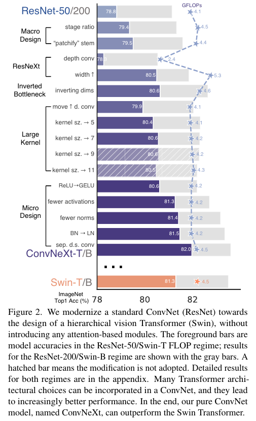

# A ConvNet for the 2020s
**CVPR, 2022**

https://openaccess.thecvf.com/content/CVPR2022/html/Liu_A_ConvNet_for_the_2020s_CVPR_2022_paper.html

## Abstract

- "Roaring 20s" Vission Transformers (ViTs)은 빠르게 cnn을 대체 했으며 이미지 classificaiton 모델에서 State-of-the-art을 달성했다.
	반면 ViT는 object detection과 semantic sgmentation 과 같은 일반적인 computer vison 문제에 어려움에 직면 했다.
	Hierarchical Transformer (예를들어 swin Trnasformers) 의 도입은 실질적으로 일반적인 vision backbone과 실행 가능하게 하고 넓은 vision 일에 놀라운 성능을 증명했다.

- 그러나 몇몇의 hybrid 접근의 효율성은 여전히 CNN의 고유한 유도적 편향보다는 Transformer의 본질적인 우월성에 크게 기인한다.

- 우리의 연구에서는 우리는 디자인 공간을 재검토하고** Pure Convnet이 달성 할 수 있는 한계를 테스트** 하다. 우리는 **vision Transformer을 설계에 맞추어 standard ResNet을 점진적으로   "modernize"하고** 그 과정에서 **성능 차이에 기여하는 몇 가지 핵심 구성요소를 발견**한다.
- 이 탐색의 결과는 ConvNeXt라고 불리는 pure Convnet 모델 제품군이다.

- 완전히 표준 ConvNet 모듈로 구성된 ConvNeXts는 **정확도와 확장성 측면에서 Transformers와 경쟁하여 87.8% ImageNet 상위 1위** 정확도를 달성하고 COCO 감지 및 ADE20K 세분화에서 Swin Transformers를 능가하는 동시에 표준 ConvNet의 단순성과 효율성을 유지합니다.

## Introduction

`(indcutive bias가 있음으로써 CNN은 어느곳에 고양이가 있던 그것을 잘 인식 한다.
그리고 근처에 있는 연관성을 더 중요하게 된다. 예를들어 얼굴에 눈을 더 관계 깊게 생각한다. CNN은 Translational invariance 이다. 어디에 사진이 있던 불변한다(인식한다).  그런데 CNN이 Trnaslation equvariance이 좋아서 detiction에 강해 그런데 instance segmentation에서 과연 강할까?)`

- 컴퓨터 비전에서 ConvNets의 완전한 우세(dominance)는 우연이 아니다. 많은 application  시나리오에서 **"sliding window"  전략은 특히 high-resolution 이미지로 작업할 때 시각적 처리(visual processing) 에 필수적**이다.

- Convnet에는 다양한 computer vision application에 적합한 몇 가지 기본 제공 **inductive biases**가 있다. 
	- 가장 중요한 것은 **translaition equivariance**으로, 이는 *objection detection와 같은 task에 적합한 속성이다.  또한 ConvNets는 sliding-window 방식으로 사용할 때 계산이 공유되기 때문에 본질적으로 효율적*이다.
	- 수십 년 동안, 이것은 일반적으로 digit, faces, and pedestrians와 같은 제한된 객채 범주에서 ConvNets의 기본 사용이었다.
	- 2010년대에 들어서면서, region-based detectors 는 ConvNets을 visual recognition system의 fudamental building block으로 더욱 끌어 올렸다.

- ViT는 언어와 이미지의 큰 domain 차이임에도 큰 변화를 가져 왔다.
	-  이미지를 일련의 패치로 분할하는 초기 'patchify' 계층을 제외하고, ViT는 image-specific inductive bias을 도입하지 않으며 원래 NLP Transformer에 최소한의 변경을 가한다.
	- ViT의 주요 초점은 확장 동작에 있다. 더 큰 모델과 데이터 사이즈의 도움으로  Transformer은 표준 ResNet를 크게 능가 했다. 이미지 분류 작업에 대한 결과는 영감을 받지만, 하지만 ***computer vision은 image classification에 제한되지 않는다***.

- 이전에 논의한 바 같이, 지난 10년 동안  수많은 computer vision 작업은 sliding window와 fullyconvolutional paradigm에 의존했다.
	- **ConvNet inductive biases가 없으면 vanilla ViT 모델은 일반(generic) vision backbone으로 채택되는데 많은 문제에 직면**한다. 
	- 가장 큰 문제는 **입력 크기와 관련한여 2차 복잡성**을 갖는 ViT의 global attention 설계 이다. 이는 imageNet 분류에 적합할 수 있지만 고해상도 입력으로 인해 빠르게 처리 할 수 없다.

- Hierarchical Transformers는 *이러한 격차를 해소하기 위해 hybrid 방식을* 사용한다.
	- 예를 들어 **"sliding window" 전략 (예를들어 attention within local windows)** 는 Transformers에 다시 도입되어 **ConvNets와 더 유사하게 동작할 수 있게 되었다**.
	- Swin Transformer는 Transformer가 일반적인(generic) vision backbone으로 채택 되고 image classification을 넘어 다양한 컴퓨터 비전 작업에서 최첨단 성능을 달성할 수 있음을 처음으로 보여줍니다.: 컨볼류션의 본질은 무관하지 않고 오히려 그것은 여전히 많은 바람을 받고 있으며 결코 퇴색하지 않았다.

- 이러한 관점에서, computer vision을 위한 Transformer의 많은 발전은 convolution을 되살리는 목표로 했다. 이러한 시도는 **비용이 많이 든다.**
	- sliding window self-attention 의 ***pure 구현은 비용이 많이 든다.***
	- cyclic shifting과 같은 향상된 접근 방식을 사용하면* 속도를 최적화할 수 있지만, 시스템 설계가 더욱 정교해* 진다.
		
- 반면에, ConvNet이 비록 간단하고 군더더기 없는 방식으로 원하는 많은 속성을 이미 충족하고 있다는 것은 거의 아이러니 한다.
	- ConvNets가 활력을 읽어가는 유일한 이유는 (계층적) Transformer가 많은 비전 작업에서 ConvNets을 능가하기 때문이며, 성능 차이는 ***일반적으로 multi head self-attention가 핵심 구성 요소인 Transformers의 superior scaling 동작에 기인***한다.
		
- 지난 10년간 점진적으로 개선된 ConvNets와 달리 Vision Transformers의 채택은 한 단계 변화했습니다.
	-  최근 문헌에서는 일반적으로 두 가지를 비교할 때 시스템 수준 비교(예: Swin Transformer 대 ResNet)가 채택됩니다. 
	- ConvNets와 계층적 비전 트랜스포머는 ***서로 다르고 동시에 유사합니다.***
	- 둘 다 유사한 ***유도 편향을 갖추고 있지만 교육 절차와 매크로/마이크로 레벨 아키텍처 설계에서는 크게 다릅니다.***

- 이 연구에서, 우리는 ConvNets와 Transformers 사이의 구조적 차이를 조사하고 네트워크 성능을 비교할 때 교란 변수를 식별하려고 노력합니다.
	-  우리의 연구는 **ConvNets에 대한 ViT 이전과 ViT 이후의 시대 사이의 격차를 해소하고 순수한 ConvNet이 달성할 수 있는 한계를 테스트하기 위한 것입니다.**

- 이를 위해 개선된 절차로 훈련된 표준 ResNet(예: ResNet-50)부터 시작합니다. 
	- 우리는 점진적으로 아키텍처를 계층적 비전 트랜스포머(예: Swin-T)의 구성으로 "현대화"합니다.

- 우리의 탐사는 다음과 같은 핵심 질문에 의해 지시됩니다: **트랜스포머의 설계 결정이 ConvNets의 성능에 어떤 영향을 미칩니까?** 
	- 이 과정에서 성능 차이에 기여하는 몇 가지 주요 구성 요소를 발견했습니다. *결과적으로 ConvNeXt라는 순수 ConvNets 제품군을 제안합니다.*
	
- 우리는 ImageNet 분류[17], COCO의 객체 감지/분할, ADE20K의 의미 분할[92]과 같은 다양한 비전 작업에서 ConvNeXt를 평가합니다. 
	- 놀랍게도, 전적으로 표준 ConvNet 모듈로 구성된 ConvNeXts는 모든 주요 벤치마크에서 **정확성, 확장성 및 견고성 측면에서 Transformer와 유리하게 경쟁**합니다. 
	- ConvNeXt는 표준 ConvNets의 효율성을 유지하며, 교육 및 테스트 모두에 대한 완전한 컨볼루션 특성으로 구현이 매우 간단합니다

##  2. Modernizing a ConvNet: a Roadmap

이 섹션에서는 ResNet에서 트랜스포머와 유사한 ConvNet으로의 궤적을 제공합니다. 우리는 FLOP의 관점에서 두 가지 모델 크기를 고려하는데, 하나는 약 4.5 x10^9의 FLOP가 있는 ResNet-50 / Swin-T 체제이고 다른 하나는 약 15.0 x 10^9의 FLOP가 있는 ResNet-200/Swin-B 체제입니다.

- 단순화를 위해 ResNet-50 / Swin-T 복잡성 모델로 결과를 제시할 것입니다. 대용량 모델에 대한 **결론은 일관적이**며 결과는 부록 C에서 확인할 수 있습니다.
	- 높은 수준에서, 우리의 탐색은 표준 ConvNet으로서의 네트워크의 ***단순성을 유지하면서 Swin Transformer의 다양한 수준의 설계를 조사하고 따르는 것을 목표로 합니다.***

- Roadmap
	- 우리의 출발점은 ResNet-50 모델입니다. 먼저 vision Transformer를 훈련하는 데 사용되는 **유사한 훈련 기술로 훈련하고** 원래 **ResNet-50과 비교하여 훨씬 향상된 결과**를 얻습니다. 
	-  그런 다음 
      	-  1) macro design, 
      	-  2) ResNeXt, 
      	-  3) inverted bottleneck, 
      	-  4) large kernel size 
      	-  5) various layer-wise micro design로 요약한 일련의 설계 결정을 연구합니다. 
   	- 그림 2에서는 "network modernization"의 각 단계에서 달성할 수 있는 절차와 결과를 보여줍니다.
	- 네트워크 복잡성은 최종 성능과 밀접한 상관관계가 있기 때문에 FLOP는 중간 단계에서 기준 모델보다 높거나 낮을 수 있지만 탐색 과정에서 대략적으로 제어됩니다.
	- 모든 모델은 ImageNet-1K에서 교육 및 평가됩니다.

 ### 2.1. Training Techniques

- network architecture 설계 외에도 **train precedure는 궁극적인 성능에도 영향**을 미친다
	- vision Trnsformer은 새로운 module과 architecture 설계 결정을 가져왔을 뿐만 아니라, 그들을 또한 vision에 다양한 training 기술을 도입했다.
	- 이는 대부분 최적화 전략과 연관된 hpyer-parameter  설정과 관련된다.
-  따라서 우리의 탐구의 **첫번째 단계는 vision transformer 훈련 절자를 사용하여 baseline(Resnet-50/200)을 사용하여 훈련**하는 것이다.
	- 최근 연구에서는 일련의 현대적 훈련 기술이 simple ResNet-50 모델의 성능을 크게 향상 시킬 수 있음을 보여준다.(근거)
	- 본 연구에서는 DeiT와 Swin Trnasforme에 가까운 traiing 방법을 사용한다.
	- training은 ***ResNet의 original 90 epoch에서 300 epoch 로*** 늘린다.
	- 우리는 ***AdamW optimizer, data augmentation 기술 예를 들어 Mixup, Cutmix, RandAugment, Random Erasing 그리고  regularization 전략은 Stochastic Depth 와 Label Smoothing을*** 한다.
	- 우리가 사용하는 완전한 하이퍼 파라미터 세트는 부록 A.1에서 확인할 수 있습니다.
	- 그 자체로 이 향상된 훈련 방법은 ResNet-50 모델의 성능을 76.1%을 78.8%(+2.7%)로 증가 시켰으며, 이는 전통적인 ConvNets와 vision Transformer 간의 성능 차이의 상당 부분이 훈련 기술 때문일 수 있음을 시사한다.
	- 우리는 "modernization" 프로세스 전반에 걸쳐 동일한 hyper-parameters와 함께 이 고정 training 방법(레시피) 사용할 것이다.
	- ResNet -50 방식에서 보여준 각 정확도는 세가지 다른 무작위 seed를 사용한 훈련에서 얻은 평균이다.

### 2.2. Macro Design

- 이제 swin Transformers의 macro 네트워크 설계를 분석한다.
	- Swin Transformer은 ConvNets 를 따라 각 단계가 다른 기능 맵 해상도를 갖는 다단계 설계를 사용한다.
	- 두 가지 흥미로운 설계 고려 사항은 : 단계 계산 ration와 "stem cell"  구조이다.

**Changing stage compute ratio.**
- ResNet의 단계별 계산 분포의 원래 설계는 대부분 경험적이었다.
	- 무거운 'res4' 단계는 detector head가 14x14 형상면(feature plane)에서 작동하는 object detection 와 같은 down stream  작업과 호환되도록 고안되었습니다.
	- 반면 **Swin-T 는 1:1:3:1의 약간 다른 계산 비율**로 같은 원리를 따랐다.
	- Larger Swin Trnasofrmers은 그 비율은 1:1:9:1이다.
	- 설계에 따라 ResNet-50의 ***(3, 4, 6, 3)에서 (3,3, 9, 3)까지 각 단계의 block의 수를 조정 하여 Swin-T의 FlOPs로 정렬한다.***
	- 따라서 모델 정확도가 78.8%에서 79.4%로 향상된다.
	- 특히 연구자들은 계산 분포를 철저히 조사했으며, 보다 최적의 설계가 존재 할 가능성이 높다.
	- **이제부터 이 단계 계산 비율을 사용하겠습니다**

**Changing stem to “Patchify”.**

- 일반적으로** stem cell 설계는 network 시작 시 input images가 처리되는 방법**과 관련 있다.
	- 자연 이미지에 내재된 중복성(redundancy)으로 인해 ***공통 stem cell은 standard ConvNets와 vision Transformer 모두에서 input image를 적절한 feature map 크기로 공격적으로 다운 샘플링한다.***
	- standard ResNet의 setm cell에는 ***7x7 컨볼루션 layer가 포함되어 있으며, 그 다음에 max pool이 있어 input image의 4배 downsampling을 한다*.**
	- vision Transformer은 더 공격적인  "patchify" 전략이 stem cell에 사용되며, 이는 larger kernel size (다시 말해 kernel size = 14 or 16) 와 non-overlapping convolution 에 해당 한다.
	- Swin Trnasofrmer는 유사한 "patchify"  layer을 사용하지만 architecture의 다단계 설계를 수용하기 위해 4의 더 작은 패치 크기를 사용한다.
	- 우리는 Resnet 스타일의 stem cell를 4x4, 4 stride 컨볼루션 레이어르 사용하여 구현된 패치화 레이어로 대체한다.
	- 정확도가 79.4%에서 79.5%로 변경되었습니다. 이것은 ResNet의 줄기 세포가 ViT와 같은 더 간단한 "패치화" 레이어로 대체되어 유사한 성능을 낼 수 있음을 시사합니다.
	- 우리는 네트워크에서 "patchify stem"(4x4 겹치지 않는 컨볼루션)을 사용할 것입니다.

### 2.3. ResNeXt-ify

- 이 부분에서, 우리는 바닐라 ResNet보다 더 나은 FLOP/정확도 trade-off를 가진 **ResNeXt[87]의 아이디어를 채택**하려고 시도합니다
	- 핵심 구성 요소는 convolution filter가 서로 다른 그룹으로 분리되는 grouped convolution 이다
	- 높은 수준에서 ResNeXt의 지침 원칙은 "use more groups, expand width"하는 것입니다
	- 보다 정확하게는 ResNeXt는 병목 현상이 발생한 3x3 convolution을 사용합니다
	- 블록. 이렇게 하면 FLOP가 크게 줄어들기 때문에 네트워크 폭이 확장되어 Capacity 손실을 보상합니다
	- 우리의 경우 그룹 수가 채널 수와 동일한 grouped convolution의 특별한 경우인 depthwise convolution을 사용합니다.
	- 우리는 **depthwise convolution이 채널별로, 즉 공간 차원(spatial dimension)에서만 정보를 혼합하는 self attention 가중 합계 연산과 유사하다는 점에 주목**합니다.`(이거 chaneel 별 합성 attention을 depth wise로 교체 할 수 있지 않을까? 그러면 어떤것을 수정 해야 하지)`?
	- Depthwise conv와 1 x 1 conv의 조합은 vision transformer가 **공유하는 속성인 spatial과 channel mixing의 분리로 이어지며, 각 작업은 spatial또는 mixing에 걸쳐 정보를 혼합하지만 둘 다 혼합하지는 않습니다.** `(무슨 말이지?   [why depth wise conv and point wise conv is similar vision transformer](../../../0.0%20참고/why%20depth%20wise%20conv%20and%20point%20wise%20conv%20is%20similar%20vision%20transformer.md) 이거 유사한 이유)`
	- Depthwise conv을 사용하면 네트워크 FLOP와 예상대로 정확도가 효과적으로 감소합니다.
	- ResNeXt에서 제안된 전략에 따라 네트워크 폭을 Swin-T와 동일한 채널 수(64개에서 96개)로 늘립니다. `(이거 Swin transformer Unet과 유사하게 해야 겠어)`
	-  따라서 **FLOP(5.3G)가 증가하여 네트워크 성능이 80.5%로 향상됩**니다. 
	- 이제 ResNeXt 디자인을 사용하겠습니다.

### 2.4. Inverted Bottleneck(반전 병목 현상)

