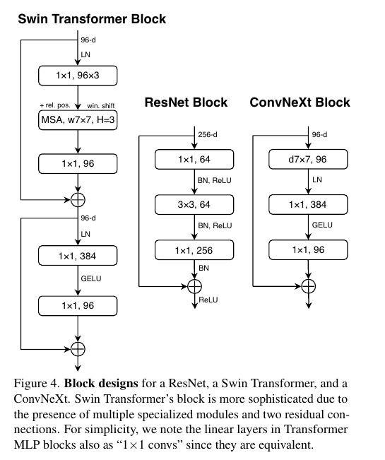

# A ConvNet for the 2020s
**CVPR, 2022**

https://openaccess.thecvf.com/content/CVPR2022/html/Liu_A_ConvNet_for_the_2020s_CVPR_2022_paper.html

"A ConvNet for the 2020s" 논문은 2020년대의 컴퓨터 비전 분야에서 Convolutional Neural Networks (ConvNets 또는 CNNs)의 역할과 발전에 대해 다루고 있습니다. 이 논문에서는 Vision Transformers (ViTs)의 등장 이후 ConvNets의 역할이 어떻게 변화하고 있는지, 그리고 ConvNets가 어떻게 현대화되고 있는지에 대해 탐구합니다.

주요 내용은 다음과 같습니다:

1. **ConvNets vs Transformers**: Vision Transformers (ViTs)는 이미지 분류 모델로서 ConvNets를 뛰어넘었지만, 일반 컴퓨터 비전 작업에 적용할 때는 어려움이 있습니다. 이에 대한 해결책으로 계층적 Transformers (예: Swin Transformers)가 제안되었으며, 이는 ConvNets의 특성을 다시 도입하여 Transformers를 일반 비전 백본으로 사용할 수 있게 하였습니다.

2. **ConvNets의 현대화**: 이 논문에서는 표준 ResNet을 점진적으로 "현대화"하여 vision Transformer의 설계로 이동하고, 이 과정에서 성능 차이에 기여하는 주요 구성 요소를 발견합니다. 이 연구의 결과로, ConvNeXt라는 순수한 ConvNet 모델이 제안되었습니다.

3. **ConvNeXt의 성능**: ConvNeXt는 표준 ConvNet 모듈만으로 구성되어 있지만, 정확성과 확장성 면에서 Transformers와 경쟁할 수 있습니다. 이는 ImageNet에서 87.8%의 top-1 정확도를 달성하고, COCO 탐지 및 ADE20K 분할에서 Swin Transformers를 능가하는 결과를 보여줍니다.

이 논문은 ConvNets의 중요성을 재고하고, 순수한 ConvNet이 얼마나 높은 성능을 달성할 수 있는지에 대한 한계를 테스트하는 데 중점을 두고 있습니다.