# Deep Residual Learning for Image Recognition

**ResNet, CVPR, 2016**

**AUTHOR**

| Kaiming He | Xiangyu Zhang | Shaoqing Ren | Jian Sun |
| ---------- | ------------- | ------------ | -------- |

## Abstract

- 심층 신경망은 훈련하기가 더 어렵습니다. 
	- 우리는 이전에 사용된 것보다 훨씬 더 깊은 네트워크의 훈련을 용이하게 하기 위해 **residual learning 프레임워크**를 제시합니다.
	- 우리는 참조되지 않은 함수를 학습하는 대신 layer 입력을 참조하여 residual functions를 학습하는 것으로 layer를 명시적으로 재구성합니다.
	- 우리는 이러한 **residual networks가 최적화하기 쉽고 상당히 증가된 깊이에서 정확성을 얻을 수 있음을 보여주는 포괄적인 경험적 증거** 를 제공합니다.
	- ImageNet 데이터 세트에서 우리는 VGG 네트[40]보다 8배 깊이인 최대 152개의 레이어로 residual nets를 평가하지만 여전히 복잡성이 낮습니다.
	-  이러한 잔여 네트워크의 앙상블은 ImageNet 테스트 세트에서 3.57% 오류를 달성합니다. 
	- 이 결과는 ILSVRC 2015 분류 과제에서 1위를 차지했습니다. 우리는 또한 100개와 1000개의 레이어가 있는 CIFAR-10에 대한 분석을 제시합니다.
- 표현의 깊이는 많은 시각적 인식 작업에서 중요합니다. 
	- 극도로 심층적인 표현 덕분에 COCO 객체 감지 데이터 세트에서 28%의 상대적 개선 효과를 얻었습니다. 
	- Deep residual nets는 ILSVRC & COCO 2015 대회 1에 제출한 기반이며, ImageNet 탐지, ImageNet 현지화, COCO 탐지 및 COCO 분할 작업에서 1위를 차지했습니다.

## 1. Introduction

- 심층 컨볼루션 신경망[22, 21]은 이미지 분류[21, 49, 39]에 대한 일련의 혁신을 이끌었습니다. 
	- 심층 네트워크는 low/mid/highlevel feature[49]과 분류기를 end-to-end 다층 방식으로 자연스럽게 통합하며, 기능의 "levels"은 **적층된(stacked) layer의 수(깊이)에 의해 강화될 수 있습니다**. ```*(이때 그냥 나온게 아니고 이런 트렌드로 발전 방향이 있었구나 이런 수요가 맞물려서 이런 논문이 나왔구나)*```
	- 최근의 증거[40, 43]는 **네트워크 깊이가 매우 중요**하다는 것을 보여주며, 까다로운 ImageNet 데이터 세트[35]에 대한 선도적인(leading) 결과[40, 43, 12, 16]는 모두 16[40]에서 30[16]까지 깊이가 있는 *"매우 깊은" [40] 모델을 이용*합니다. 
	- *다른 많은 중요하지 않은 시각적 인식 작업[7, 11, 6, 32, 27]도 매우 깊은 모델의 혜택을 많이 받았습니다*.
- **깊이의 중요성에 따라 다음과 같은 문제가 발생합니다: 더 나은 네트워크를 배우는 것이 더 많은 계층을 쌓는 것만큼 쉽습니까?**
	- 이 질문에 대답하는 데 걸림돌이 된 것은 gradients(그라디언트) vanishing/exploding이라는 악명 높은 문제 [14, 1, 8]로, 처음부터 수렴(convergence)을 방해합니다. 
	- 그러나 이 문제는 주로 normalized initialization [23, 8, 36, 12]와 intermediate normalization layers [16]에 의해 해결되었으며, 이는 수십 개의 계층을 가진 네트워크가 backpropagation로 tochastic gradient descent(SGD)을 위해 수렴을 시작할 수 있게 합니다 [22].```(이미 이런것을 해결하기 위해 여러가지 것들이 나왔었다. 하지만 수렴(scalbilty_ 즉 데이터가 많아지면 성능이 수렴하는 현상)은 나중에 CNN의 확장성의 문제로 다시 생기게 된다.)``` <br>
  
- 더 깊은 네트워크가 수렴을 시작할 수 있을 때, 성능 저하 문제가 노출되었습니다: 네트워크 깊이가 증가함에 따라 정확도가 포화(saturated) 상태가 되고(이는 놀라운 일이 아닐 수 있음) 급격히 저하됩니다.
	- 예기치 않게 이러한 성능 저하가 과적합(overfitting)으로 인한 것이 아니며 적절하게 깊은 모델에 더 많은 레이어를 추가하면 [10, 41]에 보고되고 실험에 의해 철저히 검증된 바와 같이 더 높은 학습 오류가 발생합니다. ```(나는 overfitting인지 알았는데 아니였구나. 그럼 무엇일까?)```
	- Fig 1은 전형적인 예를 나타낸다.
  
  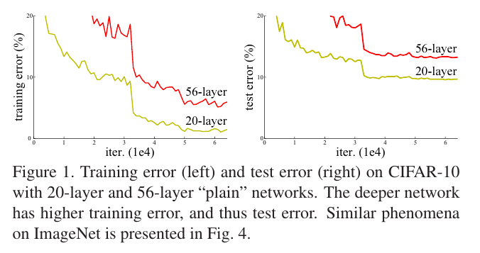

  - (훈련 정확도의) degradation는 모든 시스템이 비슷하게 최적화하기 쉬운 것은 아니라는 것을 나타냅니다. 
	- 더 얕은 아키텍처와 더 많은 계층을 추가하는 더 깊은 아키텍처를 고려해 보겠습니다.
	- 더 깊은 모델에 대한 솔루션이 존재합니다. 
	- 추가된 레이어는 ID(identity mapping항등식) 매핑이고, 다른 레이어는 학습된 얕은 모델에서 복사됩니다. (ID : F(x) = x)
	- 이 구성된 솔루션의 존재는 심층 모델이 얕은 모델보다 높은 교육 오류를 발생시키지 않아야 함을 나타냅니다.
	-  그러나 실험에 따르면 현재 해결책은 구성된 솔루션보다 비교적 우수하거나 더 나은 솔루션을 찾을 수 없습니다(또는 실현 가능한 시간 내에 그렇게 할 수 없습니다).

- 본 논문에서는 **deep residual learning 프레임워크를 도입하여 성능 degradation 문제를 해결**합니다. 
	- [(ResNets) 잔차(residual)가 왜 좋은지 설명](../../../0.0%20참고/(ResNets)%20잔차(residual)가%20왜%20좋은지%20설명.md)
	- 몇 개의 적층된 레이어가 원하는 기본(underlying) 매핑에 직접 적합하기를 바라는 대신, 이러한 레이어가 residual 매핑에 적합하도록 명시적으로 허용합니다. 
	- 공식적으로, 원하는 기본 매핑을 H(x)로 표시하고, 쌓인 비선형 레이어가 F(x) := H(x) - x의 다른 매핑에 맞도록 합니다. 원래 매핑은 F(x)+x로 recast됩니다.
	- 우리는 참조되지 않은 원래 매핑을 최적화하는 것보다 잔여 매핑을 최적화하는 것이 더 쉽다고 가정합니다. 
	- 극단적으로, identity mapping이 최적인 경우, nonlinear layers 스택에 의해 identity mapping을 적합시키는 것보다 residual를 0으로 푸시하는 것이 더 쉬울 것입니다.
	- `(논문을 자세히 보면, 저자의 주장하는 이론과 그것을 설명하는 논리력이 굉장히 매력있다. 예를들어 skip connenctio의 왜 좋은 설명하려 할떄, 나는 그냥 이전 정보를 주니깐 이렇게 생각하지만, 이게 gradient관점 그리고 학습에 관점에서 설명을 해주었다. 물론 모델이 black box라서 이 설명이 또 완벽한 인과관계를 가지는 것은 아니다. 하지만 경험적인 이유를 들어서 이러한 이유다. 라는 방식으로 설명이 굉장히 매력있고 이해가 잘 된다. )`
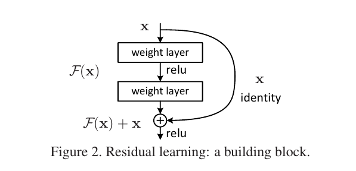

- F(x) + x의 공식화는 **"shortcut connections"**을 가진 feedforward 신경망을 통해 실현될 수 있습니다(그림 2).
	- shortcut connections [2, 33, 48]은 하나 이상의 레이어를 건너뛰는(skipping) 연결입니다. `(Resnet이 나오기 전에 이미 여러 논문에서 나오고 있었다)`
	- 우리의 경우, shortcut connections은 단순히 identity mapping을 수행하고, 그 출력은 적층된 레이어의 출력에 추가됩니다(그림 2).
	-  ID( identity) shortcut connections은 추가 parameter나 computational complexity을 추가하지 않습니다.
	-  전체 네트워크는 여전히 backpropacation를 사용하여 SGD에 의해 end -to-end로 훈련될 수 있으며, solvers를 수정하지 않고도 공통 라이브러리(예: 카페[19])를 사용하여 쉽게 구현할 수 있습니다.
  
- 우리는 성능 저하 *degradation를 보여주고 우리의 방법을 평가하기 위해 ImageNet [35]에 대한 포괄적인 실험*을 제시합니다. 
  1. **극도로 심층적인 잔여 네트워크는 최적화하기 쉽지만, 상대적인 "plain(일반)" 네트워크(단순히 레이어를 쌓는)는 깊이가 증가할 때 더 높은 훈련 오류**를 나타냅니다. 
  2. **deep residual nets는 크게 증가한 깊이에서 정확도 향상을 쉽게 누릴 수 있어 이전 네트워크보다 훨씬 나은 결과**를 얻을 수 있습니다.
  
- CIFAR-10 세트[20]에도 *유사한 현상이 나타나 우리 방법의 최적화 어려움과 효과가 특정 데이터 세트와 유사하지 않음을 시사*합니다.
	- 우리는 100개 이상의 layers가 있는 이 데이터 세트에서 성공적으로 훈련된 모델을 제시하고 1000개 이상의 layers가 있는 모델을 탐색합니다.

- ImageNet 분류 데이터 세트[35]에서, 우리는 극도로 깊은 잔류 그물에 의해 우수한 결과를 얻습니다.
	-  152 layer residual net는 ImageNet에 표시된 네트워크 중 가장 깊은 네트워크이며 VGG 네트워크보다 복잡성이 낮습니다[40]. 
	- 우리 ensemble은 ImageNet 테스트 세트에서 상위 5개 오류가 3.57%이며, ILSVRC 2015 분류 대회에서 1위를 차지했습니다. 
	- extremely deep representations은 또한 다른 인식 작업에서 우수한 일반화 성능을 가지며, ILSVRC 및 COCO 2015 대회에서 ImageNet 탐지, ImageNet 현지화, COCO 탐지 및 COCO 세분화 부문에서 추가로 1위를 차지했습니다. 
	- 이 강력한 증거는 잔류 학습 원리가 일반적이라는 것을 보여주며, 우리는 그것이 다른 비전 및 비전 문제에 적용될 수 있을 것으로 기대합니다.

## 2. Related Work


**Residual Representations.**
- 이미지 인식에서, VLAD[18]는 사전에 대하여 residual vectors에 의해 인코딩하는 표현이고, Fisher Vector[30]는 VLAD의 확률적 버전[18]으로서 공식화될 수 있다.
	- 두 가지 모두 이미지 검색 및 분류를 위한 강력한 shallow 표현입니다 [4, 47]. 
	- 벡터 양자화의 경우, reisual vectors [17]을 *인코딩하는 것이 원래 벡터를 인코딩하는 것보다 더 효과적인 것으로 나타났습니다.*

- low-level vision의 비전과 computer graphics에서 편미분 방정식(Partial Differential Equations PDE)을 해결하기 위해 널리 사용되는 멀티그리드 방법(Multigrid method)[3]은 시스템을 여러 규모의 하위 문제로 재구성하며, 각 하위 문제는 더 거칠고(coarser) 미세한 규모 사이(finer scale)의 residual solution을 담당합니다.
	- [**Multigrid Methods:**와 **Hierarchical Basis Preconditioning:*이 왜 수렴하는지 빠른 이유](../../../0.0%20참고/Multigrid%20Methods와%20Hierarchical%20Basis%20Preconditioning이%20빠른%20이유%20.md)
	- Multigrid의 대안은 두 scale 사이의 residual vector를 나타내는 변수에 의존하는 계층적 기초 전제 조건 [44, 45]입니다. 
	- 이러한 solver는 solution의 residual nature을 모르는 표준 solver보다 훨씬 빠르게 수렴되는 것으로 나타났습니다 [3, 44, 45].
	-  이러한 방법은 좋은 재구성(reformulation) 또는 전제 조건을 통해 최적화를 단순화할 수 있음을 시사합니다.

**Shortcut Connections.**
- shortcut connections로 이어지는 관행과 이론 [2, 33, 48]은 오랫동안 연구되어 왔습니다.
	-  다층 퍼셉트론(MLP)을 훈련하는 초기 관행은 네트워크 입력에서 출력에 연결된 선형 레이어를 추가하는 것입니다 [33, 48]. 
	- [43, 24]에서, 몇 개의 중간 레이어는 vanishing/exploding gradients를 해결하기 위한 보조(auxiliary) 분류기에 직접 연결됩니다. 
	- [38, 37, 31, 46]의 논문은 바로 가기 연결에 의해 구현된 layer responses, 기울기(gradient) 및 전파된(propagated) 오류 중심화 방법을 제안합니다. [43]에서 "inception" 계층은 shortcut branch와 몇 개의 더 깊은 분기로 구성됩니다.

- 우리의 연구와 동시에, **"highway networks"[41, 42]는 게이트(gate) 기능이 있는 shortcut connections을 제시합니**다 [15].
	- *이러한 게이트는 데이터 의존적이며 매개 변수가 없는 identity shortcuts와 대조적으로 매개 변수가 있습니*다.
	- gated short가 *"closed"(0에 가까워짐)인 경우 high-way networks의 레이어는 non-residual functions를 나타*냅니다.
	-  **반대로**,* 우리의 공식은 항상 residual functions를 학습합니다. 우리의 identity shortcuts는 결코 닫히지 않으며, 모든 정보는 항상 전달되며*, additional residual functions를 학습해야 합니다. 
	- 또한, *high-way networks는 극단적으로 증가된 깊이(e.g., over 100 layers)에서 정확도 향상을 보여주지 않았습니다*.

## 3. Deep Residual Learning

### 3.1. Residual Learning

- H(x)를 몇 개의 스택 레이어(반드시 entire net일 필요는 없음)에 맞는 기본(underlying) 매핑으로 간주하고 x는 이러한 레이어 중 첫 번째 레이어에 대한 입력을 나타냅니다.
	- 여러 개의 비선형 레이어(multiple nonlinear)가 점근적(asymptotically)으로 복잡한 function^2를 근사할 수 있다고 가정하면 , residual functions, 즉 H(x) − x(입력과 출력이 동일한(equivalent) 차원이라고 가정)를 점근적으로 근사할 수 있다는 가설을 세우는 것과 같습니다.`(여기서 근사하다는 말이 참 어렵다. 근사가 무엇일까?)`  [신경망에서 근사하다는 것은 무엇일까?](../../../0.0%20참고/신경망에서%20근사하다는%20것은%20무엇일까.md)
- 
	- 따라서 적층된 레이어가 H(x)에 근접할 것으로 예상하는 대신, 우리는 이러한 레이어가 잔차 함수 F(x) := H(x) - x에 근접하도록 명시적으로 허용합니다. 
	- 따라서 원래 함수는 F(x)+x가 됩니다. 두 양식 모두 원하는 함수에 점근적(asymptotically)으로 근사할 수 있어야 하지만(가설대로 as hypothesized) 학습의 용이성(ease)은 다를 수 있습니다.

- 이 재구성은 분해 문제에 대한 반 직관적 인 현상(counterintuitive phenomena)에 의해 동기가 부여됩니다 (그림 1, 왼쪽). 
	- 소개에서 설명했듯이 추가된 계층을 ID 매핑으로 구성할 수 있는 경우 더 깊은 모델은 더 얕은 모델보다 학습 오류(training error)가 크지 않아야 합니다.
	- 성능 저하 문제는 솔버(solvers)가 여러 비선형 레이어(multiple nonlinear layers)에 의한 ID 매핑을 근사화하는 데 어려움이 있을 수 있음을 시사합니다. 
	- residual learning reformulation을 통해 identity mapping이 최적인 경우 솔버는 단순히 identity mapping에 접근하기 위해 여러 비선형 레이어(nonlinear layers)의 가중치를 0으로 유도할 수 있습니다.

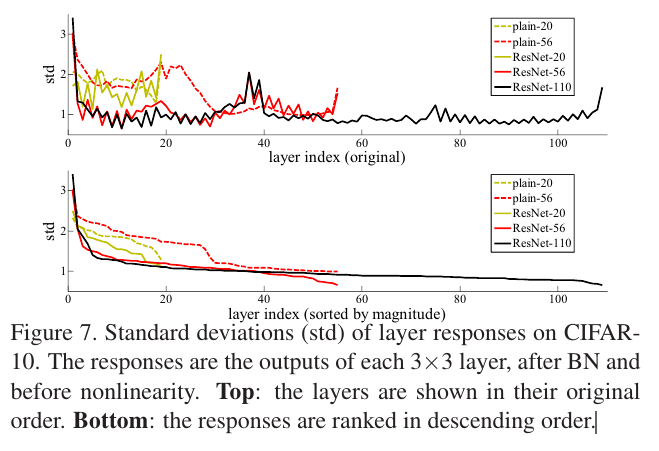

- 실제 경우, **identity mapping이 최적일 가능성은 낮지만, 우리의 reformulation은 문제를 전제하는 데 도움**이 될 수 있습니다. 
	- *최적의 함수가 zero mapping보다 identity mapping에 더 가까우면 solover가 identity mapping을 참조하여 섭동(perturbations)을 찾는 것이 새로운 함수로 학습하는 것보다 더 쉬울 것입니다.*   ["Perturbations"의 의미](../../../0.0%20참고/Perturbations의%20의미.md)
	- 우리는 실험을 통해 학습된 residual 함수가 일반적으로 반응이 작다는 것을 보여주며, 이는 ID 매핑이 합리적인 전제 조건을 제공한다는 것을 시사합니다. 


 ### 3.2. Identity Mapping by Shortcuts
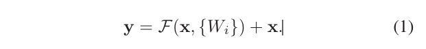
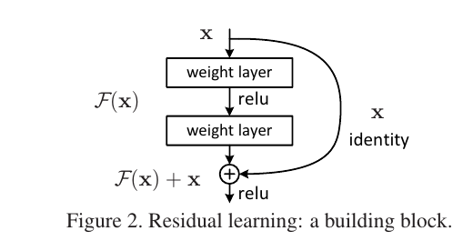
- 우리는 **몇 개의 적층된 모든 레이어에 잔여 학습을 채택**합니다.
	- 여기서 x와 y는 고려된 레이어의 입력 및 출력 벡터입니다.
	-  함수 F(x, {W_i})는 학습할 잔여 매핑을 나타냅니다.
	-  두 개의 층을 갖는 그림 2의 예에서, σ가 ReLU [29]를 나타내며 표기를 단순화하기 위해 편향이 생략된 F = W_{2σ}(W_{1x}).
	-  F + x 작업은 바로 가기 연결 및 요소별 추가에 의해 수행됩니다. 
	- 우리는 추가 후 두 번째 비선형성을 채택합니다(즉, σ(y), 그림 2 참조)..

- 방정식(1)의 shortcut connections은 extra parameter나 computation complexity을 유발하지 않습니다.
	-  이것은 실제로 매력적일 뿐만 아니라 일반 네트워크와 residual 네트워크 간의 비교에서도 중요합니다. 
	- 우리는 동일한 수의 매개 변수, 깊이, 폭 및 계산 비용을 동시에 갖는 일반/잔류 네트워크를 공정하게 비교할 수 있습니다(except for the negligible element-wise addition). `(비교를 할때 철저히 똑같이 비교를해야지 독자들에게 본인의 주장을 확실히 할 수 있다.)`
- x와 F의 dimension는 방정식(1)에서 같아야 합니다.
	-  그렇지 않은 경우(e.g., when changing the input/output channels) 바로 가기 연결로 linear projection W_s를 수행하여 dimension를 일치시킬 수 있습니다: `(이것도 엄청 친절히 답변해 주었다. 지금 medical 쪽 실험에 skip connection을 했을 때 일부러 차원을 맞추기 위해서 linear projoction을 했다.)`
	- 우리는 또한 방정식(1)에서 사각 행렬(square matrix) W_s를 사용할 수 있습니다.  [square matrix 설명](../../../0.0%20참고/square%20matrix%20설명.md)
	- 그러나 우리는 실험을 통해 identity mapping이 성능 저하 문제를 해결하기에 충분하고 경제적이므로 W는 치수를 일치시킬 때만 사용된다는 것을 보여줄 것입니다.

- residual 함수 F의 형태는 유연(flexible)합니다. 
	- 이 논문의 실험은 두 개 또는 세 개의 레이어를 갖는 함수 F(그림 5)를 포함하는 반면 더 많은 레이어가 가능합니다. 
	- 그러나 F가 단일 레이어만 가지고 있다면, Eqn.(1)은 inear layer와 유사합니다: y = W1_x + x. 이에 대해 우리는 이점을 관찰하지 못했습니다.
- 또한 위의 표기법은 단순성을 위해 fully-connected layers에 관한 것이지만 convolutional layers에 적용할 수 있습니다.
	-  함수 F(x, {W_i})는 multiple convolutional layers를 나타낼 수 있습니다. 
	- element-wise 추가는 채널별로 두 개의 feature maps에서 수행됩니다.


### 3.3. Network Architectures


- 우리는 다양한 일반/잔여망(plain/residual)을 테스트했고, 일관된 현상을 관찰했습니다. 
	- 논의를 위한 사례(instance)를 제공하기 위해 ImageNet에 대한 두 가지 모델을 다음과 같이 설명합니다.
 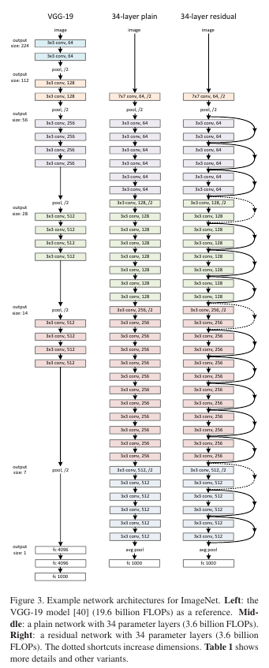
**Plain Network.**
- 우리의 plain baselines (그림 3, 가운데)은 주로 VGG 네트[40]의 철학에서 영감을 받았습니다(그림 3, 왼쪽).
	-  convolutional layers는 대부분 3×3 filters를 가지며 두 가지 간단한 설계 규칙을 따릅니다. 
		- (i) 동일한 출력 피쳐 맵 크기에 대해 레이어가 동일한 수의 필터를 가지고 있으며, 
		- (ii) 피쳐 맵 크기가 절반으로 줄어들면 레이어당 시간 복잡성을 유지하기 위해 필터 수가 두 배가 됩니다.  `(왜 시간 복잡성을 유지하지??? 굳이 무슨 이유로)` [preserve the time complexity per layer의 중요성](../../../0.0%20참고/preserve%20the%20time%20complexity%20per%20layer의%20중요성.md)
	- 우리는 **2의 stride을 가진 컨볼루션 레이어에 의해 직접 다운샘플링을 수행합니다.** 
	- 네트워크는 global average pooling layer과 softmax가 있는 1000-way 완전 연결 계층으로 끝납니다. 
	- 총 weighted layers 수는 그림 3(가운데)에서 34개입니다.
- 우리 모델은 VGG 네트[40]보다 필터 수가 적고 복잡성이 낮다는 점에 주목할 필요가 있습니다(그림 3, 왼쪽). 
	- 우리의 34-layer baseline은 36억 개의 FLOP(multiply-adds)를 가지고 있으며, 이는 VGG-19(196억 개의 FLOP)의 18%에 불과합니다.


**Residual Network.**
- 위의 plain network를 기반으로 네트워크를 상대 residual version으로 전환하는 shortcut connections(그림 3, 오른쪽)을 삽입합니다.
	- identity shortcuts(예: (1))은 입력과 출력이 동일한 차원일 때 직접 사용할 수 있습니다(그림 3의 실선(solid line) shortcuts). 치수가 증가할 때(그림 3의 점선(dotted line) shortcuts), 우리는 두 가지 옵션을 고려합니다.
		-  (A) 바로 가기는 여전히 dentity mapping을 수행하고 치수를 늘리기 위해 추가 0 항목을 패딩합니다. 이 옵션은 추가 매개 변수를 도입하지 않습니다.
		-  (B) 공식 (2)의 projection shortcut는 dimensions를 일치시키는 데 사용됩니다(1×1 convolutions에 의해 수행됨). 
	- 두 옵션 모두 단축키가 두 가지 크기의 feature map을 교차할 때 2의 stride로 수행됩니다.


### 3.4. Implementation

- **ImageNet에 대한 당사의 구현은 [21, 40]의 사례**를 따릅니다. 
	- 영상은 scale augmentation를 위해 [256, 480]에서 짧은 쪽을 무작위로 샘플링하여 크기를 조정합니다[40].
	- 224×224 crop은 per-pixel 평균을 뺀 상태에서 이미지 또는 해당 horizontal flip에서 무작위로 샘플링됩니다 [21]. 
	- [21]의 standard color augmentation가 사용됩니다. 
	- [16]에 따라 각 convolution 직후와 activation 전에 batch normalization (BN) [16]를 채택합니다. 
	- [12]에서와 같이 가중치를 초기화하고 모든 plain/residua을 처음부터 훈련합니다. 
	- 우리는 미니 배치 크기가 256인 SGD를 사용합니다. 
	- 학습 속도는 0.1에서 시작하여 오류가 발생할 때 10으로 나뉘며, 모델은 최대 60 × 10^4 반복에 대해 훈련됩니다. 
	- 우리는 0.0001의 무게 감소(weight decay)와 0.9의 운동량(momentum)을 사용합니다. 
	- 우리는 [16]의 관행에 따라 dropout[13]를 사용하지 않습니다.
	- `(Resnet의 모델이 탄생이 그냥 실험하면서 만들어진것이아니라 [16]의 예시를 들어서 만들어 졌다. 그래서 하나하나 그것이 있는 의미에 대해서 무언가 건의할것이 없다.)`

- **테스트에서 비교 연구를 위해 표준 10 crop 테스트를 채택**합니다[21]. 
	- 최상의 결과를 위해 [40, 12]와 같이 fully convolutional 형식을 채택하고 여러 척도에서 점수의 평균을 냅니다(짧은 쪽이 {224, 256, 384, 480, 640}이 되도록 이미지 크기가 조정됨).
	- `(테스트 또한 건들것이 없다. 물론 자기가 평가 모델을 만들 수 있지만, 기존에 있는 비교 평가 모델을 가져와서 비교 한다. 그러기에 더 객관적이고, 시간이 많이 save 될 수 것 같다.) `


## 4. Experiments

### 4.1. ImageNet Classification

- 우리는 1000개의 클래스로 구성된 ImageNet 2012 분류 데이터 세트[35]에서 우리의 방법을 평가합니다. 모델은 128만 개의 훈련 이미지에 대해 훈련되고 50k 검증 이미지에 대해 평가됩니다. 우리는 또한 테스트 서버에서 보고한 100k 테스트 이미지에 대한 최종 결과를 얻습니다.
- 상위 1개 오류율과 상위 5개 오류율을 모두 평가합니다.

**Plain Networks.**
- 우리는 먼저 18-layer와 34-layer의 plain nets를 평가합니다. 
	- 34단 plain net은 그림 3(가운데)에 나와 있습니다. 
	- 18단 plain net도 비슷한 형태입니다. 
	- 자세한 아키텍처는 표 1을 참조하십시오.
	- `(우선 글 구조가 전체적으로 예쁘다. Plain Networks을 시작 해서 Residual으로 단계별로 진화 그리고 논리적 구조 흐름도 좋다.)`
	- `(plain net을 함으로써 기존에 있는 것들의 문제점을 먼저 보여주고 있다. experiments에 이미 근거를 배치하고 있다.)`

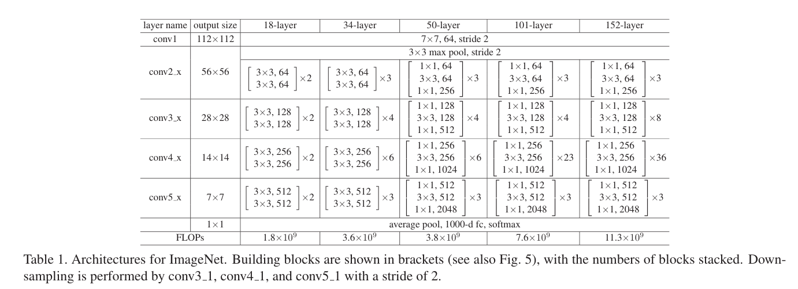

- 표 2의 결과는 더 deeper 34-layer plain net가 더 얕은 18-layer plain net보다 검증 오차(validation error)가 더 높다는 것을 보여줍니다. 
	- 그 이유를 밝히기 위해, Fig. 4 (왼쪽) 훈련 절차 중training/validation 오류를 비교합니다. 
	- 우리는 성능 저하 문제를 관찰했습니다 
	-  18-layer plain network의 솔루션 공간이 34-layer plain net의 솔루션 공간의 부분 공간(subspace)임에도 불구하고 34-layer plain nets는 전체 학습 절차에 걸쳐 더 높은 학습 오류를 갖습니다.
	- `(결과에 대해서 하나씩 확인하며 보여주고 있다. 어디서 문제인지 어떤것을 해야 할지 말이다.)`

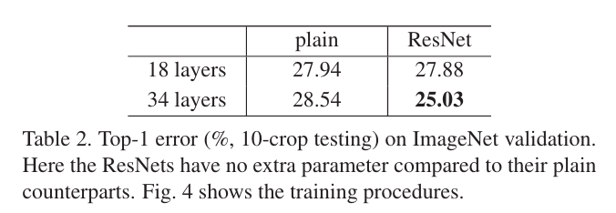
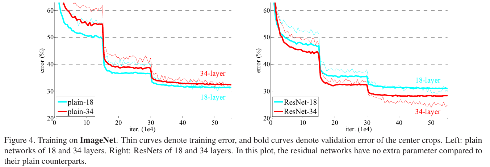

- 우리는 이러한 **optimization 어려움이 gradients가 사라져서 발생할 가능성**이 낮다고 주장합니다. 
	- 이러한 plain networks는 BN[16]으로 훈련되어 전방 전파(forward propagated) 신호가 0이 아닌 분산(variances)을 갖도록 보장합니다. 
	- 우리는 또한 역방향으로 전파된(backward propagated) 그레이디언트(gradients)가 BN과 함께 건전한 규범(healthy norms)을 나타낸다는 것을 검증합니다. 
	- 따라서 전진(forward) 또는 후진(backward) 신호는 모두 사라집니다. 
	- 실제로 34-layer 플레인 네트는 여전히 경쟁력 있는 정확도를 달성할 수 있으며(표 3) solver가 어느 정도 작동함을 시사합니다. 
	- 우리는 deep plain nets가 기하급수적으로 낮은 수렴률(convergence)을 가질 수 있으며, 이는 **raining error^3**의 감소에 영향을 미칠 것으로 추측합니다. 
	- 이러한 최적화의 어려움에 대한 이유는 앞으로 연구될 것입니다.
	- **(raining error^3:우리는 더 많은 훈련 반복(3배)을 실험했고 여전히 degradation 문제를 관찰했으며, 이는 단순히 더 많은 반복을 사용하는 것으로는 이 문제를 실현 가능하게 해결할 수 없음을 시사합니다.)**
	- `(우선 나는 단순히 gradinet가 사라져서 성능하락이 발생했다고 생각을 했겠지만, 이런것도 다 실험을 통해서 증명을 하는 것을 보니, 그냥 추측이 아니였다. 이런 근거로 추축을 한다는 것이 더 객관적으로 남을 설득할때 더 좋은것 같다. 내가 실험 할 때나 논문을 쓸 때 많은 참고가 된다.)`

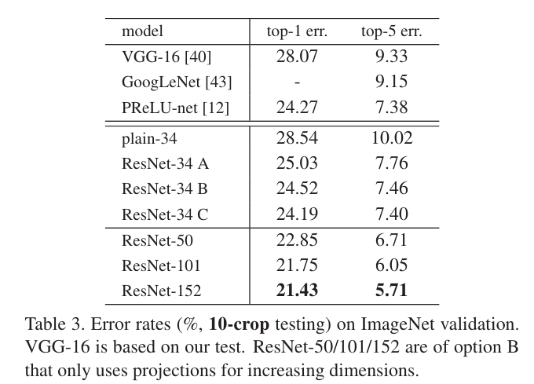

**Residual Networks.**
- 다음으로 18layer 및 34layer residual nets(ResNets)를 평가합니다.
	-  기본 아키텍처는 위의 plain nets와 동일합니다. 
	- 그림 3(오른쪽)과 같이 각 3×3 필터 쌍에 바로 가기 연결이 추가됩니다. 
	- 첫 번째 비교(표 2 및 그림 4 오른쪽)에서는 모든 단축키에 대해 ID mapping을 사용하고 dimensions 증가(옵션 A)에 대해 zero-padding을 사용합니다. dimension이 맞지 않을 때, 차원을 zero padding으로 맞추는거
	- 따라서 일반적인 파라미터에 비해 추가 파라미터가 없습니다.

- 우리는 표 2와 그림 4의 세 가지 주요 관찰 결과를 가지고 있습니다. 
	- 첫**째, residual 학습을 통해 상황이 역전**됩니다. 
		- 34 layer ResNet이 18 layer ResNet보다 우수합니다(2.8%).  `(plain과 비교했을때 확연히 차이가 난다)`
		- **더 중요한 것은 34layer  ResNet이 상당히 낮은 training error를 나타내며 검증 데이터로 일반화할 수 있다는 것**입니다. 
		- **이는 degradation 문제가 이 설정에서 잘 해결되었다는 것을 나타내며**, 우리는 increased depth에서 정확도 이득을 얻을 수 있습니다.
		- `(이런식으로 error을 이용해서 비교했다. 따라서 plain nets와의 차별적인 이유를 설명했다. 나의 실험에서도 이런 error를 비교 해서 논문을 집어 넣을 수 있을까? 고민해야 봐야할 문제이다.)`
	- 둘째, 34 layer ResNet은 일반적인 ResNet에 비해 상위 1개 오류를 3.5% 줄였습니다(표 2). 
		- 이는 교육 오류를 성공적으로 줄였습니다(그림 4 오른쪽 대 왼쪽).
		-  이 비교는 extremely deep systems에 대한 residual learning의 효과를 검증합니다.
	- **마지막으로, 우리는 또한 18개 layer의 plain/residual 네트워크가 비교적 정확하지만(표 2), 18개 layer의 ResNet은 더 빠르게 수렴한다는 것에 주목합니다**(그림 4 오른쪽 대 왼쪽). 
		- net가 "지나치게 깊지 않은(not overly deep)" 경우(18 layers here), 현재 SGD solver는 여전히 plain ne에 대한 좋은 솔루션을 찾을 수 있습니다. 
		- 이 경우 **ResNet은 초기 단계에서 더 빠른 수렴(convergence)을 제공하여 최적화를 용이**하게 합니다.

**Identity vs. Projection Shortcuts.**
- 우리는 매개 변수가 없는 identity shortcuts가 훈련에 도움이 된다는 것을 보여주었습니다. 
	- 다음으로 projection shortcuts(예: (2)))를 조사합니다. 
	- 표 3에서 우리는 세 가지 옵션을 비교합니다. 
		- (A) zero-padding shortcuts는 dimensions 증가에 사용되며 모든 shortcuts는 매개 변수가 없습니다(표 2 및 그림 4 오른쪽과 동일). 
		- (B) projection shortcuts는 dimensions 증가에 사용되고 다른 바로 가기는 identity입니다. 
		- (C) all shortcuts는 투영(projections)입니다.
		- `(우선 실험에 있어 어떻게 실험을 할 것이니 방법과 기준을 알려주고 있다)`

- **표 3은 세 가지 옵션이 모두 plain 옵션보다 상당히 우수하다는 것을 보여**줍니다. 
	- B가 A보다 약간 낫습니다. 
	- 우리는 이것이 **A의 zero-padded dimensions이 실제로 residual 학습이 없기 때문이라고 주장**합니다.  `(이것은 본인이 잔여 학습이 없기 떄문에 낮다고 주장을 한다. 객관적인 의견은 아니다.  경험적인 실험을 통해 본인의 주관적인 의견이다. 연구해 볼만 한 곳이다.)`
	- C가 B보다 약간 더 낫고, 우리는 이것을 많은 (13개의) projection shortcuts에 의해 도입된 추가 매개 변수(extra parameters) 때문이라고 생각합니다. 
	- 그러나 A/B/C 간의 작은 차이는 degradation 문제를 해결하는 데 projection shortcuts가 필수적이지 않음을 나타냅니다.
	-  따라서 이 문서의 나머지 부분에서는memory/time 복잡성과 모델 크기를 줄이기 위해 옵션 C를 사용하지 않습니다. Identity shortcuts기는 아래에서 소개하는 병목 현상 아키텍처의 복잡성(complexity)을 증가시키지 않기 위해 특히 중요합니다.
	- `(Resnet과 convnet와 의 차이가 신기하다 Resnet은 병목현상을 안 증가 시키기 위해 C를 사용하지 않았다)`
	- [ResNet의 skip connection 3가지 옵션](../../../0.0%20참고/ResNet의%20skip%20connection%203가지%20옵션.md)

**Deeper Bottleneck Architectures.**

- 다음으로 ImageNet에 대한 보다 deeper nets에 대해 설명합니다. 
	- 우리가 감당할 수 있는 훈련 시간에 대한 우려 때문에, 우리는 building block을 bottleneck design ^4로 수정합니다.
	-  각 residual Function F에 대해, 우리는 2 대신 3개의 layer stack을 사용합니다(그림 5).
	-  3개의 layer는 1×1, 3×3 및 1×1 convolution이며, 여기서 1×1 layer는 dimensions를 줄인 다음 증가(복원)하여 3×3 layer는 더 작은 input/output dimensions를 가진 bottleneck 현상을 남깁니다. 
	- 그림 5는 두 설계 모두 시간 complexity가 유사한 예를 보여줍니다. 
	- bottleneck design ^4 : Deeper non-bottleneck ResNets (e.g., Fig. 5 left) also gain accuracy from increased depth (as shown on CIFAR-10), but are not as economical as the bottleneck ResNets. So the usage of bottleneck designs is mainly due to practical considerations. We further note that the degradation problem of plain nets is also witnessed for the bottleneck designs.
	- `(진정한 ResNet의 형태가 만들어지고 있다. 위에서는 여러가지 비교 실험을 하고 여기서 왜 이렇게 했는지 알려주고 있다.)`

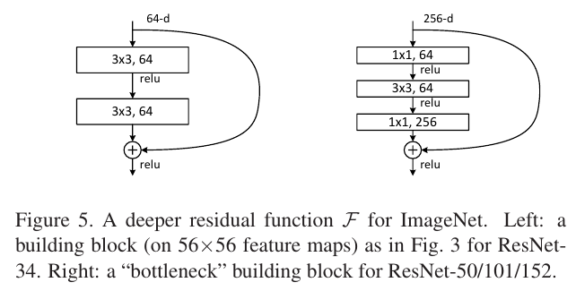

- parameter-free identity shortcuts는 병목 현상 아키텍처에 특히 중요합니다. 
	- 그림 5(오른쪽)의 identity shortcut를 projection으로 대체하면 shortcut가 high-dimensional 끝단에 연결되므로 time complexity와 model size가 두 배로 증가함을 알 수 있습니다. 
	- 따라서 identity shortcuts는 bottleneck designs를 위한 보다 효율적인 모델로 이어집니다.
	- `(이 부분 헷갈렸지만 Fig 5. 을 자세 보면 64에서 256으로 채널 수가 바뀌고 있다. 이는 모델 복잡도와 시간 복잡도가 증가한다. 즉 원래 Resnet과는 다르지만 왜 identity shorcut을 projection을 하지 않는 이유이다.)`
	- [ResNet 그림 5에 대해서 이해 안되는 부분](../../../0.0%20참고/ResNet%20그림%205에%20대해서%20이해%20안되는%20부분.md)

**50-layer ResNet:**
- 34layer netwrok의 각 2층 블록을 이 3-layer bottleneck block으로 대체하여 50층 ResNet(표 1)을 생성합니다. 
	- dimension를 늘리기 위해 옵션 B를 사용합니다. 
	- 이 모델은 38억 개의 FLOP를 보유하고 있습니다.

**101-layer and 152-layer ResNets:**
- 우리는 더 많은 3층 블록을 사용하여 101층 및 152층 ResNet을 구성합니다(표 1).
	-  놀랍게도 깊이는 상당히 증가했지만 152층 ResNet(113억 FLOP)은 여전히 VGG-16/19 네트(153억/196억 FLOP)보다 복잡성이 낮습니다

- 50/101/152 계층 ResNet은 34 계층 ResNet보다 상당히 정확합니다(표 3 및 4).
	- 우리는 열화 문제를 관찰하지 않기 때문에 상당히 증가된 깊이에서 상당한 정확도 향상을 누릴 수 있습니다. 
	- 깊이의 이점은 모든 평가 지표에서 확인할 수 있습니다(표 3 및 4).

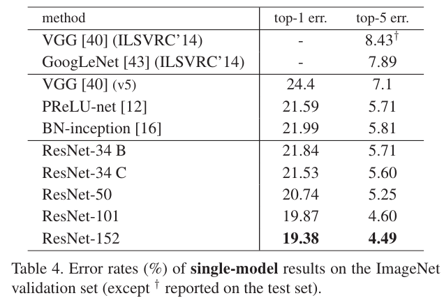

**Comparisons with State-of-the-art Methods.**
- 표 4에서는 이전의 최상의 단일 모델 결과와 비교합니다.
	- 우리의 baseline 34계층 ResNet은 매우 경쟁력 있는 정확도를 달성했습니다.
	-  152 레이어 ResNet의 단일 모델 상위 5개 검증 오류는 4.49%입니다.
	-  이 단일 모델 결과는 이전의 모든 앙상블 결과를 능가합니다(표 5). 깊이가 다른 6개의 모델을 결합하여 앙상블을 구성합니다(제출 시 152개의 레이어 모델만 있음).
	- 따라서 테스트 세트에서 상위 5% 오류가 3.57% 발생합니다(표 5).
	- 이 출품작은 ILSVRC 2015에서 1위를 차지했습니다.

### 4.2. CIFAR-10 and Analysis

- 우리는 10개 클래스의 50k 훈련 이미지와 10k 테스트 이미지로 구성된 CIFAR-10 데이터 세트[20]에 대해 더 많은 연구를 수행했습니다.
	-  우리는 훈련 세트에서 훈련되고 테스트 세트에서 평가된 실험을 제시합니다. 
	- 우리는 매우 깊은 네트워크의 행동에 초점을 맞추고 있지만 최첨단 결과를 추진하는 것에는 초점을 맞추지 않기 때문에 의도적으로 다음과 같은 간단한 아키텍처를 사용합니다.

- 일반/잔류 아키텍처는 그림 3(가운데/오른쪽)의 형태를 따릅니다. 
	- 네트워크 입력은 픽셀당 평균을 뺀 32x32 영상입니다. [per-pixel mean subtraction](../../../0.0%20참고/per-pixel%20mean%20subtraction.md)
	-  첫 번째 층은 3×3 컨볼루션입니다. 
	- 그런 다음 크기가 {32, 16, 8}인 형상 맵에 각각 3×3 컨볼루션을 가진 6n개 레이어 스택을 사용하고 각 형상 맵 크기에 대해 2n개 레이어를 사용합니다.  6n layer explain
	- 필터 수는 각각 {16, 32, 64}개입니다.
	-  서브샘플링은 2의 stride을 가진 컨볼루션에 의해 수행됩니다. 
	- 네트워크는 glober average polling,  10-way 완전 연결 계층 및 소프트맥스로 끝납니다. 총 6n+2개의 가중 레이어가 쌓여 있습니다. 다음 표는 아키텍처를 요약한 것입니다:
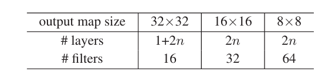

- shortcut connections을 사용하면 3×3 레이어 쌍((totally 3n shortcuts)에 연결됩니다. 
	- 이 데이터 세트에서 우리는 모든 경우(즉, 옵션 A)에 identity shortcuts를 사용하므로, 우리의 residual models은 일반 모델과 정확히 동일한 깊이, 너비 및 매개 변수 수를 갖습니다.

- 우리는 0.0001의 가중치 붕괴와 0.9의 운동량을 사용하고, [12]와 BN[16]에서 가중치 초기화를 채택하지만 drop out은 없습니다.
	-  이러한 모델은 두 개의 GPU에서 128의 미니 배치 크기로 훈련되었습니다. 
	- 0.1의 학습 속도로 시작하여 32k 및 48k 반복에서 10으로 나누고 45k/5k train/val 분할에서 결정되는 64k 반복에서 교육을 종료합니다. 
	- 우리는 훈련을 위해 [24]의 간단한 데이터 확대를 따릅니다.
	-  각 면에 4개의 픽셀이 패딩되고 32×32 크롭이 패딩된 이미지 또는 수평 플립에서 무작위로 샘플링됩니다. 
	- 테스트의 경우 원본 32x32 이미지의 single view만 평가합니다.

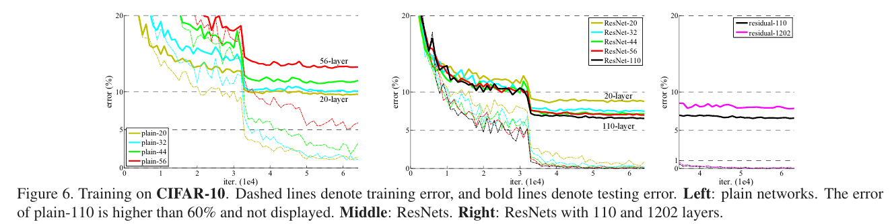

- n = {3, 5, 7, 9}을 비교하여 20, 32, 44 및 56 레이어 네트워크로 연결합니다. 
	- 그림 6(왼쪽)은 일반 그물의 행동을 보여줍니다. 
	- 깊은 평원 그물은 깊이가 증가하고 더 깊이 들어갈 때 더 높은 훈련 오류를 보입니다.
	-  이 현상은 ImageNet(그림 4, 왼쪽) 및 MNIST([41] 참조)의 현상과 유사하며, 이러한 최적화 어려움이 근본적인 문제임을 시사합니다.

- 그림 6(가운데)은 ResNets의 동작을 보여줍니다.
	-  또한 ImageNet 사례(그림 4, 오른쪽)와 유사하게 ResNet은 최적화 어려움을 극복하고 깊이가 증가할 때 정확도 향상을 보여줍니다.

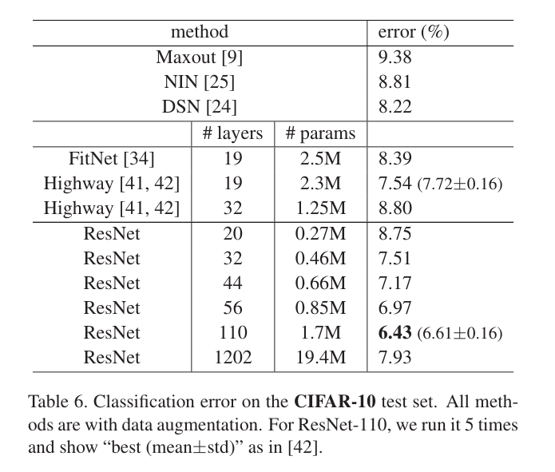

- 110 layer ResNet으로 이어지는 = 18에 대해 자세히 알아봅니다. 
	- 이 경우 초기 학습률 0.1이 너무 커서 5를 수렴하기가 어렵다는 것을 알 수 있습니다. 
	- 따라서 0.01을 사용하여 교육 오류가 80% 미만(약 400회 반복)이 될 때까지 교육을 예열한 다음 0.1로 돌아가서 교육을 계속합니다. 
	- 나머지 학습 일정은 이전에 했던 것과 같습니다. 
	- 이 110 계층 네트워크는 잘 수렴합니다(그림 6, 중간). 
	- FitNet [34] 및 Highway [41](표 6)과 같은 다른 심층 및 씬 네트워크보다 매개 변수가 적지만 최첨단 결과(6.43%, 표 6)에 속합니다.

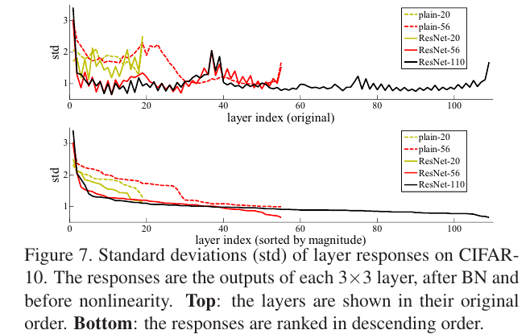

**Analysis of Layer Responses.**
- 그림 7은 레이어 response의 표준 편차(std)를 보여줍니다.
	-  response은 BN 다음과 다른 비선형성(ReLU/추가) 이전의 각 3×3 계층의 출력입니다. 
	- ResNets의 경우 이 분석을 통해 잔차 함수의 response 강도가 표시됩니다.
	- 그림 7은 ResNets의 일반 response보다 일반 응답이 더 작다는 것을 보여줍니다. 
	- 이러한 결과는 잔차 함수가 비잔차 함수보다 일반적으로 0에 가까울 수 있다는 기본 동기(3.1항)를 뒷받침합니다.
	- 또한 그림 7의 ResNet-20, 56 및 110 간의 비교에서 입증된 바와 같이 심층 ResNet의 응답 크기가 더 작다는 것을 알 수 있습니다. 
	- 레이어가 더 많을 경우 ResNet의 개별 레이어는 신호를 덜 수정하는 경향이 있습니다.

**Exploring Over 1000 layers.**
- 우리는 1000개 이상의 계층의 공격적으로 심층 모델을 탐색합니다. 
	- 우리는 1202 계층 네트워크로 이어지는 n = 200을 설정하고, 이는 위에서 설명한 대로 훈련됩니다. 
	- 우리의 방법은 최적화 어려움을 보이지 않으며, 이 10^3 계층 네트워크는 훈련 오류 <0.1%(그림 6, 오른쪽)를 달성할 수 있습니다. 
	- 그것의 테스트 오류는 여전히 꽤 좋습니다(7.93%, 표 6).

- 그러나 이러한 공격적으로 심층적인 모델에는 여전히 미해결 문제가 있습니다. 
	- 이 1202 계층 네트워크의 테스트 결과는 유사한 훈련 오류가 있지만 110 계층 네트워크의 테스트 결과보다 좋지 않습니다. 
	- 이는 over-fitting 때문이라고 주장합니다. 
	- 1202 계층 네트워크는 이 작은 데이터 세트에 대해 불필요하게 클 수 있습니다. 
	- 이 데이터 세트에서 최상의 결과([9, 25, 24, 34])를 얻기 위해 maxout [9] 또는 dropout [13]과 같은 강력한 정규화가 적용됩니다. 
	- 본 논문에서는 maxout/dropout을 사용하지 않고 최적화의 어려움에 집중하지 않고 단순히 설계에 의해 깊고 얇은 아키텍처를 통해 정규화를 부과합니다.
	- 그러나 더 강력한 정규화와 결합하면 결과가 향상될 수 있으며, 이는 앞으로 우리가 연구할 것입니다.

### 4.3. Object Detection on PASCAL and MS COCO

- 우리의 방법은 다른 인식 작업에 대한 일반화 성능이 좋습니다. 
	- 표 7과 표 8은 PASCAL VOC 2007 및 2012 [5] 및 COCO [26]의 객체 검출 기준선 결과를 보여줍니다. 
	- 우리는 검출 방법으로 Faster R-CNN [32]을 채택합니다. 여기서 우리는 VGG-16 [40]을 ResNet-101로 대체하는 개선점에 관심이 있습니다.
	-  두 모델을 사용하는 검출 구현(부록 참조)은 동일하므로, 이득은 더 나은 네트워크에만 귀속될 수 있습니다.
	- 가장 주목할 만한 것은 도전적인 COCO 데이터 세트에서 COCO의 표준 메트릭(mAP@[.5, .95])이 6.0% 증가하여 상대적으로 28% 향상되었다는 것입니다. 
	- 이 증가는 오직 학습된 표현 덕분입니다.
	- 깊은 잔류망을 바탕으로, 우리는 ILSVRC & COCO 2015 대회에서 ImageNet 검출, ImageNet 현지화, COCO 검출, COCO 세분화 등 여러 트랙에서 1위를 차지했습니다. 자세한 내용은 부록에 나와 있습니다.