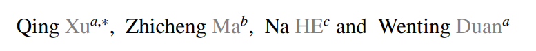

# DCSAU-Net: A deeper and more compact split-attention U-Net for medical image segmentation

https://arxiv.org/abs/2202.00972

## 저널 :  Computers in Biology and Medicine (q1, 2023)
## 저자 : 

## ABSTRACT

- U-net 구조가 biomedical image segmentation에 있어서 실용적이 사용에 있어 넓게 사용하며 큰 발전(breakthrough)을 이루었다. 
- 그러나 **encdoer 부분의 모든 다운샘플링 레이어와 단순히 스택된 컨볼루션의 동일한 설계는 U-Net이 서로 다른 깊이에서 기능의 충분한(sufficient) 정보(informatiON)를 추출(exctract)할 수 있도록 허용하지 않습니다**.
  - 의료 이미지 복잡성이 증가함에 따라 기존 방법에 새로운 문제 발생
- 본 논문에서는 **deeper and more compact split attention u-shape network(더 깊고 합축성 분할 attention U-nEt)을 제안한다. 이것은 두가지 framework 기반에서 low-level과 high-level의 semantic information 효율적으로 이용**한다.
- 우리는 제안된 모델은 union과 dice coefficient의 mean intersection의 관점에서 최신 성능을 보여 준다.
- 더 중요한 것은 제안된 모델이 challenging images에서 우수한 segmentation 성능을 나타냄을 보여준다.

## 1. Introduction

- **대장암(colon cancer), 다발성 골수종(multiple myeloma), 흑색종(melanoma)과 같은 종류의 암은 Medical image analyiss 역할은 진단(dianosing)와 치료( treating)에 필수**적이다. 
	- 예, **현미경(microscopy) 이미지의 수많은(numverous) 세포는 질병의 단계**를 설명하고, 종양(tumour) 유형을 식별하는데  도움을 주며, 세포(cellular)와 분자(molecular) 유전(genetic) 메너키즘(mechanisms)에 대한 통찰(insight)력을 지원하며(support), 암(cancer)과 chronic(만성) 폐쇄성(obstructive) 폐의(pulmonary) 병과 같은 많은 다른 응용 분야에 귀중한(valuable) 정보를 제공한다.
	- 전통적으로 의료 영상은 병리학자(pathologists)가 수동적(manually)으로 분석한다. 즉 진단 결과(result of diagnosis)는 대개 의료 전문가(medical experts) 경험에 의해 좌우 되며(dominated), 이는 시간이 많이 걸리고 주관적(subjective), 오류 발생(error-prone) 하기 쉽다.
	- CAD(computer-aided diagnosis)은 병리학(pathological) 연구자(researcher)와 임상(clinical) 실습(practice) 모두로부터 상당한 관심을 가졌다. 
- **분류(classificaton) 및 검출(detection task) 작업과는 달리 생물의학적(biomedical) 이미지 분할(segmentatiON)의 목표는 환자에게 보다 상세한 질병 분석을 제공할 수 있는 이미지의 배경에서 특정 개체를 분리**하는 것입니다
	- 기존의 고전적인 세분화 알고리듬은 에지 감지(edge detection), 임곗값(thresholding), 형태학(morphology), 두 객체 간 거리(distance between two ojbects) 및 픽셀 에너지(pixel energy)(예: Otsu Thresholding , Snake 및 Fuzzy 알고리듬)을 기반으로 합니다. 
	- 각 알고리즘에는 서로 다른 요구 사항을 수용(accommodate)할 수 있는 고유한 매개 변수가 있습니다. 
- 그러나 **이러한 알고리듬은 복잡한 데이터 세트의 일반화에 대해 제한적인 성능을 보이는 경우**가 많습니다.
	- 각 **알고리즘에는 서로 다른 요구 사항을 수용할 수 있는 고유한 매개 변수**가 있습니다. 
	- 그러나 이러한 **알고리듬은 복잡한 데이터 세트의 일반화에 대해 제한적인 성능**을 보이는 경우가 많습니다[9]. 
	- 이러한 방법의 **분할 성능은 영상 획득 품질에도 영향을 받습니다. 예를 들어 일부 병리학적(pathological) 이미지는 흐릿하거나 노이즈를 포함**할 수 있습니다. 
	- **불균일한(uneven) 조명(illuination), 전경과 배경 사이의 낮은 이미지 대비, 복잡한 조직 배경 등 다른 상황에도 부정적인 영향을 미칠 수 있습니다 [10]. 따라서 도전적인 이미지에 대한 적절한(adequate) 견고성(robustness)을 달성하고 다양한 생물 의학 애플리케이션에 대해 작동할 수 있는 강력하고 일반적인 모델을 구성하는 것이 필수적**입니다.

- **CNN(Convolutional Neural Network) 기반 인코더-디코더 아키텍처는 다양한(various) 의료 이미지 분할 작업에서 기존 이미지 처리 방법을 능가**했습니다 [11]. 
	- 이러한 모델의 성공은 **낮은 수준의 의미 정보와 높은 수준의 의미 정보를 통합(incorporate)하여 최종 마스크를 생성하는 스킵 연결 전략에 크게 기인**합니다 [12].
- 그러나 많은 **개선된 아키텍처는 심층적인 특징 추출 측면에서 알고리듬 최적화에만 초점을 맞추고 있으며, 이는 인코더의 헤더에서 고해상도 정보의 손실**을 무시합니다. 
	- 이 계층에서 **추출된 충분한 기능 맵은 풀링 작업 동안 손실된 공간 정보를 보완**하는 데 도움이 될 수 있습니다 [13].

- 본 논문에서는 **DCSAU-Net이라고 하는 의료 이미지 분할을 위한 인코더-디코더 아키텍처**를 제안합니다. 
	- 인코더 부분에서, 우리의 모델은 먼저 **매개 변수의 수와 계산량을 줄이고 네트워크의 장거리(long-range) 공간 정보를 낮은 수준의 의미 계층에 통합**하는 기본 기능 보존(primay feature conservation PFC) 전략을 채택합니다.
		- 이 계층에서 얻은 풍부한 기본 기능은 구성된 모듈, 즉 CSA(compact split-attention) 블록으로 전달될 것입니다. 
		- CSA 모듈은 **다중 경로 주의 구조(multi-path attention structure)를 사용하여 다양한 채널의 기능 표현을 강화**합니다.
		- 각 경로에는 CSA 모듈이 서로 다른 수신(receptive) 필드 스케일을 가진 혼합 피쳐 맵을 출력할 수 있도록 서로 다른 수의 컨볼루션이 포함되어 있습니다. 
		- 두 가지 새로운 프레임워크 모두 레이어 증가에 따른 그레이디언트 소실 문제를 완화하기 위해 잔류 스타일로 설계되었습니다.
	- **디코더의 경우, 모든 다운샘플링 계층의 인코딩된 기능은 스킵 연결에 의해 해당 업샘플링 기능과 연결**됩니다. 
		- 결합된 기능에서 효율적인 기능 추출을 완료하기 위해 동일한 CSA 블록을 적용합니다. 
		- 제안된 DCSAU-Net은 추가 지원 샘플(예: 초기화된 마스크 또는 에지 initialised mask or edge) 없이 쉽게 훈련할 수 있습니다.
		-  이 작업의 주요 기여는 다음과 같이 요약할 수 있습니다:

- (1) 입력 이미지에서 충분한 기본 기능을 **캡처하기 위해 DCSAU-Net에 PFC라는 메커니즘이 내장**되어 있습니다. 
	- 다른 일반적인 설계와 비교하여 **PFC는 계산 효율성을 향상시킬 뿐만 아니라 네트워크의 수용 영역**을 확장합니다.
- (2) **DCSAU-Net의 다중 스케일 표현을 향상시키기 위해 주의 메커니즘이 있는 다중 분기 기능 그룹을 채택하는 CSA 블록을 구축**합니다.
	-  각 그룹은 **서로 다른 수신 필드 크기의 조합으로 피쳐 맵을 출력하기 위해 서로 다른 수의 컨볼루션**으로 구성됩니다.
- (3) 실험 분석은 2018 Data Science Bowl, ISIC-2018 병변 경계 분할 CVC-ClinicDB  및 두 개의 다중 클래스 분할 데이터 세트를 포함하여 5개의 서로 다른 의료 영상 분할 데이터 세트로 수행됩니다: SegPC-2021와 브라TS-2021. 평가 결과는 제안된 DCSAU-Net이 의료 이미지 분할을 위한 새로운 SOTA 방법이 될 수 있는 (IoU and Dice)는 표준 컴퓨터 비전 메트릭 측면에서 다른 최첨단(SOTA) 분할 방법보다 우수한 성능을 보여준다는 것을 보여줍니다.

## 2. Related work

### 2.1. Medical image segmentation

- 이러한 **아키텍처에서 영감을 받은 Zhou 등은 의료 이미지 분할을 위한 중첩된 U-Net(Unet++)을 제시**했습니다. 
	- **인코더와 디코더 사이의 기능 융합의 의미 정보 손실을 줄이기 위해 일련의 중첩(nested) 및 건너뛰기 경로가 모델**에 추가됩니다. 
	- Huang 등은 저해상도(low-resolution) 정보와 고해상도(high-resolution) 정**보를 서로 다른 규모로 결합하는 또 다른 풀 스케일 스킵 연결 방법을 설계**했습니다.
	- Jha의 두 개의 **U-Net 아키텍처를 순차적으로(sequentially) 구성하는 Double U-Net 네트워크를 구축(organises)**했습니다. 
	- **인코더 부분에서는 각 다운샘플 레이어의 끝에 Atrous Spatial Pyramid Pooling(ASPP)이 구성되어 컨텍스트(contextual)** 정보를 얻습니다.
	-  평가 결과는 **DoubleU-Net이 용종(polyp), 병변(lesion) 경계 및 핵(nuclei) 분할에서 잘 수행된다는 것을 보여줍니다. 더 깊은 네트워크를 수렴하려고 시도할 때 그라데이션 소실 문제**가 발견되었습니다.

- 이 문제를 해결하기 위해 He의 **다양한(different) 세분화(segmentation) 네트워크에 널리 적용되었던 심층 잔여 아키텍처(ResNet)를 도입**했습니다. 
	- 의료 영상 분할의 경우 Jha의 Res라고 불리는 용종(polyp) 분할을 위한 advanced(고급, 향상된) u-shape 아키텍처를 구축했습니다
	- UNet++. 이 모델에는 잔류 스타일, 스퀴즈 및 여기 모듈, ASPP 및 주의 메커니즘이 포함됩니다
	- Tarasiewicz 외. [28] 뇌종양(brain tumour) 분할을 위해 개발된 경량(lightweight) U-Net. 인셉션(inception) 모듈과 고밀도(dense) 블록은 광범위한(wide) 공간(spatial) 정보 수집을 위해 인코더와 디코더에 내장되어 있습니다.

- 그러나 **대부분의 모델은 단일 데이터 세트(single dataset) 또는 이진 분할 작업(binary segmentation)에서만 평가**됩니다. 
	- 네트워크 아키텍처를 수정하는 것과는 **대조적으로, Isensee은 데이터 사전 처리(pre-processing), 모델 교육 전략 및 결과 추론(inference)의 중요성을 강조하는 nnU-Net을 제안**했습니다. 
	- 모든 작업에 대해 nn-Unet은 모델의 가장 최적의 매개 변수를 **자동으로 검색**할 수 있습니다. 
	- 사소한 변경 U-Net으로 **23개의 공개 데이터 세트에서 평가되었으며 다른 알고리듬에 비해 뛰어난 성능**을 보여주었습니다.
	-  반대로, 우리의 접근 방식은 네트워크 자체의 향상에 초점을 맞추고 있습니다. 
	- 이러한 기술은 모든 아키텍처에도 적용되고 성능을 향상시킬 수 있기 때문입니다 [30], [31].

### 2.2. Attention mechanisms

- **채널 주의(channel attention) 사항 중 하나인 SENet [32]는 의료 영상 분할에 널리 적용**되었습니다.
	- 글로벌 평균 풀링이 있는 스퀴즈 모듈을 사용하여 글로벌 공간 정보를 수집하고 여기 모듈을 사용하여 피처 맵에서 **각 채널 간의 관계를 얻습니다. 공간 주의는 적응형 공간 위치 선택 메커니즘**이라고 할 수 있습니다.
	- **글로벌 평균 풀링(global average pooling)이 있는 스퀴즈(squeeze) 모듈을 사용하여 글로벌 공간 정보(global spatial information)를 수집하고 여기 모듈(excitation module)을 사용하여 피처 맵에서 각 채널 간의 관계**를 얻습니다.
	-  **공간 주의(spatial attention)는 적응형(adaptive) 공간 위치 선택 메커니즘**이라고 할 수 있습니다.
	- 예를 들어,**Oktay 등. 추가 계산 비용과 모델 매개 변수 없이 유용한 기능을 강조하는 특정 영역에 정확하게 초점을 맞출 수 있는 상향식 주의 게이트를 사용하는 attention U-Net**을 도입했습니다
- 또한, 일련의  ViT는 더 광범위한 분야에서 사용되고 있습니다. 
	- XU 외 **LeViT-UNET은 기능에서 먼 공간 정보(distant spatial information)를 수집할 것을 제안**했습니다. 
	- 또한 변**압기는 CNN과 통합되었을 때 강력한 성능**을 보여주었습니다.
	-  Chen 외, 제공된 트랜스이미지 패치를 얻기 위해 CNN을 인코더의 전반부(first half)로 선택하고 트랜스포머 모델을 사용하여 글로벌 컨텍스트(global context)를 추출하는 TransUNet. 디코더의 최종 혼합 기능은 보다 정확한 현지화를 달성할 수 있습니다. 
	- 그러나 transformer-based networks는 일반적(usually)으로 많은 수의 매개 변수를 포함(contain)하며 더 많은 컴퓨팅 소스를 소비합니다. 
	- **기존 주의 아키텍처를 최적화하고 가벼운 주의 모듈을 제안**합니다

### 2.3. Depthwise separable convolution

- **Depthwise separable convolution은 Howard 외 연구진이 제안한 효율적인 신경망 아키텍처**입니다. 
	- 이 아키텍처의 각 컨볼루션 필터는 하나의 입력 채널을 담당합니다.
	- **standard convolution과 비교하여 깊이별 컨볼루션(depthwise covlution)은 동일한 효과를 달성할 수 있을 뿐만 아니라 매개 변수와 계산 비용이 더 적게** 듭니다.
- 그러나 모든 입력 채널의 기능만 추출(extract)합니다. 
	- 채널 간의 정보를 결합하고 새 피쳐 맵을 만들기 위해 포인트별(point-wise) 컨볼루션이라고 하는 1×1 컨볼루션은 깊이별 컨볼루션(depth wise convolution)을 따릅니다. 
	- 최종 MobileNets 모델은 딥 러닝의 새로운 백본으로 확립(established)되고 고려되었습니다.
	- 이미지 분류 작업에서 Chollet은 깊이별 분리 가능한 (depthwise separable) 컨볼루션을 사용하여 이전 SOTA 방법을 능가하고 더 낮은 복잡성을 나타내는 Xception 모델을 구성했습니다. 
- 그러나 **Sandler 외 연구진 낮은 채널 특징 맵에서 깊이별 컨볼루션이 제대로 수행되지 않음을 관찰**했습니다..
	- 앞서 언급한 문제를 해결하기 위해, **그들은 형상의 차원을 미리 증가시키기 위해 깊이별 컨볼루션 앞에 1×1 컨볼루션을 추가하는 새로운 MobileNetV2 모델을 제안**했습니다.
	-  MobileNets와 비교하여 MobileNetV2는 매개 변수 수를 증가시키지 않고 성능 저하를 감소시킵니다.
- 의료 영상 분할에서 Qi 등. [43] 3D 뇌중풍(brain stroke) 병변 분할을 위한 X-net 모델을 도입했습니다. 
	- **깊이별 분리 가능한 컨볼루션을 사용하여 피처 맵에서 거리 공간 정보를 캡처하기 위해 피처 유사성 모듈(feature similarity module FSM)이 만들**어졌습니다. 
	- 실험 결과는 X-net 모델이 더 높은 성능을 달성하기 위해 다른 SOTA 모델의 매개 변수 수의 절반만 비용이 든다는 것을 보여줍니다.

## 3. Method

### 3.1. Primary feature conservation

- **대부분의 의료 이미지 분할 네트워크에서 첫 번째 다운샘플링 블록 작업에 사용되는 컨볼루션은 이미지에서 낮은 수준의 의미 정보를 추출**하는 것입니다. 
	- 그림 1(a)의 **U-Net 아키텍처[22]는 다양한 모델[25], [35]에서 널리 사용**되었습니다. 
	- 그림 1(b)의 스**템 블록 [44]은 일반적으로 7×7 컨볼루션과 동일한 수용 필드를 얻고 파라미터의 수를 줄이도록 설계**됩니다. 
	- Res의 첫 번째 피쳐 스케일 다운샘플링 도면층UNet++ [27]은 그림 1(c)에 나타난 바와 같이 기울기 소실의 잠재적 영향을 완화(mitigate)하기 위해 스킵 연결(skip connection) 전략을 추가합니다.
- 더 **많은 컨볼루션 블록을 쌓으면 신경망의 수용 영역을 확장할 수 있지만, 매개 변수의 수와 계산량은 빠르게 증가**할 것입니다. 
	- 모델의 안정성이 손상될 수 있습니다. 
- 또한, **최근의 연구에 따르면 적층된 3 × 3 컨볼루션의 수가 계속 증가할 때 유효한 수용 필드가 어느 정도 감소**할 것이라고 합니다 [45].
	- 이 문제를 해결하기 위해 그림 1(d)에 제공된 첫 번째 다운샘플링 블록에서 새로운 기본 기능 보존(primary feature conservation PFC) 전략을 소개합니다. 
	- 우리 모듈의 **주요 개선(refinement)은 깊이별 분리 가능한(depthwise separable convolution) 컨볼루션을 채택하며, 7 × 7 깊이별 컨볼루션(depthwise convolution)과 1 × 1 점별(pointwise convolution) 컨볼루션으로 구성**됩니다.
- **depthwise separable convolution이 standard convoultion를 비교했을 때 parameter 수와 계산 비용을 감소시키기 떄문에, 우리는 distant(먼) 공간(spatial) 정보를 병합하고 가능한 주요(primary) features를 보존하기 위해  큰 크기의 kernel 크기의 depthwise convolution을 적용할 기회**를 가졌다.
	- **1x1 pointwise convolution은 채널 정보를 융합**하는데 사용됩니다.
	- `Convnext 역시 swin transfomer을 모방하지만 1x1을 channel 융합 하는데 사용한다.` 
	- 또한 **3x3 convolution은 이 모듈의 head에 더해진다. (feature channel 을 증가하기 위해 그 이유는 depthwise separable convolution이 low-dimensional feature에서 낮은 성능을 보이기 때문에)**
	- **모든 convolution은 ReLU 활성화와 BatchNOrm을 따른다**. 
	- **gradient vanish를 피하기 위해 PFC 블럭을 residual style**로 구성한다.
- 이를 위해 제안된 PFC 모듈은 parameters와 계산 커스트 증가없이 성능을 높일 수 있다. 게다가 우리는 7x7 kernel size의 depthwise convoltion을 사용한 이유는 Section 5에 설명된다.

