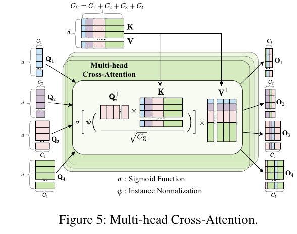

#### [UCTransNet: Rethinking the Skip Connections in U-Net from a Channel-Wise Perspective with Transformer 자세한 설명](./)

# UCTransNet: Rethinking the Skip Connections in U-Net from a Channel-wise Perspective with Transformer

이 논문은 최근 의미론적 분할 방법에 대해 다루고 있습니다. 이 방법들은 대부분 U-Net 프레임워크를 사용하며, 이는 인코더-디코더 아키텍처를 가지고 있습니다. U-Net은 간단한 스킵 연결 구조를 가지고 있지만, 이로 인해 전역 다중 스케일 컨텍스트를 모델링하는 것이 여전히 도전적입니다.

## 주요 발견

이 논문에서는 인코더와 디코더 단계의 피처 세트가 호환되지 않는 문제로 인해 모든 스킵 연결 설정이 효과적이지 않다는 점을 지적하고 있습니다. 심지어 일부 스킵 연결은 분할 성능에 부정적인 영향을 미칩니다. 또한, 원래의 U-Net은 일부 데이터셋에서 어떠한 스킵 연결도 없는 버전보다 성능이 떨어집니다.

## UCTransNet

이러한 발견에 기반하여, 저자들은 주의 메커니즘을 이용한 채널 관점에서 새로운 분할 프레임워크인 UCTransNet을 제안합니다. 특히, CTrans (Channel Transformer) 모듈은 U-Net의 스킵 연결을 대체하는 것으로, CCT (Channel Cross fusion with Transformer)와 CCA (Channel-wise Cross-Attention)라는 두 개의 서브 모듈로 구성되어 있습니다.

CCT는 다중 스케일 채널 크로스 융합을 수행하고, CCA는 융합된 다중 스케일 채널 정보를 디코더 피처에 효과적으로 연결하여 모호성을 제거하는 데 도움이 됩니다. 따라서, CCT와 CCA로 구성된 제안된 연결은 원래의 스킵 연결을 대체하여 정확한 자동 의료 이미지 분할을 위한 의미론적 간극을 해결할 수 있습니다.

## 실험 결과

실험 결과, 제안된 UCTransNet은 더 정확한 분할 성능을 제공하며, 다양한 데이터셋과 전통적인 아키텍처(트랜스포머 또는 U-형 프레임워크를 포함)에 대해 최신 기술을 향상시키는 일관된 개선을 보여줍니다.

논문의 코드는 다음 링크에서 확인할 수 있습니다: [UCTransNet Code](https://github.com/McGregorWwww/UCTransNet)

## 더 자세한 내용

이 논문은 U-Net의 스킵 연결에 대한 새로운 이해를 제공하며, 이를 통해 의료 영상 분할의 성능을 향상시키는 데 기여하고 있습니다. U-Net의 스킵 연결은 인코더와 디코더 사이의 정보를 직접 전달하여 네트워크가 입력 이미지의 고해상도 세부 정보를 유지할 수 있도록 돕습니다. 그러나 이 논문에서는 이러한 스킵 연결이 항상 효과적이지 않음을 보여주며, 일부 경우에는 성능을 저하시킬 수 있음을 보여줍니다.

이를 해결하기 위해 저자들은 채널별 주의 메커니즘을 도입한 새로운 UCTransNet을 제안합니다. 이 네트워크는 각 채널의 중요성을 독립적으로 조정하여 더 효과적인 피처 융합을 가능하게 합니다. 이로 인해 네트워크는 더 정확한 분할 성능을 달성할 수 있습니다.

이 논문의 결과는 의료 영상 분할, 특히 U-Net과 같은 인코더-디코더 아키텍처를 사용하는 분야에 중요한 시사점을 제공합니다. 이러한 아키텍처는 이미지 분할, 객체 탐지, 의료 이미지 분석 등 다양한 컴퓨터 비전 작업에서 널리 사용되고 있습니다. 이 논문의 결과는 이러한 작업의 성능을 향상시키는 데 도움이 될 수 있습니다.

# 나의 의견

- 우선 일부 불친절한 것이 있었다. pre-train을 쓴다고 했는데 MoNuSeg, Glas의 경우 쓴것 같은데 paper에는 확실히 표시 그리고 표에 확실히 표시를 안해 주어서 헷갈렸다.
- 하지만 intro에서의 동기를 확실히 설명 했다. 그것을 위해서 skip 관련 실험을 수행하였고 이후에 experiment에서 본인 모델에서 skip connection을 하나씩, 없애면서 또 실험을 하며, 우리가 가진 의문도 해결 해주었다. 즉 결과적으로 2,3,4,연결이 중요하다는 것이다.
  - 이런 것은 다음 연구자에게도 도움이 된다.
  - 또한 본인의 의문을 보여주면서 그것이 무엇이 문제인지도 확실히 보여 줌을써 모델을 만들었다. 
  - 그점에서 동기에 대한 근거가 확실하다.