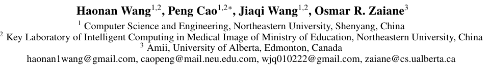

# UCTransNet: Rethinking the Skip Connections in U-Net from a Channel-Wise Perspective with Transformer

https://ojs.aaai.org/index.php/AAAI/article/view/20144/19903

## 저널 : AAAI 2022
**The Thirty-Sixth AAAI Conference on Artificial Intelligence (AAAI-22)**

## 저자 : 

### Abstract

- 대부분 최신 s**emantic segmentation은 U-net 구조를 채택**한다.
- 간단한(simple) s**kip connection을 가진 U-Net이 글로벌(global)  멀티 스케일  컨텍스트(context)를 모델링 하는 것은 여전히 어렵다**.

  1. **인코더와 디코더의 비호환(incompatible) 기능 세트 문제로 인해 각(each) skip connection은 효과 적이지 않다**.
  2. **U-net이 일부 데이터 세트에서 skip connection이 없는것**이 더 효과가 있을 때가 있다.

- 연구 결과를 바탕으로 그들은 새로운 segmentation framework를 제안한다. (UCTransNet with a proposed CTrans moduel in U-net). (채널 관점에서 attention 메커니즘)  
- 특히 CTrnas (Channel Transformer) 모듈은 U-net skip connection의 대안이다. 이것은 Transformer으로 이루어진 multi-scale Channel cross fusion (CCT)인 하위 모듈과 함께  구성되다. 그리고 하위 모듈 Channel-wise cross-Attention (named CCA) 는 합성된 multiscale channel-wise 정보(infromation)을 효율적으로 디코더(decoder)와 모호성(ambiguity)을 제거하기위해 연결하는데 가이드를 해준다.   
- 따라서 제안되 CCT와 CCA로 구성된 연결은 기존(original) skip connection을 대체한다. 그것은 정확한 자동 메디컬 이미지 segmentation에서의 semantic gap(의미론적 차이)를 해결해 준다.  
- 실험 결과에 따르면 그들의 UCTransNet은 더 정확한 segmentation성능과 최신 성능을 뛰어넘는 일관된 상승을 보여준다. (기존 아키텍처와 다른 데이터 세트에서 의미론적 분류에서)

## Introduction

- **의료영상은 의사가 질병을 평가하고 예방 및 통제 조치를 최적화 하는데 도움이 되는 필수 기술**로 간주됩니다.
  - 의료 영상에서 **대상(target) 개체의 분할 및 후속(subsequent) 정량적(quantitative) 평가(assessment)는 병리학(pathologies) 분석에 귀중한 정보를 제공하며 치료 전략(treatment strategies), 질병 진행 모니터링(monitoring of disease progression), 그리고 환자 결과 예측(prediction of patient outcome)에 중요**합니다.
  - 최근 의미론적 분할의 방식은 일반적으로 **인코더(encoder) 가 저해상도(low-resolution) 이미지 특징을 생성하고 디코더(decoder)가 pixel class score로 분할 맵에  업 샘플링하는 컨볼루션(convlutional) 인코더-디코더 아키텍쳐에 의존**한다.
  - U-net은 인코더(encoder)가 낮**은 수준(low-level)과 높은 수준(high-level) 기능(feature)을 캡처하고 디코더가 의미론적(semantic) 기능(features) 결합하여 최종 결과를 구성하기 때문에 의료 이미지 분할에 가장 널리 사용되는 인코더-디코더 네트워크 아키택처**이다.
  - skip-connection은 **풀링(pooling) 작업 중에 손실되는 공간(spatial) 정보(information)을 전파하여 인코딩-디코딩 프로세스를 통해 전체(full) 공간(spatial) 해상도(resoution) 복구하는데 도움이 될 수 있다**.
  - 이를 조사하기 위해 **U-Net에 대한 심층(in-depth) 연구를 수행하고 여러 데이터 세트에 대한 분석에 따라 몇 가지 주요 제한 사항**을 관찰한다.
  - 우리는 `**simple skip connection 체계(scheme)를 가진  U-net이 의미적(semantic) 격차(gap)을 고려하지 않고(without considering) 디코딩(decoding) 프로세스를 지원하기 위한 글로벌(global) 멀티 스케일(multi-scale) 컨텍스트(context)를 모델링 하는 것은 여전히 어렵다는 것을 발견**`했다.
  - `여기서 문제점을 정확히 집었다. 어떤 문제를 해결할 것인지 말이다.`

**U-net 확장에는 기본적으로 두가지 주요 문제가 있다.:**
  1. 인코더(encdoer)의 어떤 기능중 어떤레이어가 멀티 스케일(multi-scale) 피처(features)를 집계(aggreagating)하여 글로벌(global) 컨텍스트(context)를 모델링하기 위해 디코더에 연결해야 할 인코더(encoder) feature layer 결정.
  2. 특징(feature)을 단순히 연결시키는 것이 아니라, 의미적(semantic) 차이(gap)가 있을 수 있는 것과 효율적인 융합하는 방법을 찾는것

- **다중 스케일 인코더(multi-scale encoder) 기능(features) 간(among) 및 인코더돠 디코더 단계 간에 의미론적(semantic) 격차가 존재하여 분할 성능을 제한**한다.
  - 위에서 언급한(aforementioned) 한계를 극복하기 위해 최근 이 **두 가지 호환되지 않는(incompatible) 기능 세트를 융합할 때 불일치를 완화하기 위해 여러가지 접근 방식이 도입** 되었다.
  - 첫번째는 방법으로는 의료 영상 분할을 위해 **일반(plain) skip connections을 중첩된(nested) 밀도 높은(dense) skip 경로로(pathways) 직접 대체**하는 것이다.
  - 가장 대표적인 방법은** UNet++로 일련의(series) 컨벌루션으로 밀도 높은 연결을 도입하여 인코더와 디코더 하위 네트워크(sub-networks) 간의 의미적  차이 격차를 줄이고(narrow) 더 나은 분할 성능**을 달성 합니다.
  - 이는 동일한 **규모의(only same-scale featur maps) 기능 맵만 융합해야 하는 U-net의 제한적인 skip connection에 비해 개선**된 것이다.
  - `앞에 언급한것처럼 이미 다른 사례를 들어서 skip connection의 필요성을 언급 하고 있다.`

- 다른 접근 방식은 **인코더 단계(encoder stage)에서 전파(propagate)되는 기능(features)에 추가적인(addtional) 비선형(non-linear) 변환(transformation)을 도입하여  스킵 연결을 강화(strenghthening)하는데 초점을 맞추고 있으며, 이는 가능한(posiible) 의미적 격차를 설명(account)하거나 어느 정도 균형(balance)를 맞춰야** 합니다.
	- 위의 두 작업 모두 우수한 성능을 달성했음에도 불구하고 여전히 **전체 규모(full scale)에서 충분한 정보를 탐색할 수 없습니**다.(incapable)
	- 의료 **영상 분할(segmentation)의 복잡한(complex) 스케일 변화(variations)를 해결하려면 다중 스케일 기능(multi-scale features)을 캡처하는 것이 필수**적이다.
	- `또한 다른 것들을 해결 했지만 multi-scale feature에 대해서 아직 해결 하지 않음을 얘기하고 있다.`

- (Driven by the important issues.) 중요 이슈에 의해 주도 된다.
	1.  **U-Net 아키텍처에서 인코더와 디코더 단계의 기능 간 의미론적 차이 해결**.
	2.  전**체 스케일에서 충분한 정보를 탐색합니다. 즉, 다중 스케일 기능을 효과적으로 캡처**합니다.

- 이 **논문에서는 그들은 skip connetion design(설계)를 재고 하고(rethink) 인코더(encoder)와 디코더(decoder) 단계(stage)사이의 기능을 더 잘 연결하기 위한 대체 방법을 제안**한다.
	- 다**양한(different) 채널은 일반적으로(usually)  다양한(different) 의미(semantic) 패턴(patterns)에 초점을 맞추며, 충분한(sufficent) 채널별 기능을 적응적(adaptively)으로 융합하는 것은 복잡한 의료 의미지 분할에 유리**하다.

- **이를 위해 U-net을 네트워크의 주요 구조로 하는 UCTransNet이라는 종단간(end-to-end) 딥 러닝 네트워크 제안**.
	- 그들은 **채널별 관점에서(channel-wise perspective)  교차 주의(cross attention)와 다중 스케일 컨텍스트(multi-scale context)를 융합하는 채널별 교차 융합 변압기(Channel-wise cross fusion Trnasformer (CCT))를 제안**한다.
	- 그것은 독**립적인(independent) 연결이 아닌 협업(collaborative) 학습을 통해 다중 스케일(multi-scale) 채널별 기능(channel-wise features)을 가능 규모(possible scale)의 의미적 격차와 효과적인 융합하기 위한 적응형 체계를 달성하기 위해 로컬(local) 채널 간 상호 작용(local cross-chaneel interaction)을 포착**하는 것을 목표로 한다.

- 한편, **우리는 일관되지 않은(inconsistent) 의미 수준(semantic level) 해결하기 위해 융합된(fused) 다중 스케일 기능과 디코더 단계의 기능을 융합하기 위해 또 다른 채널별 교차 주의(channel-wise cross Attention CCA) 모듈을 제안**한다.

	- **CCT + CCA = CTrans**

	- 두 **교차 주의(CCT and CCA) 모듈 모두 CTrans라고 하며, 이는 다중 스케일 글로벌 컨텍스트(mutl-scale global context)을 탐색하여 인코더와 디코더 간의 연결(association)을 설정하고 원래의 스킵 연결을 대체하여 분할 성능 향상을 위한 의미론적 격차를 해결** 할 수 있다.
	- **제안된 두 모듈 모두 의료 영상 분할 작업에서 U-shape 네트워크에 쉽게 내장(embedde)되고 적용(applied)**될 수 있다.
	- `intor에 보면 쉽게 내장 되고 적용이 가능하다고 언급했다. 그러면 분명 실험에서 그것을 보여줄 것이다.`

- 광범위한 실험에 따르면 UCTransNet은 GlaaS, MoNuSeg 및 Synapse 데이터 세트에서 U-Net에 비해 각각 4.05% Dice, 7.98% Dice 및 9.00% Dice의 절대적인 이점을 통해 기존 분할 파이프라인을 크게 개선할 수 있습니다.
	-  또한 기능 상호 작용이 어떻게 작동하는지 조사하기 위해 철저한 분석을 수행했습니다.
	-  게다가, 이전 연구들은 트랜스포머와 U-Net을 결합하여 장거리 공간 의존성을 명시적으로 모델링했습니다.
	- 결과는 채널별 융합 변압기 체계가 일반적으로 컨볼루션 작업을 대체하기 위해 변압기를 통합하는 방법보다 더 나은 성능으로 이어진다는 것을 보여줍니다. 우리는 UCTransNet이 의료 이미지 분할을 위한 강력한 스킵 연결 체계 역할을 할 수 있다고 주장합니다.

**summary**
1. 우리의 연구는 여러 데이터 세트에서 U-Net 에서 **스킵 연결(skip conneciton)의 잠재적(potentional) 약점(weaknesses)을 철저히(thoroughly) 조사한 첫 번째 연구**이다.
   - 우리는 기능을 개별적으로(independently) 단순 복사하는 것이 아닌 적절한(appropriate) 접근 방식이 아니라는 것을 발견 했다.
2. 우리는 **낮은 수준(low-level)과 높은 수준(high-level)의 특징 사이의 의미론적 및 해상도 격차를 효과적으로 연결하여 의미론적 세분화 성능을 향상시키는 새로운 관점**을 제안한다. 
   - 우리의 접근 방식은 정교한(sophisticated) 채널별 종속성(channel-wise dependencies)을 캡처할 수 있는 다중 스케일 채널별 교차 주의(multi-scale channel-wise cross attention)를 사용하여 보다 효과적인 기능 융합을 포함한다.
3. **우리의 방법은 U-Net과 Transformer의 적합한 조합을 제공하여 계산 비용을 낮추고 성능**을 향상시킨다. 
   - 다른 최첨단 세분화 방법과  할때, 우리의 실험 결과는 세 가지 공개 데이터 세트 모두에서 우수한 성능을 보여 준다.
`각각 contribution이 method와 experiments에 잘 녹아 있을 것 같다. 그러니 하나씩 체크해야 한다.`