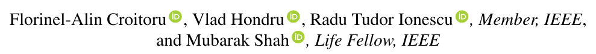
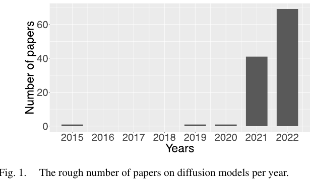
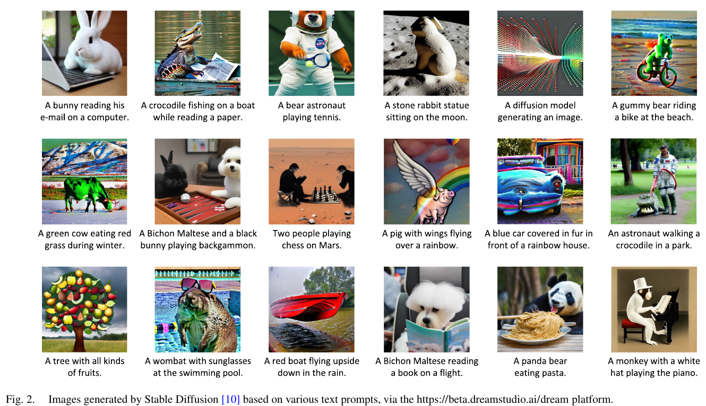
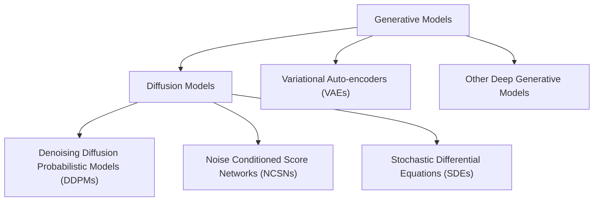
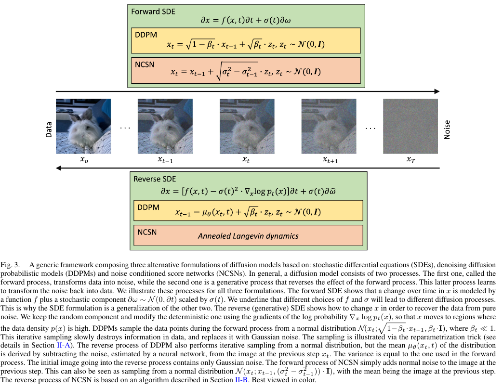

# Diffusion Models in Vision: A Survey

## 저널 : IEEE TRANSACTIONS ON PATTERN ANALYSIS AND MACHINE INTELLIGENCE, [2022년 기준 Q1, 1%]

https://arxiv.org/pdf/2209.04747

## 저자 :  

## Abstract:
- Denoising diffusion 모델은 컴퓨터 비전에서 최근에 부상한 주제를 나타내며, 생성 모델링 분야에서 주목할 만한 결과를 보여줍니다.
  -  Denoising diffusion은 forward diffusion stage와 a reverse diffusion stage의 두 단계를 기반으로 하는 심층 생성 모델입니다. 
  -  forward diffusion stage에서는 입력 데이터가 가우시안 노이즈를 추가하여 몇 단계에 걸쳐 점진적으로 섭동됩니다. 
  -  reverse diffusion stage에서는 모델이 단계별로 확산 과정을 점진적으로 되돌리는 방법을 학습하여 원본 입력 데이터를 복구하는 임무를 수행합니다.
     -  Denoising diffusion은 알려진 계산 부담에도 불구하고 생성된 샘플의 품질과 다양성, 즉 샘플링 중에 포함된 단계의 수가 많기 때문에 속도가 낮다는 점에서 널리 인정받고 있습니다. 
 - 이 조사에서는 비전에 적용된 노이즈 제거 Denoising diffusion에 대한 기사를 종합적으로 검토하여 해당 분야의 이론적 및 실제적 기여를 모두 포함합니다. 

- **denoising diffusion probabilistic models(DDPM), noise conditioned score networks(NCSN) 그리고 stochastic differential equations(SDE)을 기반으로 하는 세 가지 generic diffusion modeling frameworks를 식별하고 제시**합니다. 
  - 우리는 또한 확산 모델과 가변 자동 인코더, 생성 적대적 네트워크, 에너지 기반 모델, 자기 회귀 모델 및 정규화 흐름을 포함한 다른 심층 생성 모델 간의 관계에 대해 논의합니다. 
  - 그런 다음 컴퓨터 비전에 적용되는 확산 모델의 다중 관점 분류를 소개합니다. 
  - 마지막으로, 우리는 확산 모델의 현재 한계를 설명하고 향후 연구를 위한 몇 가지 흥미로운 방향을 구상합니다.

## I. INTRODUCTION

- DFFUSION 모델 [1]은 최근 컴퓨터 비전에서 가장 뜨거운 주제 중 하나가 된 심층 생성 모델의 범주를 형성하며, 높은 수준의 세부 사항부터 생성된 예제의 다양성에 이르기까지 인상적인 생성 기능을 보여줍니다(그림 1 참조).

- 우리는 특히 Imagen[12] 및 LDM(Latent Diffusion Models)[10]과 같은 모델을 참조하여 이러한 생성 모델이 생성 모델링 영역에서 기준을 새로운 수준으로 높였다고까지 말할 수 있습니다. 
  - 이 문장은 텍스트 프롬프트에 기초하여 이미지를 생성하는 LDM [10]의 버전인 Stable Diffusion에 의해 생성된 그림 2에 예시된 이미지 샘플에 의해 확인됩니다. 생성된 이미지는 매우 적은 아티팩트를 보여주고 텍스트 프롬프트와 매우 잘 정렬됩니다.
  - 특히, 프롬프트는 비현실적인 시나리오를 나타내도록 의도적으로 선택되므로(교육 시간에 결코 볼 수 없음) 확산 모델의 높은 일반화 용량을 보여줍니다.
  
----------

- 지금까지 확산 모델은 이미지 생성(image generation), 이미지 초해상도(image super-resolution), 이미지 인페인팅(image inpainting), 이미지 편집(image editing), 이미지 대 이미지 변환(image-toimage translation) 등 매우 다양한 생성 모델링 작업에 적용되었습니다.

- 또한, 확산 모델에 의해 학습된 잠재 표현은 이미지 분할, 분류 및 이상 감지과 같은 차별적 작업에서도 유용한 것으로 확인되었습니다.
  - 이는 denoising diffusion models의 광범위한 적용 가능성을 확인하며, 추가적인 응용 프로그램이 아직 발견되지 않았음을 나타냅니다
  - 또한, 강력한 잠재 표현을 학습할 수 있는 능력은 새로운 신경 구조설계부터 학습 전략 개발에 이르기까지 다양한 접근 방식을 포함하는 강력한 데이터 표현을 학습하는 방법을 연구하는 포괄적인 영역인 표현 학습 [47], [48]에 대한 연결을 만듭니다.

-----------

-  그림 1의 그래프에 따르면, 확산 모델에 대한 논문 수가 매우 빠른 속도로 증가하고 있으며, 빠르게 발전하고 있는 이 주제의 과거 및 현재 성과를 개략적으로 설명하기 위해 컴퓨터 비전에서 노이즈 제거 확산 모델에 대한 기사를 종합적으로 검토합니다.
   -  보다 정확하게는 아래에 정의된 생성 모델의 범주에 속하는 기사를 조사합니다.
      -   확산 모델은 (i) 가우시안 노이즈를 추가하여 입력 데이터가 몇 단계에 걸쳐 점진적으로 교란되는 전방 확산 단계와 
      -   (ii) 확산 과정을 점진적으로 되돌리는 것을 학습하여 확산(소음이 많은) 데이터에서 원본 입력 데이터를 복구하는 생성 모델이 임무를 수행하는 역(후방) 확산 단계에 기초한 심층 생성 모델의 범주를 나타냅니다.

---------

- 위의 정의를 준수하는 확산 모델에는 적어도 세 가지 하위 범주가 있음을 강조합니다. 
  - 첫 번째 하위 범주는 비평형 열역학 이론에서 영감을 받은 노이즈 확산 확률 모델(DDPM) [1], [2]로 구성됩니다.
    - DDPM은 잠재 변수를 사용하여 확률 분포를 추정하는 잠재 변수 모델입니다. 
    - 이러한 관점에서 DDPM은 VAE(Variational Auto-encoder)의 특수한 종류로 볼 수 있으며, 순방향 확산 단계는 VAE 내부의 인코딩 프로세스에 해당하고 역방향 확산 단계는 디코딩 프로세스에 해당합니다.
  - 두 번째 하위 범주는 노이즈 조건 점수 네트워크(NCSN)[3]로 표현되며, 이는 점수 매칭을 통해 공유 신경망을 훈련하여 서로 다른 노이즈 수준에서 교란된 데이터 분포의 점수 함수(로그 밀도의 기울기로 정의됨)를 추정하는 것을 기반으로 합니다. 
  - 확률적 미분 방정식 (SDE) [4]는 모델 확산에 대한 대안적인 방법을 나타내며, 확산 모델의 세 번째 하위 범주를 형성합니다. 
    - 순방향 및 역방향 SDE를 통한 모델 확산은 효율적인 생성 전략뿐만 아니라 강력한 이론적 결과로 이어집니다 [59]. 
    - 이 후자의 공식 (SDE 기반)은 DDPM 및 NCSN에 대한 일반화로 볼 수 있습니다.

- 우리는 몇 가지 정의 설계 선택 사항을 식별하고 위에서 소개한 세 가지 하위 범주에 해당하는 세 가지 일반 확산 모델링 프레임워크로 합성합니다. 
  - 일반적인 확산 모델링 프레임워크를 맥락에 두기 위해, 우리는 확산 모델과 다른 심층 생성 모델 사이의 관계에 대해 추가로 논의합니다. 
    - 보다 구체적으로, 우리는 가변 자동 인코더 (VAE) [50], 생성 적대적 네트워크 (GAN) [52], 에너지 기반 모델 (EBM) [60], [61], 자기회귀 모델 [62] 및 흐름 [63], [64]에 대한 관계를 설명합니다. 
  - 그런 다음, 우리는 컴퓨터 비전에 적용된 확산 모델의 다중 관점 분류를 소개하고, 기본 프레임워크, 대상 작업 또는 잡음 제거 조건과 같은 몇 가지 기준을 기반으로 기존 모델을 분류합니다. 
  - 마지막으로, 우리는 확산 모델의 현재 한계를 설명하고 향후 연구를 위한 몇 가지 흥미로운 방향을 구상합니다. 
    - 예를 들어, 가장 문제가 되는 한계 중 하나는 추론 중 시간 효율성이 낮다는 것인데, 이는 샘플 [2]를 생성하기 위해 수천 개와 같은 매우 많은 평가 단계에 의해 발생합니다. 
- 당연히, 생성된 샘플의 품질을 손상시키지 않고 이 한계를 극복하는 것은 향후 연구의 중요한 방향을 나타냅니다.

**In summary, our contribution is twofold:**

- 최근 확산 모델을 기반으로 한 많은 기여가 비전에 등장하고 있기 때문에, 우리는 일반 확산 모델링 프레임워크에 대한 빠른 이해를 독자들에게 제공하는 것을 목표로 컴퓨터 비전에 적용된 노이즈 제거 확산 모델에 대한 포괄적이고 시기 적절한 문헌 검토를 제공합니다.

- 우리는 확산의 다중 관점 분류(multi-perspective categorization)를 고안합니다
  - 특정 도메인에 적용된 확산 모델을 연구하는 다른 연구자들이 각 도메인에서 관련 작업을 신속하게 찾을 수 있도록 돕는 것을 목표로 하는 모델.

## II. GENERIC FRAMEWORK

- 확산 모델은 훈련 데이터 구조를 점진적으로 저하시키는 프로세스를 되돌리는 방법을 배우는 확률론적 생성 모델의 클래스입니다. 
  - 따라서 훈련 절차는 전방 확산 프로세스와 후방 잡음 제거 프로세스의 두 단계를 포함합니다.
  - 전자 단계는 각 입력 영상에 낮은 수준의 노이즈가 추가되는 여러 단계로 구성되며, 각 단계에서 노이즈의 규모가 다릅니다. 
  - 훈련 데이터는 순수한 가우시안 노이즈가 될 때까지 점진적으로 파괴됩니다.

- 후자의 단계는 순방향 확산 프로세스를 반전시킴으로써 표현됩니다. 
  - 동일한 반복 절차가 채용되지만 역방향: 잡음은 순차적으로 제거되므로 원본 영상이 다시 생성됩니다. 
  - 따라서 추론 시간에 이미지는 무작위 백색 잡음에서 시작하여 점진적으로 재구성함으로써 생성됩니다. 
  - 각 시간 단계에서 감산된 잡음은 일반적으로 U-Net 아키텍처에 기반하여 신경망을 통해 추정되며 [65], 이는 차원의 보존을 허용합니다.

- 다음 세 가지 하위 절에서 우리는 확산 모델의 세 가지 공식, 즉 확산 방지 확률론적 모델, 잡음 조건 점수 네트워크 및 처음 두 가지 방법에 걸쳐 일반화하는 확률론적 미분 방정식에 기초한 접근 방식을 제시합니다.
  -  각 공식에 대해 우리는 데이터에 잡음을 추가하는 과정, 이 과정을 되돌리는 방법을 학습하는 방법 및 추론 시 새로운 샘플이 생성되는 방법을 설명합니다. 
  -  그림 3에서는 세 가지 공식이 모두 일반 프레임워크로 설명되어 있습니다. 우리는 마지막 하위 절을 다른 심층 생성 모델과의 연결을 논의하는 데 바칩니다.

``