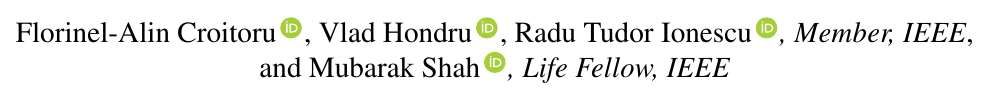
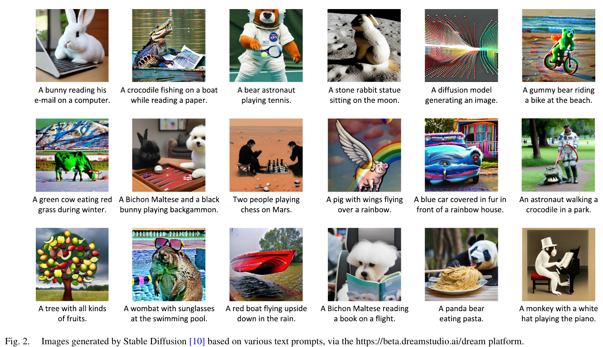

# Diffusion Models in Vision: A Survey

## 저널 : IEEE TRANSACTIONS ON PATTERN ANALYSIS AND MACHINE INTELLIGENCE, [2022년 기준 Q1, 1%]

https://arxiv.org/pdf/2209.04747

## 저자 :  

**논문의 주요 내용**:
- **Diffusion Models**: Diffusion 모델은 컴퓨터 비전 분야에서 최근 주목받는 주제로, 생성 모델링 분야에서 뛰어난 결과를 보여주고 있습니다. Diffusion 모델은 두 단계로 구성되어 있습니다.
  1. **Forward Diffusion Stage**: 입력 데이터에 가우시안 잡음을 여러 단계에 걸쳐 점진적으로 추가하여 데이터를 변조합니다.
  2. **Reverse Diffusion Stage**: 모델은 Diffusion 과정을 점진적으로 거꾸로 되돌리면서 원래의 입력 데이터를 복구하는 작업을 합니다.

- 이러한 모델들은 생성된 샘플의 품질과 다양성 때문에 널리 인정받고 있지만, 샘플링 중에 많은 단계가 포함되어 있기 때문에 계산 부하가 크다는 단점이 있습니다.

- 이 논문에서는 시각 분야에서의 denoising diffusion 모델에 관한 기사를 포괄적으로 검토하며, 이론적 및 실용적 기여를 포함합니다.

- 또한, diffusion 모델과 다른 딥 생성 모델, 예를 들면, variational auto-encoders, generative adversarial networks, energy-based models, autoregressive models 및 normalizing flows와의 관계에 대해서도 논의합니다.

- 마지막으로, diffusion 모델의 현재의 한계와 미래 연구 방향에 대한 흥미로운 아이디어를 제시합니다.

**Fig. 2**: 이 그림은 Stable Diffusion 모델을 사용하여 생성된 이미지를 보여줍니다. 이 모델은 다양한 텍스트 프롬프트를 기반으로 이미지를 생성합니다. 예를 들어, "Mars에서 물을 발견하는 로버"나 "컴퓨터에서 이메일을 읽는 토끼"와 같은 텍스트 프롬프트를 기반으로 한 이미지가 생성됩니다. 이러한 이미지는 [https://beta.dreamstudio.ai/dream](https://beta.dreamstudio.ai/dream) 플랫폼을 통해 생성되었습니다.

**Diffusion Models의 세부 카테고리**:
1. **Denoising Diffusion Probabilistic Models (DDPMs)**: 이 모델은 비균형 열역학 이론에서 영감을 받았습니다. DDPMs는 잠재 변수를 사용하여 확률 분포를 추정하는 잠재 변수 모델입니다. 이 관점에서 DDPMs는 VAEs의 특별한 종류로 볼 수 있습니다.
2. **Noise Conditioned Score Networks (NCSNs)**: 이 모델은 다양한 잡음 수준에서 변조된 데이터 분포의 점수 함수를 추정하기 위해 점수 매칭을 통해 공유된 신경망을 훈련시키는 데 기반을 둡니다.
3. **Stochastic Differential Equations (SDEs)**: SDEs는 Diffusion을 모델링하는 다른 방법으로, Diffusion 모델의 세 번째 하위 카테고리를 형성합니다. 이 방식은 효율적인 생성 전략과 강력한 이론적 결과를 제공합니다.

- 이 논문은 Diffusion 모델링 프레임워크를 세 가지 일반적인 카테고리로 분류하고, 다른 딥 생성 모델과의 관계를 논의합니다. 
  - 또한, 컴퓨터 비전에서 적용된 Diffusion 모델의 다양한 관점에서의 분류를 소개하고, 현재의 Diffusion 모델의 한계와 미래 연구 방향을 제시합니다.

**주요 기여**:
1. 최근 시각 분야에서 Diffusion 모델을 기반으로 한 많은 연구가 나타났기 때문에, 이 논문은 컴퓨터 비전에서의 denoising diffusion 모델에 대한 포괄적인 문헌 검토를 제공합니다.
2. Diffusion 모델의 다양한 관점에서의 분류를 제시하여, 특정 도메인에 적용된 Diffusion 모델에 대한 연구를 하는 다른 연구자들이 관련 연구를 빠르게 찾을 수 있도록 도움을 줍니다.

**Fig. 3**: 이 그림은 세 가지 다른 Diffusion 모델 형식을 보여줍니다: 확률론적 미분 방정식 (SDEs), denoising diffusion 확률 모델 (DDPMs), 그리고 noise conditioned score 네트워크 (NCSNs). 각 모델은 데이터를 잡음으로 변환하는 전방향 프로세스와, 그 잡음을 데이터로 다시 변환하는 생성 프로세스로 구성됩니다. 이 그림은 이러한 프로세스를 모든 세 가지 형식에 대해 시각화합니다.

**Diffusion 모델의 핵심 개념**:
- Diffusion 모델은 훈련 데이터 구조를 점진적으로 악화시키는 프로세스를 역으로 학습하는 확률론적 생성 모델입니다. 따라서 훈련 절차는 전방향 Diffusion 프로세스와 후방향 Denoising 프로세스의 두 단계로 구성됩니다.
- 전방향 프로세스는 각 입력 이미지에 저수준의 잡음을 여러 단계에 걸쳐 추가하는 것으로 구성됩니다. 
  - 훈련 데이터는 순수한 가우시안 잡음이 될 때까지 점진적으로 파괴됩니다.
- 후방향 프로세스는 전방향 Diffusion 프로세스를 역으로 수행하는 것으로 구성됩니다. 
  - 동일한 반복적인 절차가 사용되지만, 잡음은 순차적으로 제거되므로 원래의 이미지가 다시 생성됩니다.

다음 세 섹션에서는 세 가지 Diffusion 모델 형식, 즉 denoising diffusion 확률 모델, noise conditioned score 네트워크, 그리고 첫 두 방법을 일반화하는 확률론적 미분 방정식에 대해 소개합니다. 각 형식에 대해 데이터에 잡음을 추가하는 프로세스, 이 프로세스를 역으로 학습하는 방법, 그리고 추론 시간에 새로운 샘플을 생성하는 방법을 설명합니다.

**2.1 Denoising Diffusion Probabilistic Models (DDPMs)**:
- **전방향 프로세스**: DDPMs는 훈련 데이터를 가우시안 잡음을 사용하여 점진적으로 손상시킵니다.
  -  주어진 손상되지 않은 훈련 샘플 x0에서, 잡음이 있는 버전 x1, x2, ..., xT는 다음의 Markovian 프로세스에 따라 얻어집니다.

- **역방향 프로세스**: 위에서 언급한 속성을 활용하면, 우리는 샘플 xT를 N(0;I)에서 시작하여 역방향 단계 p(xt-1|xt)를 따라 p(x0)에서 새로운 샘플을 생성할 수 있습니다. 
  - 이 단계를 근사하기 위해, 잡음 이미지 xt와 시간 단계 t의 임베딩을 입력으로 받아 평균 μ_θ(xt;t)와 공분산 σ_θ(xt;t)를 예측하는 신경망 p_θ(xt-1|xt)를 훈련시킬 수 있습니다.
- 이상적인 시나리오에서는, 모델 p_θ(x0)이 각 훈련 예제 x0에 할당하는 확률이 최대가 되도록 신경망을 최대 우도 목적으로 훈련시킬 것입니다. 
  - 그러나 p_θ(x0)는 모든 가능한 역방향 경로를 마진화하여 계산해야 하므로 계산할 수 없습니다. 이 문제의 해결책은 음의 로그 우도의 변분 하한을 최소화하는 것입니다.

**2.2 Noise Conditioned Score Networks (NCSNs)**:
- 데이터 밀도 p(x)의 점수 함수는 입력에 대한 로그 밀도의 기울기로 정의됩니다, 
  - 즉, ∇x log p(x). 이러한 기울기에 의해 주어진 방향은 Langevin dynamics 알고리즘을 사용하여 무작위 샘플 (x0)에서 밀도가 높은 영역의 샘플 (xN)로 이동하는 데 사용됩니다. 
  - Langevin dynamics는 데이터 샘플링을 위해 사용할 수 있는 반복적인 방법입니다. 
  - 물리학에서 이 방법은 입자와 다른 분자 간의 상호 작용을 허용하는 분자 시스템에서 입자의 궤적을 결정하는 데 사용됩니다.
  
- **추론 시간**: Song et al. [3]은 "annealed Langevin dynamics"라는 방법을 소개합니다. 이 방법은 흰색 잡음에서 시작하여 Eq. (7)을 고정된 반복 횟수 동안 적용합니다. 필요한 기울기(점수)는 훈련된 신경망에서 제공되며, 이 신경망은 시간 단계 T에 조건을 부여합니다. 이 과정은 다음 시간 단계들에 대해서도 계속되며, 한 단계의 출력을 다음 단계의 입력으로 전달합니다. 최종 샘플은 t=0에 대한 출력입니다.

**2.3 Stochastic Differential Equations (SDEs):**

- 이 방법은 데이터 분포 p(x0)를 점진적으로 잡음으로 변환합니다. 
  - 그러나 이 방법은 이전의 두 방법을 일반화합니다. 
  - 여기서 확산 과정은 연속적으로 간주되며, 이는 확률론적 미분 방정식 (SDE)의 해결책이 됩니다. Song et al. 
  - [4]의 생성 모델은 신경망을 사용하여 점수 함수를 추정하고, 수치적 SDE 솔버를 사용하여 p(x0)에서 샘플을 생성합니다.
  -  NCSNs의 경우와 마찬가지로 신경망은 훼손된 데이터와 시간 단계를 입력으로 받아 점수 함수의 추정치를 생성합니다.
- 전방향 확산 과정의 SDE는 다음과 같은 형태를 가집니다: @x/@t = f(x;t) + β(t) * ωt. 여기서 ωt는 가우시안 잡음, f는 x와 t의 함수로서 드리프트 계수를 계산하며, β는 시간에 따라 변하는 함수로서 확산 계수를 계산합니다.

- Song et al.은 샘플링 기술에 대한 여러 기여를 제시합니다. 그들은 Predictor-Corrector 샘플러를 도입하는데, 이 샘플러는 더 나은 예제를 생성합니다. 이 알고리즘은 먼저 역시간 SDE에서 샘플을 생성하기 위해 수치적 방법을 사용하고, 그 다음으로 점수 기반 방법을 사용하여 수정자로 사용합니다. 예를 들어, 이전 하위 섹션에서 설명한 annealed Langevin dynamics입니다. 또한, 그들은 일반 미분 방정식 (ODEs)도 역 프로세스를 모델링하는 데 사용될 수 있다고 보여줍니다. 따라서 SDE 해석에 의해 잠금 해제된 또 다른 샘플링 전략은 ODE에 적용된 수치적 방법을 기반으로 합니다. 이 후자 전략의 주요 장점은 그 효율성입니다.

**2.4 다른 생성 모델과의 관계**:
- Diffusion 모델과 다른 생성 모델 간의 연결에 대해 논의합니다. 우리는 likelihood 기반 방법으로 시작하여 생성적 적대 네트워크로 끝납니다.
- Diffusion 모델은 VAEs [50]와 많은 공통점을 가지고 있습니다. 예를 들면, 두 경우 모두 데이터가 잠재 공간에 매핑되며, 생성 프로세스는 잠재 표현을 데이터로 변환하는 방법을 학습합니다. 또한, 두 경우 모두 목적 함수는 데이터 가능도의 하한으로 파생될 수 있습니다. 그러나 두 접근법 사이에는 핵심적인 차이점이 있으며, 우리는 앞으로 그 중 일부를 언급할 것입니다.
- Autoregressive 모델 [62], [70]은 이미지를 픽셀의 시퀀스로 나타냅니다. 그들의 생성 프로세스는 이미지를 픽셀 별로 생성하여 새로운 샘플을 생성합니다. 이 접근법은 이 클래스의 생성 모델의 한계를 명확하게 나타내는 단방향 편향을 의미합니다.
- Normalizing flows [63], [64]는 간단한 가우시안 분포를 복잡한 데이터 분포로 변환하는 생성 모델의 클래스입니다. 변환은 쉽게 계산할 수 있는 야코비안 행렬식을 가진 가역 함수의 집합을 통해 수행됩니다.
- Energy-based models (EBMs) [60], [61], [72], [73]는 에너지 함수라고 불리는 밀도 함수의 정규화되지 않은 버전의 추정치를 제공하는 데 중점을 둡니다.

- **Energy-based models (EBMs)**: 이 모델들은 훈련이 어렵다는 특징이 있습니다. 실제로 사용되는 훈련 전략 중 하나는 점수 매칭입니다. 샘플링과 관련하여, 점수 함수를 기반으로 한 Markov Chain Monte Carlo (MCMC) 방법과 같은 여러 전략이 있습니다. 따라서 2.2절에서 설명한 확산 모델의 형식은 에너지 기반 프레임워크의 특별한 경우로 간주될 수 있습니다.
- **GANs**: 확산 모델이 대중적으로 알려지기 전에, GANs는 생성된 샘플의 품질 측면에서 최첨단 생성 모델로 여겨졌습니다. 그러나 확산 모델은 안정적인 훈련 과정을 가지고 있으며, 가능성을 기반으로 하기 때문에 더 다양한 결과를 제공합니다. 그럼에도 불구하고, 확산 모델은 GANs에 비해 비효율적입니다.

**3 확산 모델의 분류**:
- 확산 모델을 다양한 관점에서 분류하는 다중 관점 분류를 제안합니다. 가장 중요한 분류 기준은 (i) 적용되는 작업과 (ii) 필요한 입력 신호입니다. 또한, 확산 모델을 설계하는 데 여러 접근 방식이 있기 때문에, (iii) 기본 프레임워크도 확산 모델을 분류하는 데 중요한 요소입니다. 마지막으로, (iv) 훈련 및 평가 중에 사용되는 데이터 세트도 매우 중요합니다.

**3.1 무조건적 이미지 생성**:
- 아래에 제시된 확산 모델은 무조건적 설정에서 샘플을 생성하는 데 사용됩니다. 이러한 모델은 감독 신호를 필요로 하지 않으므로 완전히 비감독적입니다. 이것은 이미지 생성에 대한 가장 기본적이고 일반적인 설정으로 간주됩니다.

**3.1.1 Denoising Diffusion Probabilistic Models**:
- Sohl-Dickstein et al.의 연구는 2.1절에서 설명한 확산 모델을 공식화합니다. 제안된 신경망은 다중 스케일 컨볼루션을 포함하는 컨볼루션 아키텍처를 기반으로 합니다.
- Austin et al.은 Sohl-Dickstein et al.의 접근법을 이산 확산 모델로 확장합니다. 그들의 결과는 이미지 생성 작업에 대한 이전의 연속 확산 모델과 경쟁력이 있습니다.

**3.1.2 Score-Based Generative Models**:
- Song et al. [13]은 이전 연구 [3]를 기반으로 여러 개선 사항을 제시합니다. 훈련 및 샘플링 단계 모두를 다룹니다. 훈련에 대해, 저자들은 잡음 규모를 선택하는 새로운 전략을 보여주며, NCSNs [3]에 잡음 조절을 어떻게 통합할지를 설명합니다. 샘플링에 대해, 그들은 매개변수에 지수 이동 평균을 적용하고 Langevin 동역학의 하이퍼파라미터를 선택하여 특정 방정식을 검증하는 단계 크기를 제안합니다. 제안된 변경 사항은 고해상도 이미지에서 NCSNs의 적용을 가능하게 합니다.

**3.1.3 Stochastic Differential Equations**:
- DiffFlow는 [71]에서 소개되며, 정규화 흐름과 확산 확률 모델을 결합한 새로운 생성 모델링 접근법입니다. 확산 모델의 관점에서 볼 때, 이 방법은 학습 가능한 전방 프로세스 덕분에 최대 20배 더 효율적인 샘플링 절차를 가지고 있습니다.

**3.2 Conditional Image Generation**:
- 확산 모델이 조건부 이미지 합성에 적용되는 방법을 소개합니다. 조건은 주로 다양한 소스 신호를 기반으로 하며, 대부분의 경우 일부 클래스 레이블이 사용됩니다. 일부 방법은 무조건적 및 조건부 생성을 모두 수행하며, 여기에서도 논의됩니다.

**3.2.1 Denoising Diffusion Probabilistic Models**:
- Dhariwal et al. [5]은 확산 모델의 FID를 향상시키기 위해 몇 가지 아키텍처 변경을 도입합니다. 또한 샘플링 중 확산을 안내하기 위해 분류기의 기울기를 사용하는 분류기 안내 전략을 제안합니다. 무조건적 및 조건부 이미지 생성 실험을 수행합니다.
- Bordes et al. [101]은 자기 감독 작업에서 얻은 표현을 시각화하고 원본 이미지와 비교합니다. 따라서 확산 모델은 이러한 표현에 기반하여 샘플을 생성하는 데 사용됩니다.
- [95]에서 제시된 방법은 확산 모델이 데이터 매니폴드의 저밀도 영역에서 이미지를 생성할 수 있게 합니다.
- Kong et al. [89]은 연속 확산 단계와 잡음 수준 사이의 일대일 대응을 정의합니다.
- Pandey et al. [19]은 생성기-정제기 프레임워크를 구축합니다.
- Ho et al. [104]은 ImageNet 클래스에 기반한 고해상도 이미지를 생성하기 위한 Cascaded Diffusion Models (CDM)를 소개합니다.

- **Benny et al. [79]**: 이미지 대신 잡음을 예측하는 것의 장단점을 연구합니다. 두 종류의 출력 사이에서 보간을 수행하는 방법으로 일부 문제를 해결할 수 있다고 결론 내립니다.
  
- **Choi et al. [81]**: 확산 모델에 의해 학습된 시각적 개념에 잡음 수준이 미치는 영향을 연구합니다. 새로운 목적 함수 가중치 체계를 도입하여 확산 모델이 풍부한 시각적 개념을 학습하도록 합니다.

- **Singh et al. [109]**: 조건부 이미지 생성을 위한 새로운 방법을 제안합니다. 샘플링 과정 전체에 걸쳐 신호를 조건화하는 대신, 샘플링이 시작되는 잡음 신호를 조건화하는 방법을 제시합니다.

- **Liu et al. [91]**: 역 프로세스의 ODE 형식을 해결하기 위한 전통적인 수치 방법의 사용을 조사합니다. 그들은 확산 모델을 위한 의사 수치 방법을 도입합니다.

- **Tachibana et al. [148]**: DDPM의 느린 샘플링 문제를 해결하려고 합니다. 확산 모델의 샘플링 단계 수를 줄이는 방법을 제안합니다.

- **Karras et al. [105]**: 확산 점수 기반 모델을 독립적인 구성 요소로 분리하려고 시도합니다. 이러한 분리는 확산 모델의 개선을 용이하게 합니다.

- **Salimans et al. [108]**: 샘플링 단계 수를 줄이는 기술을 제안합니다. 훈련된 교사 모델의 지식을 학생 모델로 압축합니다.

- **Campbell et al. [102]**: 이산 데이터로 작동할 수 있는 확산 모델의 연속 시간 형식을 제시합니다.

- **Lu et al. [107]**: 확산 모델의 해석을 ODE로 재구성하고, 지수 적분기를 사용하여 해결할 수 있는 형식으로 제시합니다.

**3.7 Image Inpainting**:
- **Nichol et al. [14]**: 텍스트 설명에 조건부로 확산 모델을 훈련시키며, 분류기 없이 및 CLIP 기반 안내의 효과성을 연구합니다. 그들은 첫 번째 옵션으로 더 나은 결과를 얻습니다. 또한, 그들은 이미지 인페인팅을 위해 모델을 미세 조정하며, 텍스트 입력을 기반으로 이미지 수정을 가능하게 합니다.
  
- **Lugmay et al. [29]**: 마스크 형태에 구애받지 않는 인페인팅 방법을 제시합니다. 이 방법은 무조건적 확산 모델을 사용하지만, 역 프로세스를 수정합니다.

**3.8 Image Segmentation**:
- **Baranchuk et al. [39]**: 확산 모델이 어떻게 의미론적 분할에 사용될 수 있는지 보여줍니다. 확산 모델을 기반으로 한 분할은 대부분의 기본선보다 우수한 성능을 보입니다.

- **Amit et al. [42]**: 이미지 분할을 위한 확산 확률 모델의 사용을 제안합니다. 입력 이미지와 현재 추정된 이미지는 두 개의 다른 인코더를 통과하며 합산되어 결합됩니다.

**3.9 Multi-Task Approaches**:
- **Song et al. [3]**: 다양한 잡음 규모에서 점수 함수를 추정하는 방법을 제시합니다. 샘플링을 위해, 그들은 Langevin 동역학의 담금질 버전을 도입하고 이미지 생성 및 인페인팅에서 결과를 보고합니다.

