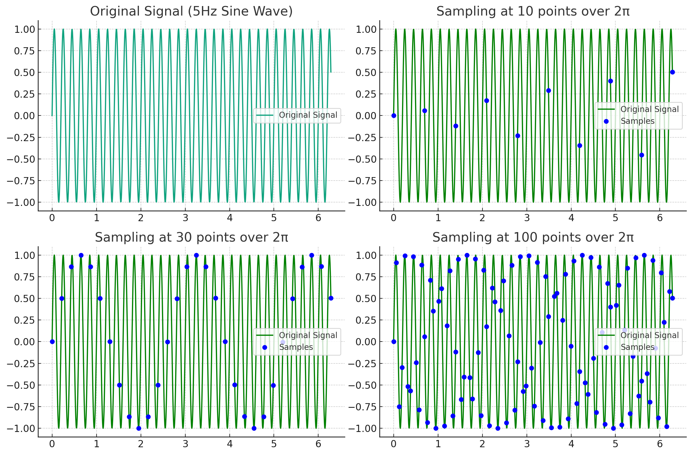
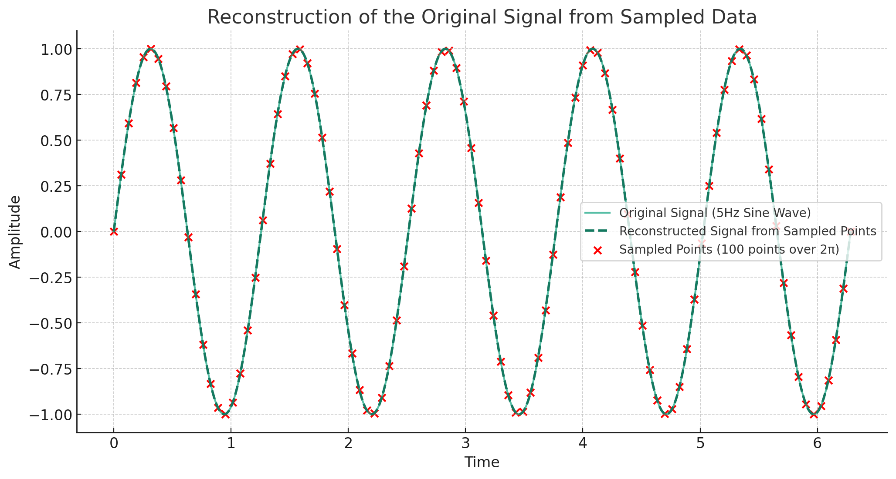

"Discrete sampling"은 연속적인 정보나 데이터를 특정 간격이나 점들로 나눠서 샘플링하는 과정을 의미합니다. 말 그대로 '이산적'으로 데이터를 추출하는 것이죠.

예를 들어, 다음과 같은 상황들에서 discrete sampling이 사용됩니다:

1. **오디오 샘플링**: 사운드는 연속적인 파형으로 표현되지만 디지털 오디오에서는 특정 시간 간격으로 이 파형을 샘플링하여 디지털 데이터로 변환합니다. 이러한 샘플링 빈도는 초당 샘플 수(Samples per Second)로 표현되며, 이것이 바로 discrete sampling입니다.

2. **이미지의 픽셀**: 사진이나 그림은 연속적인 현실 세계의 장면을 나타내지만, 디지털 이미지는 픽셀이라는 이산적인 점들로 이루어져 있습니다.

3. **3D 볼륨 샘플링**: 3D 공간의 연속적인 정보를 취급할 때, 그 정보를 이해하거나 처리하기 위해 공간을 일정한 간격의 그리드로 나누어 각 그리드 포인트에서의 데이터 값을 샘플링할 수 있습니다. 이것이 바로 voxel grids의 기본 원리입니다.

이러한 이산 샘플링의 한계는, 샘플링 간격이나 해상도를 높이지 않는 한 연속적인 데이터의 모든 정보를 포착할 수 없다는 것입니다. 예를 들어, 오디오 샘플링의 경우, 샘플링 빈도가 너무 낮으면 고주파의 소리 정보가 손실될 수 있습니다. 이와 같은 한계 때문에 더 높은 해상도나 정밀도의 데이터를 얻기 위해선 더 높은 샘플링 비율이 필요하며, 이는 추가적인 저장 공간과 처리 능력을 요구합니다.

**오디오 샘플링** 예시

1. **기본 개념**: 오디오는 기본적으로 공기의 진동으로 인한 소리 파동입니다. 이 파동을 그래프로 그려보면, 시간에 따른 공기의 압축 상태를 나타내는 연속적인 파형으로 표현됩니다. 이 파형을 디지털 데이터로 변환하려면, 연속적인 파형을 특정 간격으로 샘플링해야 합니다.

2. **샘플링**: 샘플링은 특정 시간 간격으로 파형의 값을 측정하는 것을 의미합니다. 예를 들어, 샘플링 빈도가 44.1kHz(초당 44,100번의 샘플)라면, 1초 동안의 오디오를 44,100개의 점으로 나타냅니다.

3. **주파수의 한계**: 샘플링 빈도의 2분의 1 값이 바로 그 오디오의 최대 주파수입니다. 예를 들어, 44.1kHz로 샘플링된 오디오는 최대 22.05kHz의 주파수를 포착할 수 있습니다. 이를 'Nyquist frequency'라고 합니다. 

4. **샘플링 빈도의 중요성**: 샘플링 빈도가 낮으면 고주파 소리를 포착하지 못하게 되어 오디오 품질이 떨어집니다. 반면, 샘플링 빈도가 높으면 더 많은 주파수 범위의 소리를 포착할 수 있지만, 데이터 크기도 커집니다.

 이 사인파를 다양한 샘플링 빈도로 샘플링하고 그 결과를 비교해 보겠습니다.
위의 그래프는 5Hz의 사인파를 다양한 샘플링 빈도로 샘플링한 결과를 보여줍니다.

1. **Original Signal (5Hz Sine Wave)**:
   이 그래프는 연속적인 5Hz의 사인파를 보여줍니다.

2. **Sampling at 10 points over \(2\pi\)**:
   2\(\pi\) 동안 10개의 포인트로 샘플링하였습니다. 샘플링 빈도가 낮기 때문에 원래의 파형을 정확하게 재현하기는 어렵습니다.

3. **Sampling at 30 points over \(2\pi\)**:
   이번에는 2\(\pi\) 동안 30개의 포인트로 샘플링하였습니다. 샘플링 빈도가 증가하면서 원래의 파형에 가까워졌습니다.

4. **Sampling at 100 points over \(2\pi\)**:
   마지막으로 2\(\pi\) 동안 100개의 포인트로 샘플링하였습니다. 이 경우, 원래의 파형을 거의 완벽하게 재현할 수 있습니다.

 샘플링 빈도가 높아질수록 원래의 신호를 더 잘 포착할 수 있다는 것을 알 수 있습니다. 하지만 샘플링 빈도가 너무 높으면 필요 이상의 데이터를 저장하게 되어 저장 공간이나 처리 능력에 부담을 줄 수 있습니다. 따라서 적절한 샘플링 빈도를 선택하는 것이 중요합니다.

 ----
 여기서 하나더 정리(왜 재현 할 수 있느지에 대한 배경지식 필요)

**Nyquist-Shannon 샘플링 정리**:
이 정리는 연속적인 신호를 샘플링할 때, 해당 신호를 완벽하게 복구하기 위한 최소한의 샘플링 빈도 (즉, 샘플링 비율)를 설명합니다. 정리는 다음과 같습니다:
- 연속적인 신호의 최대 주파수가 \( f_{\text{max}} \)일 때, 이 신호를 완벽하게 복구하기 위해서는 최소 \( 2f_{\text{max}} \)의 비율로 샘플링해야 합니다.

이전 예제에서는 5Hz의 사인파를 사용했습니다. 따라서 이 신호의 최대 주파수는 5Hz입니다. Nyquist-Shannon 샘플링 정리에 따르면, 이 신호를 완벽하게 복구하기 위해서는 최소 10Hz (즉, 2 x 5Hz)의 비율로 샘플링해야 합니다.

그렇다면, "2\(\pi\) 동안 100개의 포인트로 샘플링"이라는 것은 실제로 어떤 샘플링 비율을 의미하는지 확인해보겠습니다.

2\(\pi\) 동안 100개의 포인트로 샘플링하는 것은 대략 15.92Hz의 샘플링 비율을 의미합니다.

5Hz의 사인파를 완벽하게 복구하기 위해서는 최소 10Hz의 샘플링 비율이 필요하다고 했습니다. 여기서 사용한 15.92Hz는 이 최소 요구 샘플링 비율보다 높기 때문에, 5Hz의 사인파를 거의 완벽하게 복구할 수 있습니다.

그러나 "Original Signal (5Hz Sine Wave)"에서 보여준 것은 샘플링이 아닌 연속적인 신호입니다. 이 연속적인 신호는 무한히 많은 데이터 포인트로 구성되어 있기 때문에, 그래프 상에서는 더욱 밀도 높게 표시됩니다. 하지만 실제로 15.92Hz의 샘플링 비율로도 5Hz의 사인파를 충분히 잘 복구할 수 있습니다.

---

 1. **Sampling at 100 points over \(2\pi\)**의 샘플링 데이터만으로도, 원래의 **Original Signal (5Hz Sine Wave)**를 복구할 수 있습니다. 이러한 복구 과정은 샘플링된 데이터를 사용하여 연속적인 신호로 변환하는 것을 포함하며, 이를 "재구성" 또는 "보간"이라고도 합니다.

Nyquist-Shannon 샘플링 정리에 따르면, 신호의 최대 주파수의 두 배 이상의 비율로 샘플링되면, 이 샘플링된 데이터만으로 원래의 연속적인 신호를 완벽하게 복구할 수 있습니다. 

따라서, 우리의 예제에서는 5Hz의 사인파를 약 15.92Hz의 샘플링 비율로 샘플링했기 때문에, 이 샘플링된 데이터를 사용하여 원래의 5Hz 사인파를 완벽하게 복구할 수 있습니다.

위 그래프에서:

- **Original Signal (5Hz Sine Wave)**: 연속적인 5Hz 사인파 신호입니다.
- **Sampled Points (100 points over \(2\pi\))**: 2\(\pi\) 동안 100개의 포인트로 샘플링된 데이터입니다.
- **Reconstructed Signal from Sampled Points**: 샘플링된 데이터를 사용하여 복구한 신호입니다.

보시다시피, 샘플링된 데이터를 사용하여 복구한 신호 (점선)는 원래의 연속적인 신호 (실선)와 매우 유사합니다. 이것은 샘플링된 데이터만으로도 원래의 신호를 거의 완벽하게 복구할 수 있다는 것을 시각적으로 보여줍니다.

이러한 복구 방법은 샘플링된 데이터 간의 보간을 사용하여 연속적인 신호로 변환하는 과정을 포함합니다. 여기서는 3차원 스플라인 보간을 사용하여 샘플링된 데이터를 보간했습니다.