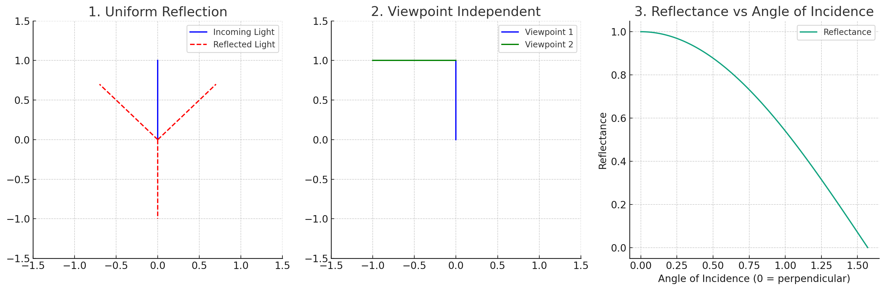

1. **균일한 반사**: 람베르트 표면에 빛이 닿으면, 그 빛은 모든 방향으로 동일하게 반사됩니다. 이것은 람베르트 반사의 가장 중요한 특징입니다. 예를 들면, 매끈하지 않은 종이나 벽화에 빛이 닿을 때 그 표면에서 빛이 균일하게 퍼져 나가는 것을 볼 수 있습니다.

2. **시점에 독립적**: 람베르트 표면은 관찰자의 위치나 시점에 관계없이 항상 동일한 밝기로 보입니다. 예를 들어, 당신이 특정 각도에서 본 매끈하지 않은 흰 종이의 밝기와 다른 각도에서 본 그 종이의 밝기가 동일하다는 것을 느낄 수 있습니다.

3. **빛의 입사각에 따라 반사되는 빛의 양이 변함**: 빛이 표면에 수직으로 들어오면 최대의 밝기로 반사되며, 빛이 표면과 평행하게 들어올수록 반사되는 빛의 양이 줄어듭니다.

람베르트 반사 모델은 컴퓨터 그래픽스에서 주로 사용되며, 실제 세계의 많은 물체는 완벽한 람베르트 표면은 아니지만, 이 모델은 많은 상황에서 근사치로 사용될 수 있습니다. 그러나 반사, 광택 또는 투명한 물체와 같은 특정 특성을 갖는 물체는 람베르트 반사 모델로는 잘 표현되지 않습니다. 이런 경우 비람베르트 모델이 필요하게 됩니다.

------

1. **균일한 반사**: 빛이 람베르트 표면에 닿았을 때 모든 방향으로 균일하게 반사되는 것을 보여줄 것입니다.
2. **시점에 독립적**: 두 개의 다른 각도에서 람베르트 표면을 관찰할 때 동일한 밝기로 보이는 것을 표현하겠습니다.
3. **빛의 입사각에 따라 반사되는 빛의 양이 변함**: 빛이 표면에 다양한 각도로 들어왔을 때 반사되는 빛의 양이 어떻게 변하는지 보여줄 것입니다.

위 그림은 람베르트 효과의 세 가지 주요 특성을 시각적으로 나타냅니다:

1. **균일한 반사**: 첫 번째 그림에서 파란색 화살표는 빛이 람베르트 표면에 닿는 것을 나타냅니다. 이 빛은 모든 방향(빨간색 점선 화살표)으로 균일하게 반사됩니다.
2. **시점에 독립적**: 두 번째 그림에서 파란색과 녹색 화살표는 서로 다른 시점에서 람베르트 표면을 바라보는 것을 나타냅니다. 두 시점에서 표면의 밝기는 동일하게 보입니다.
3. **빛의 입사각에 따라 반사되는 빛의 양이 변함**: 세 번째 그림은 반사된 빛의 양(Reflectance)이 빛의 입사각에 따라 어떻게 변하는지 보여줍니다. 빛이 표면에 수직으로 들어오면(입사각 0도) 최대의 밝기로 반사되고, 입사각이 커질수록 반사되는 빛의 양이 줄어듭니다.

