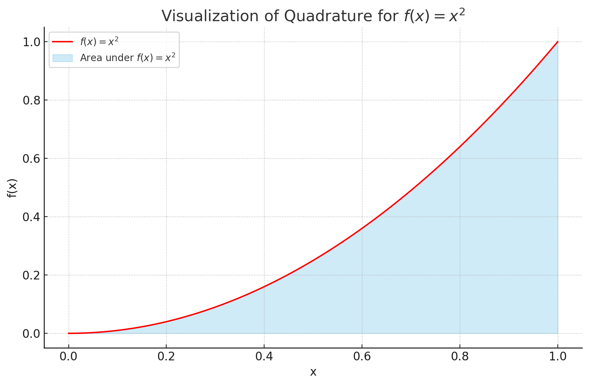

**쿼드라처 (Quadrature)**는 함수의 정적분 값을 근사적으로 계산하는 방법을 의미합니다. 쿼드라처는 수치적분이라고도 부릅니다. 다양한 쿼드라처 방법들이 있으며, 그 중에서도 가장 널리 알려진 것들은 사다리꼴 규칙, 심슨의 규칙, 그리고 가우스 쿼드라처입니다.

쿼드라처의 기본 아이디어는 복잡한 형태의 함수나 적분할 수 없는 함수에 대한 정적분 값을, 알려진 함수들의 가중치 합으로 근사하는 것입니다. 이 때 사용되는 알려진 함수들은 보통 다항식 함수들입니다.

간단한 예로, **사다리꼴 규칙**에서는 두 점을 잇는 선분 (사다리꼴)을 사용하여 함수 아래의 영역을 근사합니다. **심슨의 규칙**에서는 세 점을 통과하는 이차 다항식을 사용하여 함수 아래의 영역을 근사합니다.

쿼드라처는 다음과 같은 상황에서 유용하게 사용됩니다:
1. 함수의 원래 형태가 너무 복잡하여 수식으로 적분하기 어려운 경우.
2. 함수가 수식으로 주어지지 않고, 특정 지점에서의 값만 주어진 경우.
3. 적분 구간이 무한대인 경우.

쿼드라처는 근사적인 방법이기 때문에, 항상 오차가 발생합니다. 그러나 적절한 쿼드라처 방법을 선택하고 충분한 샘플링 지점을 사용하면, 이 오차를 최소화할 수 있습니다.

----------

간단한 예로, 함수 \( f(x) = x^2 \)의 정적분 값을 \([0, 1]\) 구간에서 근사적으로 계산해 보겠습니다. 이 함수의 정적분 값은 수식적으로 계산하면 \(\frac{1}{3}\)이 됩니다.

우리는 다음의 두 가지 쿼드라처 방법을 사용하여 이 값을 근사적으로 계산해 보겠습니다:

1. **사다리꼴 규칙 (Trapezoidal Rule)**
2. **심슨의 규칙 (Simpson's Rule)**

이 두 가지 방법을 사용하여 \( f(x) = x^2 \)의 \([0, 1]\) 구간에서의 정적분 값을 근사하고, 그 결과를 시각화해 보겠습니다.

위의 그래프는 \( f(x) = x^2 \) 함수와 해당 함수 아래의 영역을 시각화한 것입니다.

우리가 근사적으로 계산한 정적분 값은 다음과 같습니다:

1. **사다리꼴 규칙 (Trapezoidal Rule)**: 0.34375
2. **심슨의 규칙 (Simpson's Rule)**: 0.3333 (이 값은 실제 값인 \(\frac{1}{3}\)에 매우 가깝습니다)

여기서 볼 수 있듯이, 심슨의 규칙은 이 함수에 대해 더 정확한 근사값을 제공합니다. 사다리꼴 규칙도 상당히 근접한 값을 제공하지만, 심슨의 규칙이 이 경우에 더 우수한 결과를 보여줍니다.

이러한 결과는 쿼드라처 방법의 선택과 적분을 근사하는 데 사용되는 구간의 수 (\( n \))에 따라 달라질 수 있습니다.

-----

**결정론적 쿼드라처 (Deterministic Quadrature)**는 함수의 정적분 값을 근사적으로 계산하기 위한 방법 중 하나입니다. 이 방법의 핵심은 적분 구간을 고정된, 미리 정의된 점들로 나누어 해당 점들에서의 함수 값을 사용하여 적분 값을 근사하는 것입니다.

결정론적 쿼드라처의 특징은 다음과 같습니다:

1. **고정된 샘플 위치**: 결정론적 쿼드라처는 적분 구간을 균일하게 나누거나, 또는 특정한 패턴에 따라 구간을 나눕니다. 이러한 분할은 전체 적분 구간에 대해 일관되게 적용됩니다.

2. **정확도**: 결정론적 쿼드라처는 일반적으로 고정된 점의 수가 많을수록 더 정확한 결과를 제공합니다. 그러나, 모든 함수에 대해 동일한 정확도를 보장하는 것은 아닙니다.

3. **일반적인 사용 사례**: 결정론적 쿼드라처는 디스크릿화된 보텍스 그리드 렌더링과 같은 분야에서 자주 사용됩니다. 이러한 경우에는 함수가 그리드의 각 점에서 이미 계산되어 있기 때문에, 이 점들을 사용하여 적분 값을 근사하는 것이 효율적입니다.

결정론적 쿼드라처의 일반적인 예로는 **사다리꼴 규칙 (Trapezoidal Rule)**과 **심슨의 규칙 (Simpson's Rule)**이 있습니다. 이러한 방법들은 모두 적분 구간을 고정된 점들로 나누고, 이 점들에서의 함수 값을 사용하여 적분 값을 근사합니다.

결론적으로, 결정론적 쿼드라처는 적분 구간을 고정된 점들로 나누어 적분 값을 근사하는 방법입니다. 이 방법은 특정한 적용 사례에서 매우 효율적이지만, 함수의 특성이나 적분 구간의 선택에 따라 정확도가 달라질 수 있습니다.

-----
