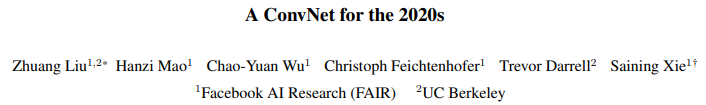
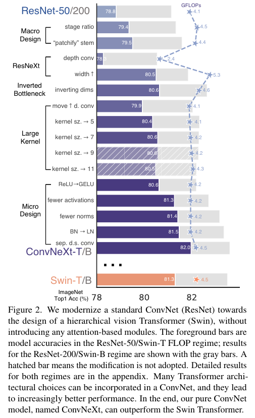
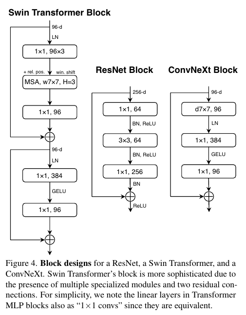
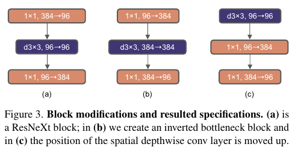
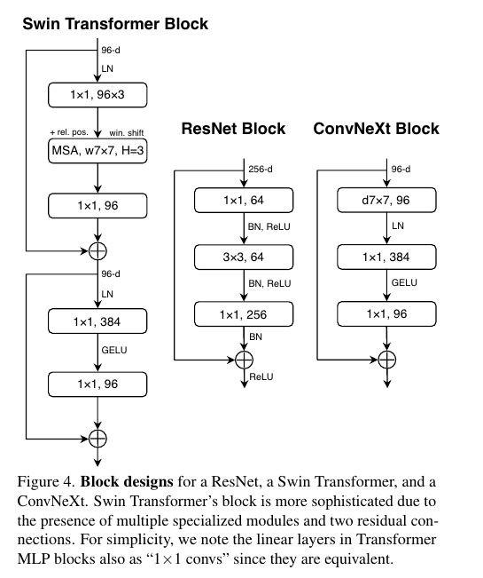
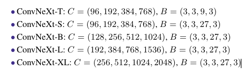
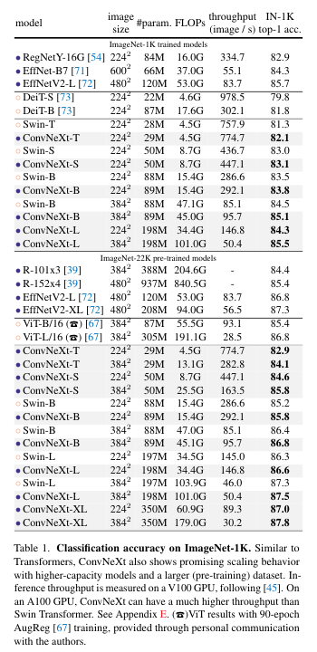
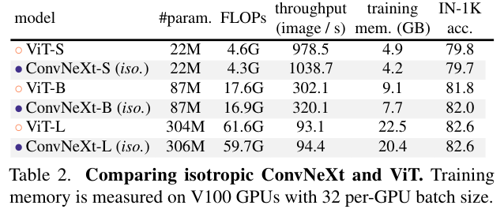
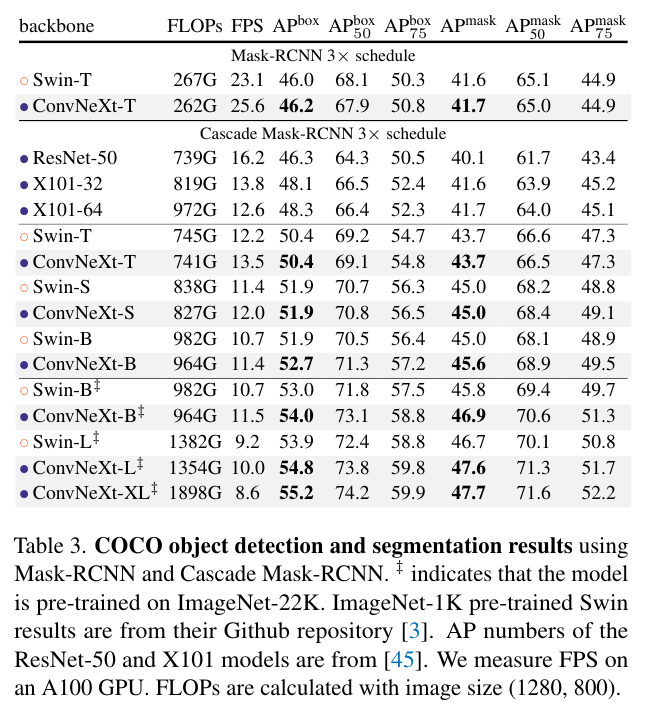
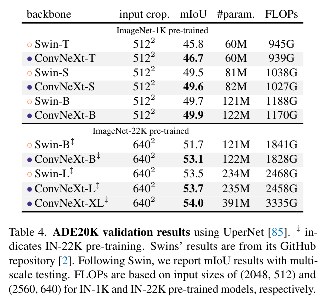

# A ConvNet for the 2020s
**CVPR, 2022**

https://openaccess.thecvf.com/content/CVPR2022/html/Liu_A_ConvNet_for_the_2020s_CVPR_2022_paper.html

## Abstract

- "Roaring 20s" Vission Transformers (ViTs)은 빠르게 cnn을 대체 했으며 이미지 classificaiton 모델에서 State-of-the-art을 달성했다.
	반면 ViT는 object detection과 semantic sgmentation 과 같은 일반적인 computer vison 문제에 어려움에 직면 했다.
	Hierarchical Transformer (예를들어 swin Trnasformers) 의 도입은 실질적으로 일반적인 vision backbone과 실행 가능하게 하고 넓은 vision 일에 놀라운 성능을 증명했다.

- 그러나 몇몇의 hybrid 접근의 효율성은 여전히 CNN의 고유한 유도적 편향보다는 Transformer의 본질적인 우월성에 크게 기인한다.

- 우리의 연구에서는 우리는 디자인 공간을 재검토하고** Pure Convnet이 달성 할 수 있는 한계를 테스트** 하다. 우리는 **vision Transformer을 설계에 맞추어 standard ResNet을 점진적으로   "modernize"하고** 그 과정에서 **성능 차이에 기여하는 몇 가지 핵심 구성요소를 발견**한다.
- 이 탐색의 결과는 ConvNeXt라고 불리는 pure Convnet 모델 제품군이다.

- 완전히 표준 ConvNet 모듈로 구성된 ConvNeXts는 **정확도와 확장성 측면에서 Transformers와 경쟁하여 87.8% ImageNet 상위 1위** 정확도를 달성하고 COCO 감지 및 ADE20K 세분화에서 Swin Transformers를 능가하는 동시에 표준 ConvNet의 단순성과 효율성을 유지합니다.

## Introduction

`(indcutive bias가 있음으로써 CNN은 어느곳에 고양이가 있던 그것을 잘 인식 한다.
그리고 근처에 있는 연관성을 더 중요하게 된다. 예를들어 얼굴에 눈을 더 관계 깊게 생각한다. CNN은 Translational invariance 이다. 어디에 사진이 있던 불변한다(인식한다).  그런데 CNN이 Trnaslation equvariance이 좋아서 detiction에 강해 그런데 instance segmentation에서 과연 강할까?)`

- 컴퓨터 비전에서 ConvNets의 완전한 우세(dominance)는 우연이 아니다. 많은 application  시나리오에서 **"sliding window"  전략은 특히 high-resolution 이미지로 작업할 때 시각적 처리(visual processing) 에 필수적**이다.

- Convnet에는 다양한 computer vision application에 적합한 몇 가지 기본 제공 **inductive biases**가 있다. 
	- 가장 중요한 것은 **translaition equivariance**으로, 이는 *objection detection와 같은 task에 적합한 속성이다.  또한 ConvNets는 sliding-window 방식으로 사용할 때 계산이 공유되기 때문에 본질적으로 효율적*이다.
	- 수십 년 동안, 이것은 일반적으로 digit, faces, and pedestrians와 같은 제한된 객채 범주에서 ConvNets의 기본 사용이었다.
	- 2010년대에 들어서면서, region-based detectors 는 ConvNets을 visual recognition system의 fudamental building block으로 더욱 끌어 올렸다.

- ViT는 언어와 이미지의 큰 domain 차이임에도 큰 변화를 가져 왔다.
	-  이미지를 일련의 패치로 분할하는 초기 'patchify' 계층을 제외하고, ViT는 image-specific inductive bias을 도입하지 않으며 원래 NLP Transformer에 최소한의 변경을 가한다.
	- ViT의 주요 초점은 확장 동작에 있다. 더 큰 모델과 데이터 사이즈의 도움으로  Transformer은 표준 ResNet를 크게 능가 했다. 이미지 분류 작업에 대한 결과는 영감을 받지만, 하지만 ***computer vision은 image classification에 제한되지 않는다***.

- 이전에 논의한 바 같이, 지난 10년 동안  수많은 computer vision 작업은 sliding window와 fullyconvolutional paradigm에 의존했다.
	- **ConvNet inductive biases가 없으면 vanilla ViT 모델은 일반(generic) vision backbone으로 채택되는데 많은 문제에 직면**한다. 
	- 가장 큰 문제는 **입력 크기와 관련한여 2차 복잡성**을 갖는 ViT의 global attention 설계 이다. 이는 imageNet 분류에 적합할 수 있지만 고해상도 입력으로 인해 빠르게 처리 할 수 없다.

- Hierarchical Transformers는 *이러한 격차를 해소하기 위해 hybrid 방식을* 사용한다.
	- 예를 들어 **"sliding window" 전략 (예를들어 attention within local windows)** 는 Transformers에 다시 도입되어 **ConvNets와 더 유사하게 동작할 수 있게 되었다**.
	- Swin Transformer는 Transformer가 일반적인(generic) vision backbone으로 채택 되고 image classification을 넘어 다양한 컴퓨터 비전 작업에서 최첨단 성능을 달성할 수 있음을 처음으로 보여줍니다.: 컨볼류션의 본질은 무관하지 않고 오히려 그것은 여전히 많은 바람을 받고 있으며 결코 퇴색하지 않았다.

- 이러한 관점에서, computer vision을 위한 Transformer의 많은 발전은 convolution을 되살리는 목표로 했다. 이러한 시도는 **비용이 많이 든다.**
	- sliding window self-attention 의 ***pure 구현은 비용이 많이 든다.***
	- cyclic shifting과 같은 향상된 접근 방식을 사용하면* 속도를 최적화할 수 있지만, 시스템 설계가 더욱 정교해* 진다.
		
- 반면에, ConvNet이 비록 간단하고 군더더기 없는 방식으로 원하는 많은 속성을 이미 충족하고 있다는 것은 거의 아이러니 한다.
	- ConvNets가 활력을 읽어가는 유일한 이유는 (계층적) Transformer가 많은 비전 작업에서 ConvNets을 능가하기 때문이며, 성능 차이는 ***일반적으로 multi head self-attention가 핵심 구성 요소인 Transformers의 superior scaling 동작에 기인***한다.
		
- 지난 10년간 점진적으로 개선된 ConvNets와 달리 Vision Transformers의 채택은 한 단계 변화했습니다.
	-  최근 문헌에서는 일반적으로 두 가지를 비교할 때 시스템 수준 비교(예: Swin Transformer 대 ResNet)가 채택됩니다. 
	- ConvNets와 계층적 비전 트랜스포머는 ***서로 다르고 동시에 유사합니다.***
	- 둘 다 유사한 ***유도 편향을 갖추고 있지만 교육 절차와 매크로/마이크로 레벨 아키텍처 설계에서는 크게 다릅니다.***

- 이 연구에서, 우리는 ConvNets와 Transformers 사이의 구조적 차이를 조사하고 네트워크 성능을 비교할 때 교란 변수를 식별하려고 노력합니다.
	-  우리의 연구는 **ConvNets에 대한 ViT 이전과 ViT 이후의 시대 사이의 격차를 해소하고 순수한 ConvNet이 달성할 수 있는 한계를 테스트하기 위한 것입니다.**

- 이를 위해 개선된 절차로 훈련된 표준 ResNet(예: ResNet-50)부터 시작합니다. 
	- 우리는 점진적으로 아키텍처를 계층적 비전 트랜스포머(예: Swin-T)의 구성으로 "현대화"합니다.

- 우리의 탐사는 다음과 같은 핵심 질문에 의해 지시됩니다: **트랜스포머의 설계 결정이 ConvNets의 성능에 어떤 영향을 미칩니까?** 
	- 이 과정에서 성능 차이에 기여하는 몇 가지 주요 구성 요소를 발견했습니다. *결과적으로 ConvNeXt라는 순수 ConvNets 제품군을 제안합니다.*
	
- 우리는 ImageNet 분류[17], COCO의 객체 감지/분할, ADE20K의 의미 분할[92]과 같은 다양한 비전 작업에서 ConvNeXt를 평가합니다. 
	- 놀랍게도, 전적으로 표준 ConvNet 모듈로 구성된 ConvNeXts는 모든 주요 벤치마크에서 **정확성, 확장성 및 견고성 측면에서 Transformer와 유리하게 경쟁**합니다. 
	- ConvNeXt는 표준 ConvNets의 효율성을 유지하며, 교육 및 테스트 모두에 대한 완전한 컨볼루션 특성으로 구현이 매우 간단합니다

##  2. Modernizing a ConvNet: a Roadmap

이 섹션에서는 ResNet에서 트랜스포머와 유사한 ConvNet으로의 궤적을 제공합니다. 우리는 FLOP의 관점에서 두 가지 모델 크기를 고려하는데, 하나는 약 4.5 x10^9의 FLOP가 있는 ResNet-50 / Swin-T 체제이고 다른 하나는 약 15.0 x 10^9의 FLOP가 있는 ResNet-200/Swin-B 체제입니다.

- 단순화를 위해 ResNet-50 / Swin-T 복잡성 모델로 결과를 제시할 것입니다. 대용량 모델에 대한 **결론은 일관적이**며 결과는 부록 C에서 확인할 수 있습니다.
	- 높은 수준에서, 우리의 탐색은 표준 ConvNet으로서의 네트워크의 ***단순성을 유지하면서 Swin Transformer의 다양한 수준의 설계를 조사하고 따르는 것을 목표로 합니다.***

- Roadmap
	- 우리의 출발점은 ResNet-50 모델입니다. 먼저 vision Transformer를 훈련하는 데 사용되는 **유사한 훈련 기술로 훈련하고** 원래 **ResNet-50과 비교하여 훨씬 향상된 결과**를 얻습니다. 
	-  그런 다음 
      	-  1) macro design, 
      	-  2) ResNeXt, 
      	-  3) inverted bottleneck, 
      	-  4) large kernel size 
      	-  5) various layer-wise micro design로 요약한 일련의 설계 결정을 연구합니다. 
   	- 그림 2에서는 "network modernization"의 각 단계에서 달성할 수 있는 절차와 결과를 보여줍니다.
	- 네트워크 복잡성은 최종 성능과 밀접한 상관관계가 있기 때문에 FLOP는 중간 단계에서 기준 모델보다 높거나 낮을 수 있지만 탐색 과정에서 대략적으로 제어됩니다.
	- 모든 모델은 ImageNet-1K에서 교육 및 평가됩니다.

 ### 2.1. Training Techniques

- network architecture 설계 외에도 **train precedure는 궁극적인 성능에도 영향**을 미친다
	- vision Trnsformer은 새로운 module과 architecture 설계 결정을 가져왔을 뿐만 아니라, 그들을 또한 vision에 다양한 training 기술을 도입했다.
	- 이는 대부분 최적화 전략과 연관된 hpyer-parameter  설정과 관련된다.
-  따라서 우리의 탐구의 **첫번째 단계는 vision transformer 훈련 절자를 사용하여 baseline(Resnet-50/200)을 사용하여 훈련**하는 것이다.
	- 최근 연구에서는 일련의 현대적 훈련 기술이 simple ResNet-50 모델의 성능을 크게 향상 시킬 수 있음을 보여준다.(근거)
	- 본 연구에서는 DeiT와 Swin Trnasforme에 가까운 traiing 방법을 사용한다.
	- training은 ***ResNet의 original 90 epoch에서 300 epoch 로*** 늘린다.
	- 우리는 ***AdamW optimizer, data augmentation 기술 예를 들어 Mixup, Cutmix, RandAugment, Random Erasing 그리고  regularization 전략은 Stochastic Depth 와 Label Smoothing을*** 한다.
	- 우리가 사용하는 완전한 하이퍼 파라미터 세트는 부록 A.1에서 확인할 수 있습니다.
	- 그 자체로 이 향상된 훈련 방법은 ResNet-50 모델의 성능을 76.1%을 78.8%(+2.7%)로 증가 시켰으며, 이는 전통적인 ConvNets와 vision Transformer 간의 성능 차이의 상당 부분이 훈련 기술 때문일 수 있음을 시사한다.
	- 우리는 "modernization" 프로세스 전반에 걸쳐 동일한 hyper-parameters와 함께 이 고정 training 방법(레시피) 사용할 것이다.
	- ResNet -50 방식에서 보여준 각 정확도는 세가지 다른 무작위 seed를 사용한 훈련에서 얻은 평균이다.

### 2.2. Macro Design

- 이제 swin Transformers의 macro 네트워크 설계를 분석한다.
	- Swin Transformer은 ConvNets 를 따라 각 단계가 다른 기능 맵 해상도를 갖는 다단계 설계를 사용한다.
	- 두 가지 흥미로운 설계 고려 사항은 : 단계 계산 ration와 "stem cell"  구조이다.

**Changing stage compute ratio.**
- ResNet의 단계별 계산 분포의 원래 설계는 대부분 경험적이었다.
	- 무거운 'res4' 단계는 detector head가 14x14 형상면(feature plane)에서 작동하는 object detection 와 같은 down stream  작업과 호환되도록 고안되었습니다.
	- 반면 **Swin-T 는 1:1:3:1의 약간 다른 계산 비율**로 같은 원리를 따랐다.
	- Larger Swin Trnasofrmers은 그 비율은 1:1:9:1이다.
	- 설계에 따라 ResNet-50의 ***(3, 4, 6, 3)에서 (3,3, 9, 3)까지 각 단계의 block의 수를 조정 하여 Swin-T의 FlOPs로 정렬한다.***
	- 따라서 모델 정확도가 78.8%에서 79.4%로 향상된다.
	- 특히 연구자들은 계산 분포를 철저히 조사했으며, 보다 최적의 설계가 존재 할 가능성이 높다.
	- **이제부터 이 단계 계산 비율을 사용하겠습니다**

**Changing stem to “Patchify”.**

- 일반적으로** stem cell 설계는 network 시작 시 input images가 처리되는 방법**과 관련 있다.
	- 자연 이미지에 내재된 중복성(redundancy)으로 인해 ***공통 stem cell은 standard ConvNets와 vision Transformer 모두에서 input image를 적절한 feature map 크기로 공격적으로 다운 샘플링한다.***
	- standard ResNet의 setm cell에는 ***7x7 컨볼루션 layer가 포함되어 있으며, 그 다음에 max pool이 있어 input image의 4배 downsampling을 한다*.**
	- vision Transformer은 더 공격적인  "patchify" 전략이 stem cell에 사용되며, 이는 larger kernel size (다시 말해 kernel size = 14 or 16) 와 non-overlapping convolution 에 해당 한다.
	- Swin Trnasofrmer는 유사한 "patchify"  layer을 사용하지만 architecture의 다단계 설계를 수용하기 위해 4의 더 작은 패치 크기를 사용한다.
	- 우리는 Resnet 스타일의 stem cell를 4x4, 4 stride 컨볼루션 레이어르 사용하여 구현된 패치화 레이어로 대체한다.
	- 정확도가 79.4%에서 79.5%로 변경되었습니다. 이것은 ResNet의 줄기 세포가 ViT와 같은 더 간단한 "패치화" 레이어로 대체되어 유사한 성능을 낼 수 있음을 시사합니다.
	- 우리는 네트워크에서 "patchify stem"(4x4 겹치지 않는 컨볼루션)을 사용할 것입니다.

### 2.3. ResNeXt-ify

- 이 부분에서, 우리는 바닐라 ResNet보다 더 나은 FLOP/정확도 trade-off를 가진 **ResNeXt[87]의 아이디어를 채택**하려고 시도합니다
	- 핵심 구성 요소는 convolution filter가 서로 다른 그룹으로 분리되는 grouped convolution 이다
	- 높은 수준에서 ResNeXt의 지침 원칙은 "use more groups, expand width"하는 것입니다
	- 보다 정확하게는 ResNeXt는 병목 현상이 발생한 3x3 convolution을 사용합니다
	- 블록. 이렇게 하면 FLOP가 크게 줄어들기 때문에 네트워크 폭이 확장되어 Capacity 손실을 보상합니다
	- 우리의 경우 그룹 수가 채널 수와 동일한 grouped convolution의 특별한 경우인 depthwise convolution을 사용합니다.
	- 우리는 **depthwise convolution이 채널별로, 즉 공간 차원(spatial dimension)에서만 정보를 혼합하는 self attention 가중 합계 연산과 유사하다는 점에 주목**합니다.`(이거 chaneel 별 합성 attention을 depth wise로 교체 할 수 있지 않을까? 그러면 어떤것을 수정 해야 하지)`?
	- Depthwise conv와 1 x 1 conv의 조합은 vision transformer가 **공유하는 속성인 spatial과 channel mixing의 분리로 이어지며, 각 작업은 spatial또는 mixing에 걸쳐 정보를 혼합하지만 둘 다 혼합하지는 않습니다.** `(무슨 말이지?)`   [why depth wise conv and point wise conv is similar vision transformer](../../../0.0%20참고/why%20depth%20wise%20conv%20and%20point%20wise%20conv%20is%20similar%20vision%20transformer.md)
	- Depthwise conv을 사용하면 네트워크 FLOP와 예상대로 정확도가 효과적으로 감소합니다.
	- ResNeXt에서 제안된 전략에 따라 네트워크 폭을 Swin-T와 동일한 채널 수(64개에서 96개)로 늘립니다. `(이거 Swin transformer Unet과 유사하게 해야 겠어)`
	-  따라서 **FLOP(5.3G)가 증가하여 네트워크 성능이 80.5%로 향상됩**니다. 
	- 이제 ResNeXt 디자인을 사용하겠습니다.

### 2.4. Inverted Bottleneck(반전 병목 현상)

- 모든 Transformer 블록에서 중요한 설계 중 하나는 **역 병목(inverted bottleneck) 현상**이 발생한다는 것입니다.  즉, **MLP 블록의 hidden dimension가 입력 dimension보다 4배 넓다는 것**입니다(그림 4 참조).
	- 흥미롭게도, 이 transformer **디자인은 ConvNets**에서 사용되는 4의 확장 비율로 역 병목 디자인(inverted bottleneck) 과 연결되어 있습니다. 이 아이디어는 MobileNetV2[61]에 의해 대중화되었으며, 이후 여러 고급 ConvNet 아키텍처에서 인기를 얻었습니다[70, 71]
	- 여기서는 **inverted bottleneck** 설계를 살펴봅니다.  그림 3 (a) 내지 (b)는 구성을 설명한다. **depthwise convolution layer에 대한 FLOP가 증가했음에도 불구**하고, **downsampling residual blocks’ shortcut의 1x1 변환 계층에서 FLOP가 크게 감소했기 때문에 이러한 변경으로 인해 전체 네트워크 FLOP가 4.6G**로 감소합니다.
	- 흥미롭게도, 이 결과 성능이 약간 향상되었습니다(80.5% - 80.6%). ResNet-200/Swin-B 체제에서 이 단계는 FLOP 감소로 훨씬 더 많은 이득(81.9% - 82.6%)을 가져옵니다.
	- 이제 **inverted bottleneck**을 사용하겠습니다.

### 2.5. Large Kernel Sizes

- 탐색의 이 부분에서, 우리는 큰 convolutional kernels의 행동에 초점을 맞춥니다. 
	- 비전 트랜스포머의 가장 구별되는 측면 중 하나는 각 레이어가 global receptive field를 가질 수 있도록 하는 non-local self-attention입니다
	- 과거에 ConvNets[40, 68]에서 큰 kernel sizes가 사용되었지만, 골드 표준(VGGNet[65]에 의해 대중화됨)은 최신 GPU에서 효율적인 하드웨어 구현을 가진 작은kernel sizes(3x3) conv를 스택하는 것입니다[41].
	- Swin Transformers가 local window to the self-attention block에 다시 도입했지만 window 크기는 **최소 7x7로 ResNe(X)t 커널 크기인 3x3보다 훨씬 큽니**다.
	-  여기서는 ConvNets에 대한 큰 kernel-sized convolutions **사용을 다시 검토합니다**

**Moving up depthwise conv layer.**
- large kernels을 탐색하기 위한 한 가지 전제 조건은 depthwise conv layer의 위치를 위로 이동하는 것입니다(그림 3 (b)에서 (c)까지). 
	- 이는 Transformers에서도 분명하게 드러나는 설계 결정으로, MSA 블록은 MLP 레이어 앞에 배치됩니다.
	- inverted bottleneck 블록이 있기 때문에, 이것은 자연스러운 설계 선택입니다. 복잡하고 비효율적인 모듈(MSA, 대형 커널 컨버스)은 채널 수가 적은 반면 효율적이고 밀도가 높은 1x1 계층은 많은 양을 차지할 것입니다.
	- 이 중간 단계에서는 FLOP가 4.1G로 감소하여 일시적으로 성능이 79.9%로 저하됩니다.

**Increasing the kernel size.**
- 이러한 모든 준비로 인해 더 larger kernel-sized convolutions을 채택하는 이점이 상당합니다. 
	- 우리는 3, 5, 7, 9, 11을 포함한 여러 커널 크기로 실험했습니다.
	-  네트워크 성능은 79.9%(3x3)에서 80.6%(7x7)로 증가하는 반면 네트워크의 FLOP는 거의 동일하게 유지됩니다.
	-  또한, 우리는 더 큰 커널 크기의 이점이 7x7에서 포화점에 도달한다는 것을 관찰합니다.
	- 우리는 대용량 모델에서도 이 동작을 확인했습니다.  ResNet-200 체제 모델은 커널 크기를 7x7 이상으로 증가시킬 때 추가적인 이득을 나타내지 않습니다.
	- **우리는 각 블록에서 7⁄7 depthwise conv를 사용할 것입니다.**
	- 이 시점에서, 우리는 거시적 규모의 네트워크 아키텍처에 대한 검토를 마쳤습니다.  흥미롭게도 **vision Transformer에서 선택한 설계 선택의 상당 부분이 ConvNet 인스턴스에 매핑될 수 있습니다**

### 2.6. Micro Design

- 이 섹션에서는 micro 스케일로 몇 가지 다른 아키텍처 차이를 조사합니다. 여기서는 활성화 기능 및 정규화 계층의 특정 선택에 초점을 맞춰 계층 레벨에서 대부분의 탐색을 수행합니다.
	- 여기서는 activation functions 및 normalization 계층의 특정 선택에 초점을 맞춰 계층 레벨에서 대부분의 탐색을 수행합니다.

**Replacing ReLU with GELU**
- NLP와 비전 아키텍처 간의 한 가지 차이점은 사용할 activation functions의 세부 사항입니다.
- 시간이 지나면서 수많은 activation functions이 개발되었지만, ReLU(Recomated Linear Unit)[49]는 단순성과 효율성 때문에 여전히 ConvNets에서 광범위하게 사용되고 있습니다. ReLU는 original Transformer 논문[77]에서도 activation function으로 사용됩니다.
- ReLU의 보다 부드러운 변형으로 생각할 수 있는 Gaussian Error Linear Unit 또는 GELU [32]는 Google의 BERT [18]와 OpenAI의 GPT-2 [52]를 포함한 가장 진보된 transformer 및 가장 최근의 ViT에 사용됩니다. 
	- 정확도는 변하지 않지만(80.6%) ConvNet에서도 ReLU를 GELU로 대체할 수 있습니다.
  
**Fewer activation functions.**
- Transformer와 ResNet 블록의 한 가지 **사소한 차이점은 Transformer의activation functions이 적다**는 것입니다.
	-  MLP 블록에 key/query/value linear embedding layer, procjection layer, and two linear layer가 있는 Transformer 블록을 생각해 보십시오. **MLP 블록에는 활성화 기능이 하나만 있습니다**.
	-  이에 비해 1 x 1 convs를 포함하여 각 convolutional layer에 activation function을 추가하는 것이 일반적입니다. 
	- 여기에서는 동일한 전략을 고수할 때 성능이 어떻게 변화하는지 살펴봅니다.
	-  그림 4에 나와 있는 것처럼, 우리는 **두 개의 1 x 1** layer에 있는 하나를 제외한 나머지 블록에서 **모든 GELU 레이어를 제거**하여 Transformer 블록의 스타일을 복제합니다. 
	- 이 프로세스는 결과를 0.7% - 81.3% 향상시켜 Swin-T의 성능과 실질적으로 일치시킵니다.
	- **이제 각 블록에서 단일 GELU 활성화를 사용합니다**.

**Fewer normalization layers.**
- 변압기 블록에는 일반적으로 정규화 계층이 더 적습니다. 
	- 여기서 우리는 두 개의 배치 표준(BN) 레이어를 제거하고 conv 1x1 레이어 앞에 하나의 BN 레이어만 남깁니다.
	-  이는 성능을 81.4%까지 향상시켜 Swin-T의 결과를 이미 능가합니다.
	-  블록 시작 부분에 BN 레이어를 **하나 추가한다고 해서 성능이 향상되지는 않는다는 것을 경험적으로 알 수 있기** 때문에 블록당 정규화 계층이 Transformer보다 훨씬 적습니다.

**Substituting BN with LN**
- **BatchNorm [38]은 컨버전스를 개선하고 과적합을 줄이기 때문에 ConvNets의 필수 구성 요소**입니다. 그러나 BN은 또한 모델의 성능에 **해로운 영향을 미칠 수 있는 많은 복잡성**을 가지고 있습니다 [84].
	-  대안적인 정규화 기법을 개발하려는 수많은 시도가 있었지만, BN은 대부분의 비전 작업에서 선호되는 옵션으로 남아 있습니다. 
	- 반면에, Transformer에는 더 단순한 계층 표준화[5](LN)가 사용되어 여러 애플리케이션 시나리오에서 우수한 성능을 보였습니다.
- 원래 **ResNet에서 BN 대신 LN을 직접 대체하면 성능이 최적화**되지 않습니다 [83]. 
	- 네트워크 아키텍처 및 교육 기술의 모든 수정 사항과 함께, 여기서는 BN 대신 LN을 사용하는 것의 영향에 대해 다시 논의합니다. 
	- 우리는 ConvNet 모델이 **LN으로 훈련하는 데 어려움**이 없다는 것을 관찰했습니다. 
	- 실제로 성능이 **약간 향상**되어 81.5%의 정확도를 얻었습니다.
	- **이제부터는 각 잔여 블록에서 하나의 LayerNorm을 정규화 선택 항목으로 사용**합니다.

**Separate downsampling layers.**
- ResNet에서 spatial downsampling은 stride  2가 있는 3x3 conv(shortcut 연결에서 stride 2가 있는 1x1 conv)를 사용하여 각 단계 시작 시 residual 블록에 의해 달성됩니다.
	- Swin Transformers에서는 별도의 downsampling layer가 stage 사이에 추가됩니다. 
	-** 우리는 spatial downsampling을 위해 stride  2가 있는 2x2 conv를 사용하는 유사한 전략을 탐구**합니다. 
	- 이러한 수정은 놀랍게도 다양한 훈련으로 이어집니다. 
	- 추가 조사에 따르면 공간 해상도가 변경될 때마다 normalization 계층을 추가하면 교육을 안정화하는 데 도움이 될 수 있습니다.
	-  여기에는 Swin Transformers에도 사용되는 여러 LN 레이어가 포함됩니다. 
	- 각 다운샘플링 레이어 이전, 스템 이후, 최종 글로벌 평균 풀링 이후에 하나씩.
	-  정확도를 82.0%로 향상시킬 수 있습니다. Swin-T의 81.3%를 크게 초과합니다.
- **우리는 별도의 downsampling layers를 사용할 것입니다.**
	- 이를 통해 ConvNeXt라고 하는 최종 모델로 이동합니다.
	- ResNet, Swin 및 ConvNeXt 블록 구조의 비교는 그림 4에서 확인할 수 있습니다. ResNet-50, Swin-T 및 ConvNeXt-T의 자세한 아키텍처 사양 비교는 표 9에서 확인할 수 있습니다.

**Closing remarks.**
- 우리는 첫 번째 **"playthrough"를 마치고 이 컴퓨팅 체제에서 ImageNet-1K 분류용 Swin Transformer를 능가할 수 있는 순수 ConvNet인 ConvNeXt를 발견**했습니다.
	-  지금까지 **논의된 모든 설계 선택은 vision Transformers에서 채택**된 것입니다.
	-  또한 이러한 설계는 ConvNet 문헌에서도 새로운 것이 아닙니다. 
	- 지난 10년 동안 모두 개별적으로 연구되었지만 집단적으로 연구되지는 않았습니다. 
	- ConvNeXt 모델은 FLOP, #params., 처리량(throughput) 및 메모리 사용이 Swin Transformer와 거의 동일하지만 shifted window attention 또는 relative position biases과 같은 특수 모듈이 필요하지 않습니다.
- 이러한 연구 결과는 고무적이지만 아직 완전히 설득력은 없습니다. 
	- 지금까지 우리의 연구는 소규모로 제한되었지만 비전 트랜스포머의 확장 동작이 이들을 진정으로 구별하는 것입니다.
	-  또한 ConvNet이 객체 감지 및 의미 세분화와 같은 다운스트림 작업에서 Swin Transformers와 경쟁할 수 있는지 여부에 대한 질문은 컴퓨터 비전 실무자의 중심 관심사입니다. 
	- 다음 섹션에서는 데이터와 모델 크기 측면에서 ConvNeXt 모델을 확장하고 다양한 시각적 인식 작업 세트에서 평가할 것입니다.

## 3. Empirical Evaluations on ImageNet

- 우리는 Swin-T/S/B/L과 유사한 복잡성을 갖도록 다양한 ConvNeXt 변형인 ConvNeXtT/S/B/L을 구성합니다 [45].
	- ConvNeXt-T/B는 각각 ResNet-50/200 체제에서 "현대화" 절차의 최종 산물입니다. 또한 ConvNeXt의 확장성을 추가로 테스트하기 위해 더 큰 ConvNeXt-XL을 구축합니다. 변형은 채널 C의 수와 각 단계의 블록 B의 수에서만 다릅니다.
	- ResNets와 Swin Transformers 모두에 이어 각 새로운 단계에서 채널 수가 두 배가 됩니다. 다음은 구성을 요약한 것입니다:

- 검증 세트에 대한 ImageNet-1K top-1 정확도를 보고합니다. 
	- 또한 우리는 사전 교육을 위해 ~14M개의 이미지를 가진 21841개 클래스(1000개의 ImageNet-1K 클래스의 상위 세트)의 더 큰 데이터 세트인 ImageNet-22K에 대한 사전 교육을 실시한 다음 평가를 위해 ImageNet-1K에서 사전 교육된 모델을 미세 조정합니다. 
	- 우리는 224^2 해상도에서 사전 훈련을 수행하고 224^2 및 384^2 해상도 모두로 미세 조정을 수행합니다. 
	- 자세한 교육 설정은 부록 A에서 확인할 수 있습니다.

### 3.1. Results

**ImageNet-1K.**
- 표 1(위)은 아키텍처 검색에서 나온 RegNets [54], EfficientNets [71] 및 EfficientNets V2 [72]와 같은 두 가지 최신 트랜스포머 변형인 DeiT [73] 및 Swin Transformers [45] 및 두 가지 ConvNets와 결과 비교를 보여줍니다.
	-  ConvNeXt는 정확도-계산 트레이드오프 및 추론 처리량 측면에서 두 가지 강력한 ConvNet 기준선(RegNet [54] 및 EfficientNet [71])과 유리하게 경쟁합니다. 
	- 또한 ConvNeXt는 전체적으로 유사한 complexities의 Swin Transformer를 능가하며, 때로는 상당한 마진(예: ConvNeXt-T의 경우 0.8%)을 기록합니다.
	-  shifted windows 또는 relative position bias와 같은 특수 모듈이 없는 ConvNeXts는 Swin Transformers에 비해 향상된 처리량을 제공합니다.

**ImageNet-22K.**
- 우리는 표 1(아래)에서 ImageNet-22K pre-training에서 fine-tune 모델로 결과를 제시합니다. 
	- vision Transformers는 **inductive biases이 적기 때문에 더 큰 규모로 사전 교육을 받았을 때 ConvNets보다 더 나은 성능을 발휘할 수 있다는 것이 널리 알려진 견해**이기 때문에 이러한 실험이 중요합니다.
	- 우리의 결과는 적절하게 설계된 ConvNets가 대규모 데이터 세트로 사전 훈련되었을 때 vision Transformers보다 뒤지지 않는다는 것을 보여줍니다.
	-  ConvNeXt는 여전히 비슷한 크기의 Swin Transformers와 **동등하거나 더 나은 성능을 발휘하며 처리량**이 약간 더 높습니다.
	-  이는 384^2에서 ConvNeXt-L보다 상당한 개선이며 **ConvNeXt가 확장 가능한 아키텍처**임을 보여줍니다.
- ImageNet-1K, EfficientNetV2-L에서는 고급 모듈(예: Squeeze-and Excitation [35])과 점진적인 교육 절차가 장착된 검색 아키텍처가 최고의 성능을 달성합니다. 
	- 그러나 ImageNet-22K 사전 교육을 통해 ConvNeXt는 EfficientNetV2를 능가할 수 있어 **대규모 교육의 중요성을 더욱 입증**합니다.
	- 부록 B에서는 ConvNeXt에 대한 견고성 및 도메인 외부 일반화 결과에 대해 설명합니다.

### 3.2. Isotropic ConvNeXt vs. ViT

- 이 절제에서는 ConvNeXt 블록 설계가 다운샘플링 층이 없고 모든 깊이에서 **동일한 기능 해상도(예: 14x14)를 유지하는 ViT 스타일 [20] 등방성(isotropic) 아키텍처로 일반화 가능한지 검토**합니다. 
	- ViT-S/B/L(384/768/1024)과 동일한 기능 치수를 사용하여 등방성 ConvNeXt-S/B/L을 구성합니다.
	- 깊이는 **매개변수 및 FLOP 수와 일치하도록 18/18/36**으로 설정됩니다. 
	- **블록 구조는 동일**하게 유지됩니다(그림 4). 
	- **ViT-S/B의 경우 DeiT[73], ViT-L의 경우 MAE[26]의 지도 교육 결과**를 사용합니다.  원래 ViTs[20]보다 개선된 교육 절차를 사용하기 때문입니다.
	- **ConvNeXt 모델은 이전과 동일한 설정으로 학습되지만 워밍업(epochs) 기간이 더 깁니다**.
	-  224^2 해상도에서 ImageNet-1K에 대한 결과는 표 2에 나와 있습니다. 
	- 우리는 ConvNeXt가 ViT와 대체로 동등한 성능을 발휘할 수 있다는 것을 관찰하여, ConvNeXt 블록 설계가 non-hierarchical models에 사용될 때 경쟁력이 있음을 보여줍니다.

## 4. Empirical Evaluation on Downstream Tasks

**Object detection and segmentation on COCO.**
- ConvNeXt 백본을 사용하여 COCO 데이터 세트에서 Mask R-CNN [27] 및 Cascade Mask R-CNN [9]을 미세 조정합니다. 
	- Swin Transformer[45]에 이어 다중 스케일 교육, AdamW 최적화 프로그램 및 3배 schedule을 사용합니다. 
	- 자세한 내용과 하이퍼 파라미터 설정은 부록 A.3에서 확인할 수 있습니다.
- 표 3은 Swin Transformer, ConvNeXt 및 ResNeXt와 같은 기존 ConvNet을 비교한 객체 감지 및 인스턴스 분할 결과를 보여줍니다. 
	- 다양한 모델 복잡성에서 ConvNeXt는 Swin Transformer보다 동등하거나 더 나은 성능을 달성합니다. 
	- ImageNet-22K에서 사전 교육을 받은 더 큰 모델(ConvNeXt-B/L/XL)로 확장하면 대부분의 경우 ConvNeXt가 박스 및 마스크 AP 측면에서 Swin Transformers보다 훨씬 우수합니다(예: +1.0 AP).

**Semantic segmentation on ADE20K**
- 또한 UperNet[85]을 사용하여 ADE20K 시맨틱 분할 작업에서 ConvNeXt 백본을 평가합니다.
	-  모든 모델 변형은 배치 크기가 16인 160K 반복에 대해 훈련됩니다. 다른 실험 설정은 [6]을 따릅니다(자세한 내용은 부록 A.3 참조).
	- 표 4에서는 다중 스케일 테스트를 통한 검증 mIoU를 보고합니다. 
	- ConvNeXt 모델은 다양한 모델 용량에서 경쟁력 있는 성능을 달성하여 아키텍처 설계의 효과를 더욱 검증할 수 있습니다.

**Remarks on model efficiency.**
- 유사한 FLOP에서 depthwise convolutions이 있는 모델은 밀도가 dense convolutions만 있는 ConvNet보다 느리고 **메모리를 더 많이 소비하는 것으로 알려져 있습니다.** 
	- ConvNeXt의 설계가 **실질적으로 비효율적으로 만들 것인지 묻는 것은 당연합니다.**`(무조건 depthwise convolution이 좋은 것은 아니구나 그래서 u-net구조에서 detpth wise convolution을 할 때 더 고민을 해야 겠다.)`
	- 본 논문에서 입증된 바와 같이 ConvNeXt의 추론 처리량은 Swin Transformers와 비슷하거나 그 이상입니다. 
	- 이는 분류 및 고해상도 입력이 필요한 기타 작업 모두에 해당됩니다(처리량/FPS 비교는 표 1,3 참조). 
	- 또한 ConvNeXts를 훈련시키는 것이 Swin Transformers를 훈련시키는 것보다 적은 메모리를 필요로 한다는 것을 알게 되었습니다. 
	- 예를 들어 ConvNeXt-B 백본을 사용하여 Cascade 마스크-RCNN을 훈련하면 GPU당 배치 크기가 2인 17.4GB의 최대 메모리가 사용되지만 Swin-B의 참조 번호는 18.5GB입니다.

## 5. Related Work

**Hybrid models.**
- ViT 이전 및 이후 시대 모두에서 컨볼루션과 자기 주의를 결합한 하이브리드 모델이 활발히 연구되었습니다. 
	- ViT 이전에는 장거리 종속성을 포착하기 위해 self-attention/non-local 모듈[8, 55, 66, 79]로 ConvNet을 보강하는 데 중점을 두었습니다. 
	- 원래의 ViT[20]는 먼저 하이브리드 구성을 연구했으며, ViT 이전에 명시적인 [15, 16, 21, 82, 86, 88] 또는 암시적인 [45] 방식으로 convolutional을 재도입하는 데 초점을 맞춘 많은 후속 작업을 수행했습니다.
  
**Recent convolution-based approaches.**
- Han et al. [25]는 **local Transformerattention가 inhomogeneous dynamic depthwise conv과 동일**하다는 것을 보여줍니다. 
	- 그런 다음 Swin의 MSA 블록은 dynamic 또는 regular depthwise convolution으로 대체되어 Swin과 유사한 성능을 달성합니다.
- 동시 작업 **ConvMixer [4]는 소규모 설정에서depthwise convolution이 유망한 혼합 전략**으로 사용될 수 있음을 보여줍니다.
	- ConvMixer는 최적의 결과를 얻기 위해 더 작은 패치 크기를 사용하여 처리량을 다른 기준보다 훨씬 낮춥니다.
- GFNet[56]은 **token mixing을 위해 FFT(Fast Fourier Transform)를 채택**합니다. 
	- FFT도 convolution의 한 형태이지만 global kernel size와 circular padding을 사용합니다.
- 최근의 많은 Transformer 또는 ConvNet 설계와 달리, 우리 연구의 주요 목표 중 하나는 표준 ResNet을 현대화하고 최첨단 성능을 달성하는 프로세스를 심층적으로 살펴보는 것입니다.

## 6. Conclusions

2020년대에 비전 트랜스포머, 특히 스윈 트랜스포머와 같은 계층적인 것들이 일반적인 비전 백본을 위한 선호되는 선택으로서 ConvNets를 추월하기 시작했습니다.
비전 트랜스포머가 ConvNets보다 더 정확하고 효율적이며 확장 가능하다는 것이 널리 믿어지고 있습니다. 우리는 표준 ConvNets의 단순성과 효율성을 유지하면서 여러 컴퓨터 비전 벤치마크에서 최첨단 계층적 비전 Transformers와 호의적으로 경쟁할 수 있는 순수 ConvNet 모델인 ConvNeXts를 제안합니다. 어떤 면에서, ConvNeXt 모델 자체가 완전히 새로운 것은 아니지만, 우리의 관찰은 놀랍습니다. 많은 설계 선택 사항이 지난 10년 동안 모두 개별적으로 검토되었지만, 전체적으로는 그렇지 않습니다. 우리는 이 연구의 새로운 결과가 널리 알려진 몇 가지 견해에 도전하고 사람들이 컴퓨터 비전에서 컨볼루션의 중요성을 다시 생각하도록 촉구하기를 바랍니다.

# 나의 의견

: 일단은 나의 생각에는 순수한 CNN으로 swin Transformer와 유사하게 구현 했다는 것이 정말 신기했다.
depth wise convolution이 self-attention 과 작동이 비슷하다고 해석 한것도 이렇게 볼 수 있구나 라고 생각했다.(물론 related work에서 증명 했다.)
또한 linear와 point-wise convolution이 유사하다는 것도 신기하다.
하지만 유사한 것이지 완전 연산이 똑같이 작용한다는 것은 아니다.
직접 그림을 그려 보면 그렇다.  

코드를 직접 확인해 보면, 이 저자의 코드는 linear으로 되어 있다.
왜 pointwise convolutional으로 되어 있지 않을까?

내 개인적인 생각으로는 저자가 직접 돌려 보았을때 point wise convolution이랑 nn.linear을 비교했을때 linear가 더 강력했을 것으로 예상한다.
(최근에 medical model관려해서 point wise convolution과 linear을 바꾸어 가면서 해보았을때, linear가 더 강한것을 확인했다. 물론 domain마다 다른 데이터 세트과 모델에 따라 영향을 받을 것으로 예상한다)

또한 마지막에 depth wise convolution이 만병 통치약이냐?
또 그것은 아니다.
저자가 마지막에 언급을 했다. dept convolution은 실질적으로 비효율을 달성 할 수 있다고 언급했다.
추가로 조사해 보니 depth conv으로 이루진 경우, 계산 효율과 그리고 cnn보다 더 낮은 정확성이 만들 수 있을 것 같다는 언급을 했다.

그래서 이런 것들을 고려 해야 할것 같다.
일단은 이런 점들을 알고 실험할 때 대비를 해야 한다.