# MetaFormer Is Actually What You Need for Vision

## 컨퍼런스 : cvpr (2022)

https://openaccess.thecvf.com/content/CVPR2022/papers/Yu_MetaFormer_Is_Actually_What_You_Need_for_Vision_CVPR_2022_paper.pdf

https://github.com/sail-sg/poolformer

## 저자 : 

## Abstract
- Transformer은 잠재적인 발전을 일으켰다.
  - 큰 공통적인 믿음으로는 attention-based token mixer module이 가장 큰 그들의 competence로 기여한것이다.
  - 하지만 최근 Transfomer의 attention-based module은 spatial MLps로 교체됨에 따라 성능이 잘 나오고 있다.
    - 이것을 관찰 했을 때 **우리는 specific token mixer module대신 Transformer의 general architecture을 가정**했다. 그 것은 model 성능에 더 필수적일것이다.
    - 우리는 검증하기 위해 **가장 기본이 되는 token mixing을 수행하는 pooling operator로 수행 했다**.
    - 이것을 PoolFormer이라 명칭하며 다수 computer vison tasks에서 우수한 성능이 나왔다.
    - 우린의 가정인 Pool-former의 효과는 우리의 컨셉인 "Metaformer" 시작하는 것을 주장하다.
      - 'metaformer'은 Transforme로부터 specifying the token mixer없이 추상하된 일반적인 architecture이다.
    - 광범위한 실험 결과 Metaformer은 최근 Transformer와 MLp-like model이 computer vision에서 우수한 성능을 나오는 것의 key 역할이라고 주장한다.

## 1. Introduciton
- Transformer encdoer은 두가지 구성 요소로 되어있따.
  -  하나는 트큰들 사이에 mixing information 그리고 우리는 token mixer로 칭한다.
  -  다른 하나는 다른 모듈에 포함 되어있다. 예를들어 MLP와 residual connection.
  - attention module을 특정 token mixer로 간주함으로써, 그림 1(a)와 같이 토큰 믹서가 지정되지 않은 일반 아키텍처 MetaFormer로 전체 Transforer를 더 추상화합니다.
`vision transformer을 보며 이렇게 두가지를 나누었다는 것이 신기하다. 읽으면서 나도 정리를 해야 겠다는 생각이 많이 드는 구문이다.`

- 오래동안 attention-based token mixer으로 Transformer의 성공을 기여 했다.
  - 하지만 최근 MLP-like model 에 파생된 image classification benchmark에서 경쟁력있는 성능을 가져왔다.
  - 후속 작업들은 데이터 효율적인 훈련과 특정 MLP 모듈 설계를 통해 MLP와 유사한 모델을 더욱 개선하여 ViT에 대한 성능 격차를 점차 줄이고 토큰 믹서로서의 관심의 우위에 도전합니다.

- 최근 연구는 MetaFormer architecture 안에 다른 타입의 token mixer로 탐구 되었다.
  - 예를 들어 Fourier Transformer는 attention을 교체 했으나 여전히 vanilla Trnasformer의 97%의 성능을 발휘하고 있다.
  - 우리는 그래서 MetaFormer는 경쟁력 성능을 발휘하기 위핸 필수조건이라고 가정하다.
`이글을 자세히 보면 왜 MetaFormer을 가정하려고 했는지 나와있다. 실험이 왜 시작 되었으며, 어떤 의문 그리고 어떤 논문들을 참고하면서 이러한 연구를 시작했는지 알 수 있다.`

- 가정을 검증하기 위해 가간단한 non-parametric operator, pooling을 token mixer로서 적용했다.( 가장 기본적인 token mixing을 위해)
  - 이것을 PoolFormer이라 하며 놀랍게도 경쟁력있는 성능을 보였으며, 잘 조정된 transformer을 성능일 능가합니다.
  - 여러가지 Transformer에 비해 성능이 강함을 보인다.
  - 따라서 우리는 MetaFormer가 vision model에 더 필 수적으로 경쟁력 있는 성능을 달성한다고 주장한다.
  - token mixer가 중요하지 않다는 것을 의미하는 것은 아닙니다. 
  - MetaFormer에는 여전히 이 추상화된 구성 요소가 있습니다. 
  - token mixer가 특정 유형(예: 주의)에 제한되지 않음을 의미합니다.

`사실 Convnext와 관점의 차이이긴 하다. 그 두 관점이 차이인 논문이다. Convnext는 CNN의 구조를 유사 빌린 SwinTransformer이 성공한 이유로 CNN을 가지고 transformer의 성능을 이긴 사례이다. 이렇게 관점에 따라 다른 논문이 나왔지만, 결론적으로 같은 말을 하는 것이다.`

- 첫번째로 MLP-like 모델은 MetaFormer architecture에 크게 기여한다.
  - 두번째로 PoolFormer은 다양한 컴퓨터 비전(object detction, image classifcation, stance segmentation, semaintic segmentation)등에서 우수한 성능을 보였다. 

## Related work
- 기존의 Transformer은 token-mixer에 관심을 가진 구조였다.
  - 우리는 근본적인 질문을 조사합니다:
    - Transformer와 그 변종의 성공에 진정으로 resposible은 무엇인가요? 
      - 우리의 답은 일반 아키텍처, 즉 MetaFormer이다.
      -  우리는 단순히 NetaFormer의 힘을 조사하기 위해 기본 token mixer로 pooling을 사용합니다.

## 3. Method

### 3.1 MetaFormer
- 입력 I는 먼저 ViT용 patch embedding과 같은 input embedding에 의해 처리됩니다 [17]

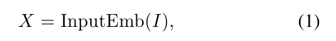

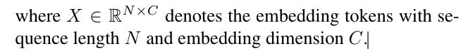

  - 그런 다음, 임베딩 토큰은 두 개의 잔여 하위 블록을 포함하는 반복되는 메타포머 블록에 공급됩니다.
  - 구체적으로, 첫 번째 sub-block은 주로 tokens들 사이에서 정보를 전달하기 위한 token mixer를 포함하며, 이 서브 블록은 다음과 같이 표현될 수 있습니다
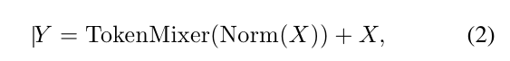

  - 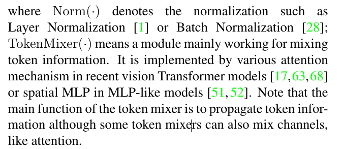
  - 

**Instantiations of MetaFormer.**
- MetaFormer는 토큰 믹서의 구체적인 설계를 지정하여 다른 모델을 즉시 얻을 수 있는 일반적인 아키텍처를 설명합니다.

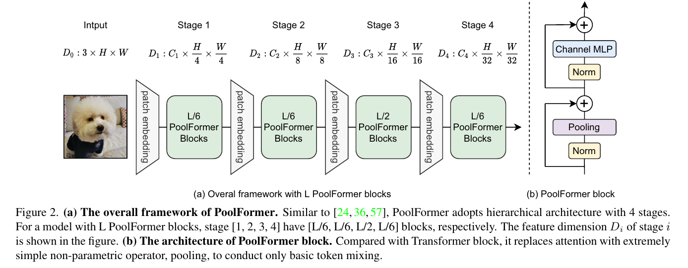

### 3.2. PoolFormer
- MetaFormer을 증명하기 위한 PoolFormer을 만들었다.
  - 극단적으로 token mixer을 단순화 한 것이다.

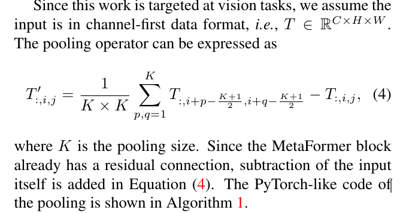

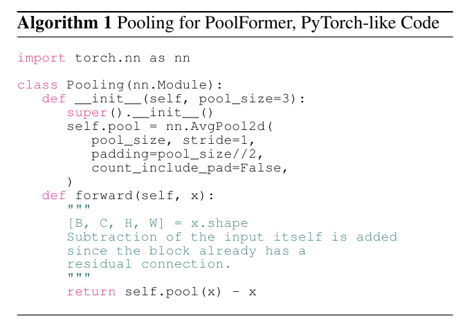

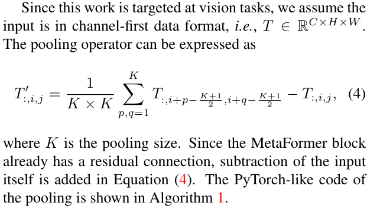

- 알다싶이 self-attention과 spatial MLP의 계산 복잡도는 token mix의 수 만큼 quadratic 하다.
  - 심지어 spatial MLPs는 긴 sequences를 다룰때 많은 parameters을 가져 온다.
  - 결과적으로 self-attention와 spatial MLP는 수백개의 토근을 처리한다.
  - 대조적으로 pooling은 어떠한 learnable parameter없이 sequence length의 선형성의 복잡도를 필요로한다.
  - 결과적으로 우리는 hierarchical Transformer variant에 의해 pooling의 이점을 취득한다.
  - 

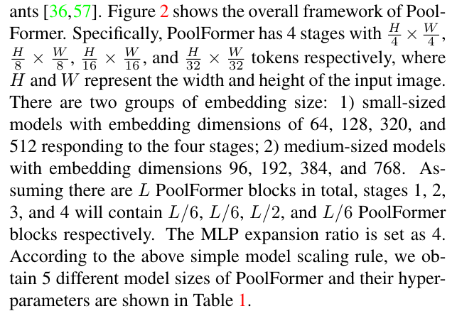

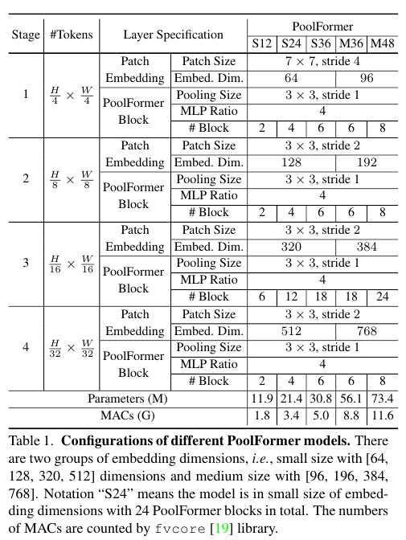

## 4. Experiments

### 4.1. Image classification

**Setup.**
- Imagenet 1k, augmentation, cousine shcedule
  - dropout disabled
  - modified Layer Normalization to compute the mean and variance along token and channel dimensions compared to only channel dimension in vanilla Layer Normalization.
  - `나는 많이 가져와 쓰는데, cvpr급은 필요시 자기가 정의해서 만들어서 쓴다. 이런것은 수학적인것에 기초한 코드 실력이다. 그래서 수학과 코드를 계속 공부 해야 겠다.`

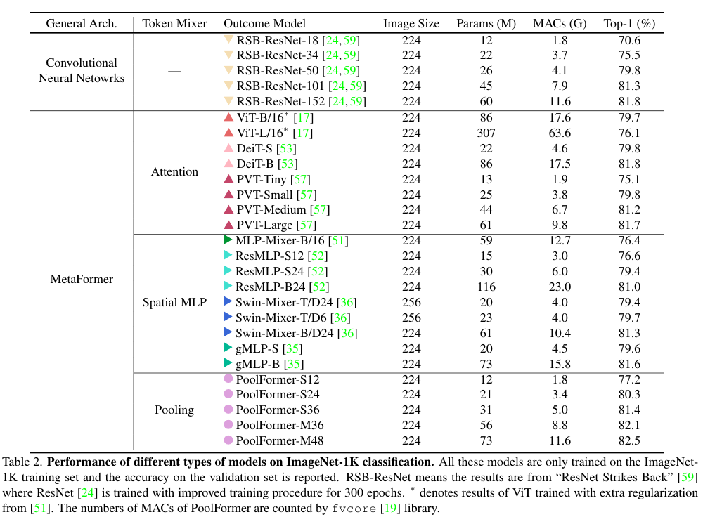

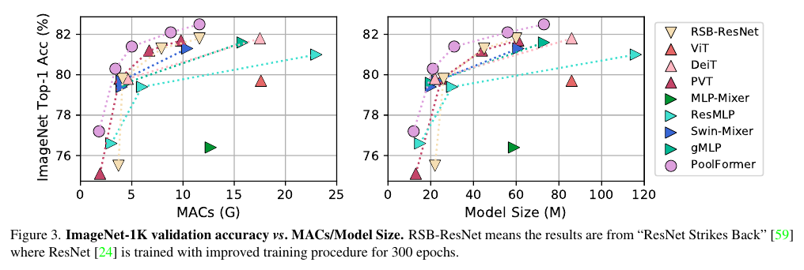

**Results.**
- pooling operator를 사용하면 각 토큰은 인근 토큰에서 기능을 고르게 집계합니다. 
  - 따라서 매우 기본적인 토큰  mixing operation입니다. 
  - 그러나 실험 결과는 이 당황스러울 정도로 간단한 토큰 혼합기로도 MetaFormer가 여전히 경쟁력 있는 성능을 얻는다는 것을 보여줍니다. 
  - 그림 3은 PoolFormer가 더 적은 MAC 및 매개 변수로 다른 모델을 능가한다는 것을 분명히 보여줍니다.
  -  이 결과는 일반 아키텍처 MetaFormer가 실제로 비전 모델을 설계할 때 필요한 것임을 전달합니다. 
  -  MetaFormer를 채택함으로써 도출된 모델이 합리적인 성능을 달성할 가능성이 보장됩니다.

### 4.2. Object detection and instance segmentation

**Setup.**

**Results.**

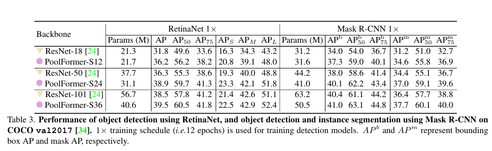

- object detection를 위한 RetinaNet이 장착된 PoolFormer 기반 모델은 표 3과 같이 지속적으로 비교 가능한 ResNet 모델보다 성능이 우수합니다.
  - object detection 및 instance segmentation.에 대해 마스크 R-CNN을 기반으로 한 모델에서도 유사한 결과가 관찰됩니다.

### 4.3. Semantic segmentation

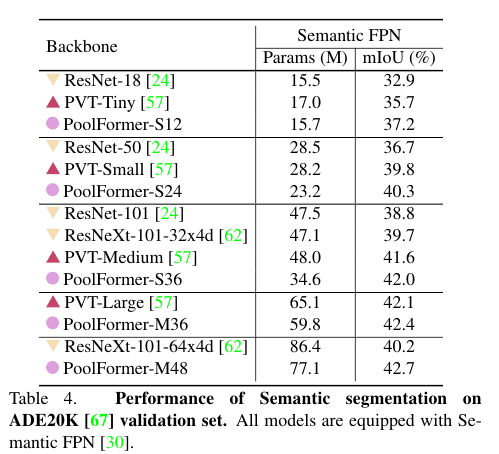

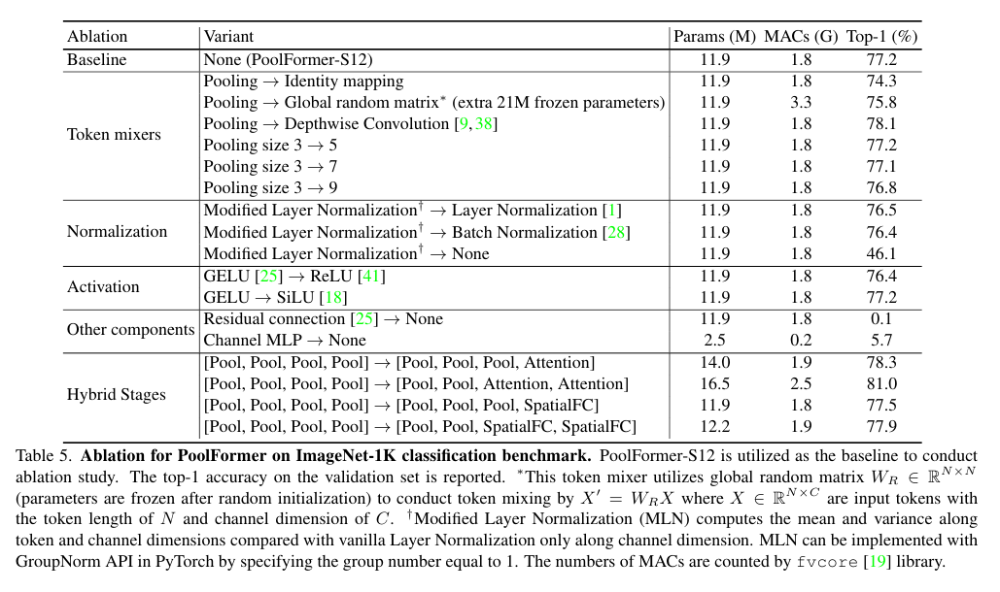

### 4.4. Ablation studies

**Token mixers.**

- 트랜스포머와 비교하여 풀포머가 **변경한 주요 사항은 토큰 믹서로 단순 풀링**을 사용하는 것입니다. 
  - 먼저 풀링을 직접** identity mapping으로 대체하여 이 연산자에 대한 절제를 수행**합니다.
  - 놀랍게도, ID 매핑이 있는 MetaFormer는 여전히 74.3%의 Top-1 정확도를 달성할 수 있으며, MetaFormer가 실제로 합리적인 성능을 보장하기 위해 필요한 것이라는 주장을 뒷받침합니다.
  - `신기 하다. identity mapping을 해도 성능이 유자 하는것이 정말 신기하다. Trnasformer을 안다고 생각했는데, 또 이렇게 하면 너무 어렵다. 알다가도 모르계{ㅆ다.}`

- 그런 다음 풀링을 각 블록에 대한 전역 랜덤 행렬 W_R ∈ R^{N×N}로 대체합니다. 
  - 행렬은 [0, 1] 구간에서 균일한 분포의 랜덤 값으로 초기화된 다음 Softmax를 사용하여 각 행을 정규화합니다. 
  - 랜덤 초기화 후 행렬 매개 변수는 동결되고 X' = W_{R}X에 의한 토큰 혼합을 수행합니다. 
  - 여기서 $X \in R^{N×C}$는 토큰 길이가 N이고 채널 치수가 C인 입력 토큰 특징입니다. 
  - 랜덤 매트릭스의 토큰 혼합기는 첫 번째 단계에서 토큰 길이가 매우 크기 때문에 S12 모델에 추가로 21M 동결 매개 변수를 도입합니다. 
  - 이러한 랜덤 토큰 혼합 방법을 사용하더라도 모델은 ID 매핑보다 1.5% 높은 75.8% 정확도의 합리적인 성능을 여전히 달성할 수 있습니다. 
  - 메타포머는 다른 잘 설계된 토큰 혼합기와는 말할 것도 없고 랜덤 토큰 혼합에서도 여전히 잘 작동할 수 있음을 보여줍니다.

- 또한 풀링은 공간 모델링을 위해 학습 가능한 매개 변수가 있는 Depthwise Convolution [9, 38]으로 대체되었습니다.
  - 당연히 도출된 모델은 더 나은 로컬 공간 모델링 능력으로 인해 PoolFormer-S12보다 0.9% 높은 78.1%의 상위 1개 정확도로 여전히 높은 경쟁력을 자랑합니다.
  - 지금까지 메타포머에 여러 토큰 믹서를 지정했으며 모든 결과 모델이 유망한 결과를 유지하고 있어 메타포머가 모델의 경쟁력을 보장하는 열쇠라는 주장을 잘 뒷받침합니다. 
  - 풀링의 단순성으로 인해 메타포머를 시연하는 도구로 주로 활용됩니다.
`보면 신기한게 더 있다. 이렇게 PoolFormer에 의해서 나오는 증명을 하고 또 추가하거나 제거를 통해서 더욱 증명을 확고히 한다.`

- 풀링 크기가 PoolFormer에 미치는 영향을 테스트합니다. 
  - 풀링 크기가 3, 5 및 7일 때 비슷한 성능을 관찰합니다. 
  - 그러나 풀링 크기가 9로 증가하면 성능이 0.5% 하락하는 것이 명백합니다. 
  - 따라서 PoolFormer에 대해 기본 푸잉 크기인 3을 채택합니다.

**Normalization.**
- 계층 정규화 [1]을 수정하여 바닐라 계층 정규화에서 채널 차원만 있는 것과 비교하여 토큰 및 채널 차원을 따라 평균과 분산을 계산합니다. 
  - MLN의 학습 가능한 어파인 매개 변수의 모양은 계층 정규화의 모양, 즉 R^C와 동일하게 유지됩니다. 
  - MLN은 그룹 번호를 1로 설정하여 PyTorch에서 GroupNorm API로 구현할 수 있습니다. 
  - 자세한 내용은 부록을 참조하십시오. PoolFormer는 계층 정규화 또는 배치 정규화보다 0.7% 또는 0.8% 높은 MLN을 선호합니다. 
  - 따라서 MLN은 PoolFormer의 기본값으로 설정됩니다. 
  - 정규화를 제거할 때 모델이 잘 수렴하도록 학습할 수 없으며 성능이 46.1%로 극적으로 떨어집니다.

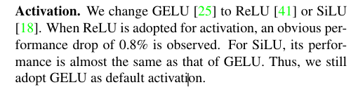

**Other components.**
- 앞서 논의된 토큰 혼합기 및 정규화 외에도, 잔여 연결 [24] 및 채널 MLP [46, 47]는 메타포머에서 두 가지 다른 중요한 구성 요소입니다. 
  - 잔여 연결 또는 채널 MLP가 없으면 모델은 수렴할 수 없고 0.1%/5.7%의 정확도만을 달성하여 이러한 부분의 필수 불가결성을 증명합니다.

**Hybrid stages.**
- 풀링, 어텐션 및 공간 MLP를 기반으로 한 토큰 믹서 중 풀링 기반은 훨씬 긴 입력 시퀀스를 처리할 수 있지만 어텐션 및 공간 MLP는 글로벌 정보를 캡처하는 데 뛰어납니다. 
  - 따라서 시퀀스가 크게 단축되었다는 점을 고려하면 아래 단계에서 풀링과 함께 메타포머를 스택하여 긴 시퀀스를 처리하고 최상위 단계에서 어텐션 또는 공간 MLP 기반 믹서를 사용하는 것이 직관적입니다. 
  - 따라서 토큰 믹서 풀링을 풀링의 상위 1~2단계에서 어텐션 또는 공간 FC로 교체합니다. 표 5에서 하이브리드 모델은 성능이 매우 우수합니다. 
  - 하위 2단계에서 풀링과 상위 2단계에서 어텐션이 있는 변종은 매우 경쟁력 있는 성능을 제공합니다. 
  - 16.5M 매개 변수와 2.5G MAC만으로 81.0% 정확도를 달성합니다. 
  - 이에 비해 ResMLP-B24는 동일한 정확도를 달성하려면 7.0배 매개 변수(116M)와 9.2배 MAC(23.0G)가 필요합니다. 
  - 이러한 결과는 메타포머를 위한 다른 토큰 믹서와 풀링을 결합하는 것이 성능을 더욱 향상시킬 수 있는 유망한 방향일 수 있음을 나타냅니다.

`본인의 가정을 검증하고 나서도 여러가지 block을 넘을써 어떠한 효과가 있는지 확실히 알아냈다.`

## 5. Conclusion and future work
- 이 작업에서, 우리는 토큰 믹서로 트랜스포머에서 주목을 추상화했고, 토큰 믹서가 지정되지 않은 일반 아키텍처로 메타포머라고 명명했습니다. 
  - 특정 토큰 믹서에 초점을 맞추는 대신, 메타포머가 실제로 합리적인 성능 달성을 보장하기 위해 필요한 것임을 지적합니다. 
  - 이를 검증하기 위해, 우리는 의도적으로 토큰 믹서를 메타포머를 위한 매우 간단한 풀링으로 지정합니다. 
  - 도출된 풀포머 모델은 다양한 비전 작업에서 경쟁력 있는 성능을 달성할 수 있으며, 이는 "메타포머가 실제로 비전에 필요한 것"이라는 것을 잘 뒷받침합니다.

- 앞으로 자가 지도 학습 및 전이 학습과 같은 보다 다른 학습 설정 하에서 풀포머를 추가로 평가할 것입니다. 
  - 더욱이 풀포머가 NLP 도메인에서 "MetaFormer는 실제로 필요한 것이다"라는 주장을 추가로 뒷받침하기 위해 여전히 NLP 작업에서 작동하는지 여부는 흥미롭습니다. 
  - 이 작업이 토큰 믹서 모듈에 너무 많은 관심을 기울이는 대신 기본 아키텍처 MetaFormer를 개선하는 데 전념하는 향후 연구에 영감을 줄 수 있기를 바랍니다.

# 나의 의견
- 첫번째로 놀란것은 Transformer을 이런식으로 분해해서 실험하고 주장한다는 것이 굉장히 신선한게 다가왔다.
  - Convnext역시 backbone의 근간이 되는것을 질문하고 찾아가는 느낌이다.
  - 이런논문을 쓰기 위해서 한상 얼마나 많은 것들을 읽고 자기 생각을 천천히 정리 해야 하는지 가흠으 안잡힌다.
  - 이들은 어떻게 실험을 했으며 이런 아이디어를 만들어 냈을까?
  - 잘 모르겠다.
  -  나역시 천천히 나의 생각을 정리하며 가지만, 아직 어디서 contribution을 만들어하며 어디를 수정해야 할지, 어떤 문제를 해결할지 날  모르곘다.
  -  일단 cvpr 같은 논문을 읽으며 생각을 정리하고 그리고 그을 꾸준히 쓰면서 하나씩 해야 겠다.
  -  노력과 연습의 양(시간) 그리고 올바른 방법이 필요한데, 올바른 방법은 유튜브에서 그들의 실험 방법을 보면서 배울수 밖에 없는것 같다.

