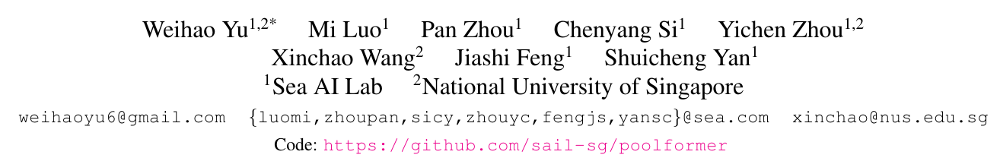
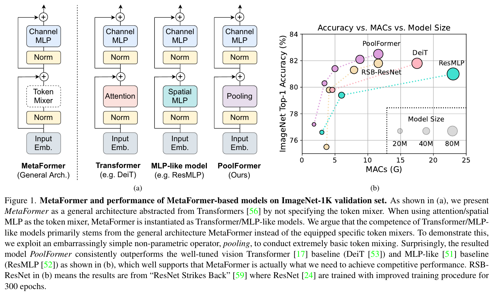
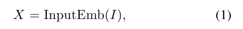
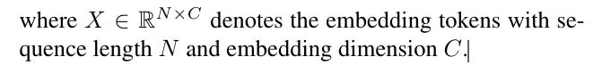
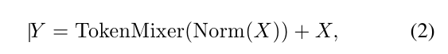
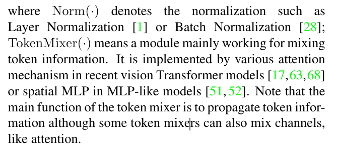
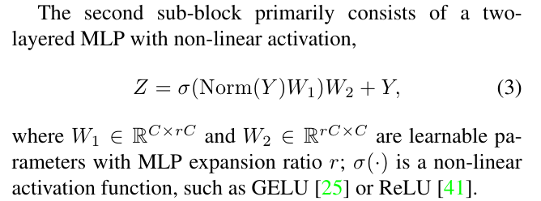
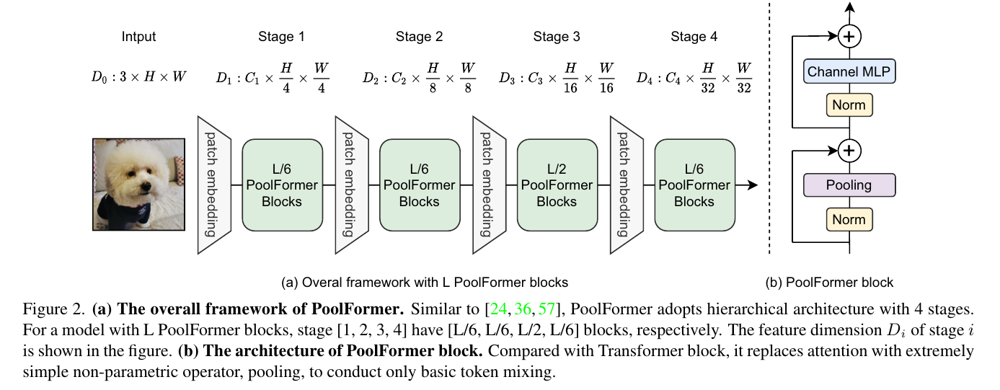
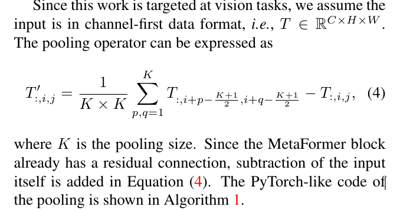
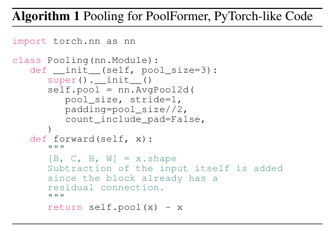

# MetaFormer Is Actually What You Need for Vision

## 컨퍼런스 : cvpr (2022)

https://openaccess.thecvf.com/content/CVPR2022/papers/Yu_MetaFormer_Is_Actually_What_You_Need_for_Vision_CVPR_2022_paper.pdf

https://github.com/sail-sg/poolformer

## 저자 : 

## Abstract
- Transformer은 잠재적인 발전을 일으켰다.
  - 큰 공통적인 믿음으로는 attention-based token mixer module이 가장 큰 그들의 competence로 기여한것이다.
  - 하지만 최근 Transfomer의 attention-based module은 spatial MLps로 교체됨에 따라 성능이 잘 나오고 있다.
    - 이것을 관찰 했을 때 **우리는 specific token mixer module대신 Transformer의 general architecture을 가정**했다. 그 것은 model 성능에 더 필수적일것이다.
    - 우리는 검증하기 위해 **가장 기본이 되는 token mixing을 수행하는 pooling operator로 수행 했다**.
    - 이것을 PoolFormer이라 명칭하며 다수 computer vison tasks에서 우수한 성능이 나왔다.
    - 우린의 가정인 Pool-former의 효과는 우리의 컨셉인 "Metaformer" 시작하는 것을 주장하다.
      - 'metaformer'은 Transforme로부터 specifying the token mixer없이 추상하된 일반적인 architecture이다.
    - 광범위한 실험 결과 Metaformer은 최근 Transformer와 MLp-like model이 computer vision에서 우수한 성능을 나오는 것의 key 역할이라고 주장한다.

## 1. Introduciton
- Transformer encdoer은 두가지 구성 요소로 되어있따.
  -  하나는 트큰들 사이에 mixing information 그리고 우리는 token mixer로 칭한다.
  -  다른 하나는 다른 모듈에 포함 되어있다. 예를들어 MLP와 residual connection.
  - attention module을 특정 token mixer로 간주함으로써, 그림 1(a)와 같이 토큰 믹서가 지정되지 않은 일반 아키텍처 MetaFormer로 전체 Transforer를 더 추상화합니다.
`vision transformer을 보며 이렇게 두가지를 나누었다는 것이 신기하다. 읽으면서 나도 정리를 해야 겠다는 생각이 많이 드는 구문이다.`

- 오래동안 attention-based token mixer으로 Transformer의 성공을 기여 했다.
  - 하지만 최근 MLP-like model 에 파생된 image classification benchmark에서 경쟁력있는 성능을 가져왔다.
  - 후속 작업들은 데이터 효율적인 훈련과 특정 MLP 모듈 설계를 통해 MLP와 유사한 모델을 더욱 개선하여 ViT에 대한 성능 격차를 점차 줄이고 토큰 믹서로서의 관심의 우위에 도전합니다.

- 최근 연구는 MetaFormer architecture 안에 다른 타입의 token mixer로 탐구 되었다.
  - 예를 들어 Fourier Transformer는 attention을 교체 했으나 여전히 vanilla Trnasformer의 97%의 성능을 발휘하고 있다.
  - 우리는 그래서 MetaFormer는 경쟁력 성능을 발휘하기 위핸 필수조건이라고 가정하다.
`이글을 자세히 보면 왜 MetaFormer을 가정하려고 했는지 나와있다. 실험이 왜 시작 되었으며, 어떤 의문 그리고 어떤 논문들을 참고하면서 이러한 연구를 시작했는지 알 수 있다.`

- 가정을 검증하기 위해 가간단한 non-parametric operator, pooling을 token mixer로서 적용했다.( 가장 기본적인 token mixing을 위해)
  - 이것을 PoolFormer이라 하며 놀랍게도 경쟁력있는 성능을 보였으며, 잘 조정된 transformer을 성능일 능가합니다.
  - 여러가지 Transformer에 비해 성능이 강함을 보인다.
  - 따라서 우리는 MetaFormer가 vision model에 더 필 수적으로 경쟁력 있는 성능을 달성한다고 주장한다.
  - token mixer가 중요하지 않다는 것을 의미하는 것은 아닙니다. 
  - MetaFormer에는 여전히 이 추상화된 구성 요소가 있습니다. 
  - token mixer가 특정 유형(예: 주의)에 제한되지 않음을 의미합니다.

`사실 Convnext와 관점의 차이이긴 하다. 그 두 관점이 차이인 논문이다. Convnext는 CNN의 구조를 유사 빌린 SwinTransformer이 성공한 이유로 CNN을 가지고 transformer의 성능을 이긴 사례이다. 이렇게 관점에 따라 다른 논문이 나왔지만, 결론적으로 같은 말을 하는 것이다.`

- 첫번째로 MLP-like 모델은 MetaFormer architecture에 크게 기여한다.
  - 두번째로 PoolFormer은 다양한 컴퓨터 비전(object detction, image classifcation, stance segmentation, semaintic segmentation)등에서 우수한 성능을 보였다. 

## Related work
- 기존의 Transformer은 token-mixer에 관심을 가진 구조였다.
  - 우리는 근본적인 질문을 조사합니다:
    - Transformer와 그 변종의 성공에 진정으로 resposible은 무엇인가요? 
      - 우리의 답은 일반 아키텍처, 즉 MetaFormer이다.
      -  우리는 단순히 NetaFormer의 힘을 조사하기 위해 기본 token mixer로 pooling을 사용합니다.

## 3. Method

### 3.1 MetaFormer
- 입력 I는 먼저 ViT용 patch embedding과 같은 input embedding에 의해 처리됩니다 [17]

  - 그런 다음, 임베딩 토큰은 두 개의 잔여 하위 블록을 포함하는 반복되는 메타포머 블록에 공급됩니다.
  - 구체적으로, 첫 번째 sub-block은 주로 tokens들 사이에서 정보를 전달하기 위한 token mixer를 포함하며, 이 서브 블록은 다음과 같이 표현될 수 있습니다

  - 
  - 

**Instantiations of MetaFormer.**
- MetaFormer는 토큰 믹서의 구체적인 설계를 지정하여 다른 모델을 즉시 얻을 수 있는 일반적인 아키텍처를 설명합니다.

### 3.2. PoolFormer
- MetaFormer을 증명하기 위한 PoolFormer을 만들었다.
  - 극단적으로 token mixer을 단순화 한 것이다.

# 나의 의견
- 첫번째로 놀란것은 Transformer을 이런식으로 분해해서 실험하고 주장한다는 것이 굉장히 신선한게 다가왔다.
  - Convnext역시 backbone의 근간이 되는것을 질문하고 찾아가는 느낌이다.
  - 이런논문을 쓰기 위해서 한상 얼마나 많은 것들을 읽고 자기 생각을 천천히 정리 해야 하는지 가흠으 안잡힌다.
  - 이들은 어떻게 실험을 했으며 이런 아이디어를 만들어 냈을까?
  - 잘 모르겠다.
  -  나역시 천천히 나의 생각을 정리하며 가지만, 아직 어디서 contribution을 만들어하며 어디를 수정해야 할지, 어떤 문제를 해결할지 날  모르곘다.
  -  일단 cvpr 같은 논문을 읽으며 생각을 정리하고 그리고 그을 꾸준히 쓰면서 하나씩 해야 겠다.
  -  노력과 연습의 양(시간) 그리고 올바른 방법이 필요한데, 올바른 방법은 유튜브에서 그들의 실험 방법을 보면서 배울수 밖에 없는것 같다.
