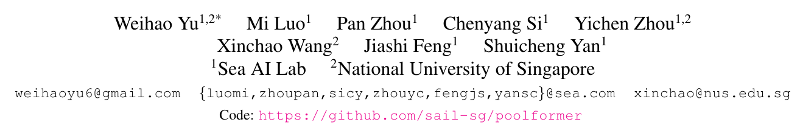
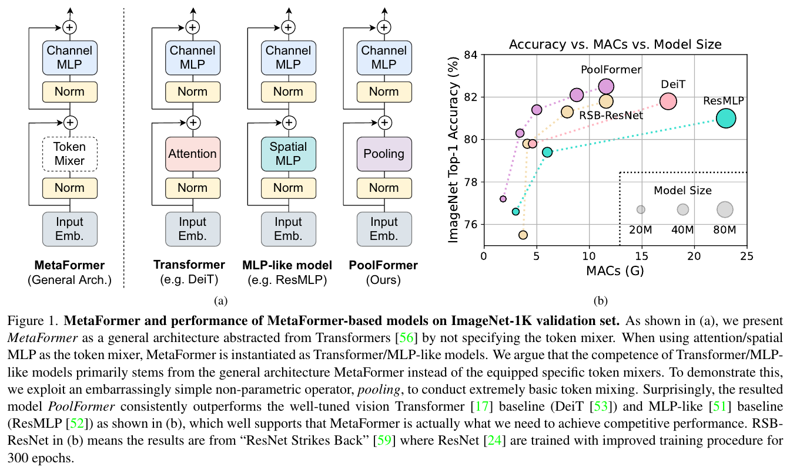

# MetaFormer Is Actually What You Need for Vision

## 컨퍼런스 : cvpr (2022)

https://openaccess.thecvf.com/content/CVPR2022/papers/Yu_MetaFormer_Is_Actually_What_You_Need_for_Vision_CVPR_2022_paper.pdf

https://github.com/sail-sg/poolformer

## 저자 : 

## [자세한 설명](./MetaFormer%20Is%20Actually%20What%20You%20Need%20for%20Vision%20(2022).md)

**요약**  
트랜스포머는 컴퓨터 비전 작업에서 중요한 잠재력을 보여왔습니다. 트랜스포머 내의 attention 기반 토큰 믹서가 그들의 능력에 가장 크게 기여한다고 생각되었지만, 최근의 연구들은 공간 MLPs가 attention 기반 모듈을 대체하고도 잘 수행될 수 있다고 보여주었습니다. 이 논문은 토큰 믹서를 구체적으로 지정하지 않고 트랜스포머에서 추상화된 "MetaFormer"라는 일반 아키텍처 개념을 소개합니다. 논문은 MetaFormer 아키텍처가 특정 토큰 믹서보다 성능에 중요하다는 것을 보여줍니다. 제안된 모델인 PoolFormer는 토큰 믹싱을 위해 간단한 공간 풀링 연산자를 사용하며 다양한 컴퓨터 비전 작업에서 경쟁력 있는 성능을 달성합니다.

---

**1. 서론**  
- 트랜스포머는 비전 트랜스포머(ViT)의 도입 이후 컴퓨터 비전 분야에서 큰 관심을 받았습니다.
- 트랜스포머 인코더는 두 가지 구성 요소로 이루어져 있습니다: attention 모듈(토큰 믹서)과 다른 모듈들입니다.
- 트랜스포머의 성공은 attention 기반 토큰 믹서에 기인한다고 생각되었습니다. 그러나 최근의 연구들은 공간 MLPs가 attention을 대체하고도 잘 수행될 수 있다는 것을 보여주었습니다.
- 이 논문은 토큰 믹서를 구체적으로 지정하지 않은 "MetaFormer"라는 일반 아키텍처 개념을 소개합니다.

---

**2. 관련 연구**  
- 트랜스포머는 처음에는 번역 작업을 위해 제안되었고, 나중에 다양한 NLP 작업에서 인기를 얻었습니다.
- NLP에서 트랜스포머의 성공에 영감을 받아 많은 연구자들이 attention 메커니즘과 트랜스포머를 비전 작업에 적용하였습니다.

---

**3. 방법**  
**3.1. MetaFormer**  
- MetaFormer는 토큰 믹서를 구체적으로 지정하지 않은 트랜스포머에서 추상화된 일반 아키텍처입니다.
- 입력은 먼저 입력 임베딩에 의해 처리되며, 그 다음 임베딩 토큰은 반복된 MetaFormer 블록에 공급됩니다.

**3.2. PoolFormer**  
- 이 논문은 MetaFormer 일반 아키텍처가 최근 트랜스포머 모델의 성공에 크게 기여한다고 주장합니다.
- PoolFormer는 토큰 믹서로 풀링을 사용하며, 이는 학습 가능한 매개변수가 없는 간단한 연산자입니다.

---

**4. 실험**  
**4.1. 이미지 분류**  
- ImageNet-1K는 컴퓨터 비전에서 널리 사용되는 데이터셋입니다.
- 훈련 체계는 이전 연구를 따르며, 다양한 데이터 증강 기술을 사용합니다.
- 모델은 AdamW 최적화 도구를 사용하여 300 에포크 동안 훈련됩니다.

---

이 논문은 MetaFormer라는 개념을 소개하며, 특정 토큰 믹싱 방법보다 아키텍처가 더 중요하다는 것을 강조합니다. 제안된 PoolFormer 모델은 토큰 믹싱을 위해 간단한 풀링을 사용하여 경쟁력 있는 성능을 보여줍니다.

# 나의 의견
- 첫번째로 놀란것은 Transformer을 이런식으로 분해해서 실험하고 주장한다는 것이 굉장히 신선한게 다가왔다.
  - Convnext역시 backbone의 근간이 되는것을 질문하고 찾아가는 느낌이다.
  - 이런논문을 쓰기 위해서 한상 얼마나 많은 것들을 읽고 자기 생각을 천천히 정리 해야 하는지 가흠으 안잡힌다.
  - 이들은 어떻게 실험을 했으며 이런 아이디어를 만들어 냈을까?
  - 잘 모르겠다.
  -  나역시 천천히 나의 생각을 정리하며 가지만, 아직 어디서 contribution을 만들어하며 어디를 수정해야 할지, 어떤 문제를 해결할지 날  모르곘다.
  -  일단 cvpr 같은 논문을 읽으며 생각을 정리하고 그리고 그을 꾸준히 쓰면서 하나씩 해야 겠다.
  -  노력과 연습의 양(시간) 그리고 올바른 방법이 필요한데, 올바른 방법은 유튜브에서 그들의 실험 방법을 보면서 배울수 밖에 없는것 같다.