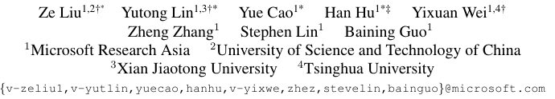

# Swin Transformer: Hierarchical Vision Transformer using Shifted Windows

https://openaccess.thecvf.com/content/ICCV2021/papers/Liu_Swin_Transformer_Hierarchical_Vision_Transformer_Using_Shifted_Windows_ICCV_2021_paper.pdf

## 저널 및 학회 : ICCV (2021)

## 저자 : 

## [Swin Transformer 자세한 설명](./Swin%20Transformer%20(2021).md)

Swin Transformer는 컴퓨터 비전 분야의 일반적인 목적을 위한 새로운 비전 Transformer입니다. 이는 이미지 분류, 객체 감지, 의미론적 분할과 같은 다양한 비전 작업과 호환됩니다. Swin Transformer의 주요 구성 요소와 특징은 다음과 같습니다.

### 1. **개요**
   Swin Transformer는 언어와 비전 사이의 차이점을 극복하기 위해 계층적 Transformer를 제안합니다. 비전 엔터티의 큰 변동과 이미지의 고해상도 픽셀과 같은 문제를 해결하기 위해 Shifted windows를 사용하는 계층적 구조를 도입했습니다.

### 2. **계층적 구조**
   - **Shifted Windowing Scheme**: 비효율적인 자기 주의 계산을 제한하면서도 교차 창 연결을 허용합니다.
   - **다양한 스케일 모델링**: 계층적 아키텍처는 다양한 스케일에서 모델링 할 수 있는 유연성을 제공합니다.
   - **선형 계산 복잡성**: 이미지 크기에 대한 선형 계산 복잡성을 가집니다.

### 3. **성능**
   - **Image Classification**: ImageNet-1K에서 87.3의 top-1 정확도를 달성했습니다.
   - **Object Detection**: COCO testdev에서 58.7 box AP와 51.1 mask AP를 달성했습니다.
   - **Semantic Segmentation**: ADE20K val에서 53.5 mIoU를 달성했습니다.

### 4. **Shifted Window Approach**
   - **창 이동**: 연속된 자기 주의 계층 사이의 창 분할을 이동하여 모델링 능력을 크게 향상시킵니다.
   - **효율성**: 모든 쿼리 패치가 동일한 키 세트를 공유하므로 하드웨어에서 메모리 액세스를 용이하게 합니다.

### 5. **다목적 백본**
   - **일반 목적 백본**: Swin Transformer는 다양한 비전 작업에 적합한 일반 목적 백본으로 사용됩니다.
   - **컴퓨터 비전과 자연어 처리의 통합**: 비전과 언어 신호의 통합 모델링을 장려하고 두 도메인 간의 모델링 지식을 더 깊게 공유할 수 있습니다.

### 6. **비교**
   - **ViT / DeiT와 ResNe(X)t 모델과 비교**: 세 가지 작업에서 유사한 대기 시간으로 크게 능가합니다.
   - **COCO 객체 감지와 ADE20K 의미론적 분할에서 최첨단 정확도를 달성**: 이는 선형 복잡성과 지역 작동 방식 덕분입니다.

### 7. **전반적인 아키텍처**
   - **입력 이미지를 비중첩 패치로 분할**: 각 패치는 "토큰"으로 취급되며, 원시 픽셀 RGB 값의 연결로 설정됩니다.
   - **Swin Transformer 블록**: 이러한 패치 토큰에 적용되며, 토큰 수를 유지하고 "Stage 1"로 참조됩니다.

Swin Transformer는 이미지 분류, 객체 감지, 의미론적 분할 등 다양한 비전 작업에서 강력한 성능을 발휘하며, 컴퓨터 비전과 자연어 처리 분야에서 통합 아키텍처의 가능성을 보여줍니다.

# 나의 의견 :
- Transformer에서 single scale 으로 이루어진 patch 계산은 이미지와 어울리지 않은 방법이라는 지적에서 시작했다.
- 왜냐 하면 언어는 차원이 어느정도 정해져 있지만, 이미지의 경우 고차원 이기 때문이다.
- 그리고 single scale은 계산 복잡성이 2배수로 증가함으로 효율 문제 가 있었다.
- 계산 복잡성과 메모리의 효율성을 달성하기 위해 CNN과 같은 계층적 구조를 이용하였다.
- 그 결과 속려과 메모리 효율을 달성 헀으면, 일부 부분에서 좋은 성능을 달성 했다.