# Swin Transformer: Hierarchical Vision Transformer using Shifted Windows

https://openaccess.thecvf.com/content/ICCV2021/papers/Liu_Swin_Transformer_Hierarchical_Vision_Transformer_Using_Shifted_Windows_ICCV_2021_paper.pdf

## 저널 및 학회 : ICCV (2021)

## 저자 : 

## Abstract

- 이 논문은 컴퓨터 비전을 위한 범용 백본 역할을 할 수 있는 Swin Transformer라는 새로운 비전 Transformer를 제시합니다. 
- 언어에서 비전으로 Transformer를 적응시키는 데 있어서의 어려움은 시각적 실체의 규모의 큰 변화와 텍스트의 단어에 비해 이미지의 픽셀의 높은 해상도와 같은 두 도메인 간의 차이로 인해 발생합니다. 
	- 이러한 차이를 해결하기 위해 우리는 Shifted window로 표현이 계산되는 hierarchical sTransformer를 제안합니다. 
	- Shifted windowing scheme은 자기 주의 계산을 중첩되지 않는 local 윈도우로 제한하는 동시에 cross-window connection을 허용함으로써 더 큰 효율성을 가져옵니다.
- 이 계층적 아키텍처는 다양한 스케일로 모델링할 수 있는 유연성을 가지고 있으며 이미지 크기에 대한 선형 계산 복잡성을 가지고 있습니다. 
	- 이러한 Swin Transformer의 품질은 이미지 분류(ImageNet-1K의 경우 87.3 Top-1 정확도)와 객체 검출(COCO testdev의 경우 58.7 박스 AP 및 51.1 마스크 AP) 및 의미론적 분할(ADE20K val의 경우 53.5 mIoU)과 같은 밀도 높은 예측 작업을 포함하여 광범위한 비전 작업과 호환됩니다. 
	- 이 성능은 COCO의 경우 +2.7 박스 AP 및 +2.6 마스크 AP, ADE20K의 경우 +3.2 mIoU라는 큰 차이로 이전의 최첨단 성능을 능가하며, Transformer 기반 모델의 비전 백본으로서의 가능성을 보여줍니다.
- 계층적 설계와 시프트된 윈도우 접근 방식은 또한 모든 MLP 아키텍처에 유익한 것으로 입증되었습니다. 
- 코드와 모델은 https://github.com/microsoft/Swin-Transformer.에서 공개적으로 사용할 수 있습니다.

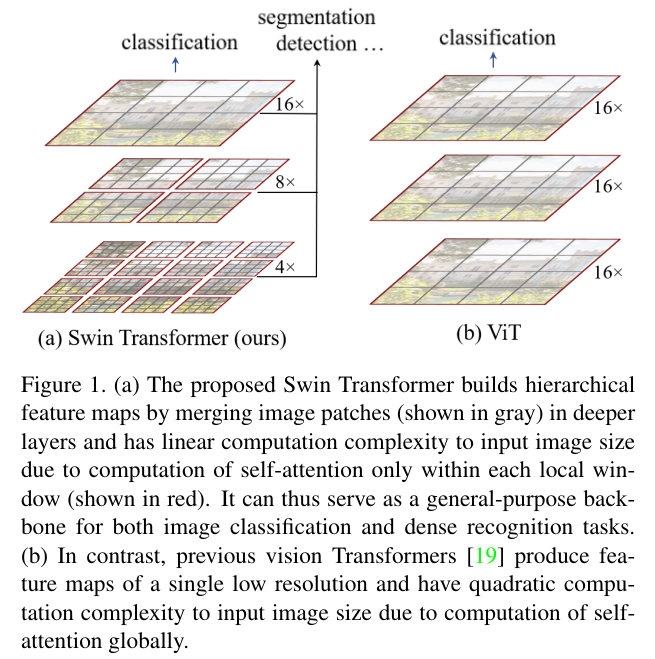

## 1. Introduction

- Figure1, 에 나와 있는 것처럼 작은 크기의 패치(patch)에서 시작되어 깊은 Transformer에서는 인접합(neighboring) 패치를 병합하는 계층적 구조를 가지고 있다.
	- 이러한 계층적 특징 맵을 통해 Swin  Trnasformer 모델은 특징피라미트네트워크(feature pyramid networks (FPN))과 U-net과 같은 예측을 편리하게 사용할 수 있게 된다.
	- `-> 이 말은 다양한 활용성이 있다는 뜻이구만`
- 선형 계산 복잡성(linear computational complexity)는 중복되지 않는(non-overlapping) 창(window)내의 로컬로 self-attentio으로 계산으로 달성된다.
	- 각 패치의 수는 고정되어 있으며, 복잡성은 이미지 크기에 따라 선형이 된다. 
- 이러한 장점은 Swin-transformer를 다양한 비전 으로 적합하게 만든다. (vit의 2차 복잡성을 갖는 single resolution(단일 해상도)에 비해)
	- 또한 shifted widow 접근은  sliding window보다 낮은 latency를 보인다.

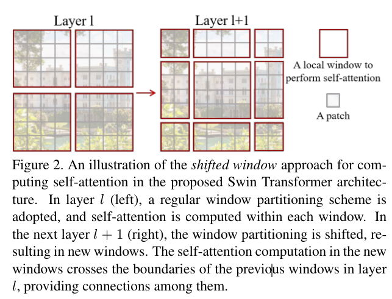

- Swin Trnsformer의 핵심 설계는 Figure 2.와 같이 연속적인(consecutive) self-attention간의(between) 창(window) 파티션의 이동시키는 것이다. 전환된(shifted) 창(window)은  이전 layer의 창들과 연결해주며, 모델링 power(능력)을 크게 향상 시킨다. [Sliding Window와 Shifted Window](../../../0.0%20참고/Sliding%20Window와%20Shifted%20Window.md)
	- 이 전략은 실제 세계(real-world)에서 효율적이다. query 패치는 동일한 key set1 을 공유한다. 이는 하드웨어 메모리를 용이하게 한다.
- 대조적으로 slidin window 기반 self-attention  접근법은 서로 다른 query pixcel으로 일반 hardware에서  인해 낮은 latency(지연시간)의 어려움을 겪고 있다.
	- `(일반 하드웨어 에서 슬라이딩 윈도우(sliding window) 기반 convolution layer를 구현하는 효율적인 방법이 있다. 하지만  feature map을 걸친 kenel weight의 공유로 때문에 실저로 효율적인 메모리 엑세스를 갖는 것은 어렵다.)`
- Swin Transformer는 이미지 분류(classification), 물체 감지(object detection) 그리고 의미 분할(semantic segmentation)의 이미지 인식(recognition) 작업에서 강력한 성능을 달성한다.

## 2. Related work

**CNN and variants**
 - CNN은 컴퓨터 비전의 중요한 역할은 함.

**Self-attention based backbone architectures.**
 - self-attention Resnet보다 좋은 성능을 가졌지만 메모리 사용량이랑 trade-off를 하게 된다.
 - 값비싼 메모리 사용량으로 대기시간이 기랃.

**self-attention/Transformers to complement CNNS**
 - standard CNN 구조에 self-attention과 Trnasformer을 더하는 것이다.  
   - distant  의존성과 heterogeneous 상호작용에 능력을 제공 한다.
 - 최근에는 트랜스포머의 인코더 디커도 설계가 객체 감지 및 instance(segnentation) 작업 탐구 하고 있다.

**Transformer based vision backbones**
- Vit는 컴퓨터 비전에 선구의 역할은 했다. 
  - 겹치지 않은 중간크기의 이미지 패치로 분류 작업을 한다.
  -  그것은 속도와 정확도를 trade-off 하는 결과를 이루다.
- 반면 ViT는 large-scale 훈련 이미지가 필요하다. 
  - Deit는 상대적 작은 데이터로 분류 성능을 보였으나, 범용성이 부겆절하다.
- 낮은 이미지 해상도와 계산 복잡도가 2차인 것도 있다.
- `모델이 아직 연산에 대해서 비효율 적이다.`

## 3. Method

### 3.1. Overall Architecture

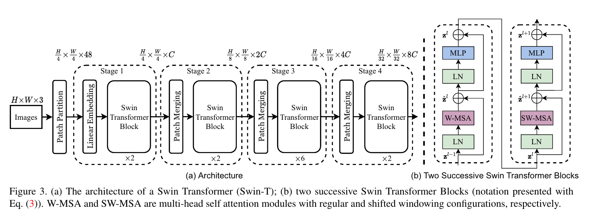

- Swin-Transformer은 RGB 이미지를 Vit와 같이 패치 분할 모듈에 중복되지 않게 분할 한다.
	- 각 패치는 ''token" 으로 처리되며  픽셀 RGB 값의 연결로 설정 된다.
	- 4x4의 패치 크기를 사용하여 각 패치의 feature dimension은 4x4x3  = 48이다.
	- 선형 임베딩 레이거 이 가공되지 않은 값들의 feature을 임의 차원(C)로 투영된다.

		- 1단계 (H/4 +  W/4) 이다.
			- 계층적(hierarchical) 표현을 하기 위해 layer가 깊어 질 수록 패치합성레이어(patch merging layer)을 이용하여 토큰의 수를 줄인다.
			- 처음 패치합성 레이어는  2x2의 각 그룹의  features를 연결한다. 그리고 선형 레이어를 적용하여 4C 차원을 가지게 연결 한다.
			- 이렇게 하면 2x2 = 4(2x 다운샘플링 의 토큰 감소와 출력 차원은 2C를 가지게 된다.
			- H/8 + H/8 로 유지 된다.
		- 이 패치는 2단계이다.
			- 3단계 4단계를 거치면서 H/16+ W/16와 H/32 * W/32 의 출력을 가진다.
			- 이 단계들은 convolutional layer와 같은 계층적인 feature 맵 해상도를 가진다.
- 결과적으로 제안된 아키택처는 편리하게 다양한 비전 작업을 재 설계 할 수 있다.

**Swin Transformer block**
- MSA 모듈을 다른 레이어와 동일하게 유지하면서 shfited widows교체 했다.
- Swin Transformer은 shifted window ased MSA module으로 이루어졌있다. (GELU가 포함된 2계층의 MLP)
  
### 3.2 Shifted Window based Self-Attention

- 이미지 분류를 위한 표준(standard) Transformer  구조는 전역(global) self-attention으 이루어져 있다. self-attention은 토큰과 다른 토큰간의 관계를 계산한다.
- global 계산은 토큰수와 관련하여 이차 복잡성으로 이어진다.  조밀한  예측을 위해 엄청난 토큰 세트를 요구하거나 고해상도 이미지를 나타내는 많은 비전 문제에 적합하지 않다.

**Self-attention in non-overlapped windows**

- 효율적인 모델리을 위해 창 내의 self-attention 계산을 제안한다. 
	- 창은 겹치지 않는 방식으로 이미지를 균등하게 분할 하도록 배열된다.
	- 각 창에 MxM 패치가 포함되어 있다고 가정하면 글로벌 MSA 모듈과 h x w 패치의 이미지를 기반으로 한 창의 복잡도는 3이다.
- 우리는 복잡성을 판달할때 softmax를 제외한다.

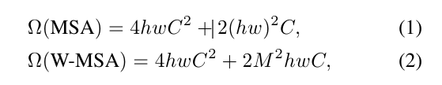

- 여기서 전자는 패치 번호 hw 에 2차이고, M이 고정된 경우 후자는 선형이다.( 기본값으로 7로 설정)
- 글로벌 자기 주의(global self attenton) 게싼은 일반적으로 대규모 하드웨어에 대해 감당할 수 없는 반면, window(창) 기반 자기 주의(self attention)은 확장 가능하다.

**Shifted windo partitioning in successive block**
- 창(window) 기반 self-attention 모듈은  윈도우간의 연결이 부족하여 모델링 능력이 제한된다. 
	- 중복되지 않은(non-overlapping) 창의 효율적인 계산을 유지하면서 교차 창(cross-window)  연결을 도입하기 위해 연속적인(consecutive) Swin Transformer block 제안한다.

- 그림 2와 같이, 첫 번째 모듈은 왼쪽 위 픽셀 부터 시작하는 일반적인 창 분할을 씁니다. 
	- 8x8  혀상 맵은 4x4 크기의 2x2 창으로 고르게 분할 됩니다.(M=4)
	- 그런 다음 모듈이 창을 교체하여 정기적으로 분할된 창에서 이전 계층([M/2],[M/2]) 픽셀의 창 구성을 쳬택 합니다.

- 전환된(shifted widnow) 분할 접근법은 연속적인(consecutive) Swin Trnasformer block은 다음과 같이 계산:
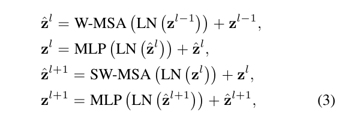

- Shifted window partitioning 접근 방식은 이전 계층에서 중첩되지 않는 인접 window(창) 사이의 연결을 도입하며 표4와 같이 효과적으로 보임

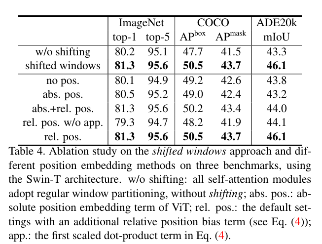

**Efficient batch computation for shifted confiuration**

- 창 분할 할 때 생기는 문제는 [h/M] x [w/M]에서 ([h/M]+1) x([w/M]+1)으로  변환 특성은 더 많은 창을 만들게 된다. 
	- 그리고 몇몇은 window(창)은 M x M 보다 더 작다.
- 간단한 해결책으로는  window를 계산할때 작은 창을 M x M 크기로 패딩하고 패딩 된 값을 마스크하는 것이다. 

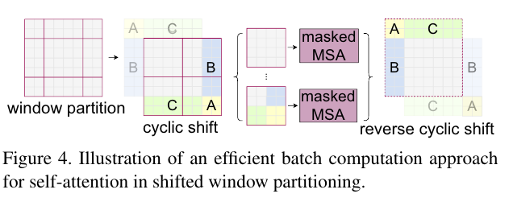

- 여기서, 우리는 그림 4에 나타난 바와 같이 왼쪽 상단 방향으로 주기적으로 이동함으로써 보다 효율적인 배치 계산법을 제안 한다.
	- 이러한 이동 후 배치된 창은 형상 맵에서 인접하지 않은 여러 하위 창으로 구성될 수 있으므로 마스킹 메커니즘을 사용하여 각 하위 창 내에서 자체 주의 계산을 제한한다.
	- 순환 시프트를 사용하면 배치된 창 수가 일반 창 준할의 창 수와 동일하므로 효율적이다. 

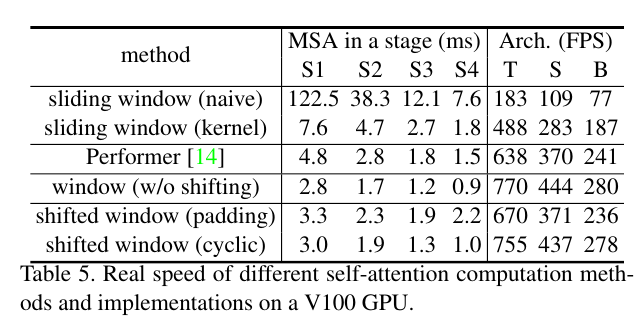

- 표 5에 우리는 속도가 나와있다.

**Relative position bias**
- self-attention 에서 우리는 계산 유사성에서 각 헤드에 대한 상대적 위치 편향 B \in R 를 포함 시킴으로써 [a] 따른다.

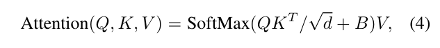

- 표4에 나타난 바와 같이, 우리는 이 편향 항이 없거나 절대 위치 임배딩(absolute position embedding) 을 사용하는 상대에 비해 상당한 개선을 관찰한다. 
	- [19]와 같이 절대 위치 임베딩을 입력에 추가하면 성능이 약간 저하되므로 구현에 채택되지 않는다.
	- 사전 훈련에서 학습된 상대 위치 편향(relative position bias) bi-cubic 보간을 통해 다른 창 크기로 미세 조정을 위한 모델을 초기화하는데 사용될 수 있다.

### 3.3. Architecture Variants

- 우리는 Swin-B라고 하는 기본 모델을 ViTB/DeiT-B와 유사한 모델 크기와 계산 복잡성을 갖도록 구축합니다. 
	- 또한 각각 모델 크기와 계산 복잡도가 약 0.25배, 0.5배, 2배인 Swin-T, Swin-S 및 Swin-L을 소개합니다.
- Swin-T와 Swin-S의 복잡성은 각각 ResNet-50(DeiT-S)과 ResNet-101의 복잡성과 유사합니다. 
	- 윈도우 크기는 기본적으로 M = 7로 설정됩니다. 
	- 모든 실험에서 각 헤드의 쿼리 차원은 d = 32이고 각 MLP의 확장 레이어는 α = 4입니다. 
	- 이러한 모델 변형의 아키텍처 하이퍼 파라미터는 다음과 같습니다:

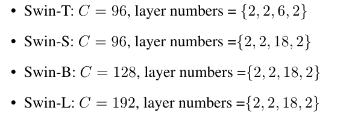

- 여기서 C는 첫 번째 단계에서 숨겨진 레이어의 채널 번호입니다. ImageNet 이미지 분류를 위한 모델 변형의 모델 크기, 이론적 계산 복잡도(FLOP) 및 처리량은 표 1에 나와 있습니다.

## 4. Experiments

- 우리는 ImageNet-1K 이미지 분류 [18], COCO 객체 검출 [39] 및 ADE20K 시맨틱 분할 [74]에 대한 실험을 수행합니다.
	-  다음에서는 먼저 제안된 Swin Transformer 아키텍처를 세 가지 작업에 대한 이전의 최신 기술과 비교합니다. 
	- 그런 다음 Swin Transformer의 중요한 설계 요소를 자세히 설명합니다.

### 4.1. Image Classification on ImageNet-1K

**Settings**
- 이미지 분류를 위해 1,000개 클래스의 1.28M 훈련 이미지와 50K 검증 이미지를 포함하는 ImageNet-1K [18]에서 제안된 Swin Transformer를 벤치마크합니다. 
	- single crop에 대한 상위 1개 정확도가 보고됩니다. 
	- 우리는 두 가지 훈련 설정을 고려합니다:
		- 정규 ImageNet-1K 훈련. 이 설정은 대부분 [57]을 따릅니다. 
			- cosine decay learning rate scheduler와 20개의 linear warm-up을 사용하여 300개의 epoch에 대해 AdamW [33] 최적화기를 사용합니다.
			-  배치 크기 1024, initial learning rate 0.001 및 weight decay 0.05가 사용됩니다. 
			- 성능을 향상시키지 않는 반복 증강 [28] 및 EMA [41]를 제외하고 [57]의 대부분의 증강 및 정규화 전략을 훈련에 포함합니다. 
			- 이는 반복 증강이 ViT 훈련을 안정화하는 데 중요한 [57]과는 상반됩니다.
		- ImageNet-22K에 대한 사전 훈련 및 ImageNet-1K에 대한 fine-tuning. 
			- 또한 1420만 개의 이미지와 22K 클래스를 포함하는 ImageNet-22K 데이터 세트에 대한 pre-train을 실시합니다. 
			- 우리는 5- epoch  linear warm-up을 가진 cosine decay learning rate scheduler를 사용하여 90개의 epcoh에 대해 AdamW 최적화기를 사용합니다.
			-  배치 크기 4096, 초기 learning rate 0.001, 가 weight decay 0.01이 사용됩니다. 
			- ImageNet-1K 미세 조정에서는 배치 크기 1024, constant learning rate 10^-5, weight decay 10^-8로 30개의 epcoh를 훈련합니다.

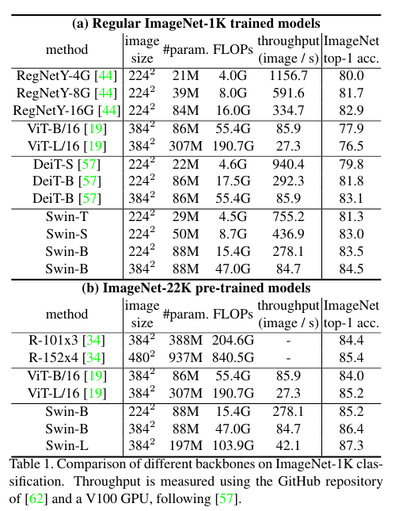

**Results with regular ImageNet-1K training**

- Table  1(a)는 regular ImageNet-1K 교육을 사용하여 트랜스포머 기반 및 ConvNet 기반을 포함한 다른 백본과 비교합니다.
- 이전의 최첨단 트랜스포머 기반 아키텍처(즉 DeiT[57])와 비교하면, Swin Transformer는 유사한 복잡성을 가진 DeiT 아키텍처를 눈에 띄게 능가합니다. 
	- 224^2 입력을 사용하는 DeiT-S(79.8%)보다 Swin-T(81.3%)가 +1.5%, 224^2/384^2 입력을 사용하는 DeiT-B(81.8%/83.1%)보다 Swin-B(83.3%/84.5%)가 +1.5%/1.4%입니다.
	- 최신 ConvNets(즉 RegNet[44])와 비교하여 Swin Transformer는 약간 더 나은 속도-정확도 trade-off를 달성합니다. 
	- RegNet[44]는 철저한 아키텍처 검색( obtained via a thorough architecture search)을 통해 얻었지만 Swin Transformer는 표준 Transformer에서 수동으로 조정되어 추가 개선 가능성이 있습니다. obtained via a thorough architecture search 에 대한 설명

**Results with ImageNet-22K pre-training**
- 또한 ImageNet-22K에서 대용량 Swin-B 및 Swin-L을 사전 훈련합니다.
	-  ImageNet-1K 이미지 분류에서 미세 조정된 결과는 표 1(b)에 나와 있습니다.
	-  Swin-B의 경우 ImageNet-22K 사전 훈련은 ImageNet-1K 훈련보다 처음부터 1.8%~1.9% 향상됩니다. 
	- 이전의 ImageNet-22K 사전 훈련의 최상의 결과와 비교하여 모델은 훨씬 더 나은 속도-정확도 트레이드오프를 달성합니다:
	- Swin-B는 86.4%의 상위 1개 정확도를 얻는데, 이는 유사한 추론 처리량(throughput)(84.7 대 85.9 이미지/초)과 약간 낮은 FLOP(47.0G 대)로 ViT(55.4G)보다 2.4% 더 높습니다.
	- 더 큰 Swin-L 모델은 Swin-B 모델보다 +0.9% 향상된 87.3%의 상위 1 정확도를 달성합니다.

 ### 4.2. Object Detection on COCO

**Settings**
- Object detection 및 instance segmentation 실험은 118K 훈련, 5K validation 검사 및 20K test-dev images를 포함하는 COCO 2017에서 수행됩니다. 
	- validation set를 사용하여 ablation study가 수행되고, 테스트 개발에서system-level comparison가 보고됩니다. 
	- ablation study의 경우, 우리는 네 가지 일반적인 object detection frameworks를 고려합니다: Cascade Mask R-CNN [26, 6], ATSS [71], RepPoints v2 [12], 및 Sparse RCNN [52] in mmdetection [10]. 
	- 이러한 네 가지 프레임워크에 대해 동일한 설정을 활용합니다.
	-  multi-scale training [8, 52] (단편은 480에서 800 사이이고 긴 편은 최대 1333이 되도록 입력 크기를 multi-scale training), AdamW [40] optimizer (initial learning rate 0.0001, weight decay 0.05, batch size 16), x schedule (36 epoch).
	-  system-level comparison를 위해, instaboost [20], stronger multi-scale training [7], 6x schedule (72 epoch), soft-NMS [5] 및 ImageNet-22K pre-trained model을 initialization.로 채택합니다.

- 우리는 Swin Transformer를 표준 ConvNets, 즉 ResNe(X)t 및 이전 Transformer 네트워크(예: DeiT)와 비교합니다. 
	- 비교는 다른 설정을 변경하지 않은 백본만 변경하여 수행합니다. 
	- Swin Transformer와 ResNe(X)t는 hierarichical feature map 때문에 위의 모든 frame work에 직접 적용할 수 있지만 DeiT는 특징 맵의 단일 해상도만 생성하고 직접 적용할 수 없습니다. 
	- 공정한 비교를 위해 [73]을 따라 deconvolution layers 계층을 사용하여 DeiT를 위한 hierarchical feature maps을 구성합니다.

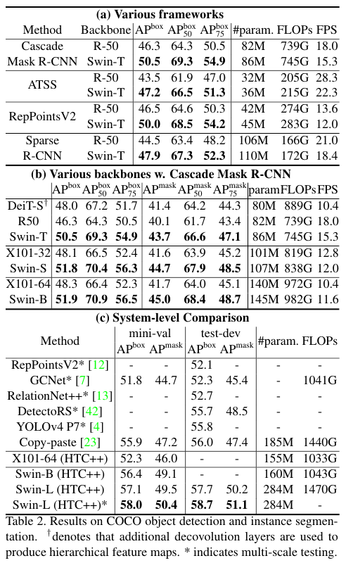

**Comparison to ResNe(X)t**
- 표 2(a)는 4개의 object detection frameworks에 대한 Swin-T 및 ResNet-50의 결과를 나열합니다. 
	- 우리의 Swin-T 아키텍처는 ResNet-50보다 일관된 +3.4~4.2 박스 AP 이득을 가져오며, 모델 크기, FLOP 및 latency이 약간 더 큽니다.

- 표 2(b)는 Cascade Mask RCNN을 사용하여 서로 다른 모델 용량 하에서 Swin Transformer와 ResNe(X)t를 비교합니다. 
	- Swin Transformer는 유사한 모델 크기, FLOP 및 latency을 가진 ResNext101-64004d에 비해 +3.6 박스 AP 및 +3.3 마스크 AP의 상당한 이점인 51.9 박스 AP 및 45.0 마스크 AP의 높은 검출 정확도를 달성합니다.
	- 개선된 HTC 프레임워크를 사용하는 52.3 박스 AP 및 46.0 마스크 AP의 더 높은 기준선에서 Swin Transformer의 이득도 +4.1 박스 AP 및 +3.1 마스크 AP로 높습니다(표 2(c) 참조). 
	- 추론 속도와 관련하여 ResNe(X)t는 고도로 최적화된 Cudnn 함수에 의해 구축되지만 아키텍처는 모두 잘 최적화되지 않은 내장 PyTorch 함수로 구현됩니다. 
	- 철저한 커널 최적화는 본 논문의 범위를 벗어납니다.

**Comparison to DeiT**

- Cascade Mask R-CNN 프레임워크를 사용한 DeiT-S의 성능은 표 2(b)에 나와 있습니다. 
	- Swin-T의 결과는 유사한 모델 크기(86M 대 80M)와 상당히 높은 추론 속도(15.3FPS 대 10.4FPS)를 가진 DeiT-S보다 +2.5박스 AP와 +2.3마스크 AP입니다. 
	- DeiT의 추론 속도가 더 낮은 것은 주로 입력 이미지 크기에 대한 2차 complexity 때문입니다.

**Comparison to previous state-of-the-art**
- 표 2(c)는 이전의 최첨단 모델의 결과와 최고의 결과를 비교합니다. 
	- COCO 테스트 개발에서 최고의 모델은 58.7 박스 AP와 51.1 마스크 AP를 달성하여 이전의 최고의 결과를 +2.7 박스 AP(외부 데이터 없이 복사 붙여넣기 [23])와 +2.6 마스크 AP(DetectoRS [42])만큼 능가합니다.

### 4.3. Semantic Segmentation on ADE20K
**Settings**
- ADE20K[74]는 널리 사용되는 의미론적 분할 데이터 세트로, 150개의 다양한 의미론적 범주를 포함합니다. 
	- 총 25,000개의 이미지를 가지고 있으며, 훈련용은 20,000개, 검증용은 2,000개, 테스트용은 또 다른 3,000개입니다. 
	- 우리는 높은 효율성을 위해 mmseg[16]의 UperNet[63]을 기본 프레임워크로 사용합니다. 자세한 내용은 부록에 나와 있습니다

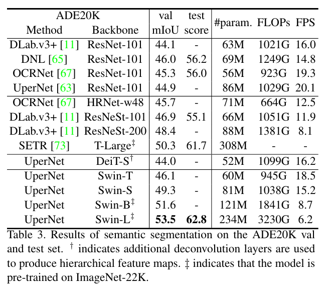

**Results**

- 표 3에는 서로 다른 method/backbone 쌍에 대한 mIoU, 모델 크기(#param), FLOP 및 FPS가 나열되어 있습니다. 
	- 이러한 결과를 통해 유사한 계산 비용을 가진 DeiT-S보다 Swin-S가 +5.3 mIoU 더 높음(49.3 대 44.0)을 알 수 있습니다.
	- 또한 ResNet-101보다 +4.4mIoU 더 높고 ResNeSt-101[70]보다 +2.4mIoU 더 높습니다. 
	- ImageNet-22K 사전 훈련이 포함된 당사의 Swin-L 모델은 밸브 세트에서 53.5mIoU를 달성하여 이전 최고의 모델을 +3.2mIoU(SETR [73]에 의해 50.3mIoU) 능가합니다.

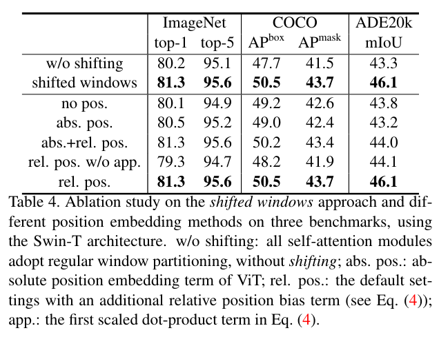

###  4.4. Ablation Study

- 이 섹션에서는 제안된 Swin Transformer에서 ImageNet-1K 이미지 분류, COCO 객체 검출의 Cascade Mask R-CNN 및 ADE20K 시맨틱 분할의 UperNet을 사용하여 중요한 설계 요소를 설명합니다.

**Shifted windows**

- 세 가지 작업에 대한 시프트된 윈도우 접근 방식의 완화는 표 4에 보고되어 있습니다.
	-  Shifted windows 분할이 있는 Swin-T는 각 단계에서 단일 윈도우 분할에 구축된 상대보다 ImageNet-1K에서 +1.1% 상위 1% 정확도, COCO에서 +2.8 박스 AP/+2.2 마스크 AP, ADE20K에서 +2.8 mIoU의 성능을 능가합니다. 
	- 결과는 Shifted windows를 사용하여 이전 계층의 윈도우 간에 연결을 구축하는 효과를 나타냅니다.
	- 표 5와 같이 Shifted windows에 의한 지연 시간 오버헤드도 작습니다.

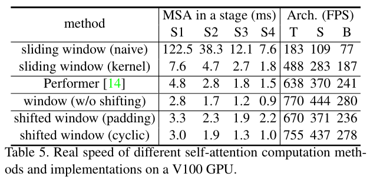

**Relative position bias**
- 표 4는 서로 다른 위치 임베딩 접근 방식의 비교를 보여줍니다. 
	- 상대적 위치 편향이 있는 Swin-T는 ImageNet-1K에서 +1.2%/+0.8% top-1 정확도를, COCO에서는 +1.3/+1.5 박스 AP와 +1.1/+1.3 마스크 AP, ADE20K에서는 +2.3/+2.9 mIoU가 각각 위치 인코딩이 없는 것과 절대 위치 임베딩이 있는 것과 관련하여 산출되며, 이는 상대적 위치 편향의 효과를 나타냅니다. 
	- 또한 절대 위치 임베딩을 포함하면 이미지 분류 정확도(+0.4%)가 향상되지만, 객체 감지 및 의미론적 분할(-COCO에서는 0.2 박스/마스크 AP, ADE20K에서는 -0.6 mIoU)을 해칩니다.

**Different self-attention methods**
- 다양한 self-attention computation 방법과 구현의 실제 속도는 표 5와 비교됩니다. 
	- 우리의 순환 구현은 특히 더 깊은 단계에서 순진한 패딩보다 하드웨어 효율성이 높습니다. 
	- 전체적으로, 그것은 Swin-T, Swin-S 및 Swin-B에 각각 13%, 18% 및 18%의 속도 향상을 가져다줍니다.

- 제안된 시프트 윈도우 접근법에 구축된 셀프 어텐션 모듈은 네 개의 네트워크 스테이지에서 naive/kernel 구현에서 슬라이딩 윈도우보다 각각 40.8×/2.5×, 20.2×/2.5×, 9.3×/2.1×, 7.6×/1.8배 더 효율적입니다. 
	- 전체적으로 시프트 윈도우에 구축된 Swin Transformer 아키텍처는 Swin-T, Swin-S 및 Swin-B용 슬라이딩 윈도우에 구축된 변형보다 각각 4.1/1.5, 4.0/1.5, 3.6/1.5배 더 빠릅니다.
	-  표 6은 세 가지 작업에 대한 정확도를 비교하여 시각적 모델링에서도 유사하게 정확하다는 것을 보여줍니다.

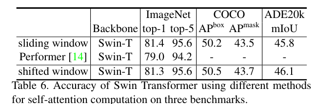

 ## 5. Conclusion

- 본 논문에서는 계층적 특징 표현을 생성하고 입력 영상 크기에 대해 선형 계산 복잡성을 갖는 새로운 비전 트랜스포머인 Swin Transformer를 제시합니다. 
	- Swin Transformer는 COCO 객체 검출 및 ADE20K 시맨틱 분할에 대한 최첨단 성능을 달성하여 이전의 최고 방법을 크게 능가합니다.
	-  다양한 비전 문제에 대한 Swin Transformer의 강력한 성능이 시각과 언어 신호의 통합 모델링을 장려하기를 바랍니다.
