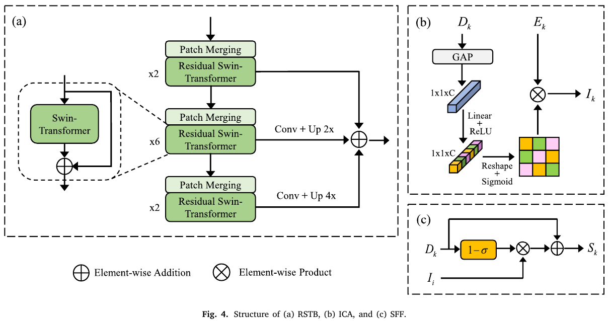
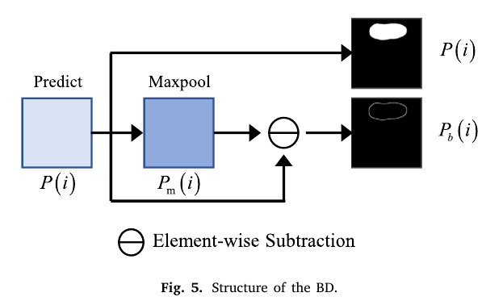

# CSwin-PNet: A CNN-Swin Transformer combined pyramid network for breast lesion segmentation in ultrasound images

## 저널 : Expert Systems with Applications, 2022년 기준 Q1, 15%

https://www.sciencedirect.com/science/article/pii/S0957417422020425

## 저자 : 

## Abstract:
- 현재 유방 초음파(BUS) 영상을 기반으로 유방 종양을 자동 분할하는 것은 여전히 어려운 작업입니다. 
  - 대부분의 병변 분할 방법은 컨볼루션 신경망(CNN)을 기반으로 구현되어 장거리 의존성을 설정하고 전역 컨텍스트 정보를 얻는 데 한계가 있습니다. 
  - 최근 변압기 기반 모델은 강력한 자기 주의 메커니즘으로 인해 장거리 상황 정보를 구축하기 위해 컴퓨터 비전 작업에 널리 사용되고 있으며 그 효과는 기존 CNN보다 우수합니다. 
- **본 논문에서는 CNN과 Swin Transformer를 특징 추출 백본으로 연결하여 특징 인코딩 및 디코딩을 위한 피라미드 구조 네트워크를 구축**합니다. 
  - **첫째, 채널별 주의를 사용하여 중요한 특징 영역을 강조하기 위해 대화형 채널 주의(ICA) 모듈을 설계**합니다. 
  - **둘째, 게이팅 메커니즘을 기반으로 하는 보조 특징 융합(SFF) 모듈을 개발**합니다. 
    - **SFF 모듈은 특징 융합 중에 특징을 보완하고 유방 병변 분할의 성능을 향상**시킬 수 있습니다. 
  - 마지막으로, 분할 결과에서 경계 품질을 향상시키기 위해 유방 병변의 경계 정보에 추가적인 주의를 기울이기 위해 경계 검출(BD) 모듈을 채택합니다. 
- 실험 결과에 따르면 네트워크가 유방 초음파 병변 분할에 대한 최첨단 영상 분할 방법을 능가합니다.

## 1. Introduction

- 유방암은 전 세계 여성의 삶과 건강에 영향을 미치는 끔찍한 질병이며, 여성들 사이에서 가장 흔한 사망 원인 중 하나입니다. 
  - 미국 암 학회(2021)가 보고한 통계에 따르면, 2021년에 추정적으로 43,600명의 유방암 사망자가 발생했습니다(Siegel et al., 2021). 유방암의 조기 진단은 생존율 향상을 위해 중요합니다(Bleicher et al., 2015). 
  - 초음파 영상은 성숙한 기술로서, 유방 종양의 임상 진단에 널리 사용되는 비침습적, 비방사성 및 저비용 영상 촬영 방법입니다(Xian et al., 2018). 
  - 그러나 초음파 영상의 낮은 대조도, 높은 잡음 및 조직 간의 높은 유사도는 초음파 전문가조차도 완전한 병변 조직을 식별하기 어렵게 만듭니다. 
  - 전문가마다 관찰한 내용에 차이가 있습니다. 
  - 컴퓨터이용진단(CAD) 시스템은 방사선사의 해석 및 진단을 도울 수 있습니다(Bai et al., 2021, Jalalian et al., 2017, Samulski et al., 2010, Yanase and Triantapylou, 2019). 
  - 이 경우, 유방초음파(BUS) 영상을 기반으로 하는 CAD 시스템은 의사가 병변을 검출하는 것을 돕고, 진단 정확도를 향상시키며 어느 정도 주관성을 낮출 수 있습니다. 
  - CAD 시스템은 기계 학습 및 컴퓨터 비전 기술을 사용하여 초음파 영상에서 형태학적 및 질감 특징을 추출하여 병변 분할을 위한 배경과 병변 영역을 분리합니다(Yassin et al., 2018, Zhu et al., 2021). 
  - CAD 시스템은 병변 분할을 달성하는 데 효율적이고 정확한 것으로 입증되었습니다(Horsch et al., 2001, Moon et al., 2020).

- 최근 몇 년 동안 컨볼루션 신경망(CNN)은 검출, 분류 및 의미론적 분할을 포함한 의료 영상 분야에서 널리 사용되어 탁월한 성능을 달성했습니다(Rai et al., 2019, Thiyagaragajan and Murukesh, 2020). 
  - 가장 대표적인 네트워크는 완전 컨볼루션 네트워크(FCN)(Shelhamer et al., 2017)와 U-Net(Ronneberger et al., 2015)입니다. 
    - Yap et al. (2019)은 FCN을 기반으로 BUS 이미지의 유방 병변에 대한 분할 모델을 개발했습니다. 
    - Hu, Guo et al. (2019)은 융합된 확장 컨볼루션을 사용하여 FCN을 기반으로 유방 종양 분할을 위한 완전 컨볼루션 네트워크를 개발했습니다. 
    - Ghosh et al. (2020)은 BUS 이미지의 자동 분할을 위해 전역적 특징을 통합하여 개선된 U-Net 모델을 제안했습니다. 
  - 그러나 초음파 이미지는 낮은 대조도, 높은 노이즈, 흐릿한 에지 및 유방 병변의 가변적인 모양과 위치가 특징이며, 간단한 CNN은 성능이 좋지 않을 수 있습니다. 
    - CNN의 성능을 개선하는 효과적인 수단으로 주의 메커니즘(Mnih et al., 2014)은 국소 특징의 민감한 제어를 통해 특징 추출을 개선하며, 그 중 가장 대표적인 것은 주의 U-Net(Oktay et al., 2018)입니다. 
    - Tong et al. (2021)은 혼합 주의 손실 기능을 기반으로 개선된 U-Net 모델을 제안했고 주의 U-Net. 
    - Zhang et al. (2019)은 잔여 단위를 활용하여 에지 정보를 강화하고 분할 성능을 개선하는 잔여 주의 게이트 네트워크(RDAU-Net)를 제안했습니다. 
  - 현저성 맵은 이미지에서 시각적으로 두드러지는 영역이나 객체를 강조하는 데 사용될 수 있습니다. 
    - 이러한 맵은 관심 영역에 대한 네트워크의 주의를 강화하고 네트워크의 분할 성능을 개선하는 데 도움이 될 수 있습니다(Ramadan et al., 2020, Vakanski et al., 2020). 
    - 예를 들어, Ning et al. (2022)은 현저한 배경 및 SMU-Net 이미지를 활용하는 현저성 유도 모폴로지 인식 U-Net(SMU-Net) 모델을 제안했습니다. 
  - 또한 네트워크에 사전 지식을 추가하면 기능 분할에도 도움이 됩니다(Xi et al., 2017).

- 초음파 영상은 낮은 대비를 가지고 있으며, 많은 픽셀이 질병 조직 픽셀과 유사한 외관을 가진 질병 조직을 포함하지 않습니다. 
  - 이러한 비국소적 특징은 네트워크가 특징을 구별하는 능력을 향상시키기 위해 전역 배경 정보를 캡처하여 학습할 수 있습니다. 
  - 이전의 연구는 수용 분야를 확장하기 위해 확장 컨볼루션을 사용할 것을 제안했습니다(Chen et al., 2018, Li et al., 2021). 
  - 그러나 전역적 관점에서 맥락 정보를 캡처하지 못하고 장거리 의존성 정보를 캡처하는 것이 특징을 구별하는 데 도움이 됩니다. 
    - Xue et al. (2021)은 유방 종양 분할을 위한 전역 안내 네트워크 (GG-Net)를 제안했습니다. 
    - 그들은 공간과 채널에서 장거리 비국소적 의존성을 학습하기 위한 안내 정보로 다층 CNN 정보를 사용하여 네트워크 학습 능력을 향상시켰습니다. 
  - 최근에는 원래 자연어 처리(NLP) 작업에 적용되는 변압기 아키텍처 (Vaswani et al., 2017)가 컴퓨터 비전 분야에서 많은 관심을 받고 있습니다. 
    - 전역 관계 구성에 사용되는 변압기 아키텍처의 다중 머리 자가 주의 (MSA) 메커니즘은 픽셀 기반 CV 작업에 적용할 수 있습니다. 
      - Carion et al. (2020)은 변압기 모델을 기반으로 한 최초의 종단 간 물체 감지 모델을 수립했습니다. 
      - Dosovitski et al. (2020)은 CNN을 대체하기 위해 변압기를 사용했고, 비전 변압기(ViT)라는 변압기 기반 이미지 인식 모델을 수립했으며, 컨볼루션 기술을 사용하는 다른 최첨단 방법과 비교할 수 있는 성능을 달성했습니다. 
      - Wang et al. (2021)은 피라미드 ViT(Pyramid ViT) 모델을 구축하여 멀티스케일 특징 맵을 추출했습니다. 
      - PVT 모델은 계산 복잡도를 어느 정도 감소시키지만, 복잡도는 여전히 이미지 크기와 2차적입니다. Liu, Lin et al. (2021)은 이동 윈도우 전략을 사용한 Swin Transformer를 제안했는데, 이는 계산 복잡도를 크게 줄이고 고급 성능으로 교차 윈도우 정보 교환을 가능하게 합니다. 
      - 트랜스포머 아키텍처는 다운스트림 컴퓨터 비전 작업(분류, 검출 및 분할)(Liu, Zhang et al., 2021)에서 광범위하게 사용될 수 있는 큰 잠재력을 보여주었습니다. 
    - 컴퓨터 비전 작업에서 트랜스포머의 성공적인 적용으로 인해 일부 연구에서는 의료 영상 처리에서 트랜스포머의 가능성을 탐구했습니다(Chen, Liu et al., 2021, Hatamizadeh et al., 2022, Valanarasu et al., 2021). Cao et al. (2021)은 U-Net의 컨볼루션 인코딩 및 디코딩 작업을 Swin Transformer 모듈로 대체하고 Swin-UNet을 구축했습니다. 
      - Lin et al. (2022)은 병렬 이중 Swin Transformer 모듈을 사용하여 Swin-UNet과 유사한 아키텍처를 구축하고 트랜스포머 기반 기능 상호 작용 융합 모듈을 제안했습니다. 
      - Wang et al. (2022)은 U-Net 모델을 얻기 위해 트랜스포머를 사용하여 U-Net의 스킵 연결을 교체했습니다. 
      - Zhang et al. (2021)은 ViT 기반 TransFuse 네트워크를 제안하고 기능 추출을 달성하기 위해 트랜스포머와 CNN을 융합하려고 했습니다. 
      - Chen, Lu et al. (2021)은 CNN을 사용하여 기능을 추출한 후 장거리 의존성 모델링을 위한 트랜스포머로 공급하는 TransUNet을 제안했습니다. 
- 이 논문은 **TransUNet에서 영감을 받아 글로벌 모델링에서 CNN의 부족을 완화하기 위해 BUS 이미지의 유방 병변 분할을 위한 새로운 분할 네트워크를 제안**합니다. 
  - Swin Transformer 모듈은 글로벌 기능 추출에서 CNN을 보조하기 위해 사용되며 기능 피라미드 네트워크(FPN) 구조 (Lin et al., 2017)는 멀티스케일 기능 융합을 달성하기 위해 구성됩니다. 
  
- 요약하면, 우리의 주요 기여는 다음과 같습니다:

 1. **CNN에서 추출한 기능을 전역적으로 모델링하기 위해 Swin Transformer를 기반으로 잔여 Swin Transformer 블록(RSTB)을 구축합**니다.

 2. **채널 주의 메커니즘을 기반으로 대화형 채널 주의(ICA) 모듈을 설계**합니다. 
   - **감독된 인코더 기능을 활용하여 인코더의 각 계층의 기능을 출력하여 종양 관련 영역에 초점을 맞추고 이러한 기능 채널에 큰 가중치**를 할당합니다.

 3. 게**이팅 메커니즘을 기반으로 하는 SFF(Supplementary Feature Fusion) 모듈을 제안하며, 부호화 과정은 부호화기로부터 특징을 선택적으로 수신하여 부호화기의 특징 정보를 보완**하는 것입니다.

 4. 우리는 디코더의 중간 계층에 경계 감지(BD) 모듈을 추가하여 유방 병변의 경계 맵을 식별하고 고품질 경계를 가진 병변 특징을 얻습니다.

## 2. Methodology

- **본 논문에서 제안한 새로운 유방 병변 분할 네트워크는 그림 1에** 나타나 있습니다. 
  - 전체적으로 네트워크는 BUS 영상을 입력으로 받아 종단 간 방식으로 선내 병변의 분할 결과를 생성합니다. 
  - CNN의 얕은 층은 전역 정보를 캡처하는 변압기에 도움이 되지 않는 텍스처와 구조 정보에 더 많은 주의를 기울이고 추가 계산을 도입합니다(Gao et al., 2021). 
  - 따라서 네트워크는 CNN을 사용하여 얕은 구조 정보를 처리하고 변압기를 사용하여 피라미드 네트워크를 구축합니다.
  -  인코더 단계에서는 GEUL 활성화 함수(그림 2(a))를 사용하여 얕은 구조 정보를 처리하여 공간 해상도가 다른 특징을 얻습니다.

- **stride 2를 갖는 컨볼루션 연산은 다운샘플링 과정에서 영상 특징의 손실을 방지하기 위해 maxpool 연산을 대체**하는 데 사용됩니다. 
  - 각 특징 추출 단계 이후의 출력 영상 크기는 입력 영상 크기의 1, 1/2 및 1/4이 됩니다. 
  - i = {1,2,3}에서 세 잔차 모듈의 출력 특징은 , E_i로 표시됩니다. 
  - 그런 다음 마지막 잔차 블록이 출력한 특징 맵을 심층 특징 추출을 위해 1×1 컨볼루션을 통해 RSTB로 연결합니다. 
  - 심층 특징에서 상황 정보를 더 잘 추출하기 위해 본 논문에서는 표준 트랜스포머 대신 Swin 트랜스포머를 사용하며, 2.1절에 자세히 설명합니다.
  -  디코더 단계에서는 ReLU 활성화 기능을 갖는 잔차 모듈(그림 2(b))을 특징 디코딩에 사용합니다. 
     -  디코더의 각 계층의 출력 특징 맵은 다음과 같이 표시됩니다 i = {1,2,3,4}의 D_i. 
  - 인코딩 단계에서 서로 다른 레이어의 특징 정보를 활용하기 위해 ICA 및 SFF를 도입합니다. 
    - 컨볼루션 레이어는 ICA의 채널 주의를 통해 병변 영역에 주의를 기울이도록 향상됩니다. 
    - SFF를 사용하여 디코딩 하위 네트워크의 특징 보완을 실현합니다. 
    - 이어서 디코딩 중간 레이어에 BD를 도입하여 유방 병변 윤곽을 캡처하고 고품질 경계 정보로 분할 특징을 획득합니다.

`이것은 그냥 maxpooling대신에 stride 2 CNN을 이용햐여 downsampling 한거`

### 2.1. Residual Swin Transformer block

- 표준 트랜스포머 블록은 MSA를 사용하여 각 마커 사이의 관계를 계산합니다.
  -  MSA의 계산 복잡도는 마커 수의 4제곱과 같으므로 고해상도 예측 및 고해상도 영상 작업에 적합하지 않습니다. 
  -  ViT와 달리 Swin Transformer는 계층적 트랜스포머로 효율적인 자기 주의 집중 전략을 사용합니다. 
  -  일반적인 MSA 접근법은 그림 3(b)와 같이 일반 윈도우 기반 MSA(W-MSA) 접근법과 시프트 윈도우 MSA(SW-MSA) 접근법으로 대체됩니다. 
  -  W-MSA 전략은 각 윈도우 내부에 일부 패치를 배치하며, 각 윈도우는 다른 윈도우와 독립적이고 M x M개의 패치를 포함합니다(기본값 M = 7). 
  -  SW-MSA 접근법은 윈도우 사이의 정보 상호작용을 처리하고 크로스-캐리어 연결을 허용합니다. 이들은 다음과 같이 표시됩니다:

- **정보 간 상호 작용은 W-MSA와 SW-MSA의 대체 실행에 의해 향상**됩니다. 
  - 그러나 이 접근 방식은 로컬 창으로 주의를 제한하여 트랜스포머의 글로벌 모델링 기능을 어느 정도 약화시킵니다. 
  - 따라서 정보 교환을 더욱 향상시키기 위해 RSTB(그림 4(a) 참조)를 설계합니다. 
  - 우리는 ImageNet에서 "아주 작은" 구성을 사전 훈련한 Swin Transformer를 사용합니다. 
  - ImageNet을 기반으로 한 사전 훈련된 트랜스포머 모델은 의료 영상의 특징 추출에도 잘 적용될 수 있으며 의료 영상을 기반으로 한 사전 훈련된 모델보다 더 나은 성능을 발휘할 수 있음을 보여주었습니다(Brandt et al., 2021, Matsoukas et al., 2022). 
- 또한, 우리는 서로 다른 계층 간의 보완성을 달성하기 위해 각 Swin Transformer 계층에서 출력되는 특징 정보를 사용합니다. 프로세스는 다음과 같습니다. 
  - (1) 마지막 계층과 중간 계층의 출력 특징은 1×1 컨볼루션 연산으로 공급되고 샘플링되지 않아 최상위 계층의 출력 특징과 공간적으로 일치합니다. 
  - (2) 각 RSTB 계층의 출력 특징 맵은 융합을 위한 합산 처리 방법에 사용됩니다. 융합 결과는 RSTB의 출력으로 사용됩니다.

### 2.2. Interactive channel attention module

- **서로 다른 채널의 특징은 서로 다른 의미 정보를 갖지만 모든 의미 객체가 검출될 필요는 없습**니다. 
  - 우리는 특징 채널에서 검출될 객체를 효과적으로 강조하고 특징 채널에서 관련 없는 정보를 억제하여 중요하지 않은 객체의 간섭을 완화해야 합니다. 
  - 관심 있는 채널 특징에 초점을 맞추기 위해 ICA 모듈을 설계합니다(그림 4(b) 참조). 
  - 감독의 채널 특징은 검출될 객체를 더 잘 강조할 수 있습니다. 
  - 컨볼루션 계층의 출력 특징 채널에서 병변 영역에 초점을 맞추기 위해 채널 특징에 큰 가중치를 할당합니다. 
  - ECA-Net(Wang et al., 2020)에 따르면 SENet(Hu, Shen et al., 2019)에서 GAP 이후 두 FC 계층의 차원 붕괴가 채널 주의 가중치 학습에 영향을 주는 것으로 나타났습니다. 
  - 두 FC 계층 대신 단일 선형 계층을 사용합니다. 프로세스는 다음과 같이 자세히 설명할 수 있습니다:

`여기서 필터링 작용을 해준다. 중요한 부분에는 높은 weight를 안 중요한 부분은 낮은 weight를 한다.`

### 2.3. Supplementary feature fusion module

- **SFF 모듈 설계의 핵심은 유용한 기능을 도입하여 현재 작업의 누락된 내용을 보완**하는 것입니다. (그림 4(c) 참조).
  -  **이전 연구에서 초음파 영상에서 낮은 대조도, 잡음 및 경계 흐림의 특성으로 인해 전경과 배경이 복잡하게 혼합된다는 것을 발견**했습니다. 
  -  안타깝게도 전경에 있는 일부 영역은 응답이 상대적으로 약합니다. 
  -  응답이 과소 추정된 영역이 필터링될 수도 있습니다. 
  -  **우리는 다른 작업의 정보로 약한 응답 영역을 보완하고 네트워크가 과소 추정된 영역을 탐지하도록 안내하기 위해 응답이 약한 기능에 더 높은 주의를 기울**입니다. 
  -  이 프로세스는 분할 작업 실행에 유익합니다. 
  -  그렇지 않으면 잘못된 인식 결과가 필연적으로 생성될 것입니다. 
  -  구체적으로 먼저 S자형 함수를 사용하여 가중치 행렬 W_1을 얻습니다. 
  -  그런 다음 모든 요소가 1인 가중치 행렬 E에서 가중치 행렬 W_1을 차감하여 역주력 가중치 행렬 W_2를 얻습니다. 
  -  그 후 **ICA 출력에 W_2를 곱하여 역주력 특징**을 얻습니다. 
  -  우리는 결국 D_k에 역주력 특징을 추가하여 병변 영역을 재평가합니다.

- 여기서 A는 시그모이드 활성화 함수를 의미하며, 1-A는 역마스크 생성을 위해 사용되며, SFF 모듈은 추가 파라미터 없이 게이팅 메커니즘을 기반으로 구현되며, 정확한 위치에 주의를 집중함으로써 유용한 정보를 보완할 수 있으며, 불필요한 정보를 억제할 수 있습니다. 
  - 모듈은 특징의 집합을 통해 풍부한 표현을 얻을 수 있습니다.

### 2.4. Boundary detection module

- **SFF 이후 특징의 관심 영역은 이전보다 더 커집**니다. 
  - **특징 구조의 무결성을 보장하고 관련 없는 특징 영역을 억제하며 유방 병변의 퍼지 경계 특징 추출을 강화하기 위해 그림 5와 같은 BD 모듈을 사용**합니다. 
  - 유방 병변의 형태와 구조 특징을 예측하는 동안 추가적인 경계 예측을 통해 분할 결과가 향상됩니다. 
  - 구체적으로, 먼저 출력 채널이 1인 1×1 컨볼루션 레이어를 사용하여 유방 병변 분할 맵 P(i)를 얻습니다. 
  - 그런 다음 최대 풀 연산(Feng et al., 2019)을 사용하여 픽셀 범위를 확장하여 특징 맵 P_m(i)을 얻고 P_m(i)에서 P(i)를 빼서 유방 병변의 경계 맵 B를 얻습니다. 
  - 경계 마스크는 동일한 연산에 의해 유방 병변 마스크에서 획득됩니다.

`보면 새악보다 visiualiztion 적인 측며에서 접근한 방법인것 같다. 위에서 attention wieght을 추가하여 불필요한 곳은 없앨려고 했고 여기서는 boundart detection module을 이용하여 mask를 획득 하는 것 같다`

### 2.5. Hybrid loss function

## 3. Experiments

### 3.1. Datasets

- 모델의 성능을 평가하기 위해 두 개의 서로 다른 데이터 세트를 사용했습니다. 
  - Parc Tauli Corporation의 UDIAT 진단 센터에서 제공하는 데이터 세트 1에는 Siemens ACUSON Sequoia C512 시스템 17L5 HD 선형 배열 변환기(8.5MHZ)로 얻은 163개의 초음파 영상(양성 110개, 악성 53개)이 포함되어 있습니다. 
  - 카이로 바헤야 병원 제공 데이터 세트 2에는 LOGIQ E9 초음파 시스템과 LOGIQ E9 Agile 초음파 시스템으로 얻은 780개의 초음파 영상(양성 437개, 악성 210개, 정상 133개)이 포함되어 있습니다. 
  - 유방 병변 분할의 주요 목적은 병변을 평가하고 병변의 분포를 식별하는 것이기 때문에 데이터 세트 2에서 마스크가 없는 정상 사례는 제거되었습니다.

### 3.2. Evaluation metrics

- Dice 계수, Jaccard Index (IoU), 정밀도, 리콜 및 F1-score 등 5가지 일반적인 메트릭이 분할 모델의 성능을 평가하는 데 사용됩니다. 
  - 이러한 메트릭을 계산하기 위해 참 긍정(TP), 거짓 긍정(FP), 참 부정(TN) 및 거짓 부정(FN) 비율을 사용합니다:

- 또한 하우스도르프 거리(HD) 95%와 평균 표면 거리(ASD)를 사용하여 분할 모델의 성능을 평가합니다.

### 3.3. Implementation details

- 모든 실험은 5배 교차 유효성 검사를 기반으로 동일한 데이터 파티션에서 수행됩니다. 
  - 4배 fold (이미지의 80%)은 훈련에 사용되고, 1배 접힘(이미지의 20%)은 테스트에 사용됩니다. 훈련 중에는 훈련 데이터의 20%가 유효성 검사에 사용됩니다. 
  - 모든 이미지는 224 × 224의 고정 크기로 크기가 조정됩니다. 
  - 네트워크를 훈련하기 위해 Adam optimizer를 사용합니다. Adam optimizer를 사용하여 서로 다른 학습률, 배치 크기 및 에포크를 탐색했습니다. 
  - 최상의 결과는 학습률, 배치 크기 및 최대 에포크 수를 각각 0.0001, 4, 200으로 설정하여 얻을 수 있습니다.
  -  랜덤 회전 및 수평 플립 연산을 사용하여 훈련 세트에서 데이터 향상을 수행합니다. 
  -  모든 실험은 PyTorch v1.10 라이브러리와 단일 NVIDIA GeForce RTX 3080 10GB GPU에서 구현됩니다.

### 3.4. Ablation study

- **이 섹션에서는 네트워크에서 ICA, SFF 및 BD 모듈의 효과를 검증하는 것을 목표**로 합니다. 
  - 데이터 세트 1과 데이터 세트 2에 대해 절제 실험을 수행했습니다. 
  - 기준은 네트워크에서 ICA, SFF 및 BD 모듈을 제거하여 구성됩니다. 
  - 표 1은 서로 다른 구성 요소를 포함하는 모델과 우리의 접근 방식을 비교한 결과를 보여줍니다. 
  - **우리의 기본 네트워크(기준선)는 분할 성능**이 좋습니다. 
  - 기준의 IoU 및 Dice 점수는 데이터 세트 1에서 각각 75.67%와 84.24%, 데이터 세트 2에서 72.64%와 81.15%입니다.

- 먼저 ICA 모듈의 효과를 조사합니다. 
  - 기본 네트워크에 ICA 모듈을 추가하고 이 모델을 기준선이라고 합니다
  - ICA. 기준과 비교하여 데이터 세트 1에서 IoU 및 Dice 측면에서 각각 1.47% 및 1.52%, 데이터 세트 2에서 0.95% 및 0.98% 개선되었습니다. 
  - **ICA 모듈은 RSTB에서 출력된 기능을 사용하여 인코딩 계층의 CNN의 채널 기능이 디코딩 계층으로 전달되도록 안내**합니다. 
  - **이를 통해 피쳐 채널에서 감지해야 하는 객체를 강조하고 피쳐 채널의 관련 없는 정보를 억제하며 다른 작업에 효과적인 정보를 전달**할 수 있습니다.

- 둘째, 우리는 SFF 모듈의 성능을 평가합니다. 
  - 우리는 SFF 모듈을 기본 네트워크에 추가하고 이 모델을 기준선이라고 부릅니다 SFF.
  -  그 결과 IoU와 Dice 점수는 데이터 세트 1에서 각각 1.39%와 1.34%, 데이터 세트 2에서 각각 1.38%와 1.31% 향상된 것으로 나타났습니다.
  -  SFF 모듈은 인코더의 각 계층의 출력 특징과 디코더의 각 계층의 출력 특징을 도입하여 특징 보완을 구현합니다. 
  -  전경과 배경의 혼합이 복잡하기 때문에 단순 인코딩 출력에서 효과적인 정보를 정확하게 추출하기가 어렵습니다. 
  -  SFF 모듈을 통해 취약한 특징에 높은 주의를 기울이면 네트워크가 특징을 재평가하도록 안내하여 더 나은 분할 성능을 달성하는 데 도움이 됩니다.

- 마지막으로, 제안된 모델(베이스라인 + ICA + SEF + BD)은 ICA 및 SFF 모듈을 기본 네트워크에 융합하고 디코딩 계층에서 BD 감독을 추가하여 구성됩니다. 
  - 기준 모델과 비교하여 데이터 세트 1의 IoU 및 Dice 점수는 각각 2.94% 및 3.01%, 데이터 세트 2는 각각 2.47% 및 2.53% 향상되었습니다. 
  - ICA, SFF 및 BD 모듈을 융합하면 서로 다른 스케일에서 기능 간의 보다 효율적인 상호 작용이 가능하여 다중 스케일 분기를 위한 기능 표현을 보다 효율적으로 융합하고 더 나은 분할 성능을 달성하는 데 도움이 됩니다.

- 우리는 또한 RSTB 모듈에서의 특징 융합 방법을 비교합니다. 
  - 잔류 구조는 표 2와 같이 Swin Transformer의 글로벌 모델링 능력을 보상하고 분할 능력을 향상시킵니다. 
  - 표 3은 RSTB 특징 집성 방법을 비교한 것입니다. 
  - 특징 결합 방법에 비해 특징 합산 방법이 더 우수하고 효율적입니다.

### 3.5. Comparison with state-of-the-art methods

- 제안된 방법의 효과를 검증하기 위해 딥러닝 영상 분할 방법과 최첨단 변압기 기반 바이오메디컬 영상 분할 방법으로 비교 실험을 수행했습니다. 
  - 경쟁 방법에는 U-Net(론버거 외, 2015), Attention U-Net(AU-Net 외, 2018), U-Net++(저우 외, 2018), FPN(린 외, 2017), ViT(도소비츠키 외, 2020), 트랜스유넷(첸, 루 외, 2021), Swin-UNet(카오 외, 2021)이 포함됩니다. 
  - 모든 방법은 정량적 및 정성적으로 평가되었습니다. 
  - 표 4, 표 5는 데이터 세트 1과 데이터 세트 2의 모든 방법의 정량적 평가 결과를 각각 보여줍니다. 
  - 다른 분할 방법과 비교하여 우리 방법은 더 큰 IoU, Dice, 정밀도, 리콜 및 F1 점수 값과 더 작은 HD 및 ASD 값을 가지고 있습니다. 
  - 표 4에서 우리 방법의 평균 IoU 및 Dice 점수는 각각 78.61% 및 87.25%로 두 번째로 우수한 Swin-UNet 모델보다 3.98% 및 4.04% 높습니다. 
  - 제안된 방법의 HD 및 ASD 값은 9.42 및 2.94로 Swin-UNet보다 4.26 및 1.17 작다. 마찬가지로 표 5에서도 방법의 평균 IoU 및 Dice 점수는 각각 75.11% 및 83.68%로 두 번째로 우수한 Swin-UNet 모델보다 1.94% 및 2.23% 높습니다. 
  - HD 및 ASD 값은 16.97 및 5.6으로 Swin-UNet보다 1.9 및 0.91 작습니다. 
  - 이는 우리의 분할 네트워크가 모든 경쟁업체보다 초음파 영상에서 유방 병변을 더 정확하게 분할할 수 있으며 에지 정보를 더 정확하게 식별할 수 있음을 보여줍니다. 
  - 또한 1의 이러한 분할 성능 메트릭은 분할 성능 데이터 세트보다 더 우수합니다.

- 또한 서로 다른 방법의 분할 결과를 정성적으로 비교합니다. 
  - 그림 6, 그림 7은 데이터 세트 1과 데이터 세트 2에서 서로 다른 방법의 분할 결과를 시각적으로 비교한 것입니다. 
  - 변압기 기반 방법은 기존 CNN 방법보다 성능이 우수합니다. 
  - ViT와 TransUNet의 비교에서 TransUNet의 효과는 ViT보다 우수합니다. 
  - 변압기가 전역 정보에 더 많은 주의를 기울이지만 너무 일찍 변압기를 사용하는 것은 얕은 특징 추출에 도움이 되지 않는다고 주장합니다. 
  - Swin-UNet의 분할 효과는 좋지만 변압기만 특징 추출의 백본으로 사용하는 것은 특징 추출의 성공에 도움이 되지 않습니다. 
  - 분명히 Swin-UNet의 분할 결과는 상당히 다르며 데이터 세트 2에서 경계가 매끄럽지 않습니다. 
  - 전반적으로 우리의 방법은 가장 좋은 분할 결과를 가지고 있습니다. 
  - 우리가 제안한 방법은 유사한 대조와 비가슴 병변이 있는 BUS 이미지를 처리할 때 병변 영역을 정확하게 식별할 수 있습니다. 
  - 상대적으로 흐릿한 이미지를 처리할 때 우리가 제안한 방법은 병변을 더 잘 식별하고 병변 경계 정보를 처리할 수 있습니다.

## 4. Discussion

- **임상 진단에서 유방 병변 분할의 일반적인 목적은 병변을 평가하고 병변의 변화를 추적하며 병변의 분포와 심각도(severity )를 확인하고 의사의 진단을 지원**하는 것입니다.
  -  분할 네트워크의 성능은 병변 분할에 중요한 영향을 미칩니다. 
  -  우리는 CNN과 변압기의 각각의 장점을 결합하여 공간 및 채널 안내와 함께 분할 네트워크를 설계합니다. 
  -  BUS 영상에서 유방 병변의 의미적 특징은 먼저 CNN을 사용하여 추출됩니다. 
  -  그런 다음 Swin Transformer의 글로벌 맥락 정보를 캡처하는 능력을 활용하여 유방 병변의 의미적 특징에 대한 장거리 의존성을 확립하고 공간 특징 학습을 개선합니다. 
  -  채널 주의는 채널 특징의 개선을 안내하기 위해 채택되고 에지 검출 모듈은 네트워크의 분할 성능을 더욱 향상시키기 위해 에지 특징 정보를 학습하는 데 사용됩니다. 
  -  최첨단 방법과 비교하여 우리의 방법은 유방 병변 분할에서 더 나은 성능을 달성합니다.

- **제안된 방법의 분할 성능이 강하지만, 일부 BUS 영상의 분할 정확도는 제한**됩니다. 
  - 그림 8은 일부 실패한 사례를 보여줍니다. 
  - 이러한 사례는 초음파 영상의 유방 병변의 일부 영역을 무시합니다. 
  - 이는 병변 경계가 명확하지 않고 병변 영역의 강도가 이질적인 경우 병변 조직을 정확하게 분할하기 어렵다는 것을 나타냅니다. 
  - 다른 분할 방법과 마찬가지로 대상 유방 병변 영역에 중요하지 않은 강도 값이 있거나 경계가 불분명한 경우 네트워크가 유방 병변 영역을 완전히 검출할 수 없는 경우가 많습니다. 
  - 향후에는 보다 효과적인 특징 추출 모듈을 탐색할 것입니다. 
  - 여기에는 CNN을 변압기에 내장하거나 유방 병변 영역 및 경계 정보의 인식 및 추출을 향상시키기 위해 보다 강력한 변압기 변형을 구축하는 것이 포함됩니다.

- **일반적으로 변압기 기반 네트워크는 U-Net 및 변종 네트워크보다 성능이 우수하며, FPN은 경쟁적인 성능을 가지고 있습니다. U-Net 스킵 링크 동작은 디코딩 중에 이미지 세부 정보를 보상하기 위해 인코더 단계에서 디코더로 기능을 보완**할 수 있습니다. 
  - U-Net 및 AU-Net의 분할 결과로부터 주의 메커니즘은 네트워크가 더 많은 정보에 주의를 기울이고 네트워크의 분할 성능을 향상시키도록 장려할 수 있음을 알 수 있습니다. 
  - 변압기는 멀티헤드 자가 주의 메커니즘으로 글로벌 상황 정보를 캡처하고 대상에 대한 장거리 의존성을 설정하여 더 강력한 기능을 추출할 수 있습니다. 
  - TransUNet과 Swin-UNet은 변압기 메커니즘과 멀티스케일 융합 전략을 통해 경쟁적인 성능을 달성합니다. 
  - 우리가 제안한 방법은 멀티스케일 기능과 멀티태스킹 정보를 활용하여 강력한 의미적 기능을 획득합니다. 
  - 우리가 제안한 방법은 멀티스케일 기능과 멀티태스킹 정보의 기능 보완을 사용하는 CNN과 변압기의 조합을 통해 강력한 의미적 기능을 획득합니다. 
  - 우리는 유방 병변 경계 인식을 용이하게 하기 위해 네트워크에 대한 추가 에지 인식 단위를 채택합니다.

## 5. Conclusions

- 본 논문에서는 초음파 영상에서 유방 병변 분할을 위한 CNN-Swin Transformer 결합 모델을 제안합니다. 
  - 우리는 **Swin Transformer의 강력한 자체 주의 메커니즘을 기반으로 RSTB를 구성**합니다. 
  - 특징 현지화를 위한 CNN과 전역 특징 추출을 위한 RSTB를 사용하여 네트워크의 백본을 구축합니다. 
  - 특징 피라미드 구조 설계를 통해 ICA 모듈과 SFF 모듈을 적용하여 인코더의 멀티스케일 특징을 효과적으로 융합하고 디코더 기능을 보완합니다. 
  - BD 모듈은 유방 병변 경계를 예측하여 분할 성능을 향상시키는 데 도움이 됩니다. 
  - 우리는 최첨단 방법과 비교하여 두 개의 서로 다른 초음파 영상 데이터 세트에서 네트워크를 평가하며 실험 결과는 네트워크가 모든 경쟁업체보다 더 정확하게 유방 병변을 분할할 수 있음을 보여줍니다.

## 나의 의견 :

-  CNN과 Transformer의 결합은 이미지 분할 작업에 대한 재미 있는 접근 방식입니다. 
   -  특히, Swin Transformer의 도입은 계산 효율성과 성능 간의 균형을 찾는 데 중요한 역할을 합니다.

- 모듈의 중요성: 제안된 각 모듈은 분할의 정확성과 품질을 향상시키는 데 중요한 역할을 합니다. 
  - 특히, ICA와 BD 모듈은 초음파 이미지의 특성을 고려하여 설계되었기 때문에, 이 분야에서의 성능 향상에 크게 기여할 것으로 보입니다.

- 총평: 전반적으로, 이 연구는 완전히 새로운 것은 아니지만 기존에 있던 좋은 방법들을 잘 정리하여 만든 모델 같은 느낌입니다. 
  - 그리고 유방암 그리고 초음파 분야에서도 이런 문제점이 있는지는 몰랐습니다.

