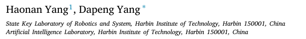
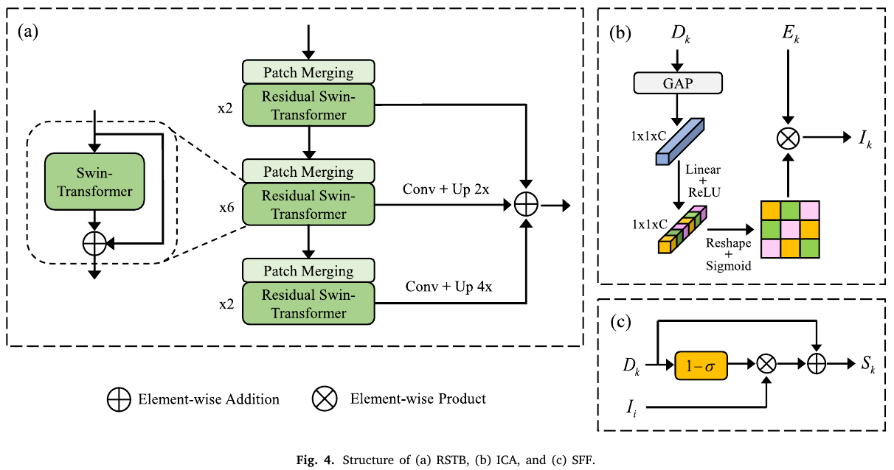

# CSwin-PNet: A CNN-Swin Transformer combined pyramid network for breast lesion segmentation in ultrasound images

## 저널 : Expert Systems with Applications, 2022년 기준 Q1, 15%

https://www.sciencedirect.com/science/article/pii/S0957417422020425

## 저자 : 

## [자세한설명](./CSwin-PNet(2023).md)

## **요약**:
1. **목적**: 이 논문은 유방 초음파 (BUS) 이미지를 기반으로 한 유방 종양의 자동 분할에 중점을 둡니다. 전통적인 방법은 주로 합성곱 신경망 (CNN)을 기반으로 하며, 장거리 의존성을 설정하고 전역 컨텍스트 정보를 얻는 데 한계가 있습니다.

2. **제안된 해결책**: 저자들은 CNN과 Swin Transformer를 결합하여 피쳐 추출 백본으로 사용하고, 피쳐 인코딩 및 디코딩을 위한 피라미드 구조 네트워크를 구축하는 새로운 모델을 소개합니다.

3. **주요 구성 요소**:
   - **Interactive Channel Attention (ICA) 모듈**: 중요한 피쳐 영역을 강조하기 위해 채널별 주의를 사용하여 설계되었습니다.
   - **Supplementary Feature Fusion (SFF) 모듈**: 게이팅 메커니즘을 기반으로 개발되었으며, 피쳐 융합 중에 피쳐를 보충합니다.
   - **Boundary Detection (BD) 모듈**: 유방 병변의 경계 정보에 중점을 둡니다.

4. **결과**: 실험 결과, 제안된 네트워크는 유방 초음파 병변 분할에 있어 다른 최신 이미지 분할 방법보다 우수한 성능을 보였습니다.

5. **배경**:
   - **유방암**: 여성의 주요 건강 문제입니다. 조기 진단은 생존율 향상에 중요합니다. 초음파 영상은 비침습적이며, 방사선이 없고, 비용 효과적인 방법입니다.
   - **Computer-Aided Diagnosis (CAD)**: CAD 시스템은 방사선과학자들에게 해석 및 진단을 도울 수 있습니다.
   - **Convolutional Neural Networks (CNNs)**: 최근 몇 년 동안, CNN은 의료 영상 분야에서 널리 사용되었습니다.

6. **컴퓨터 비전에서의 Transformers**: 최근에는 자연어 처리 작업을 위해 설계된 transformer 아키텍처가 컴퓨터 비전 분야에서 주목받고 있습니다.

7. **기여**:
   - 전역 피쳐 모델링을 위한 잔여 Swin Transformer 블록 (RSTB).
   - 종양 관련 영역을 강조하기 위한 Interactive Channel Attention (ICA) 모듈.
   - 피쳐 보충을 위한 Supplementary Feature Fusion (SFF) 모듈.
   - 고품질 경계 정보를 위한 Boundary Detection (BD) 모듈.

## 나의 의견 :

-  CNN과 Transformer의 결합은 이미지 분할 작업에 대한 재미 있는 접근 방식입니다. 
   -  특히, Swin Transformer의 도입은 계산 효율성과 성능 간의 균형을 찾는 데 중요한 역할을 합니다.

- 모듈의 중요성: 제안된 각 모듈은 분할의 정확성과 품질을 향상시키는 데 중요한 역할을 합니다. 
  - 특히, ICA와 BD 모듈은 초음파 이미지의 특성을 고려하여 설계되었기 때문에, 이 분야에서의 성능 향상에 크게 기여할 것으로 보입니다.

- 총평: 전반적으로, 이 연구는 완전히 새로운 것은 아니지만 기존에 있던 좋은 방법들을 잘 정리하여 만든 모델 같은 느낌입니다. 
  - 그리고 유방암 그리고 초음파 분야에서도 이런 문제점이 있는지는 몰랐습니다.

