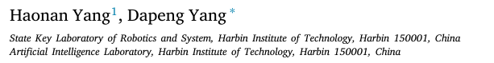
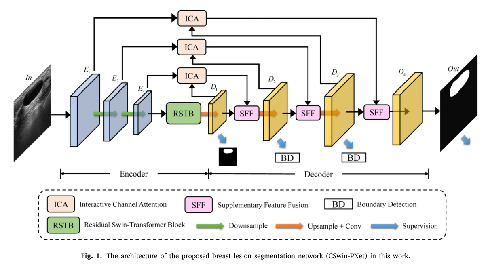
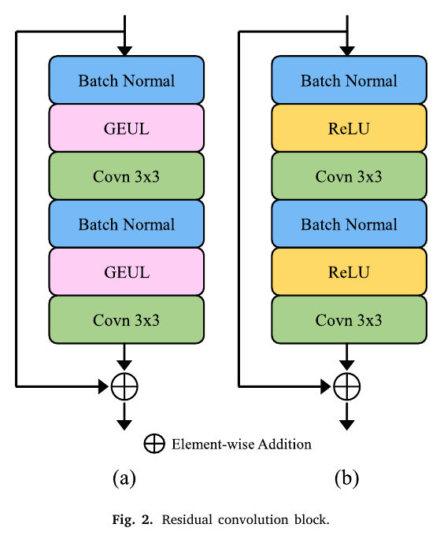

# CSwin-PNet: A CNN-Swin Transformer combined pyramid network for breast lesion segmentation in ultrasound images

## 저널 : Expert Systems with Applications, 2022년 기준 Q1, 15%

https://www.sciencedirect.com/science/article/pii/S0957417422020425

## 저자 : 

## Abstract:
- 현재 유방 초음파(BUS) 영상을 기반으로 유방 종양을 자동 분할하는 것은 여전히 어려운 작업입니다. 
  - 대부분의 병변 분할 방법은 컨볼루션 신경망(CNN)을 기반으로 구현되어 장거리 의존성을 설정하고 전역 컨텍스트 정보를 얻는 데 한계가 있습니다. 
  - 최근 변압기 기반 모델은 강력한 자기 주의 메커니즘으로 인해 장거리 상황 정보를 구축하기 위해 컴퓨터 비전 작업에 널리 사용되고 있으며 그 효과는 기존 CNN보다 우수합니다. 
- 본 논문에서는 CNN과 Swin Transformer를 특징 추출 백본으로 연결하여 특징 인코딩 및 디코딩을 위한 피라미드 구조 네트워크를 구축합니다. 
  - 첫째, 채널별 주의를 사용하여 중요한 특징 영역을 강조하기 위해 대화형 채널 주의(ICA) 모듈을 설계합니다. 
  - 둘째, 게이팅 메커니즘을 기반으로 하는 보조 특징 융합(SFF) 모듈을 개발합니다. 
    - SFF 모듈은 특징 융합 중에 특징을 보완하고 유방 병변 분할의 성능을 향상시킬 수 있습니다. 
  - 마지막으로, 분할 결과에서 경계 품질을 향상시키기 위해 유방 병변의 경계 정보에 추가적인 주의를 기울이기 위해 경계 검출(BD) 모듈을 채택합니다. 
- 실험 결과에 따르면 네트워크가 유방 초음파 병변 분할에 대한 최첨단 영상 분할 방법을 능가합니다.

## 1. Introduction

- 유방암은 전 세계 여성의 삶과 건강에 영향을 미치는 끔찍한 질병이며, 여성들 사이에서 가장 흔한 사망 원인 중 하나입니다. 
  - 미국 암 학회(2021)가 보고한 통계에 따르면, 2021년에 추정적으로 43,600명의 유방암 사망자가 발생했습니다(Siegel et al., 2021). 유방암의 조기 진단은 생존율 향상을 위해 중요합니다(Bleicher et al., 2015). 
  - 초음파 영상은 성숙한 기술로서, 유방 종양의 임상 진단에 널리 사용되는 비침습적, 비방사성 및 저비용 영상 촬영 방법입니다(Xian et al., 2018). 
  - 그러나 초음파 영상의 낮은 대조도, 높은 잡음 및 조직 간의 높은 유사도는 초음파 전문가조차도 완전한 병변 조직을 식별하기 어렵게 만듭니다. 
  - 전문가마다 관찰한 내용에 차이가 있습니다. 
  - 컴퓨터이용진단(CAD) 시스템은 방사선사의 해석 및 진단을 도울 수 있습니다(Bai et al., 2021, Jalalian et al., 2017, Samulski et al., 2010, Yanase and Triantapylou, 2019). 
  - 이 경우, 유방초음파(BUS) 영상을 기반으로 하는 CAD 시스템은 의사가 병변을 검출하는 것을 돕고, 진단 정확도를 향상시키며 어느 정도 주관성을 낮출 수 있습니다. 
  - CAD 시스템은 기계 학습 및 컴퓨터 비전 기술을 사용하여 초음파 영상에서 형태학적 및 질감 특징을 추출하여 병변 분할을 위한 배경과 병변 영역을 분리합니다(Yassin et al., 2018, Zhu et al., 2021). 
  - CAD 시스템은 병변 분할을 달성하는 데 효율적이고 정확한 것으로 입증되었습니다(Horsch et al., 2001, Moon et al., 2020).

- 최근 몇 년 동안 컨볼루션 신경망(CNN)은 검출, 분류 및 의미론적 분할을 포함한 의료 영상 분야에서 널리 사용되어 탁월한 성능을 달성했습니다(Rai et al., 2019, Thiyagaragajan and Murukesh, 2020). 
  - 가장 대표적인 네트워크는 완전 컨볼루션 네트워크(FCN)(Shelhamer et al., 2017)와 U-Net(Ronneberger et al., 2015)입니다. 
    - Yap et al. (2019)은 FCN을 기반으로 BUS 이미지의 유방 병변에 대한 분할 모델을 개발했습니다. 
    - Hu, Guo et al. (2019)은 융합된 확장 컨볼루션을 사용하여 FCN을 기반으로 유방 종양 분할을 위한 완전 컨볼루션 네트워크를 개발했습니다. 
    - Ghosh et al. (2020)은 BUS 이미지의 자동 분할을 위해 전역적 특징을 통합하여 개선된 U-Net 모델을 제안했습니다. 
  - 그러나 초음파 이미지는 낮은 대조도, 높은 노이즈, 흐릿한 에지 및 유방 병변의 가변적인 모양과 위치가 특징이며, 간단한 CNN은 성능이 좋지 않을 수 있습니다. 
    - CNN의 성능을 개선하는 효과적인 수단으로 주의 메커니즘(Mnih et al., 2014)은 국소 특징의 민감한 제어를 통해 특징 추출을 개선하며, 그 중 가장 대표적인 것은 주의 U-Net(Oktay et al., 2018)입니다. 
    - Tong et al. (2021)은 혼합 주의 손실 기능을 기반으로 개선된 U-Net 모델을 제안했고 주의 U-Net. 
    - Zhang et al. (2019)은 잔여 단위를 활용하여 에지 정보를 강화하고 분할 성능을 개선하는 잔여 주의 게이트 네트워크(RDAU-Net)를 제안했습니다. 
  - 현저성 맵은 이미지에서 시각적으로 두드러지는 영역이나 객체를 강조하는 데 사용될 수 있습니다. 
    - 이러한 맵은 관심 영역에 대한 네트워크의 주의를 강화하고 네트워크의 분할 성능을 개선하는 데 도움이 될 수 있습니다(Ramadan et al., 2020, Vakanski et al., 2020). 
    - 예를 들어, Ning et al. (2022)은 현저한 배경 및 SMU-Net 이미지를 활용하는 현저성 유도 모폴로지 인식 U-Net(SMU-Net) 모델을 제안했습니다. 
  - 또한 네트워크에 사전 지식을 추가하면 기능 분할에도 도움이 됩니다(Xi et al., 2017).

- 초음파 영상은 낮은 대비를 가지고 있으며, 많은 픽셀이 질병 조직 픽셀과 유사한 외관을 가진 질병 조직을 포함하지 않습니다. 
  - 이러한 비국소적 특징은 네트워크가 특징을 구별하는 능력을 향상시키기 위해 전역 배경 정보를 캡처하여 학습할 수 있습니다. 
  - 이전의 연구는 수용 분야를 확장하기 위해 확장 컨볼루션을 사용할 것을 제안했습니다(Chen et al., 2018, Li et al., 2021). 
  - 그러나 전역적 관점에서 맥락 정보를 캡처하지 못하고 장거리 의존성 정보를 캡처하는 것이 특징을 구별하는 데 도움이 됩니다. 
    - Xue et al. (2021)은 유방 종양 분할을 위한 전역 안내 네트워크 (GG-Net)를 제안했습니다. 
    - 그들은 공간과 채널에서 장거리 비국소적 의존성을 학습하기 위한 안내 정보로 다층 CNN 정보를 사용하여 네트워크 학습 능력을 향상시켰습니다. 
  - 최근에는 원래 자연어 처리(NLP) 작업에 적용되는 변압기 아키텍처 (Vaswani et al., 2017)가 컴퓨터 비전 분야에서 많은 관심을 받고 있습니다. 
    - 전역 관계 구성에 사용되는 변압기 아키텍처의 다중 머리 자가 주의 (MSA) 메커니즘은 픽셀 기반 CV 작업에 적용할 수 있습니다. 
      - Carion et al. (2020)은 변압기 모델을 기반으로 한 최초의 종단 간 물체 감지 모델을 수립했습니다. 
      - Dosovitski et al. (2020)은 CNN을 대체하기 위해 변압기를 사용했고, 비전 변압기(ViT)라는 변압기 기반 이미지 인식 모델을 수립했으며, 컨볼루션 기술을 사용하는 다른 최첨단 방법과 비교할 수 있는 성능을 달성했습니다. 
      - Wang et al. (2021)은 피라미드 ViT(Pyramid ViT) 모델을 구축하여 멀티스케일 특징 맵을 추출했습니다. 
      - PVT 모델은 계산 복잡도를 어느 정도 감소시키지만, 복잡도는 여전히 이미지 크기와 2차적입니다. Liu, Lin et al. (2021)은 이동 윈도우 전략을 사용한 Swin Transformer를 제안했는데, 이는 계산 복잡도를 크게 줄이고 고급 성능으로 교차 윈도우 정보 교환을 가능하게 합니다. 
      - 트랜스포머 아키텍처는 다운스트림 컴퓨터 비전 작업(분류, 검출 및 분할)(Liu, Zhang et al., 2021)에서 광범위하게 사용될 수 있는 큰 잠재력을 보여주었습니다. 
    - 컴퓨터 비전 작업에서 트랜스포머의 성공적인 적용으로 인해 일부 연구에서는 의료 영상 처리에서 트랜스포머의 가능성을 탐구했습니다(Chen, Liu et al., 2021, Hatamizadeh et al., 2022, Valanarasu et al., 2021). Cao et al. (2021)은 U-Net의 컨볼루션 인코딩 및 디코딩 작업을 Swin Transformer 모듈로 대체하고 Swin-UNet을 구축했습니다. 
      - Lin et al. (2022)은 병렬 이중 Swin Transformer 모듈을 사용하여 Swin-UNet과 유사한 아키텍처를 구축하고 트랜스포머 기반 기능 상호 작용 융합 모듈을 제안했습니다. 
      - Wang et al. (2022)은 U-Net 모델을 얻기 위해 트랜스포머를 사용하여 U-Net의 스킵 연결을 교체했습니다. 
      - Zhang et al. (2021)은 ViT 기반 TransFuse 네트워크를 제안하고 기능 추출을 달성하기 위해 트랜스포머와 CNN을 융합하려고 했습니다. 
      - Chen, Lu et al. (2021)은 CNN을 사용하여 기능을 추출한 후 장거리 의존성 모델링을 위한 트랜스포머로 공급하는 TransUNet을 제안했습니다. 
- 이 논문은 TransUNet에서 영감을 받아 글로벌 모델링에서 CNN의 부족을 완화하기 위해 BUS 이미지의 유방 병변 분할을 위한 새로운 분할 네트워크를 제안합니다. 
  - Swin Transformer 모듈은 글로벌 기능 추출에서 CNN을 보조하기 위해 사용되며 기능 피라미드 네트워크(FPN) 구조 (Lin et al., 2017)는 멀티스케일 기능 융합을 달성하기 위해 구성됩니다. 
  
- 요약하면, 우리의 주요 기여는 다음과 같습니다:

 1. CNN에서 추출한 기능을 전역적으로 모델링하기 위해 Swin Transformer를 기반으로 잔여 Swin Transformer 블록(RSTB)을 구축합니다.

 2. 채널 주의 메커니즘을 기반으로 대화형 채널 주의(ICA) 모듈을 설계합니다. 감독된 인코더 기능을 활용하여 인코더의 각 계층의 기능을 출력하여 종양 관련 영역에 초점을 맞추고 이러한 기능 채널에 큰 가중치를 할당합니다.

 3. 게이팅 메커니즘을 기반으로 하는 SFF(Supplementary Feature Fusion) 모듈을 제안하며, 부호화 과정은 부호화기로부터 특징을 선택적으로 수신하여 부호화기의 특징 정보를 보완하는 것입니다.

 4. 우리는 디코더의 중간 계층에 경계 감지(BD) 모듈을 추가하여 유방 병변의 경계 맵을 식별하고 고품질 경계를 가진 병변 특징을 얻습니다.

## 2. Methodology

- 본 논문에서 제안한 새로운 유방 병변 분할 네트워크는 그림 1에 나타나 있습니다. 
  - 전체적으로 네트워크는 BUS 영상을 입력으로 받아 종단 간 방식으로 선내 병변의 분할 결과를 생성합니다. 
  - CNN의 얕은 층은 전역 정보를 캡처하는 변압기에 도움이 되지 않는 텍스처와 구조 정보에 더 많은 주의를 기울이고 추가 계산을 도입합니다(Gao et al., 2021). 
  - 따라서 네트워크는 CNN을 사용하여 얕은 구조 정보를 처리하고 변압기를 사용하여 피라미드 네트워크를 구축합니다.
  -  인코더 단계에서는 GEUL 활성화 함수(그림 2(a))를 사용하여 얕은 구조 정보를 처리하여 공간 해상도가 다른 특징을 얻습니다.

- stride 2를 갖는 컨볼루션 연산은 다운샘플링 과정에서 영상 특징의 손실을 방지하기 위해 maxpool 연산을 대체하는 데 사용됩니다. 
  - 각 특징 추출 단계 이후의 출력 영상 크기는 입력 영상 크기의 1, 1/2 및 1/4이 됩니다. 
  - i = {1,2,3}에서 세 잔차 모듈의 출력 특징은 , E_i로 표시됩니다. 
  - 그런 다음 마지막 잔차 블록이 출력한 특징 맵을 심층 특징 추출을 위해 1×1 컨볼루션을 통해 RSTB로 연결합니다. 
  - 심층 특징에서 상황 정보를 더 잘 추출하기 위해 본 논문에서는 표준 트랜스포머 대신 Swin 트랜스포머를 사용하며, 2.1절에 자세히 설명합니다.
  -  디코더 단계에서는 ReLU 활성화 기능을 갖는 잔차 모듈(그림 2(b))을 특징 디코딩에 사용합니다. 
     -  디코더의 각 계층의 출력 특징 맵은 다음과 같이 표시됩니다 i = {1,2,3,4}의 D_i. 
  - 인코딩 단계에서 서로 다른 레이어의 특징 정보를 활용하기 위해 ICA 및 SFF를 도입합니다. 
    - 컨볼루션 레이어는 ICA의 채널 주의를 통해 병변 영역에 주의를 기울이도록 향상됩니다. 
    - SFF를 사용하여 디코딩 하위 네트워크의 특징 보완을 실현합니다. 
    - 이어서 디코딩 중간 레이어에 BD를 도입하여 유방 병변 윤곽을 캡처하고 고품질 경계 정보로 분할 특징을 획득합니다.

### 2.1. Residual Swin Transformer block

