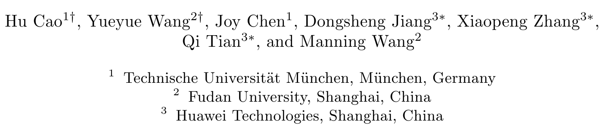
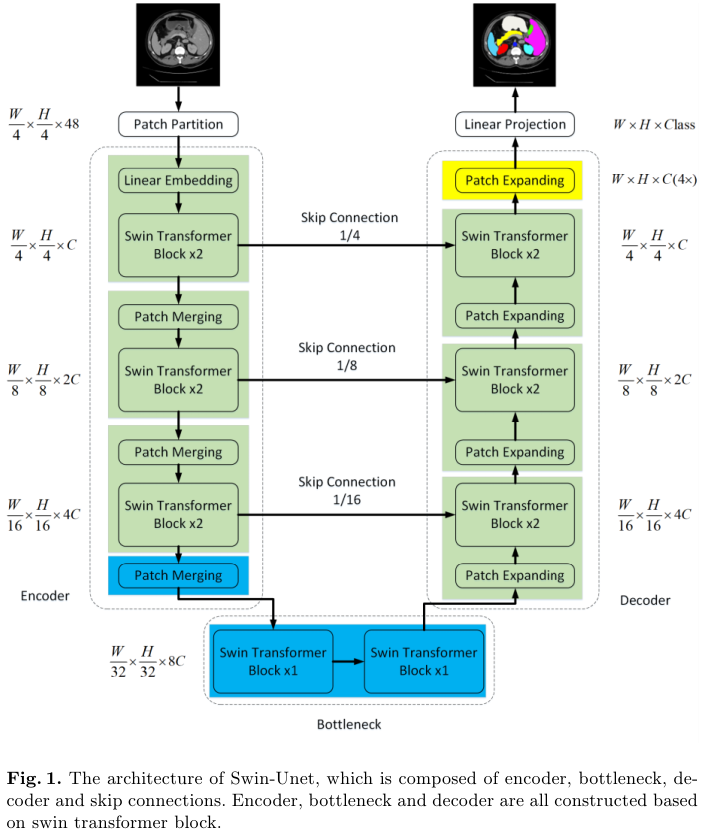

# Swin-Unet: Unet-like Pure Transformer for Medical Image Segmentation

## 저널 및 학회 : Computer Vision – ECCV 2022 Workshops

## 저자 :  

## [자세한 내용](./Swin-Unet%20(2022).md)

### 1. **소개 (Introduction)**
- 이 논문에서는 Swin-Unet이라는 새로운 구조를 제안합니다. 이 구조는 Swin Transformer를 기반으로 하며, 의료 영상 분할을 위한 효과적인 방법을 제공합니다.
- Swin Transformer는 이미지 분류, 객체 탐지 및 시맨틱 분할에서 뛰어난 성능을 보여주었습니다. 이 논문은 그 성능을 의료 영상 분할에 적용하려는 시도입니다.

### 2. **관련 연구 (Related Work)**
- 전통적인 CNN 기반의 U-Net 구조는 의료 영상 분할에서 널리 사용되어 왔습니다. 그러나 Transformer 기반의 모델이 최근에 더 높은 성능을 보여주고 있습니다.
- Swin Transformer는 이러한 Transformer 기반 모델 중 하나로, 그 구조와 작동 방식에 대한 설명이 포함되어 있습니다.

### 3. **Swin-Unet 구조 (Swin-Unet Architecture)**
- Swin-Unet은 Swin Transformer를 기반으로 하며, U-Net과 유사한 구조를 가지고 있습니다.
- 이 구조는 다양한 크기의 패치를 사용하여 이미지를 처리하며, 각 패치는 Transformer 블록을 통해 처리됩니다.
- Swin-Unet은 다양한 해상도의 특징 맵을 생성하며, 이를 통해 높은 정밀도의 분할 결과를 얻을 수 있습니다.

### 4. **실험 결과 (Experiments)**
- Swin-Unet은 여러 의료 영상 데이터셋에서 테스트되었으며, 그 결과 U-Net 및 기타 최신 모델들과 비교하여 뛰어난 성능을 보여주었습니다.
- 특히, 작은 크기의 물체나 경계 부분에서도 높은 정밀도로 분할할 수 있음이 확인되었습니다.

### 5. **결론 (Conclusion)**
- Swin-Unet은 의료 영상 분할을 위한 효과적인 Transformer 기반 모델임을 입증하였습니다.
- 이 모델은 다양한 의료 영상 분할 작업에서 높은 성능을 보여주며, 앞으로의 연구에서도 많은 관심을 받을 것으로 예상됩니다.

# 나의 의견
- Unet에서 swin transformer을 합친것이다.
- 제목만 보기에는 그냥 뭐 쉽겠네 라고 생각하기 쉽지만,
- domain이 바뀌는 순간 그 domain에 맞는 최적화를 해야 한다.
- 따라서 지금 있는 실험은 그러한 것들을 적용 시킨 실험이다.