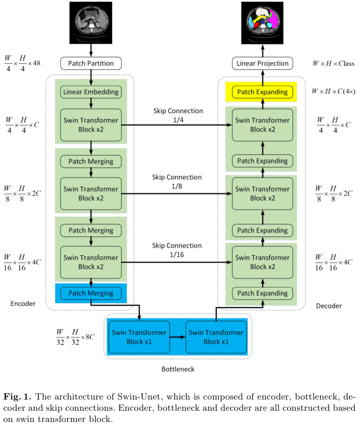
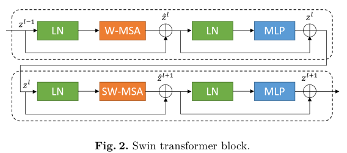
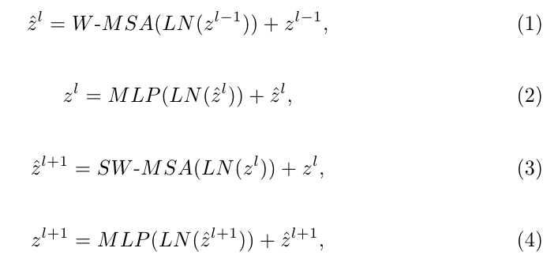
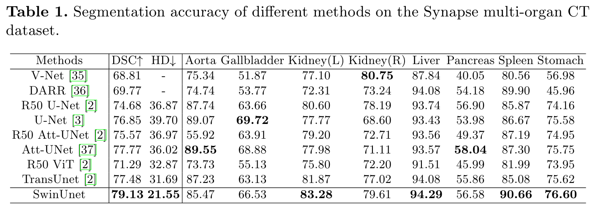
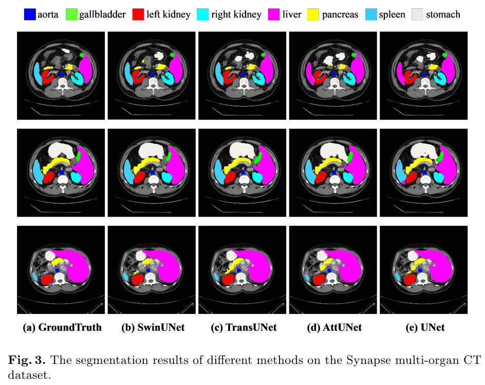
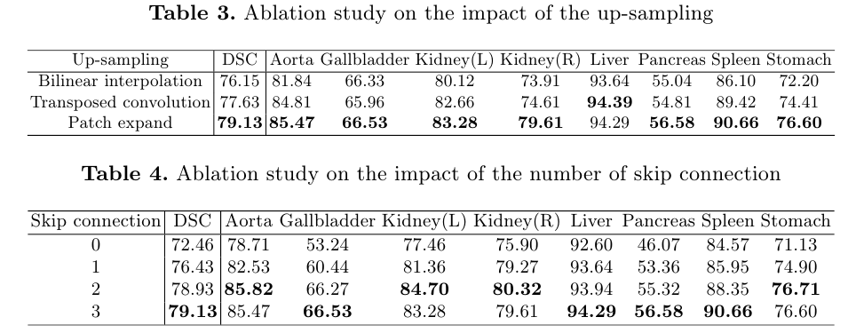

# Swin-Unet: Unet-like Pure Transformer for Medical Image Segmentation

## 저널 및 학회 : Computer Vision – ECCV 2022 Workshops

## 저자 :  

## Abstrat :
- 지난 몇 년간 컨볼루션 신경망(CNN)은 의료 영상 분석에서 이정표를 달성했습니다. 
  - 특히 U자형 아키텍처와 스킵 연결을 기반으로 한 심층 신경망은 다양한 의료 영상 작업에 널리 적용되어 왔습니다. 
  - 그러나 CNN은 우수한 성능을 달성했지만 컨볼루션 연산의 국부성으로 인해 글로벌 및 장거리 시맨틱 정보 상호 작용을 잘 학습할 수 없습니다. 
- **본 논문에서는 의료 영상 분할을 위한 Unet과 같은 순수 변환기인 Swin-Unet을 제안**합니다.
  - 토큰화된 이미지 패치는 로컬 글로벌 의미 특징 학습을 위한 생략 연결이 있는 트랜스포머 기반 Ushaped Encoder-Decoder 아키텍처에 입력됩니다. 
  - 특히, 우리는 컨텍스트 특징을 추출하기 위해 윈도우를 이동한 계층적 Swin Transformer를 인코더로 사용합니다. 
  - 그리고 패치 확장 계층이 있는 대칭 Swin Transformer 기반 디코더는 특징 맵의 공간 해상도를 복원하기 위해 업샘플링 작업을 수행하도록 설계되었습니다. 
  - 입력과 출력의 직접 다운샘플링 및 4배 업샘플링에서, 다중 장기 및 심장 분할 작업에 대한 실험은 순수 트랜스포머 기반 U자형 인코더-Decoder 네트워크가 완전 컨볼루션 또는 트랜스포머와 컨볼루션의 조합으로 그러한 방법보다 성능이 우수함을 보여줍니다. 
- 코드와 훈련된 모델은 https://github.com/HuCaoFighting/Swin-Unet 에서 공개적으로 제공될 것입니다.

## Introduction :

- 기존의 의료 영상 분할 방법은 주로 U자형 구조 [3,4,5]를 가진 완전 컨볼루션 신경망 (FCNN)에 의존합니다. 
  - 전형적인 U자형 네트워크인 U-Net[3]은 건너뛰기 연결을 가진 대칭 인코더-디코더로 구성됩니다. 
  - 인코더에서 일련의 컨볼루션 계층과 연속 다운 샘플링 계층은 큰 수용 필드를 가진 심층 특징을 추출하는 데 사용됩니다. 
  - 그런 다음 디코더는 추출된 심층 특징을 픽셀 수준 의미론적 예측을 위해 입력 해상도로 업샘플링하고 인코더와 다른 규모의 고해상도 특징을 생략 연결과 융합하여 다운샘플링으로 인한 공간 정보 손실을 완화합니다. 
  - 이러한 우아한 구조 설계를 통해 U-Net은 다양한 의료 영상 응용 분야에서 큰 성공을 거두었습니다. 
  - 이러한 기술적 경로를 따라 다양한 의료 영상 양식의 영상 및 체적 분할을 위해 3D U-Net[6], Res-UNet[7], U-Net+[8] 및 UNet3+[9]와 같은 많은 알고리듬이 개발되었습니다. 
  - 심장 분할, 장기 분할 및 병변 분할에서 이러한 FCNN 기반 방법의 우수한 성능은 CNN이 구별되는 특징을 학습하는 강력한 능력을 가지고 있음을 증명합니다.

- 현재 CNN 기반 방법은 의료 이미지 분할 분야에서 우수한 성능을 달성했지만, 분할 정확도를 위한 의료 응용의 엄격한 요구 사항을 완전히 충족할 수 없습니다. 이미지 분할은 의료 이미지 분석에서 여전히 어려운 과제입니다. 
  - 컨볼루션 연산의 고유한 국소성 때문에 CNN 기반 접근 방식에서는 명시적인 전역 및 장거리 의미 정보 상호 작용을 학습하기가 어렵습니다 [2]. 
  - 일부 연구에서는 아톰 컨볼루션 계층 [10,11], 자기 주의 메커니즘 [12,13] 및 이미지 피라미드 [14]를 사용하여 이 문제를 해결하려고 시도했습니다.
  -  그러나 이러한 방법은 여전히 장거리 의존성을 모델링하는 데 한계가 있습니다. 
- 최근 자연 언어 처리(NLP) 영역 [15]에서 트랜스포머의 큰 성공에 영감을 받아 연구자들은 트랜스포머를 비전 영역 [16]에 도입하려고 시도했습니다.
  -  [17]에서는 이미지 인식 작업을 수행하기 위해 비전 트랜스포머(ViT)가 제안되었습니다. 
  -  위치 임베딩이 있는 2D 이미지 패치를 입력으로 사용하고 대규모 데이터 세트에 대한 사전 교육을 받은 ViT는 CNN 기반 방법과 동등한 성능을 달성했습니다. 
  -  또한 데이터 효율적인 이미지 트랜스포머(DeiT)가 [18]에 제시되어 있는데, 이는 트랜스포머가 중간 크기의 데이터 세트에서 교육될 수 있고 증류 방법과 결합하여 더 강력한 트랜스포머를 얻을 수 있음을 나타냅니다. [19]에서는 계층적 Swin Transformer가 개발되었습니다. 
  -  [19]의 저자인 Swin Transformer를 비전 백본으로 사용하여 [19]의 이미지 분류, 객체 감지 및 의미론적 분할에 대한 최첨단 성능을 달성했습니다. 이미지 인식 작업에서 ViT, DeiT 및 Swin Transformer의 성공은 트랜스포머가 비전 영역에 적용될 가능성을 보여줍니다.

- Swin-Unet은 Swin Transformer의 [19] 성공에 동기를 부여받아 본 연구에서 2D 의료 영상 분할을 위한 Transformer의 힘을 활용할 것을 제안합니다. 우리가 아는 한, Swin-Unet은 인코더, 병목 현상, 디코더 및 건너뛰기 연결로 구성된 최초의 순수한 Transformer 기반 U자형 아키텍처입니다. 
  - 인코더, 병목 현상 및 디코더는 모두 Swin Transformer 블록[19]을 기반으로 구축됩니다. 
  - 입력된 의료 영상은 중복되지 않는 이미지 패치로 분할됩니다. 
  - 각 패치는 토큰으로 처리되고 심층 특징 표현을 학습하기 위해 Transformer 기반 인코더로 공급됩니다. 
  - 그런 다음 추출된 컨텍스트 특징은 패치 확장 계층이 있는 디코더에 의해 업샘플링되고 건너뛰기 연결을 통해 인코더의 다중 스케일 특징과 융합되어 특징 맵의 공간 해상도를 복원하고 추가로 분할 예측을 수행합니다.

- 다기관 및 심장 분할 데이터 세트에 대한 광범위한 실험은 제안된 방법이 우수한 분할 정확도와 강력한 일반화 능력을 가지고 있음을 나타냅니다. 구체적으로, 우리의 기여는 다음과 같이 요약될 수 있습니다:
  - (1) Swin Transformer 블록을 기반으로 스킵 연결이 있는 대칭 Encoder-Decoder 아키텍처를 구축합니다. 
    - 인코더에서는 로컬에서 글로벌로 자체 주의가 실현됩니다. 디코더에서는 글로벌 기능이 해당 픽셀 수준 분할 예측을 위해 입력 해상도로 업샘플링됩니다. 
  - (2) 컨볼루션 또는 보간 작업을 사용하지 않고 업샘플링 및 기능 차원 증가를 달성하기 위해 패치 확장 계층이 개발됩니다. 
  - (3) 실험에서 스킵 연결이 Transformer에도 효과적이라는 것이 밝혀졌으므로 스킵 연결이 있는 순수한 Transformer 기반 U자형 Encoder 아키텍처가 최종적으로 구성되며, 이는 Swin-Unet이라고 합니다.

## 2 Related work

**CNN-based methods**
- 초기 의료 영상 분할 방법은 주로 윤곽 기반 및 전통적인 기계 학습 기반 알고리듬[20,21]입니다. 
  - 심층 CNN의 개발로 U-Net은 의료 영상 분할을 위해 [3]에서 제안되었습니다. 
  - U자형 구조의 단순성과 우수한 성능으로 인해 Res-UNet [7], Dense-UNet [22], U-Net+[8] 및 UNet3+[9]와 같은 다양한 Unet 유사 방법이 지속적으로 등장하고 있습니다. 
  - 또한 3D-Unet [6] 및 V-Net [23]과 같은 3D 의료 영상 분할 분야에도 도입되었습니다. 
  - 현재 CNN 기반 방법은 강력한 표현 능력으로 인해 의료 영상 분할 분야에서 엄청난 성공을 거두었습니다.

**Vision transformers**

- 트랜스포머는 [15]에서 기계 번역 작업을 위해 처음 제안되었습니다. 
  - NLP 영역에서 트랜스포머 기반 방법은 다양한 작업에서 최첨단 성능을 달성했습니다 [24]. 
  - 트랜스포머의 성공에 힘입어 연구원들은 [17]에서 선구적인 비전 트랜스포머(ViT)를 도입했으며, 이는 이미지 인식 작업에서 인상적인 속도-정확도 트레이드오프를 달성했습니다. 
  - CNN 기반 방법과 비교할 때, ViT의 단점은 자체 대형 데이터 세트에 대한 사전 훈련이 필요하다는 것입니다. ViT 훈련의 어려움을 완화하기 위해 Deit[18]에서는 ViT가 ImageNet에서 잘 훈련할 수 있도록 하는 몇 가지 훈련 전략을 설명합니다. 
  - 최근 ViT[25,26,19]를 기반으로 몇 가지 우수한 작업이 수행되었습니다. 
  - [19]에서는 Swin Transformer라고 불리는 효율적이고 효과적인 계층적 비전 트랜스포머가 비전 백본으로 제안되었다는 것을 언급할 필요가 있습니다. 
  - shift widnow mechansim을 기반으로 Swin Transformer는 이미지 분류, 객체 검출 및 의미론적 분할을 포함한 다양한 비전 작업에서 최첨단 성능을 달성했습니다. 
- 본 연구에서는 Swin Transformer 블록을 기본 단위로 사용하여 의료 이미지 분할을 위한 스킵 연결이 있는 U자형 Encoder-Decoder 아키텍처를 구축함으로써 의료 이미지 분야에서 트랜스포머 개발을 위한 벤치마크 비교를 제공하고자 합니다.

**Self-attention/Transformer to complement CNNs**

- 최근, 연구자들은 네트워크의 성능을 향상시키기 위해 자가 주의 메커니즘을 CNN에 도입하려고 시도했습니다 [13]. 
  - [12]에서, 추가 주의 게이트와의 스킵 연결은 의료 영상 분할을 수행하기 위해 U자형 아키텍처에 통합됩니다. 
  - 그러나, 이는 여전히 CNN 기반 방법입니다. 
  - 현재, 의료 영상 분할 [2,27,1]에서 CNN과 트랜스포머를 결합하여 CNN의 지배력을 깨기 위한 일부 노력이 이루어지고 있습니다. 
  - [2]에서, 저자들은 트랜스포머를 CNN과 결합하여 2D 의료 영상 분할을 위한 강력한 인코더를 구성했습니다. 
  - [2], [27] 및 [28]과 유사하게, 모델의 분할 능력을 향상시키기 위해 트랜스포머와 CNN의 상보성을 사용합니다. 
  - 현재, CNN과의 다양한 조합의 트랜스포머가 다중 모드 뇌종양 분할 [29] 및 3D 의료 영상 분할 [1,30]에 적용됩니다. 
  - 위의 방법과는 달리, 우리는 의료 영상 분할에서 순수 트랜스포머의 적용 가능성을 탐구하려고 합니다.

## 3 Method

### 3.1 Architecture overview

- 디코더는 Swin Transformer 블록과 패치 확장 계층으로 구성되어 있습니다. 
  - 추출된 컨텍스트 피쳐는 다운 샘플링으로 인한 공간 정보 손실을 보완하기 위해 스킵 연결을 통해 인코더의 멀티스케일 피쳐와 융합됩니다. 
  - 패치 병합 계층과 달리 패치 확장 계층은 업샘플링을 수행하도록 특별히 설계되었습니다. 
  - 패치 확장 계층은 인접 차원의 피쳐맵을 2배 업샘플링으로 큰 피쳐맵으로 재구성합니다. 
  - 마지막 패치 확장 계층은 4배 업샘플링을 수행하여 피쳐맵의 해상도를 입력 해상도(W × H)로 복원한 다음 이러한 업샘플링된 피쳐에 선형 투영 계층을 적용하여 픽셀 수준 분할 예측을 출력합니다. 
  - 다음에서는 각 블록을 자세히 설명하겠습니다

### 3.2 Swin Transformer block

- 기존의 다중 헤드 셀프 어텐션(MSA) 모듈과 달리, 스위인 변압기 블록[19]은 시프트된 윈도우를 기반으로 구성됩니다. 
  - 그림 2에는 두 개의 연속적인 스위인 변압기 블록이 제시되어 있습니다. 
  - 각 스위인 변압기 블록은 LN(Layer Norm) 레이어, 다중 헤드 셀프 어텐션 모듈, 잔류 연결부 및 GELU 비선형성을 가진 2-레이어 MLP로 구성됩니다.
  - 윈도우 기반 다중 헤드 셀프 어텐션(W-MSA) 모듈과 시프트된 윈도우 기반 다중 헤드 셀프 어텐션(SW-MSA) 모듈은 두 개의 연속적인 변압기 블록에 각각 적용됩니다. 
  - 이러한 윈도우 분할 메커니즘을 기반으로 연속적인 스위인 변압기 블록은 다음과 같이 공식화될 수 있습니다:

### 3.3 Encoder

- 인코더에서 H4×W4 해상도의 C차원 토큰화된 입력은 두 개의 연속적인 Swin Transformer 블록에 입력되어 표현 학습을 수행하며, 이 과정에서 특징 치수와 해상도는 변하지 않습니다.
  - 한편, 패치 병합 계층은 토큰 수(2x 다운샘플링)를 감소시키고, 피쳐 치수를 원래 치수의 2배로 증가시킬 것이며, 이러한 절차는 인코더에서 3회 반복될 것입니다.

**Patch merging layer :**
- 입력된 패치들은 4개의 부분들로 분할되고 패치 병합 계층에 의해 함께 연결됩니다. 
  - 이러한 처리를 통해, 특징 해상도는 2배 다운 샘플링될 것입니다. 
  - 그리고, 연결 연산은 특징 차원이 4배 증가하는 결과를 초래하므로, 연결된 특징들에 선형 계층을 적용하여 특징 차원을 원래의 2배 차원으로 통합합니다.

### 3.4 Bottleneck

- Transformer가 너무 깊어서 수렴할 수 없기 때문에 [33], 심층 특징 표현을 학습하기 위해 병목을 구성하는 데 연속적인 두 개의 Swin Transformer 블록만 사용됩니다. 
- bottleneck에서는 특징 치수와 해상도가 변하지 않습니다.

### 3.5 Decoder
- 인코더에 대응하여, 대칭 디코더는 Swin Transformer 블록을 기반으로 구축됩니다. 
  - 이를 위해, 인코더에 사용되는 패치 병합 계층과 대조적으로, 우리는 추출된 심층 특징을 업샘플링하기 위해 디코더에서 패치 확장 계층을 사용합니다.
  - 패치 확장 계층은 인접 차원의 특징 맵을 더 높은 해상도의 특징 맵(2x 업샘플링)으로 재구성하고 그에 따라 특징 차원을 원래 차원의 절반으로 줄입니다.

**Patch expanding layer**

### 3.6 Skip connection
- U-Net[3]과 유사하게, 스킵 연결은 인코더의 다중 스케일 특징을 업샘플링된 특징과 융합하는 데 사용됩니다. 
  - 우리는 다운샘플링으로 인한 공간 정보의 손실을 줄이기 위해 얕은 특징과 깊은 특징을 서로 연결합니다. 
  - 선형 레이어에 이어, 연결된 특징의 치수는 업샘플링된 특징의 치수와 동일하게 유지됩니다. 
  - 섹션 4.5에서, 우리는 스킵 연결의 수가 우리 모델의 성능에 미치는 영향에 대해 자세히 설명할 것입니다.

## 4 Experiments

### 4.1 Datasets

**Synapse multi-organ segmentation dataset (Synapse)**
- 데이터 세트에는 3779개의 축방향 복부 임상 CT 이미지와 함께 30개의 사례가 포함되어 있습니다. 
  - [2,34]에 이어 18개의 샘플을 훈련 세트로, 12개의 샘플을 테스트 세트로 나눕니다. 
  - 그리고 평균 Dice-유사성 계수(DSC)와 평균 Hausdorff Distance(HD)를 평가 메트릭으로 사용하여 8개의 복부 장기(대동맥, 담낭, 비장, 좌측 신장, 우측 신장, 간, 췌장, 비장, 위)에 대한 방법을 평가합니다.

**Automated cardiac diagnosis challenge dataset (ACDC)**
- ACDC 데이터 세트는 MRI 스캐너를 사용하여 서로 다른 환자로부터 수집됩니다. 
  - 각 환자 MR 이미지에 대해 좌심실(LV), 우심실(RV) 및 심근(MYO)이 레이블로 표시됩니다. 
  - 데이터 세트는 70개의 훈련 샘플, 10개의 유효성 검사 샘플 및 20개의 테스트 샘플로 분할됩니다. 
  - [2]와 유사하게, 이 데이터 세트에서 방법을 평가하는 데 평균 DSC만 사용됩니다.

### 4.2 Implementation details
- Swin-Unet은 Python 3.6 및 Pytorch 1.7.0을 기반으로 달성됩니다. 
  - 모든 학습 사례에서 플립 및 회전과 같은 데이터 증가가 데이터 다양성을 높이기 위해 사용됩니다. 
  - 입력 이미지 크기와 패치 크기는 각각 224 x 224 및 4로 설정됩니다. 
  - 32GB 메모리가 있는 Nvidia V100 GPU에서 모델을 학습합니다. ImageNet에서 사전 학습된 가중치는 모델 매개 변수를 초기화하는 데 사용됩니다.
  - 훈련 기간 동안 배치 크기는 24이며 모멘텀 0.9와 무게 감소 1e-4를 가진 인기 있는 SGD 최적화기가 후방 전파를 위해 모델을 최적화하는 데 사용됩니다.

### 4.3 Experiment results on Synapse dataset

- 제안된 Swin-Unet과 Synapse 다중 기관 CT 데이터 세트의 이전 최첨단 방법과의 비교는 표 1에 제시되어 있습니다. 
  - TransUnet [2]와는 달리, 우리는 Synapse 데이터 세트에서 U-Net [3] 및 ATT-Unet [37]의 자체 구현에 대한 테스트 결과를 추가합니다. 
  - 실험 결과는 우리의 Unet과 유사한 순수 변압기 방법이 79.13%(DSC↑) 및 21.55%(HD↓)의 분할 정확도로 최고의 성능을 달성한다는 것을 보여줍니다. 
  - 비록 우리의 알고리듬이 DSC 평가 메트릭에서 크게 개선되지는 않았지만, 우리는 HD 평가 메트릭에서 약 4% 및 10%의 정확도 향상을 달성했으며, 이는 우리의 접근 방식이 더 나은 에지 예측을 달성할 수 있다는 것을 나타냅니다. 
  - Synapse 다중 기관 CT 데이터 세트에서 다른 방법의 분할 결과가 그림 3에 나와 있습니다. 
  - 그림을 통해 CNN 기반 방법은 과도한 분할 문제가 있는 경향이 있으며, 이는 컨볼루션 연산의 로컬리티에 의해 발생할 수 있습니다. 
  - 본 연구에서, 우리는 건너뛰기 연결이 있는 U자형 아키텍처와 Transformer를 통합함으로써 컨볼루션이 없는 순수 변압기 접근 방식이 글로벌 및 장거리 시맨틱 정보 상호 작용을 모두 더 잘 학습하여 더 나은 분할 결과를 얻을 수 있음을 보여줍니다.

### 4.4 Experiment results on ACDC dataset

- 제안된 Swin-Unet은 Synapse 데이터 세트와 유사하게 ADC 데이터 세트에서 훈련되어 의료 영상 분할을 수행합니다. 
  - 실험 결과는 표 2에 요약되어 있습니다. MR 모드의 영상 데이터를 입력으로 사용함으로써 SwinUnet은 여전히 90.00%의 정확도로 우수한 성능을 달성할 수 있으며, 이는 우리의 방법이 좋은 일반화 능력과 견고성을 가지고 있음을 보여줍니다.

### 4.5 Ablation study
- 다양한 요인이 모델 성능에 미치는 영향을 탐구하기 위해 Synapse 데이터 세트에 대한 절제 연구를 수행했습니다. 
  - 구체적으로, 업샘플링, 스킵 연결 수, 입력 크기 및 모델 척도에 대해 아래에서 논의합니다.

**Effect of up-sampling:**
- 인코더에서 패치 병합 계층에 대응하여 업샘플링 및 피쳐 치수 증가를 수행하기 위해 디코더에서 패치 확장 계층을 특별히 설계했습니다.
  - 제안된 패치 확장 계층의 효과를 탐색하기 위해 Synapse 데이터 세트에서 이중 보간, 전치 컨볼루션 및 패치 확장 계층을 사용한 Swin-Unet의 실험을 수행했습니다. 
  - 표 3의 실험 결과는 제안된 Swin-Unet이 패치 확장 계층과 결합되어 더 나은 분할 정확도를 얻을 수 있음을 나타냅니다.

**Effect of the number of skip connections:**
- SwinUNet의 스킵 연결은 1/4, 1/8, 1/16 해상도 스케일의 자리에 추가되며, 스킵 연결의 개수를 각각 0, 1, 2, 3으로 변경하여 제안된 모델의 분할 성능에 미치는 서로 다른 스킵 연결의 영향을 알아보았다. 
  - 표 4에서 스킵 연결의 개수가 증가함에 따라 모델의 분할 성능이 증가함을 알 수 있으므로 본 연구에서는 스킵 연결의 개수를 3으로 설정하였습니다.

**Effect of input size:**
- 입력으로 224 × 224, 384 × 384 입력 해상도를 갖는 제안된 Swin-Unet의 테스트 결과는 Table 5에 제시되어 있습니다. 
  - 입력 크기가 224 × 224에서 384 × 384로 증가하고 패치 크기가 4로 유지됨에 따라 트랜스포머의 입력 토큰 시퀀스가 더 커짐에 따라 모델의 분할 성능이 향상될 것입니다. 
  - 그러나 모델의 분할 정확도가 약간 향상되었지만 전체 네트워크의 계산 부하 또한 크게 증가했습니다. 알고리즘의 실행 효율성을 보장하기 위해 본 논문의 실험은 입력으로 224 × 224 해상도 스케일을 기반으로 합니다.

**Effect of model scale:**
- [19]와 유사하게 네트워크 심화가 모델 성능에 미치는 영향에 대해 논의합니다. 
  - 모델 규모의 증가는 모델의 성능을 거의 향상시키지 못하지만 전체 네트워크의 계산 비용을 증가시키는 것을 표 6에서 확인할 수 있습니다. 
  - 정확도-속도 트레이드오프를 고려하여 의료 영상 분할을 수행하기 위해 Tiny 기반 모델을 채택합니다.

### 4.6 Discussion
- 모두 알고 있듯이, 트랜스포머 기반 모델의 성능은 모델 사전 훈련에 의해 심각한 영향을 받습니다. 
  - 본 연구에서는 ImageNet에서 Swin Transformer [19]의 훈련 가중치를 직접 사용하여 네트워크 인코더 및 디코더를 초기화합니다. 
  - 이 초기화 접근 방식은 단순하며, 향후 의료 영상 분할을 위해 트랜스포머를 end-to-end으로 사전 훈련하는 방법을 모색할 것입니다.
  -  또한 본 논문의 입력 영상은 2D인 반면 의료 영상 데이터의 대부분은 3D이기 때문에 다음 연구에서는 3D 의료 영상 분할에서 Swin-Unet의 적용에 대해 살펴볼 것입니다.

## 5 Conclusion
- 본 논문에서는 의료 영상 분할을 위한 새로운 순수 트랜스포머 기반 U자형 인코더-디코더를 소개했습니다.
  -  트랜스포머의 힘을 활용하기 위해, 우리는 Swin Transformer 블록을 특징 표현 및 장거리 의미 정보 대화형 학습을 위한 기본 단위로 채택합니다. 
  -  다기관 및 심장 분할 작업에 대한 광범위한 실험은 제안된 Swin-Unet이 우수한 성능과 일반화 능력을 가지고 있음을 보여줍니다.

# 나의 의견
- Unet에서 swin transformer을 합친것이다.
- 제목만 보기에는 그냥 뭐 쉽겠네 라고 생각하기 쉽지만,
- domain이 바뀌는 순간 그 domain에 맞는 최적화를 해야 한다.
- 따라서 지금 있는 실험은 그러한 것들을 적용 시킨 실험이다.