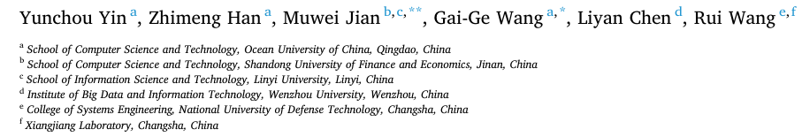
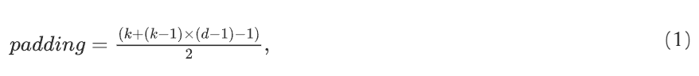
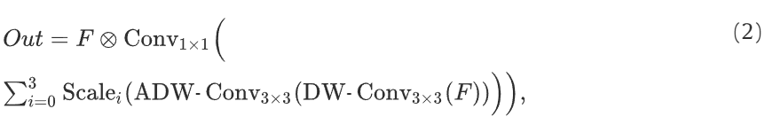
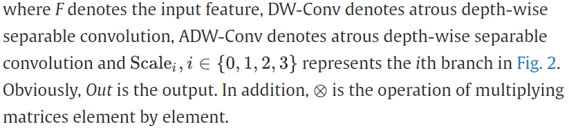
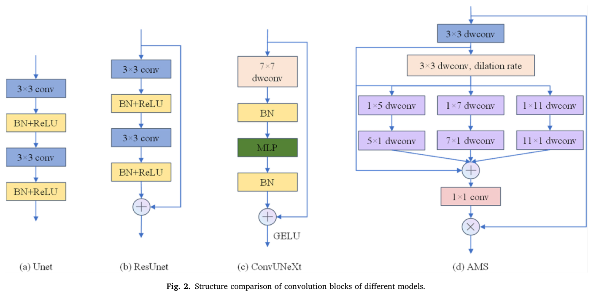
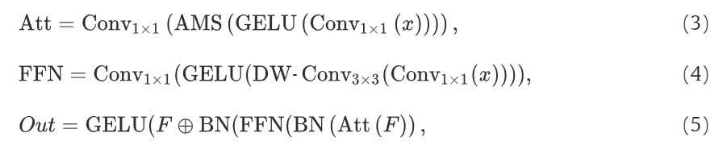
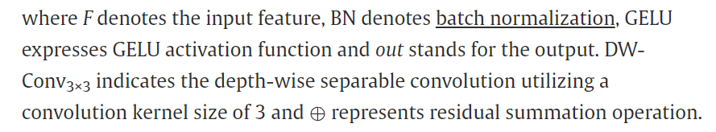
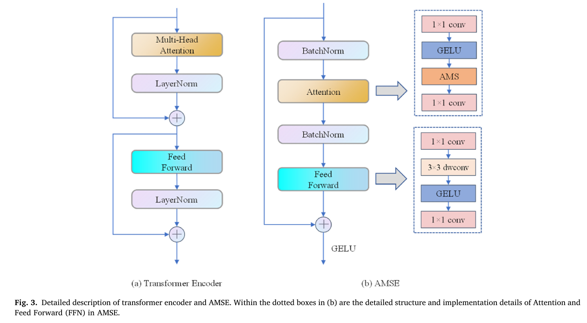
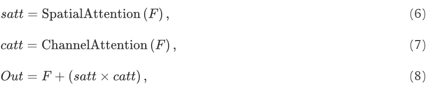
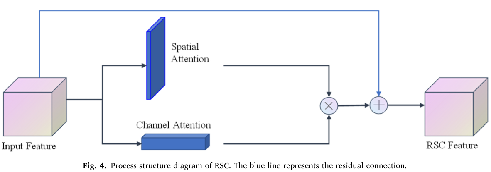

# AMSUnet: A neural network using atrous multi-scale convolution for medical image segmentation

## 저널 : COMPUTERS IN BIOLOGY AND MEDICINE, 2022년 기준 Q1, 14%

https://www.sciencedirect.com/science/article/pii/S0010482523005851

## 저자 : 

## Highlights
- A novel lightweight medical image segmentation network AMSUnet is developed.
- A brand-new convolution encoder AMSE is proposed for different scale targets.
- A plug-and-play lightweight attention mechanism module is proposed.

## Abstract

- 최근 몇 년 동안, Unet과 그 변종들은 의료 영상 처리 영역에서 놀라운 성공을 거두었다. 
  - 그러나 일부 Unet 변형 네트워크는 매개 변수의 수를 엄청나게 증가시키면서 성능을 향상시킨다. 
- SegNext에서 영감을 받은 경량 및 성능 향상을 공동으로 고려하기 위해, 우리는 AMSUnet이라는 아톰 멀티 스케일(AMS) 컨볼루션을 사용하는 의료 영상 분할 네트워크 모델을 개발한다. 
  - 특히, 우리는 아톰 및 멀티 스케일 컨볼루션을 사용하여 컨볼루션 주의 블록 AMS를 구성하고, AMSE라고 불리는 이 블록을 기반으로 다운샘플링 인코더를 재설계한다. 
  - 기능 융합을 향상시키기 위해, 우리는 잔류 주의 메커니즘 모듈(즉, RSC)을 설계하고 그것을 스킵 연결에 적용한다. 
  - 기존 모델과 비교하여, 우리의 모델은 경량의 목적을 달성하기 위해 2.62M 매개 변수만 필요하다. 
  - 다양한 데이터 세트에 대한 실험 결과에 따르면, 설계된 모델의 분할 성능은 소규모, 중간 규모 및 대규모 대상에 대해 우수하다. 코드는 https://github.com/llluochen/AMSUnet 에서 확인할 수 있다.

## 1. Introduction
- 컨볼루션 코딩 블록이 너무 간단하여 충분한 의미 정보를 수집할 수 없고 연결을 건너뛰면 기능 융합이 제대로 이루어지지 않기 때문에 새로운 경량 Unet 변형 네트워크 AMSUnet이 제안되었습니다. 
  - 보다 효율적인 기능 추출을 위해 다운샘플링에서 컨볼루션 블록과 인코더를 재설계합니다. 
  - 현재 많은 컨볼루션 블록이 정확한 기능 맵을 추출할 수 있지만 작은 수용 필드와 많은 매개 변수 [13,40]의 문제가 있으므로 모델 성능과 실제 적용을 크게 제한합니다 [38,39]. 
  - 따라서 아톰 컨볼루션을 다중 스케일 컨볼루션과 결합하여 AMS라는 컨볼루션 주의 블록을 설계하여 기능 추출 단계에서 더 큰 수용 필드와 더 정확한 기능 맵을 얻을 수 있습니다. 
- 또한 많은 모델의 인코더는 혁신이 부족하며 [28,38,44], 대부분은 Unet 또는 ViT의 인코더 구조를 따릅니다. 
  - 컨볼루션 주의 블록에서 기능 추출을 위해 아톰 컨볼루션과 다중 스케일 컨볼루션을 결합하는 최초의 의료 이미지 분할 모델로서 AMSUnet은 트랜스포머 인코더 [14]의 아이디어를 활용하여 잔차 연결, 정규화 및 활성화 함수가 기능 추출 효율과 모델 분할 성능에 미치는 영향을 깊이 고려합니다.
  -  동시에 기능 융합을 향상시키고 관련 없는 기능의 영향을 억제하기 위해 RSC라는 플러그 앤 플레이 경량 주의 메커니즘 모듈을 설계하고 RSC를 적용하여 낮은 수준의 의미 정보에서 노이즈를 필터링합니다. 
  -  광범위한 실험을 통해 여러 의료 이미지 분할 데이터 세트에서 다른 모델보다 성능이 향상됩니다. 
  -  또한 경량 설계로 인해 모델은 다른 모델보다 매개 변수 수가 적습니다. 예를 들어, 매개 변수 수는 Unet의 60.6%, ResUnet의 47.3%, ConvUNeXt의 74.6%에 불과합니다.

**The sum of our contributions in this model is as follows:** 
- 의료 영상의 특징 추출을 위한 아톰 컨볼루션과 다중 스케일 컨볼루션을 처음으로 결합한 새로운 경량 의료 영상 분할 네트워크 AMSUnet이 개발되었습니다. 
  - 한편, 효율적인 컨볼루션 주의 블록 AMS도 설계되어 특징 추출의 효율성을 향상시킬 뿐만 아니라 경량화 목표를 달성합니다.

- 정규화, 잔여 연결 및 활성화 기능을 깊이 생각하고 재배치하여 의료 영상 분할에 더 적합한 트랜스포머 블록 변형 구조인 새로운 컨볼루션 인코더 AMSE를 제안합니다. 
  - AMSE는 충분한 의미 정보를 추출할 수 있는 기존 인코더보다 혁신적이며 다양한 스케일 대상에 적합합니다.

- 잔여 아이디어를 이용한 공간적 주의 및 채널 주의 기반의 플러그 앤 플레이 경량 주의 메커니즘 모듈(RSC)을 제안합니다. 
  - RSC와의 스킵 연결은 낮은 수준의 시맨틱 정보로부터 관련성이 없는 특징을 효과적으로 억제합니다. 
  - 이는 또한 특징 융합의 효과를 효과적으로 개선하여 AMSUnet의 분할 성능을 크게 향상시킵니다.

## 2. Related work

- 의료 이미지 분할의 주요 네트워크로서, Unet은 인코더-디코더 구조를 채택하고, 인코더는 피처 추출에 사용되고 디코더는 건너뛰기 연결로 업샘플링 및 완전한 피처 융합에 사용됩니다. 
  - 보다 효율적인 피처 추출을 위해, 큰 커널 컨볼루션 [45,46], 아톰 컨볼루션 [31] 및 다중 스케일 컨볼루션 [47,48]과 같은 일련의 컨볼루션 연산이 제안됩니다. 
  - 피처 융합을 위해, 연구자들은 일반적으로 보다 새로운 스킵 연결 및 업샘플링 방법을 채택합니다. 
  - 그러나, 시야에 주의 메커니즘을 도입한 후, 일부 연구자들은 주의 메커니즘 모듈의 보다 적합한 모델을 개발합니다.

### 2.1. Unet and its variants

#### 2.1.1. Unet

- 제안된 후, Unet은 의료 영상 분할 문제를 처리하는 데 효과적으로 사용되었고 좋은 결과를 도출했습니다. 
  - 이는 인코더-디코더 구조가 생체 영상을 분할하는 데 특히 유용하며, Unet의 인코더 스테이지가 총 16회 다운스케일링됩니다. 
  - U자형 구조의 대칭에 따라 디코더 스테이지도 높은 수준의 의미적 특징 맵을 원본 영상의 해상도로 되돌릴 수 있는에 따라 4회 업샘플링합니다. 
  - Unet의 다운샘플링 모듈에는 2개의 3 × 3 컨볼루션 계층과 2 × 2 최대 풀링 계층만 있습니다. 
  - 이는 컨볼루션 블록이 얼마나 쉽게 이해할 수 있는지를 보여주며, 이후 수많은 Unet 네트워크 버전이 컨볼루션 블록을 위해 구성되도록 합니다. 
  - 또한 Unet은 스킵 연결 방법을 사용하여 하위 수준의 의미 데이터와 상위 수준의 의미적 특징을 함께 스플라이싱함으로써 업샘플링 동안 특징 융합을 수행합니다.

#### 2.1.2. ConvUNeXt

- 분류 네트워크 ConvNeXt[8]는 ConvUNeXt 네트워크 구축에 영감을 주는 역할을 했습니다. 
  - ConvUNeXt는 큰 컨볼루션 커널과 깊이별 분리 가능한 컨볼루션을 사용하여 인코더 단계에서 컨볼루션 블록을 개선하는 동시에 매개 변수를 줄였습니다[49]. 
  - 또한 풀링 연산은 컨볼루션 연산으로 대체되고 인코더와 디코더 사이에 잔여 링크가 설정됩니다. 
  - 그리고 건너뛰기 연결 중 중요하지 않은 기능을 억제하고 낮은 수준의 의미 정보에서 노이즈를 제거하기 위해 네트워크가 대상 영역에 더 집중할 수 있도록 돕는 경량 주의 메커니즘을 개발합니다. 
  - 위의 접근 방식으로 ConvUNeXt는 생체 의료 이미지 분할에서 좋은 결과를 얻었고 표준 Unet 네트워크보다 더 적은 매개 변수를 가지고 있어 경량 설계를 달성합니다.

#### 2.1.3. UNeXt
- Unet과 그 변형은 의료 영향 분할 문제에 대한 최고의 해결책 중 하나였음에도 불구하고 너무 많은 매개 변수를 가지고 있고, 계산이 어렵고, 활용하기에 노동 집약적이라는 단점이 있습니다. 
  - 이러한 이유로 UNeXt라고 불리는 MLP 기반 이미지 분할 네트워크가 제안되었습니다. 
  - UNeXt는 컨볼루션 및 풀링 작업을 독점적으로 사용하는 Unet과 대조적으로 다운샘플링의 두 최종 라운드에 토큰화된 MLP를 사용합니다. 대칭 원리에 기초하여 토큰화된 MLP는 해당 업샘플링 단계에서도 사용됩니다. 
  - 이전의 최첨단 의료 이미지 분할 모델과 달리 UNeXt는 많은 의료 이미지 분할 데이터 세트에서 우수한 분할 성능을 제공합니다. 
  - 표준 MLP[51]의 개선으로 토큰화된 MLP는 Swin-Transformer 설계 아이디어[52]의 도움으로 구축됩니다. 결과는 매개 변수 수를 낮추고, 계산 복잡성을 낮췄으며, 추론 속도를 높이는 UNeXt의 큰 효과를 보여줍니다.

### 2.2. Atrous convolution

- 확장 컨볼루션이라고도 하는 아톰 컨볼루션은 이미지 의미론적 분할에서 다운샘플링으로 인한 이미지 해상도 감소 및 정보 손실 문제를 해결하기 위해 제공됩니다. 
  - 인식 분야를 확장하기 위해 아톰 컨볼루션을 추가하면 원래의 3×3 컨볼루션 커널은 동일한 파라미터와 계산 노력으로 5×5 이상의 인식 분야를 제공할 수 있습니다. 
  - 아톰 컨볼루션은 표준 컨볼루션 맵에 구멍을 주입하여 인식 분야를 확장합니다. 
  - 아톰 컨볼루션은 확장의 크기를 지정하는 데 주로 사용되는 새로운 파라미터인 확장 속도를 추가한다는 점에서 기존의 컨볼루션과 다릅니다. 
  - 일반 컨볼루션에서는 확장 속도를 1로 간주합니다. 
  - 물론 패딩은 다음 식과 같이 구멍과 확장 속도의 추가로 인해 변경됩니다:

- 지각 영역을 확장하는 것 외에도 아톰 컨볼루션은 다단계 상황 정보도 포착할 수 있으며, 서로 다른 확장률을 구성할 때 지각 변화와 다단계 정보의 장이 수집됩니다. 
  - 요약하면 아톰 컨볼루션은 데이터 손실 없이 수용적 영역의 확장을 가능하게 합니다. 
  - 그러나 아톰 컨볼루션이 정보를 잃지 않는 것은 사실이지만 모든 정보를 충분히 활용하지는 못합니다.

### 2.3. Attention mechanism module

- 주의 메커니즘은 이미지 및 자연어 분석을 포함하여 기계 학습 애플리케이션에서 사용되는 데이터 처리 기술입니다. 
  - 주의 메커니즘의 목적은 네트워크가 모든 정보의 하위 집합에 집중하고 나머지 비필수 정보를 무시할 수 있도록 돕는 것입니다.

#### 2.3.1. SE module 
- Squeeze-and-Excitation이라고 알려진 SE는 채널 차원의 특징 계층에 대해 특징 추출을 수행하는 주의 모듈입니다. 
  - 주요 동작은 세 단계로 나뉩니다. 
  - 첫 번째 단계는 전역 평균 풀링을 사용하는 압축 동작이고, 다음으로 두 개의 완전하게 연결된 계층으로 구성된 여기 동작, 마지막으로 스케일 동작입니다. 
  - 일반적으로 SE 모듈은 비교적 쉽고 이해하기 쉽습니다. 
  - 경량 특성 때문에 SE 모듈은 기존의 많은 네트워크 아키텍처에서 사용됩니다. 
  - 계산 노력이 약간 증가함으로써 SE 모듈은 모델에 더 큰 성능 향상을 가져다 줍니다.

#### 2.3.2. Convolutional block attention module (CBAM)

- CBAM은 간단하고 효과적이며 플러그 앤 플레이 방식의 가벼운 주의 모듈로 많은 CNN 아키텍처와 통합될 수 있습니다.
  -  채널에만 초점을 맞추는 Senet [53]과는 달리 CBAM은 공간 주의[54]와 채널 주의[53,55]를 결합한 주의 메커니즘 모듈입니다. 
  -  특징 맵을 입력하면 CBAM은 두 개의 독립적인 지점을 따라 채널 및 공간 차원을 순차적으로 추론하고, 이어서 주의 맵에 특징 맵을 곱하여 적응적 기능 개선을 수행합니다. 
  -  CBAM이 다른 분류 및 탐지 네트워크 모델에 상속될 수 있음이 실험적으로 검증되었으며 모델의 성능이 크게 향상되었습니다.

- SegNeXt[24]는 AMSUnet과 가장 관련이 있는 작업입니다. 
  - SegNeXt는 트랜스포머의 주의 메커니즘과 비교하여 컨볼루션 주의를 사용하여 상황 정보를 더 효과적으로 인코딩할 수 있음을 보여줍니다. 
  - SegNeXt는 현재의 양호한 분할 모델을 특징짓는 기능과 구조를 재고함으로써 분할 성능을 향상시키는 다양한 중요 구성 요소를 식별합니다. 
  - 실험적 검증 후, SegNeXt는 잘 알려진 벤치마크에서 이전의 최첨단 기술을 크게 능가합니다.

## 3. AMSUnet

### 3.1. Changing convolution blocks

- AMS 컨볼루션 주의 블록은 우리 모델의 가장 중요한 핵심 부분입니다. 
  - 그림 2(d)와 같이, AMS는 지역 정보를 수집하기 위한 아톰 깊이별 분리 가능 컨볼루션, 멀티 스케일 정보를 캡처하기 위한 멀티 브랜치 깊이별 스트립 컨볼루션, 멀티 스케일 정보를 수집하기 위한 1×1 컨볼루션의 세 부분을 포함합니다. 
  - 수학적으로, AMS는 다음과 같이 설명할 수 있습니다:

#### 3.1.1. Introduction of atrous convolution

- 기존의 많은 분할 모델은 로컬 정보 수집을 위해 3×3 컨볼루션 커널을 사용하지만, 물론 일부 모델은 로컬 정보를 집계하기 위해 더 큰 컨볼루션 커널을 사용합니다. 
  - 예를 들어, ConvUNeXt는 7×7 컨볼루션 커널을 사용합니다. 지각 필드를 확장하고 로컬 정보를 더 잘 집계하기 위해, 우리는 실험에서 3×3 깊이별 분리 가능한 컨볼루션을 사용하고 그 안에 아톰 컨볼루션을 도입하려고 합니다. 
  - 동시에, 아톰 컨볼루션이 일부 특징 정보를 손실한다는 것을 고려하여, 특징 정보의 손실을 줄이기 위해 아톰 컨볼루션을 사용하기 전에 3×3 깊이별 분리 가능한 컨볼루션을 수행했고, 이 컨볼루션에 의해 얻은 특징 맵퍼를 잔차 연결의 일부로 사용했습니다. 
  - 아톰 컨볼루션이 있는 컨볼루션 블록은 모델 성능을 개선하는 데 좋은 효과가 있는 것으로 나타났습니다. 
  - 또한, 아톰 컨볼루션을 도입하면 모델은 지각 필드를 확장하고 다양한 규모로 목표 분할 작업에서 성공할 수 있습니다. 
  - 아톰 컨볼루션과 팽창률을 사용하기 위해, 우리는 최종적으로 여러 실험 비교 후 다운샘플링의 처음 세 단계에서는 아톰 컨볼루션을 조정하지 않는 반면, 네 번째 단계와 다섯 번째 단계에서는 각각 팽창률이 3 또는 5인 아톰 컨볼루션을 사용합니다.

#### 3.1.2. Multi-branch depth-wise strip convolution

- 깊이별 분리형 컨볼루션을 적용하면 컨볼루션 효과를 개선하는 동시에 FLOP를 크게 향상시킬 수 있습니다 [8,43]. 
  - 다중 분기에서 깊이별 분리형 컨볼루션을 사용하면 FLOP가 상당히 증가합니다. 
  - 계산량을 줄이기 위해 MSCA는 깊이별 분리형 컨볼루션 대신 두 개의 깊이별 스트립 컨볼루션 근사치를 사용합니다. 
  - 경량 고려의 경우, 모델은 다중 분기에서 깊이별 분리형 컨볼루션 대신 깊이별 스트립 컨볼루션을 사용합니다.

#### 3.1.3. Using suitable convolutional kernels and reasonable matching

- 제안된 VGG[56]는 큰 컨볼루션 커널이 작은 컨볼루션 커널에 의해 중첩될 수 있음을 지정하며, 예를 들어 7×7 컨볼루션의 이론적 지각장은 3개의 3×3 컨볼루션을 중첩하여 얻은 것과 동일합니다. 
  - 따라서 모델의 비선형 적합성이 더 우수해지고 매개 변수의 수도 줄어듭니다. 
  - 그러나 ConvUNExt, ConvNext, Swin Transformer [52]와 같은 일부 최근 연구에서는 7×7 컨볼루션 커널 또는 7×7 윈도우 크기를 사용합니다. 
  - 그리고 이러한 모든 모델의 성공은 큰 커널 컨볼루션이 때때로 모델 성능을 더 좋게 한다는 것을 나타냅니다 [8,43,57]. 우리는 여러 컨볼루션 커널 크기를 평가했고 AMS가 아톰 컨볼루션을 사용하기 때문에 로컬 정보를 집계할 때 3×3 컨볼루션 커널로 더 나은 성능을 산출한다는 것을 발견했습니다. 
  - 다중 분기 컨볼루션에서 너무 큰 컨볼루션 커널 페어링은 모델 성능을 저하시킵니다. 
  - 또한 의료 영상의 특성과 추출의 어려움을 고려하여 실험 평가 후 5×5, 7×7, 11×11의 3가지 컨볼루션 페어링을 사용합니다.

### 3.2. Redesigned encoder

- AMS 컨볼루션 어텐션 블록에 기초하여, 우리는 AMSE 기반 트랜스포머 인코더라고 불리는 컨볼루션 인코더를 제안합니다. 
  - 그림 3과 같이, 우리는 전통적인 트랜스포머 인코더 및 SegNext의 MSAN 모듈 [24]과는 달리, 정규화 계층, 잔여 연결 [1] 및 활성화 함수의 사용을 재설계합니다. 수학적으로, AMSE는 다음과 같이 설명될 수 있습니다:
  - `이것 역시 SegNext의 MSAN 모듈 을 이용했지만 redesign 했다고 밝히고 있다.`

`attention 쓴줄 알았는데 그게 아니ㄷ네. 그냥 구조에서 redesign 한거였어. 흠.... `
`근데 Transformer 구조의 강력함은 이미 증명이 됬어 'meta former'에서 안에 mixer만 다를 뿐이지 그렇게 생각하면 또 다른 것일 수 있어. 또한 Convnext에서 역시 Trnasformer의 구조에서 활동하는 모델이였지`

#### 3.2.1. Normalization layer

- 정규화 계층은 모델 구성에 필수적이며 적절한 정규화 계층을 사용하는 것이 네트워크 훈련 수렴 속도를 높이고 경사도 폭발을 제어하며 경사도 소멸 및 과적합을 방지하는 데 더 효과적입니다. 
  - 기존의 변압기 인코더가 일반적으로 계층 정규화를 사용하는 반면 MSAN은 ConvNeXt 및 ConvUNeXt와 마찬가지로 배치 정규화를 사용합니다. 
  - 우리는 두 정규화 프로세스가 모두 AMSUnet에 미치는 성능 영향을 평가했으며 마지막으로 다중 분기 구조에 대해 더 효율적이기 때문에 배치 정규화를 선택합니다. 
  - 한편, Attention과 FFN 앞에서 배치 정규화를 수행하는 모델의 분할 성능이 더 좋습니다.
  - `논문에 일부 오류가 있다. ConvNext는 LN으로 정규화를 갖는다. 그리고 attention 부분에 쓴것은 이해가 되는데 이것을 계속 attention 이라고 표현해도 되는지 모르곘다. 역할은 attentino의 역할이 맞을까? global하게 long-information에 과연 강력하다는 것을 똑같이 될까? 그냥 그 자리에 다른거 써서 attention을 쓴것이 아닐까? `
  - `아 위엣말 수정 attention 을 쓴다. CBAM을 쓴다.`

#### 3.2.2. Residual connection

- 그림 3에서 볼 수 있는 바와 같이, 기존의 변압기 인코더와 MSAN은 각각 어텐션 블록과 MLP 블록 다음으로 잔차 구조를 두 번 사용합니다. 
  - 우리는 컨볼루션 어텐션 블록을 수정한 후 어텐션 블록 이전과 두 번째 배치 정규화 계층 이후에 잔차 연결을 사용할 때 모델의 성능이 예기치 않게 좋다는 것을 실험에서 발견했습니다. 
  - 따라서 실험 비교를 수행한 후 인코더에서 잔차 연결을 변경하여 AMSE에 적합한 잔차 구조를 생성합니다.

#### 3.2.3. Activation function

- 트랜스포머 모델이 비전 아키텍처에 사용되기 전, 대부분의 비전 네트워크는 활성화를 위해 ReLU를 사용했습니다 [1,13,47]. 
  - 그리고 트랜스포머가 비전 작업과 ConvNeXt 네트워크의 제안에 사용된 후, 점점 더 많은 모델이 활성화 기능을 위해 ReLU 대신 GELU를 사용합니다. 
  - 따라서, 우리는 또한 GELU를 사용하여 활성화 연산을 구현합니다. 
  - 또한, 우리의 경험에서, 활성화 없이 바로 다음 계층의 잔차 구조에 대한 입력으로 이전 계층의 피쳐 출력이 사용되는 경우 의료 영상 분할 작업에 일부 나쁜 성능 변화를 일으킬 수 있습니다. 
  - 따라서, 그림 3과 같이, 우리는 피쳐 출력을 활성화하기 위해 AMSE의 잔차 연산 후 GELU를 배치합니다.

### 3.3. Attention mechanism module

- 의료 영상 분할 모델에 대한 이러한 진행 중인 연구에서 대부분의 네트워크 모델은 인코더 다운샘플링 모듈과 스킵 연결에 연구를 집중하는 반면 업샘플링 모듈을 크게 수정하는 경우는 거의 없습니다. 
  - 그리고 기존의 플러그 앤 플레이 주의 메커니즘 모듈 중 채널 주의와 공간 주의가 널리 언급되고 사용되고 있으며, 예를 들어 SCSE 모듈 [58]과 CBAM은 모두 이러한 두 가지 유형의 주의를 사용합니다. 
  - 그러나 CBAM은 서로 다른 분류 및 검출 모델에 더 통합되는 반면, SCSE 모듈은 모델에서 성능 개선에 대해 너무 명확하지 않습니다. 
  - 따라서 이 두 모듈에서 영감을 받아 RSC라고 불리는 의료 영상 분할을 위한 잔차를 사용하여 주의 메커니즘 모듈을 설계합니다. 
  - 그림 4와 같이 우리는 피쳐 맵 F에 대해 공간 및 채널의 두 차원을 추론하여 satt와 catt를 각각 얻은 다음 두 차원의 주의 맵을 곱하여 출력 sc를 얻은 다음 초기 피쳐 맵 F로 sc에 대한 잔차 연산을 수행하여 최종 RSC를 얻습니다. 
  - 최종 RSC가 획득되고 RSC는 높은 수준의 의미 정보와 피쳐 융합을 위한 낮은 수준의 의미 정보로 사용됩니다. 
  - 수학적으로 RSC는 다음과 같이 설명할 수 있습니다:

- Spatial Attention이 공간 주의 모듈을 나타내고 Channel Attention이 채널 주의 모듈을 나타내고 최종 출력이 Out로 표시됩니다.

## 4. Experimental results

# 나의 의견:
- 메디컬에서 계산량과 parameter을 줄이기위해 노력을 하는데 atrous convolution을 사용하여 개선한 점은 매우 흥미롭다. 
- 그리고 Multi-branch depth-wise strip convolution에서 depth convolution을 2개 사용하여 계산량을 줄이면서 성능을 높이려고 한 점도 흥미로운 점이다.
- 나의 모델에서도 이런점을 추가 할 수 있지 않을까?
- 이 모델역시 일부분 어디서 참고를 했지만, 다시 redesign 했다고 밝히고 있다. (e.g. SegNext의 MSAN 모듈)

