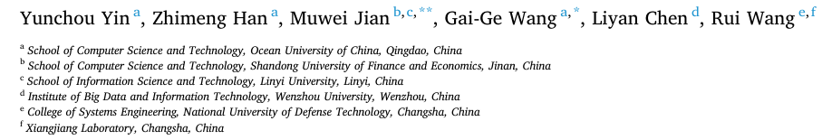
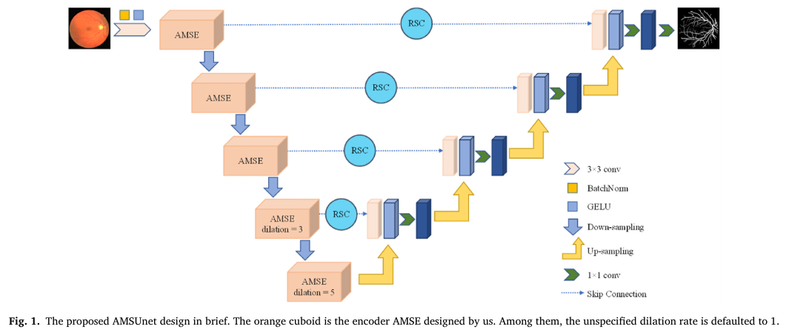

**AMSUnet: A neural network using atrous multi-scale convolution for medical image segmentation**

## 저널 : COMPUTERS IN BIOLOGY AND MEDICINE, 2022년 기준 Q1, 14%

https://www.sciencedirect.com/science/article/pii/S0010482523005851
https://github.com/llluochen/AMSUnet

## 저자 : 

1. **소개**
   - 최근 몇 년 동안, Unet과 그 변형은 의료 영상 처리 분야에서 놀라운 성공을 거두었습니다. 그러나 일부 Unet 변형 네트워크는 매개변수의 수를 크게 늘리면서 성능을 향상시킵니다.
   - 이 연구에서는 SegNeXt에서 영감을 받아 atrous multi-scale (AMS) convolution을 사용하는 의료 영상 분할 네트워크 모델인 AMSUnet을 개발하였습니다. 이 모델은 atrous와 multi-scale convolution을 사용하여 convolutional attention block AMS를 구성하였습니다.
   - 이 모델은 경량화를 목표로 하면서도 2.62 M의 매개변수만 필요로 합니다. 다양한 데이터셋에서의 실험 결과, 설계된 모델의 분할 성능은 작은, 중간, 큰 규모의 대상에 모두 우수하다고 합니다.

2. **관련 연구**
   - Unet은 의료 영상 분할을 위해 제안되었으며, 이후 다양한 Unet 변형이 제안되어 의료 영상 분할 분야에서 빠르게 발전하였습니다. Unet은 encoder-decoder 구조를 채택하였으며, 특징 추출을 위해 다양한 합성곱 연산이 제안되었습니다.
   - atrous convolution, multi-scale convolution과 같은 다양한 합성곱 연산이 특징 추출을 더 효율적으로 만들기 위해 제안되었습니다.
   - 주목할 만한 Unet 변형으로는 ConvUNeXt, UNeXt 등이 있습니다. 이들은 기존의 Unet 구조를 개선하여 더 나은 성능을 달성하려고 노력하였습니다.

3. **AMSUnet**
   - AMSUnet의 핵심 부분은 AMS convolutional attention block입니다. 이 블록은 지역 정보를 집계하기 위해 atrous depth-wise separable convolution, 다양한 규모의 정보를 캡처하기 위해 multi-branch depth-wise strip convolution, 그리고 multi-scale 정보를 집계하기 위해 1x1 convolution을 포함합니다.
   - 이 모델은 atrous convolution을 도입하여 지역 정보의 집계를 개선하려고 시도하였습니다. 이를 통해 더 넓은 수용 필드와 더 정확한 특징 맵을 얻을 수 있습니다.

4. **결론**
   - AMSUnet은 atrous multi-scale convolution을 사용하여 의료 영상 분할을 위한 특징을 추출하는 새로운 네트워크입니다. 이 모델은 경량화를 목표로 하면서도 우수한 성능을 보였습니다.
   - 다양한 실험을 통해 이 모델이 다른 모델보다 우수한 성능을 보였다고 주장하고 있습니다. 특히, 이 모델은 다른 모델보다 적은 매개변수를 가지면서도 높은 성능을 달성하였습니다.

# 나의 의견:
- 메디컬에서 계산량과 parameter을 줄이기위해 노력을 하는데 atrous convolution을 사용하여 개선한 점은 매우 흥미롭다. 
- 그리고 Multi-branch depth-wise strip convolution에서 depth convolution을 2개 사용하여 계산량을 줄이면서 성능을 높이려고 한 점도 흥미로운 점이다.
- 나의 모델에서도 이런점을 추가 할 수 있지 않을까?
- 이 모델역시 일부분 어디서 참고를 했지만, 다시 redesign 했다고 밝히고 있다. (e.g. SegNext의 MSAN 모듈)

