# ConvUNeXt: An efficient convolution neural network for medical image segmentation

## 저널 : Knowledge-Based Systems (2022), Q1, 12.8%

## 저자 : 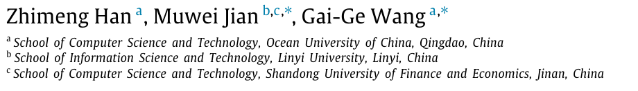

https://www.sciencedirect.com/science/article/pii/S0950705122007572

## Abstract :
- 최근 ConvNexTs 경쟁력있는 다양한 이미지 성능을 생산하기 위해 표준 ConvNet (CNN 기반 모델)로부터 만들었다.
- 이 논문은 classic UNet 기반 효율적인 모델이다. 
  - 낮은 parameters을 가지고 큰 성과를 만들었다.(medical image segmentation에서)
  - ConvNeXt에서 영감을 받아 설계된 모델은 ConvUNeXt라고 불리며 뛰어난 segmentation 우위(superiority)를 유지하면서 매개 변수의 양을 줄이는 방향으로 사용됩니다
  - 특히 **먼저 큰 컨볼루션 커널과 깊이별 분리 가능한 컨볼루션을 사용하여 매개 변수 수를 크게 감소시켜 UNet의 컨볼루션 블록을 개선한 다음 인코더와 디코더 모두의 residual 연결을 추가하고 다운 샘플링을 위한 컨볼루션을 채택하여 pooling을 포기**합니다. 
    - skip connection 중에는 낮은 수준의 의미 정보에서 노이즈를 걸러내고 관련 없는 기능을 억제하도록 경량 주의 메커니즘이 설계되어 네트워크가 대상 영역에 더 많은 attention를 기울일 수 있습니다.
  - 표준 UNet과 비교하여 우리 모델은 매개 변수가 20% 적으며, 다른 데이터 세트에 대한 실험 결과는 데이터 양이 부족하거나 충분할 때 우수한 분할 성능을 보이는 것으로 나타났습니다. 
  - 코드는 https://github.com/1914669687/ConvUNeXt 에서 확인할 수 있습니다.

**Keywords**
Convolution neural network, Deep learning, Medical image processing, Semantic segmentation

## 1. Introduction:

- 딥 러닝에 대한 추가 조사와 함께 의미론적 분할 기술은 큰 발전을 이루었다. 의미론적 분할은 초기 이미지를 특정 의미를 가진 개별 영역으로 분리하는 방법을 의미하며, 이에 따라 각 영역 블록의 의미론적 범주는 픽셀당 주석으로 식별됩니다.
  -  현재, 컨볼루션 신경망을 기반으로 한 의미론적 분할 방법은 FCN [25], SegNet [26], PSPNet [27], DeepLab [28], [29], [30], [31] 등과 같이 연속적으로 개발되어 왔습니다. 
  -  그러나 의료 영상은 일반적으로 작은 대상으로 복잡한 구조를 가지고 있기 때문에 실질적으로 개별 개체의 경계가 모호하고 정상 조직과 중첩되기 때문에 의료 영상의 자동 의미론적 분할은 여전히 매우 어렵습니다. 
- 반면, 건너뛰기 연결이 있는 UNet [33] 코덱 구조는 다른 수준의 기능을 융합할 수 있으므로 의료 영상 분할을 탐구하기 위한 새로운 생각을 제공합니다. 
- 본 논문에서는 의료 영상 분할에 대한 개선된 절차로 훈련된 표준 UNet에 초점을 맞추어 기존 UNet에 비해 매개 변수 수를 크게 줄여 더 나은 분할 성능을 달성합니다.
  
- 논문의 리마인드는 다음과 같이 정리되어 있습니다. 
  - 2절에서는 먼저 관련 작업의 현재 진행 상황을 설명합니다. 
  - 3절에서는 UNet을 ConvUNeXt로 변환하는 방법을 단계별로 설명합니다. 
  - 그리고 실험 결과는 4절에 제시되어 있습니다. 
  - 마지막으로 5절에서는 본 논문에 대한 결론과 논의를 도출합니다(그림 1 참조).

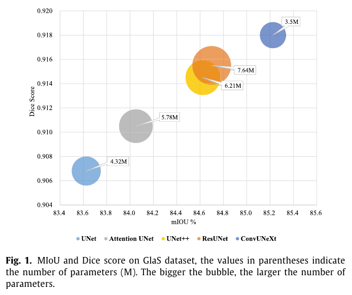

## 2. Related work

- UNet은 높은 효율성으로 인해 의료 이미지 분할 영역에서 주류 아키텍처가 되었습니다. 
  - 분할의 성능을 더욱 향상시키기 위해 연구자들은 UNet 아키텍처를 탐색하고 많은 개선된 방법을 제시하기 위해 개발했습니다.
  -  이 절에서는 다양한 기술적 관점에서 UNet의 몇 가지 대표 및 다양한 변형을 간략하게 소개할 것입니다.

### 2.1. Enhanced feature fusion

- **의료 영상 구조의 복잡한 특수성으로 인해, 낮은 수준과 높은 수준의 시맨틱 정보는 모두 상호 보완적이고 매우 중요**합니다 [34], [35].
  -  따라서, UNet은 상향 샘플링을 수행할 때 낮은 수준의 시맨틱 정보와 통합하기 위해 생략 연결을 채택하지만, 낮은 수준의 시맨틱 정보를 직접 연결하는 최적의 방법은 아닙니다. 
  -  따라서, 특징 융합(feature fusion.)을 향상시키기 위해 많은 방법이 제안됩니다. 
  -  특히, 주의 UNet [36]은 인코더의 각 해상도의 특징을 디코더의 해당 특징과 연결하기 전에 인코더의 출력 특징을 변경할 목적으로 UNet에 주의 모듈을 결합하여 도입되었습니다. 
  -  모듈은 게이트 신호(gated signal)를 생성하여 서로 다른 공간 위치에서 특징의 중요성을 제어하고, 특정 로컬 영역에서도 관련된 특징을 강조하면서 입력 영상의 관련 없는 영역을 억제(suppress)합니다.

## 2.2. Add residual structure

- ResNet 네트워크 구조는 가장 성공적인 딥 러닝 모델 중 하나가 되었고 ResNet 네트워크 구조에 의해 설계된 잔여 구조는 이후의 접근 방식에 의해 널리 채택되었습니다. 
  - 의료 이미지 분할을 다루기 위해 Xiao et al. [37]는 잔여 구조를 UNet에 도입하고 가중 주의 메커니즘이라고 불렀습니다. 
  - 이 메커니즘을 채택함으로써 모델은 관심 대상 영역에 초점을 맞출 뿐만 아니라 관련 없는 잡음 배경도 폐기했습니다.

### 2.3. Improved skip connection

**UNet++ [38]**
- UNet의 직접 연결은 너무 거칠어서 연결된 두 컨볼루션 계층의 입력 간에 의미적 차이가 크고 네트워크 학습의 어려움도 증가할 것입니다.
  -  따라서 의미적 차이를 완화하기 위해 UNet의 직접 연결을 기반으로 UNet++는 조밀 구조와 유사한 컨볼루션 계층을 추가했습니다. 
  -  한편, 동일한 조밀 블록의 이전 컨볼루션 계층의 출력은 하위 조밀 블록의 업샘플링 동작과 융합됩니다. 
  -  이를 통해 인코딩된 특징의 의미적 수준이 디코더에 대기 중인 특징 맵의 의미적 수준과 더 유사해집니다.
  -  dense skip connections의 장점은 모든 이전 특징 맵이 누적되어 각 스킵 경로의 조밀 컨볼루션 블록을 통해 현재 노드에 도달함을 보장합니다.

**UNet3+**
- 낮은 수준의 피처 맵은 객체 경계를 강조할 뿐만 아니라 풍부한 공간 정보를 캡처할 수 있습니다. 
  - 이에 상응하여 높은 수준의 의미 피처 맵은 객체의 위치 정보를 반영합니다. 
  - 그러나 이러한 미묘한 신호는 아래로 샘플링하거나 위로 샘플링할 때 점차 손실될 수 있습니다. 
  - 이 문제를 해결하기 위해 UNet3+는 전체 다중 스케일에서 세밀한 세부 사항과 거친 수준의 의미를 캡처하기 위해 서로 다른 스케일의 피처 그래프에서 높은 수준과 낮은 수준의 의미를 직접 결합하는 전면적인 스킵 연결을 설계했습니다.

### 2.4. Combined with traditional methods

- 의료 강도가 불균일하고 배경과 대상 사이의 큰 유사성으로 인해 의료 영상 분할은 여전히 큰 도전 과제입니다. 
- Shu et al. [40]은 레벨 설정 방법과 분할 브레그만 방법의 조합을 공동으로 기반으로 하는 활성 윤곽 모델을 제안했습니다. 
  - 이 모델은 다른 심장 조직 효과 및 이미지 강도 불균일성에 대한 강력한 견고성을 가질 뿐만 아니라 효과적인 조직을 추출하는 데 도움이 되어 최종 결과를 빠르고 정확하게 얻을 수 있습니다. 
  - 특히 간 분할 작업에서 간 CT 영상에서 종양 위치가 명확하지 않고 주변의 이미지 강도(intensities )가 간과 유사하여 원활한 경계를 가진 간 CT 영상을 정확하게 분할하기가 매우 어렵습니다. 
  - Shu et al. [41]은 level set framework를 기반으로 간 CT 영상 모델을 설계하기 위해 전통적인 방법을 딥 러닝 모델과 결합했으며, 분할의 효율성과 정확성을 향상시키기 위한 목적으로 UNet을 적용하여 정보를 제약했습니다.

## 2.5. Other variants

**UNeXt [42].**
- 이는 (1) 컨볼루션 단계와 (2) 토큰화 MLP 단계의 두 단계로 구분할 수 있는 UNet의 설계 철학을 따릅니다. 
  - 입력 영상은 먼저 세 개의 표준 컨볼루션 블록을 통과한 다음 두 개의 토큰화 MLP 계층을 통과하며 인코더와 디코더는 대칭입니다. 
  - 토큰화 MLP는 참조를 위해 Swin 트랜스포머를 사용하여 표준 MLP를 개선한 것입니다. 
    - 첫째, 특징 맵의 특정 채널의 축을 이동하고, 둘째, 완전히 연결된 계층을 통해 고차원 공간으로 매핑한 다음 깊이별로 분리 가능한 컨볼루션을 수행하고, 
    - 마지막으로 원본 채널과 맵을 완전히 연결된 계층을 통해 고차원 공간에서 다시 원래 공간으로 복원합니다. 
- UNExt는 매개 변수의 수와 계산량을 동시에 크게 줄여 CPU에서 빠른 속도로 실행할 수 있습니다. 
- 그러나 지나치게 경량화된 설계는 일반적으로 특징 표현을 불충분하게 하므로 모델의 정확성에 영향을 미칩니다.

**DoubleUNet**

- 그것은 두 개의 UNet 아키텍처의 통합입니다. 
  - 입력 영상은 수정된 UNet에 입력되어 예측 마스크를 생성하고, 이는 입력 영상 요소를 요소별로 곱한 다음 두 번째 성공한 UNet의 입력 역할을 합니다.
  - 두 번째 UNet의 디코더는 디코딩하는 동안 첫 번째 UNet의 각 단계의 인코더 출력을 결합하고 최종적으로 두 개의 UNet의 출력을 최종 출력으로 연결합니다. 
  - 두 번의 인코딩 및 디코딩은 더 높은 정확도를 달성하기 위해 높은 수준과 낮은 수준의 시맨틱 정보의 융합을 더 잘 촉진할 수 있습니다. 
- 그러나 두 개의 UNet의 적층 구조는 매개 변수 및 계산 양의 두 배 이상을 가져올 것입니다.

- **본 논문의 목적은 순수 심층학습을 적용하여 매개변수의 양과 정밀도의 균형을 맞출 뿐만 아니라 정확성을 잃지 않고 매개변수의 양을 최대한 줄이는 것입니다.**

## 3. Method

**Adapting the appropriate convolution kernel size.**

- Swin Transformer와 ConvNeXt는 다양한 컴퓨터 비전 작업으로 큰 성공을 거두었으며, 이러한 고급 설계 아이디어가 UNet 성능에 어떤 영향을 미치는지에 대한 핵심 질문으로 우리의 탐색을 이끌었습니다. 
  - 실제 실험에서 우리는 UNet의 성능을 개선하고 매개 변수 수를 줄일 수 있는 몇 가지 주요 구성 요소를 발견했습니다. 
  - 그림 2와 같이 우리는 전체 모델 매개 변수 수의 뚜렷한 감소와 병행하여 ConvUNeXt라는 의료 영상 분할에 대한 향상된 모델을 제안합니다. 
  - 이 절에서는 UNet을 ConvUNeXt로 개선하는 방법을 단계별로 설명하겠습니다.

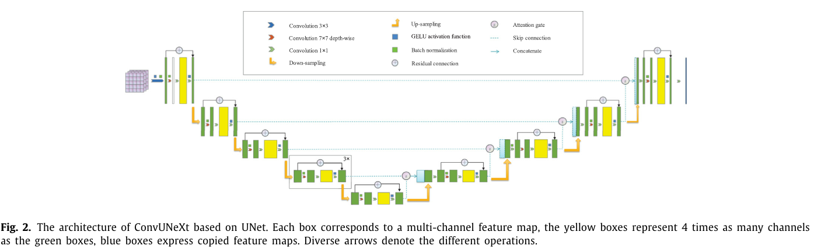

### 3.1. Changing convolution blocks

- 지난 몇 년 동안 VGGNet의 성공은 **큰 컨볼루션 커널이 여러 개의 작은 컨볼루션 커널(3 × 3)로 분할될 수 있으며, 이는 매개 변수 수를 줄일 수 있을 뿐만 아니라 비선형 계층을 증가시킬 수 있음을 보여**주었다. 
  - 그러나 일부 모델 아키텍처에서는 큰 컨볼루션 커널이 효과적으로 적용된다. 
  - 예를 들어, Swin Transformer의 자체 주의 모듈의 로컬 윈도우는 최소 7 × 7의 윈도우 크기를 사용하고, ConvNext는 7 × 7 커널 크기를 사용한다. 
  - 여러 커널 크기로 평가했으며, 7 × 7 커널 크기는 5 × 5의 커널 크기보다 약간 더 나은 성능을 생성합니다. 
  - 한편, 커널 크기가 클수록 매개 변수 및 FLOP 수가 급격히 증가하며, 더 나쁜 것은 모델의 성능을 저하시키는 결과를 초래합니다. 
  - 따라서 7 × 7 커널 크기는 모델에 채택됩니다.

**Depth-wise separable convolution.**

- **커널 크기의 증가와 함께 전체 매개 변수 수는 빠르게 증가**합니다. 
  - 높은 효율성을 달성하기 위해 커널 크기를 증가시키면서 깊이 분리 가능한 컨볼루션을 채택하여 매개 변수 수를 제어합니다. 
  - 실험 결과에 따르면 매개 변수 수는 정확도가 약간 감소함에 따라 크게 감소합니다. 
  - 따라서 깊이별 분리 가능한 컨볼루션은 컨볼루션 계층에서 채택됩니다.

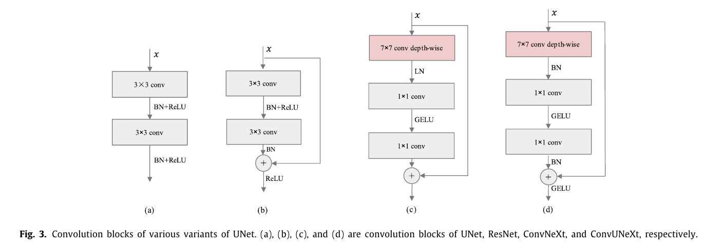

**Inverted bottleneck design.**

- 깊이별 분리 가능한 컨볼루션을 적용하면 FLOP가 증가하므로 반전 병목 현상의 신중한 설계가 필요합니다. 
  - 고안된 모델에서 정규화 및 MLP 계층은 모든 트랜스포머 블록에서 다중 헤드 자체 주의를 기울인 후 MLP 블록의 숨겨진 차원이 입력 차원보다 4배 더 넓습니다. 
  - 그림 3에 나타낸 바와 같이 ConvNext 블록은 유사한 설계를 적용하여 정규화 계층이 있는 컨볼루션 계층을 따라 1×1 커널 크기의 컨볼루션을 채택한 다음 4배만큼 채널의 수를 증폭합니다. 
  - 활성화 계층에서는 1×1 커널 크기의 컨볼루션을 채택하는 원래 채널의 수로 다시 감소합니다. 
  - 우리도 마찬가지로 모델에서 이 구조를 채택합니다. 
  - 실험 결과에 따르면 이 구조는 성능을 향상시키는 동시에 FLOP를 감소시킵니다.

- 활성화 함수와 정규화 층. Fig. 3(d)에서 정확도에 실제로 영향을 주지 않고 ReLU에서 Transformer에 널리 적용되는 GELU로 활성화 함수를 대체하여 실험을 진행하였는데 BN을 LN으로 대체하려고 했을 때 결과가 좋지 않아 본 전략을 채택하지 않았습니다.

**Residual connection.**

- Fig.3(b) 내지 Fig.3(d)에 나타낸 바와 같이 ResNet의 residual connection는 ConvNeXt의 잔여 residual connection와 상이합니다. 
  - 전자는 잔여 경로에 단축 경로를 추가한 후 활성화 계층으로 전송하는 것이고, ConvNeXt는 두 경로를 직접 추가하는 것입니다. 
  - 실험 비교 결과 ResNet의 잔여 연결 방법이 의료 영상 분할에 더 우수하고 더 적합한 성능을 보임을 알 수 있었습니다

### 3.2. Abandoned pooling and applied convolution for down-sampling
- 풀링은 피처 맵과 파라미터 및 계산의 수를 효과적으로 줄일 수 있지만 일반적으로 CNN의 일부 세부 정보를 손실합니다. 
  - 실험을 통해 계산량과 파라미터 수가 약간 증가했음에도 불구하고 피처 맵을 줄이기 위해 kernel size 2와 strixe 2를 가진 컨볼루션을 채택하는 것이 더 낫다는 것이 검증되었습니다. 
  - 또한 공간 해상도가 변경되기 전에 ConvNext의 설계 로직을 따르고 훈련 과정을 안정화하기 위해 정규화 계층을 추가합니다.

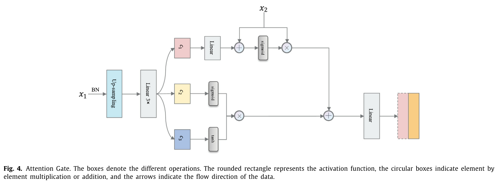

### 3.3. Skip connection
- 의료 영상 구조의 낮은 수준과 높은 수준의 시맨틱 기능을 확보하기 위해서는 업샘플링 시 낮은 수준의 시맨틱 정보를 융합해야 합니다.
  -  UNet의 직접 연결 방법은 너무 거칠기 때문에 LSTM [44]의 아키텍처를 참조하여 그림 4와 같이 Attention Gate라는 lightweight attention mechanism을 설계합니다.

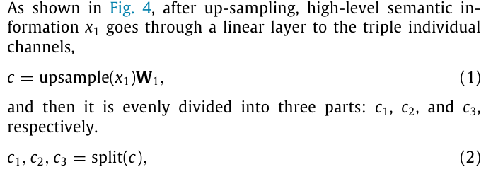

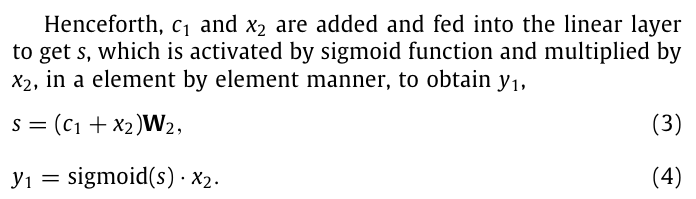

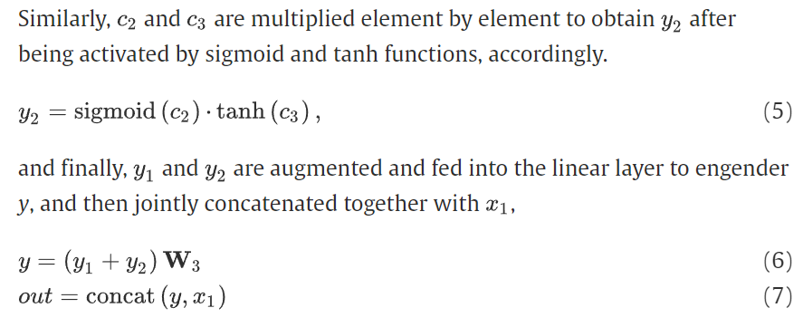

- 이 방법은 낮은 수준의 시맨틱 정보에서 노이즈를 걸러내고 관련이 없는 배경 특징을 억제하여 네트워크가 관심 대상 영역에 더 집중할 수 있습니다.

### 3.4. Changing stage compute ratio

- 기존 ResNet 모델은 3:4:6:3의 스테이지 계산 비율을 설계하기 위한 경험을 바탕으로 설계되었으며, 이후 모델의 설계에 영향을 미쳤습니다. 
  - 그럼에도 불구하고 Swin Transformer 모델은 스테이지 계산 비율을 1:1:3:1로 변경했으며 ConvNeXt 모델은 원칙적으로 이 설계를 따랐습니다. 
  - 실험 결과 UNet 인코더의 스테이지 계산 비율을 1:1:1:1에서 1:1:3:1로 변경하면 의료 영상 분할 작업에 적합한 것으로 나타났습니다.

## 4. Experimental results

### 4.1. Experimental settings

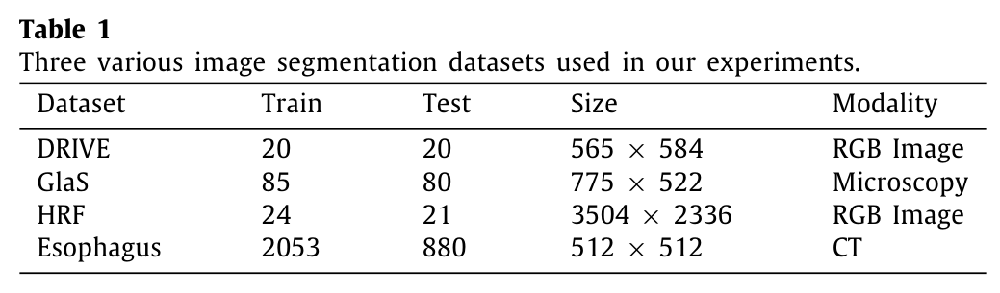

**Dataset**

- 표 1에 나와 있는 바와 같이, 우리는 널리 사용되는 세 가지 데이터 세트, 즉 망막 혈관 이미지에 대한 
- (1) 세그먼트 데이터 세트 드라이브 [45]에서 제안된 모델을 검증했습니다. 
  - 이 데이터 세트는 20개의 훈련 이미지와 20개의 검사 이미지로 구성되어 있으며 크기는 568 × 584입니다. 
- (2). GlaaS [46] 데이터 세트에는 T3 또는 T42 대장 선암의 조직학적 단면을 염색하는 총 165개의 H&E가 포함되어 있습니다.
- (3) 고해상도 안저 (HRF) 이미지 데이터베이스 [47]는 15명의 건강한 환자, 15명의 당뇨병 망막병증 환자 및 15명의 녹내장 환자의 망막 혈관 이미지로 구성되어 있으며 이미지의 크기는 3504 × 2336입니다. 이 데이터 세트는 훈련 세트의 24개 이미지와 검사 세트의 21개 이미지로 무작위로 분할되었습니다. 
  - 그리고 이미지 크기가 512 × 512인 2933명의 환자 CT 스캔을 포함하는 편평 식도암에 대한 자체 분할 데이터 세트와 유효성 검사 세트는 실험 평가를 위해 7:3 비율로 분할됩니다.

**Implementation details.**

- 우리는 비교 평가를 위해 Dice 계수 [48]과 MIoU (Mean Intersection over Union)를 모니터링했습니다. 
  - 이 모델들은 학습률이 4e-4인 AdamW [49]를 사용하여 300개의 시대 동안 훈련되었습니다. 
  - 우리는 교차 엔트로피 손실과 Dice 손실을 포함하여 손실 함수로 두 가지 평가 메트릭의 조합을 채택합니다. 
  - 5개의 에포치 선형 워밍업과 그 이후의 기하급수적인 붕괴 일정이 있습니다. 
  - 우리는 실험에서 4개의 배치 크기와 5e-5의 무게 감소를 사용합니다. 
  - 데이터 증가의 경우 랜덤 크기, 랜덤 크롭, 수평 플립 및 수직 플립을 포함한 일반적인 체계를 채택합니다. 
  - 이 세 가지 다양한 데이터 세트의 이미지 해상도가 다르기 때문에 DRIVE, GlaaS 및 Ethoagus 데이터 세트의 경우 이미지를 480 × 480으로 잘라냈고, HRF의 경우 원본 이미지의 이미지 해상도가 크기 때문에 객관적인 검증을 위해 각 이미지를 960 × 960으로 잘라냈습니다.

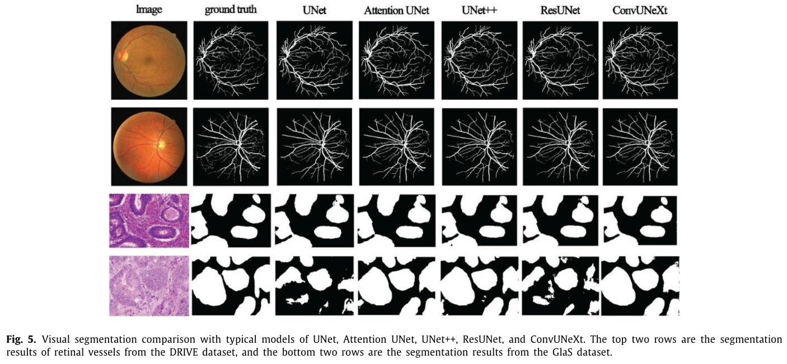

## 4.2. Experimental results

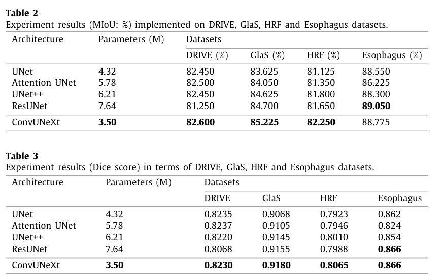

- 표 2, 표 3은 세 가지 다른 드라이브, Glas, HRF 및 식도 데이터 세트에서 수행된 UNet [24], Attention UNet [23], UNet++ [46], ResUNet [41] 및 ConvUNeXt의 매개 변수 수와 분할 정확도를 비교합니다. 
  - 표 2, 표 3을 보면 설계된 ConvUNeXt가 모델 매개 변수의 최소 양을 유지하면서 더 나은 성능을 제공한다는 것을 알 수 있습니다.
  -  실험 비교는 다음 섹션에서 분석할 수 있습니다:

**The performance of models with different numbers of parameters on different datasets.**

- ResUNet은 비교 테스트에서 가장 많은 매개 변수를 가진 모델로서 데이터 양에 민감하고 20개의 훈련 이미지만으로 DRIVE 데이터 세트에서 성능이 좋지 않습니다. 
  - 그러나 HRF 데이터 세트에는 약 20개의 훈련 이미지만 있지만 이미지 해상도가 크고 데이터 향상 후에도 충분한 데이터를 얻을 수 있으므로 ResUNet은 여전히 더 나은 성능을 발휘하고 있습니다.
  - 데이터가 분명히 증가함에 따라 ResUNet의 많은 매개 변수의 우세가 두드러져 2,053개의 훈련 이미지 데이터 세트에서 뛰어난 성능을 보였습니다.
  - 이는 많은 매개 변수를 가진 ResUNet 모델이 일반적으로 데이터 볼륨에 민감하다는 것을 보여줍니다. 
  - 동일한 많은 매개 변수를 가진 UNet+ 모델은 깊이 감독 메커니즘의 혜택을 받아 데이터 세트의 수에 관계없이 모델을 절단하고 더 나은 정확도를 얻을 수 있습니다. 
  - 깊이 감독의 의미는 다중 분기 네트워크로 각 분기에는 해당 Loss 함수가 있습니다. 
  - 그런 다음 전체 손실은 분기의 손실 함수로 가중치가 부여되고 누적됩니다. 
  - U-Net+ 네트워크의 총 손실은 위의 각 소규모 네트워크 손실의 중첩이므로 실제로 수동 가지치기의 복잡한 프로세스를 선택할 필요가 없습니다. 
  - 한편, 주의 UNet은 이상하게 행동하며 충분한 데이터가 있는 데이터 세트에서 만족스럽지 않게 수행합니다.

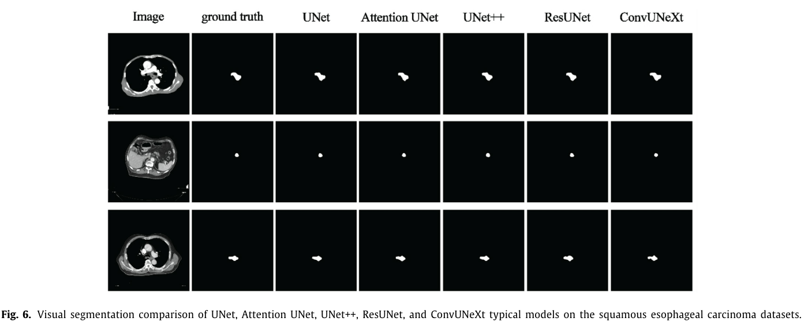

**ConvUNeXt compared to other models.**

- 비록 우리의 모델은 표준 UNet의 80% 매개 변수 수와 ResUNet의 46%만 가지고 있지만, 여전히 더 낮은 매개 변수로 더 나은 성능을 발휘합니다. 
  - 반대로, UNet++의 심층 감독 메커니즘이 없어도 ConvUNeXt는 훈련 데이터 볼륨에 둔감한 것을 보여줍니다. 
  - 서로 다른 양의 데이터를 가진 네 가지 유형의 데이터 세트에 대한 실험 결과는 제안된 모델의 효과를 검증합니다. 
  - 그림 5, 그림 6은 다른 일반적인 최신 모델과 비교하여 몇 가지 시각적 결과를 보여주는데, 이는 또한 고안된 ConvUNeXt가 만족스럽고 유망한 결과를 만들 수 있다는 것을 보여줍니다.

## 5. Conclusion and discussion

- 본 논문에서는 잔여 구조 추가, 폐기된 풀링 및 다운 샘플링을 위한 적용된 컨볼루션을 통해 UNet의 컨볼루션 블록을 개선하여 전체 매개 변수 수를 크게 줄였습니다. 
  - 한편, 특징 융합을 향상시키기 위해 게이팅 메커니즘을 제안하고 스테이지 계산 비율을 1:1:1:1에서 1:1:3:1로 수정했습니다. 고안된 모델은 경량 설계의 목표를 달성하는 동시에 분할 성능을 향상시킵니다. 
  - 기존의 다른 최첨단 방법과 비교하여 실험 결과는 모델이 효율적이며 공개적으로 사용 가능한 3개의 DRIVE, GlaaS, HRF 및 Ethoagus 데이터 세트에 따라 우수한 성능을 발휘한다는 것을 보여줍니다.

- 설계된 모델은 큰 커널 컨볼루션을 채택하고 있지만 PyTorch는 큰 커널 컨볼루션에 대한 지원이 부족하여 비디오 메모리 점유율이 증가하고 MLP 계층은 비디오 메모리의 오버헤드도 증가합니다. 
  - 향후 연구에서는 모델을 개선할 여지가 여전히 있습니다.

# 나의 의견 :
- Convnext라는 논문을 읽을 때, 내가 먼저 이것을 제안하려고 했다.
- 찾아보니 이미 논문이 나왔는데 지금 리뷰하는 논문이다.
- 일단 내가 Convnext라는 논문을 읽기전 모델을 만들고 있었는데, 논문을 읽고 나서 시간 낭비라 생각했다.
- 그래서 아이디어가 생각나면 비슷한 아이디어가 나왔는지 미리 체크를 해야 겠다. (물론 대학원 세미나에 발표자료를 만들기 위해서 급하게 실험한 경향이 있다.)
- 일단 논문은 contribution은 convnext를 unet으로 어떻게 잘 활용할지 실험한 논문이다.
- 그리고 그 과정중에서 realted work에서 medical segmetation이 어떻게 발전되고 있는지 간단히 서술했다.   
  
- 일단 어떻게 실험했고 어떻게 서술했는지 이런 점에서 배울 수 있는 좋은 논문이다.
- 근데 realted work을 글로 보아서 그런지 머리에 잘 그려 지지 않는다. 따라서 직접 찾아 보는게 떠 빠를것 같다.
- 근데 cvpr이랑 비교했을때 realted work간 연결이 잘 안되어 있다. 왜? 그런 자기 모델을 썼는지 이유가 잘 연결이 안된다.