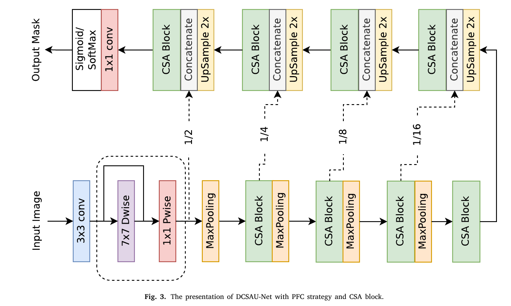

# DCSAU-Net: A deeper and more compact split-attention U-Net for medical image segmentation

https://arxiv.org/abs/2202.00972

## 저널 :  Computers in Biology and Medicine (q1, 2023)
## 저자 : 

## ABSTRACT

- U-net 구조가 biomedical image segmentation에 있어서 실용적이 사용에 있어 넓게 사용하며 큰 발전(breakthrough)을 이루었다. 
- 그러나 **encdoer 부분의 모든 다운샘플링 레이어와 단순히 스택된 컨볼루션의 동일한 설계는 U-Net이 서로 다른 깊이에서 기능의 충분한(sufficient) 정보(informatiON)를 추출(exctract)할 수 있도록 허용하지 않습니다**.
  - 의료 이미지 복잡성이 증가함에 따라 기존 방법에 새로운 문제 발생
- 본 논문에서는 **deeper and more compact split attention u-shape network(더 깊고 합축성 분할 attention U-nEt)을 제안한다. 이것은 두가지 framework 기반에서 low-level과 high-level의 semantic information 효율적으로 이용**한다.
- 우리는 제안된 모델은 union과 dice coefficient의 mean intersection의 관점에서 최신 성능을 보여 준다.
- 더 중요한 것은 제안된 모델이 challenging images에서 우수한 segmentation 성능을 나타냄을 보여준다.

## 1. Introduction

- **대장암(colon cancer), 다발성 골수종(multiple myeloma), 흑색종(melanoma)과 같은 종류의 암은 Medical image analyiss 역할은 진단(dianosing)와 치료( treating)에 필수**적이다. 
	- 예, **현미경(microscopy) 이미지의 수많은(numverous) 세포는 질병의 단계**를 설명하고, 종양(tumour) 유형을 식별하는데  도움을 주며, 세포(cellular)와 분자(molecular) 유전(genetic) 메너키즘(mechanisms)에 대한 통찰(insight)력을 지원하며(support), 암(cancer)과 chronic(만성) 폐쇄성(obstructive) 폐의(pulmonary) 병과 같은 많은 다른 응용 분야에 귀중한(valuable) 정보를 제공한다.
	- 전통적으로 의료 영상은 병리학자(pathologists)가 수동적(manually)으로 분석한다. 즉 진단 결과(result of diagnosis)는 대개 의료 전문가(medical experts) 경험에 의해 좌우 되며(dominated), 이는 시간이 많이 걸리고 주관적(subjective), 오류 발생(error-prone) 하기 쉽다.
	- CAD(computer-aided diagnosis)은 병리학(pathological) 연구자(researcher)와 임상(clinical) 실습(practice) 모두로부터 상당한 관심을 가졌다. 
- **분류(classificaton) 및 검출(detection task) 작업과는 달리 생물의학적(biomedical) 이미지 분할(segmentatiON)의 목표는 환자에게 보다 상세한 질병 분석을 제공할 수 있는 이미지의 배경에서 특정 개체를 분리**하는 것입니다
	- 기존의 고전적인 세분화 알고리듬은 에지 감지(edge detection), 임곗값(thresholding), 형태학(morphology), 두 객체 간 거리(distance between two ojbects) 및 픽셀 에너지(pixel energy)(예: Otsu Thresholding , Snake 및 Fuzzy 알고리듬)을 기반으로 합니다. 
	- 각 알고리즘에는 서로 다른 요구 사항을 수용(accommodate)할 수 있는 고유한 매개 변수가 있습니다. 
- 그러나 **이러한 알고리듬은 복잡한 데이터 세트의 일반화에 대해 제한적인 성능을 보이는 경우**가 많습니다.
	- 각 **알고리즘에는 서로 다른 요구 사항을 수용할 수 있는 고유한 매개 변수**가 있습니다. 
	- 그러나 이러한 **알고리듬은 복잡한 데이터 세트의 일반화에 대해 제한적인 성능**을 보이는 경우가 많습니다[9]. 
	- 이러한 방법의 **분할 성능은 영상 획득 품질에도 영향을 받습니다. 예를 들어 일부 병리학적(pathological) 이미지는 흐릿하거나 노이즈를 포함**할 수 있습니다. 
	- **불균일한(uneven) 조명(illuination), 전경과 배경 사이의 낮은 이미지 대비, 복잡한 조직 배경 등 다른 상황에도 부정적인 영향을 미칠 수 있습니다 [10]. 따라서 도전적인 이미지에 대한 적절한(adequate) 견고성(robustness)을 달성하고 다양한 생물 의학 애플리케이션에 대해 작동할 수 있는 강력하고 일반적인 모델을 구성하는 것이 필수적**입니다.

- **CNN(Convolutional Neural Network) 기반 인코더-디코더 아키텍처는 다양한(various) 의료 이미지 분할 작업에서 기존 이미지 처리 방법을 능가**했습니다 [11]. 
	- 이러한 모델의 성공은 **낮은 수준의 의미 정보와 높은 수준의 의미 정보를 통합(incorporate)하여 최종 마스크를 생성하는 스킵 연결 전략에 크게 기인**합니다 [12].
- 그러나 많은 **개선된 아키텍처는 심층적인 특징 추출 측면에서 알고리듬 최적화에만 초점을 맞추고 있으며, 이는 인코더의 헤더에서 고해상도 정보의 손실**을 무시합니다. 
	- 이 계층에서 **추출된 충분한 기능 맵은 풀링 작업 동안 손실된 공간 정보를 보완**하는 데 도움이 될 수 있습니다 [13].

- 본 논문에서는 **DCSAU-Net이라고 하는 의료 이미지 분할을 위한 인코더-디코더 아키텍처**를 제안합니다. 
	- 인코더 부분에서, 우리의 모델은 먼저 **매개 변수의 수와 계산량을 줄이고 네트워크의 장거리(long-range) 공간 정보를 낮은 수준의 의미 계층에 통합**하는 기본 기능 보존(primay feature conservation PFC) 전략을 채택합니다.
		- 이 계층에서 얻은 풍부한 기본 기능은 구성된 모듈, 즉 CSA(compact split-attention) 블록으로 전달될 것입니다. 
		- CSA 모듈은 **다중 경로 주의 구조(multi-path attention structure)를 사용하여 다양한 채널의 기능 표현을 강화**합니다.
		- 각 경로에는 CSA 모듈이 서로 다른 수신(receptive) 필드 스케일을 가진 혼합 피쳐 맵을 출력할 수 있도록 서로 다른 수의 컨볼루션이 포함되어 있습니다. 
		- 두 가지 새로운 프레임워크 모두 레이어 증가에 따른 그레이디언트 소실 문제를 완화하기 위해 잔류 스타일로 설계되었습니다.
	- **디코더의 경우, 모든 다운샘플링 계층의 인코딩된 기능은 스킵 연결에 의해 해당 업샘플링 기능과 연결**됩니다. 
		- 결합된 기능에서 효율적인 기능 추출을 완료하기 위해 동일한 CSA 블록을 적용합니다. 
		- 제안된 DCSAU-Net은 추가 지원 샘플(예: 초기화된 마스크 또는 에지 initialised mask or edge) 없이 쉽게 훈련할 수 있습니다.
		- `제안된 모델들이 각자 각기 다른 역할을 하고 있으며, 이것은 전과 다르게 성능 향상을 이루었다는 말이 된다.`
		-  이 작업의 주요 기여는 다음과 같이 요약할 수 있습니다:

- (1) 입력 이미지에서 충분한 기본 기능을 **캡처하기 위해 DCSAU-Net에 PFC라는 메커니즘이 내장**되어 있습니다. 
	- 다른 일반적인 설계와 비교하여 **PFC는 계산 효율성을 향상시킬 뿐만 아니라 네트워크의 수용 영역**을 확장합니다.
- (2) **DCSAU-Net의 다중 스케일 표현을 향상시키기 위해 주의 메커니즘이 있는 다중 분기 기능 그룹을 채택하는 CSA 블록을 구축**합니다.
	-  각 그룹은 **서로 다른 수신 필드 크기의 조합으로 피쳐 맵을 출력하기 위해 서로 다른 수의 컨볼루션**으로 구성됩니다.
- (3) 실험 분석은 2018 Data Science Bowl, ISIC-2018 병변 경계 분할 CVC-ClinicDB  및 두 개의 다중 클래스 분할 데이터 세트를 포함하여 5개의 서로 다른 의료 영상 분할 데이터 세트로 수행됩니다: SegPC-2021와 브라TS-2021. 평가 결과는 제안된 DCSAU-Net이 의료 이미지 분할을 위한 새로운 SOTA 방법이 될 수 있는 (IoU and Dice)는 표준 컴퓨터 비전 메트릭 측면에서 다른 최첨단(SOTA) 분할 방법보다 우수한 성능을 보여준다는 것을 보여줍니다.

## 2. Related work

### 2.1. Medical image segmentation

- 이러한 **아키텍처에서 영감을 받은 Zhou 등은 의료 이미지 분할을 위한 중첩된 U-Net(Unet++)을 제시**했습니다. 
	- **인코더와 디코더 사이의 기능 융합의 의미 정보 손실을 줄이기 위해 일련의 중첩(nested) 및 건너뛰기 경로가 모델**에 추가됩니다. 
	- Huang 등은 저해상도(low-resolution) 정보와 고해상도(high-resolution) 정**보를 서로 다른 규모로 결합하는 또 다른 풀 스케일 스킵 연결 방법을 설계**했습니다.
	- Jha의 두 개의 **U-Net 아키텍처를 순차적으로(sequentially) 구성하는 Double U-Net 네트워크를 구축(organises)**했습니다. 
	- **인코더 부분에서는 각 다운샘플 레이어의 끝에 Atrous Spatial Pyramid Pooling(ASPP)이 구성되어 컨텍스트(contextual)** 정보를 얻습니다.
	-  평가 결과는 **DoubleU-Net이 용종(polyp), 병변(lesion) 경계 및 핵(nuclei) 분할에서 잘 수행된다는 것을 보여줍니다. 더 깊은 네트워크를 수렴하려고 시도할 때 그라데이션 소실 문제**가 발견되었습니다.

- 이 문제를 해결하기 위해 He의 **다양한(different) 세분화(segmentation) 네트워크에 널리 적용되었던 심층 잔여 아키텍처(ResNet)를 도입**했습니다. 
	- 의료 영상 분할의 경우 Jha의 Res라고 불리는 용종(polyp) 분할을 위한 advanced(고급, 향상된) u-shape 아키텍처를 구축했습니다
	- UNet++. 이 모델에는 잔류 스타일, 스퀴즈 및 여기 모듈, ASPP 및 주의 메커니즘이 포함됩니다
	- Tarasiewicz 외. [28] 뇌종양(brain tumour) 분할을 위해 개발된 경량(lightweight) U-Net. 인셉션(inception) 모듈과 고밀도(dense) 블록은 광범위한(wide) 공간(spatial) 정보 수집을 위해 인코더와 디코더에 내장되어 있습니다.

- 그러나 **대부분의 모델은 단일 데이터 세트(single dataset) 또는 이진 분할 작업(binary segmentation)에서만 평가**됩니다. 
	- 네트워크 아키텍처를 수정하는 것과는 **대조적으로, Isensee은 데이터 사전 처리(pre-processing), 모델 교육 전략 및 결과 추론(inference)의 중요성을 강조하는 nnU-Net을 제안**했습니다. 
	- 모든 작업에 대해 nn-Unet은 모델의 가장 최적의 매개 변수를 **자동으로 검색**할 수 있습니다. 
	- 사소한 변경 U-Net으로 **23개의 공개 데이터 세트에서 평가되었으며 다른 알고리듬에 비해 뛰어난 성능**을 보여주었습니다.
	-  반대로, 우리의 접근 방식은 네트워크 자체의 향상에 초점을 맞추고 있습니다. 
	- 이러한 기술은 모든 아키텍처에도 적용되고 성능을 향상시킬 수 있기 때문입니다 [30], [31].

### 2.2. Attention mechanisms

- **채널 주의(channel attention) 사항 중 하나인 SENet [32]는 의료 영상 분할에 널리 적용**되었습니다.
	- 글로벌 평균 풀링이 있는 스퀴즈 모듈을 사용하여 글로벌 공간 정보를 수집하고 여기 모듈을 사용하여 피처 맵에서 **각 채널 간의 관계를 얻습니다. 공간 주의는 적응형 공간 위치 선택 메커니즘**이라고 할 수 있습니다.
	- **글로벌 평균 풀링(global average pooling)이 있는 스퀴즈(squeeze) 모듈을 사용하여 글로벌 공간 정보(global spatial information)를 수집하고 여기 모듈(excitation module)을 사용하여 피처 맵에서 각 채널 간의 관계**를 얻습니다.
	-  **공간 주의(spatial attention)는 적응형(adaptive) 공간 위치 선택 메커니즘**이라고 할 수 있습니다.
	- 예를 들어,**Oktay 등. 추가 계산 비용과 모델 매개 변수 없이 유용한 기능을 강조하는 특정 영역에 정확하게 초점을 맞출 수 있는 상향식 주의 게이트를 사용하는 attention U-Net**을 도입했습니다
- 또한, 일련의  ViT는 더 광범위한 분야에서 사용되고 있습니다. 
	- XU 외 **LeViT-UNET은 기능에서 먼 공간 정보(distant spatial information)를 수집할 것을 제안**했습니다. 
	- 또한 변**압기는 CNN과 통합되었을 때 강력한 성능**을 보여주었습니다.
	-  Chen 외, 제공된 트랜스이미지 패치를 얻기 위해 CNN을 인코더의 전반부(first half)로 선택하고 트랜스포머 모델을 사용하여 글로벌 컨텍스트(global context)를 추출하는 TransUNet. 디코더의 최종 혼합 기능은 보다 정확한 현지화를 달성할 수 있습니다. 
	- 그러나 transformer-based networks는 일반적(usually)으로 많은 수의 매개 변수를 포함(contain)하며 더 많은 컴퓨팅 소스를 소비합니다. 
	- **기존 주의 아키텍처를 최적화하고 가벼운 주의 모듈을 제안**합니다

### 2.3. Depthwise separable convolution

- **Depthwise separable convolution은 Howard 외 연구진이 제안한 효율적인 신경망 아키텍처**입니다. 
	- 이 아키텍처의 각 컨볼루션 필터는 하나의 입력 채널을 담당합니다.
	- **standard convolution과 비교하여 깊이별 컨볼루션(depthwise covlution)은 동일한 효과를 달성할 수 있을 뿐만 아니라 매개 변수와 계산 비용이 더 적게** 듭니다.
- 그러나 모든 입력 채널의 기능만 추출(extract)합니다. 
	- 채널 간의 정보를 결합하고 새 피쳐 맵을 만들기 위해 포인트별(point-wise) 컨볼루션이라고 하는 1×1 컨볼루션은 깊이별 컨볼루션(depth wise convolution)을 따릅니다. 
	- 최종 MobileNets 모델은 딥 러닝의 새로운 백본으로 확립(established)되고 고려되었습니다.
	- 이미지 분류 작업에서 Chollet은 깊이별 분리 가능한 (depthwise separable) 컨볼루션을 사용하여 이전 SOTA 방법을 능가하고 더 낮은 복잡성을 나타내는 Xception 모델을 구성했습니다. 
- 그러나 **Sandler 외 연구진 낮은 채널 특징 맵에서 깊이별 컨볼루션이 제대로 수행되지 않음을 관찰**했습니다..
	- 앞서 언급한 문제를 해결하기 위해, **그들은 형상의 차원을 미리 증가시키기 위해 깊이별 컨볼루션 앞에 1×1 컨볼루션을 추가하는 새로운 MobileNetV2 모델을 제안**했습니다.
	-  MobileNets와 비교하여 MobileNetV2는 매개 변수 수를 증가시키지 않고 성능 저하를 감소시킵니다.
- 의료 영상 분할에서 Qi 등. [43] 3D 뇌중풍(brain stroke) 병변 분할을 위한 X-net 모델을 도입했습니다. 
	- **깊이별 분리 가능한 컨볼루션을 사용하여 피처 맵에서 거리 공간 정보를 캡처하기 위해 피처 유사성 모듈(feature similarity module FSM)이 만들**어졌습니다. 
	- 실험 결과는 X-net 모델이 더 높은 성능을 달성하기 위해 다른 SOTA 모델의 매개 변수 수의 절반만 비용이 든다는 것을 보여줍니다.

## 3. Method

### 3.1. Primary feature conservation (PFC)

- **대부분의 의료 이미지 분할 네트워크에서 첫 번째 다운샘플링 블록 작업에 사용되는 컨볼루션은 이미지에서 낮은 수준의 의미 정보를 추출**하는 것입니다.  `원인을 말하고 있다.(어떠한 점이 문제점인지)`
	- 그림 1(a)의 **U-Net 아키텍처[22]는 다양한 모델[25], [35]에서 널리 사용**되었습니다. 
	- 그림 1(b)의 스**템 블록 [44]은 일반적으로 7×7 컨볼루션과 동일한 수용 필드를 얻고 파라미터의 수를 줄이도록 설계**됩니다. 
	- Res의 첫 번째 피쳐 스케일 다운샘플링 도면층UNet++ [27]은 그림 1(c)에 나타난 바와 같이 기울기 소실의 잠재적 영향을 완화(mitigate)하기 위해 스킵 연결(skip connection) 전략을 추가합니다.
- 더 **많은 컨볼루션 블록을 쌓으면 신경망의 수용 영역을 확장할 수 있지만, 매개 변수의 수와 계산량은 빠르게 증가**할 것입니다. 
	- 모델의 안정성이 손상될 수 있습니다.  `컨볼루션을 많이 쌓지 않은 이유` [CNN이 깊어지면 receptive filed가 작이지는 이유](../../../../0.0%20참고/CNN이%20깊어지면%20receptive%20filed가%20작이지는%20이유.md)
- 또한, **최근의 연구에 따르면 적층된 3 × 3 컨볼루션의 수가 계속 증가할 때 유효한 수용 필드가 어느 정도 감소**할 것이라고 합니다 [45].
	- 이 문제를 해결하기 위해 그림 1(d)에 제공된 첫 번째 다운샘플링 블록에서 새로운 기본 기능 보존(primary feature conservation PFC) 전략을 소개합니다.  `이것에 대해서 좀 조사해야 겠다. 적층된 구조를 막기 위해 지금 PFC를 제안 했다`
	- 우리 모듈의 **주요 개선(refinement)은 깊이별 분리 가능한(depthwise separable convolution) 컨볼루션을 채택하며, 7 × 7 깊이별 컨볼루션(depthwise convolution)과 1 × 1 점별(pointwise convolution) 컨볼루션으로 구성**됩니다.
- **depthwise separable convolution이 standard convoultion를 비교했을 때 parameter 수와 계산 비용을 감소시키기 떄문에, 우리는 distant(먼) 공간(spatial) 정보를 병합하고 가능한 주요(primary) features를 보존하기 위해  큰 크기의 kernel 크기의 depthwise convolution을 적용할 기회**를 가졌다.
	- **1x1 pointwise convolution은 채널 정보를 융합**하는데 사용됩니다.
	- `Convnext 역시 swin transfomer을 모방하지만 1x1을 channel 융합 하는데 사용한다.` 
	- 또한 **3x3 convolution은 이 모듈의 head에 더해진다. (feature channel 을 증가하기 위해 그 이유는 depthwise separable convolution이 low-dimensional feature에서 낮은 성능을 보이기 때문에)**
	- **모든 convolution은 ReLU 활성화와 BatchNOrm을 따른다**. 
	- **gradient vanish를 피하기 위해 PFC 블럭을 residual style**로 구성한다.
- 이를 위해 제안된 PFC 모듈은 parameters와 계산 커스트 증가없이 성능을 높일 수 있다. 게다가 우리는 7x7 kernel size의 depthwise convoltion을 사용한 이유는 Section 5에 설명된다.

### 3.2. Compact split-attention block

- VGGNet와 일반적인 typical residual 구조는 DoubleUnet과 ResUnet고 같은 이미 많은 이전 의미론적 분할 networks에 적용 되었다. 
	- 그러나 VGGNet의  convolutional layer은  바로 쌓인다. 
	- 즉 모든 기능 레이어(every feature layer)는 상대적(comparatively)으로 일정한(constant) 수신 필드를 가진다.
	- medical 이미지 분할에서 다양한 병명은 다른 사이즈를 가질 수 있다.
	-  multi-scale feature의 충분한 표현은 데이터 특징을 인식하는데 도움이 된다. 
	- 최근에는 Resnest와 같이 cross-channel feature을 통해 표현을 학습하는 다양한 모델이 쳬택 되었다.
- 그것들을 영감받아 우리는 새로운 compact split-attention (CSA) 구조를 개발했다.

- CSA 블록의 개요는 그림 2에 나와 있다. 
	- ResNest 는 기능 추출을 위해 large channel-split 그룹을 사용한다. 
	- 적절한 데이터와 막대한 매개 변수가 있는 일반적 컴퓨터 비전 작업에서는 더효율적입니다. 
	- 또한 이 모델의 각 그룹은 같은 동등한field size를 수용하는 convlutional operation을 채택합니다.  
	- 구조를 최적화하고 잘 segmentation하기 위해 그들의 제안 block은 2개 feature group을 유지한다. (전체적인 네트워크의 파라미터를 줄이기 위해)
	- 이 2개의 그룹은 input feature로 부터 2개의 그룹으로 나뉘어 다른 F_1 변환에 공급된다.
	- 채널간의 표현을 개선하기 위해 다른 그룹(F_2)의 출력 기능 맵은 첫번째 그룹(F_1)의 결과를 합산하고 다른 3x3 convoluton에 거친다. 
	- ( 나누어진 groups으로 부터 semantic information을 수렴 할수 있게 그리고 네트워크의 수용(receptive) 필드를 넓힐 수 있다.) 
	- 그러므로 CSA block은 feature map으로 부터 global과 local 정보의 강한 능력을 가진다. 수학적으로 fusion feature map을 정의 할 수 있다.

- H,W, 그리고 C는출력 feature maps의  척도 이다. 
  - global average pooling에 의해 생성된 channel-wise statistics(통계)는 global한 공간(spatial) 정보를 모은다.
  -  (이것은 spatial dimension과 계산된 c번째 구성요소로 부터 압축된 변환에 의해 생성된다.)

- channel-wise soft attention은 기본(cardinal) 그룹 표현으로 표현 되는 weighted 융합(fusion) 집께(aggregating)으로 사용됩니다. 
  - (분할 가중치 조합이 featur map에서 결정 정보를 잡을 수 있게 해줍니다.)  그런다음 c 번째 feature map 채널에 계산 된다.

- a_i 는 soft 집계 가중 디자인 이다: 

- Y_i^c 는 c번재  처낼에 대한 global spatial information S의 가중치를 나타내며 BatchNorm과 ReLU 활성화 함수로 이루어진 2개의 1x1 convolutions을 사용하여 정량화 한다.
	- 결과적으로 전체 CSA 블록은 출력 Y가 스킵 연결을 사용하여 계산되는 표준 residual architecture로 설계된다. 
	- Y = V +X 출력 feature map 사이즈와 input feature map 사이즈가 같을때. 
	- 그렇지 않으면, 동일한 모양을 얻기 위해 추가 변환이 적용된다. 
	- 예를 들어 strixe 또는 convolution 그리고 pooling 혼합된 컨볼루션일 수 있다.

### 3.3. DCSAU-Net architecture

- 의료 이미지 분할을 위해, **우리는 인코더와 디코더구조를 따르는 제안된 PFC 전략과 CSA블럭을 사용하는 모델**을 설립하다. ( 그림 3에 나와있는 DCSAU-NET이라고 한다.)
	- **DCSAU-Net 인코더는 들어온 이미지의 low-level 정보를 추출하기 위해 맨처음 PFC 전략**을 사용한다. 
		- 큰 7x7 커널 사이즈인 depthwise separable convolution은 **수용필드를 넓게 하고 주요 기능을 보전 할수 있다**.(parameter 수를 늘리지 않으며)
	- **CSA block은 서로 다른 convolution수와 attention 메카니즘을 가지고 있는 multi-path feature 그룹 들로 이루어져** 있다. 
		- (서로 다른 수용 필드 스케일에 걸쳐 채널 정보를 통합하고 의미 있는 의미론적 기능 강조한다)
	- **각 블록 다음에는 다운 샘플링 작업을 수행하기 위해 스트라이드 2가 있는 최대 2x2 max pooling**이 이어 진다.
	- **모든 디코더 하위네트워크는 upsampling 연산자로 시작하여 입력 이미지의 원래 크기를 단계적으로 복구**한다.
	- skip connection은 이러한 피쳐 맵을 해당 인코더 계층의 피쳐 맵과 연결하는 데 사용되며, 이는 **낮은 수준과 높은 수준의 의미 정보를 혼합하여 정확한 마스크를 생성**합니다.
	- skp connection 다음에 CSA block이 나오며 gradient vanishing 문제와 feature 효율적으로 잡는다.
	- 마지막으로 1x1 convolution은 성공했다 . sigmoid 또는 softmax layer가 이진 또는 다중 클래스 분할 마스크를 출력하는데 사용했다.

## 4. Experiments and results

### 4.2. Evaluation metrics

- mean intersection over union(mIoU), accuarcy, recall, precision 그리고 dice coefficient (DSC)는 메디컬 이미지 분할 하는데 standard metircs 이다.
	- 여기서 mIoU는 각 모델 간의 성능을 비교를 위해 compeition(경기)에서 사용 되는 일반적인 메트릭이다.
	- The p-values of the paired t-tests are also reported. 쌍체 t-검정의 p-값도 보고됩니다.

### 4.3. Data augmentation

- **의료 이미지 데이터 세트는 일반적으로 이미지를 획득하고 주석을 달기 때문에 교육 단계에서 사용할 수 있는 샘플 수가 제한되어 있습니다 .(과적합 쉽다)**
	- 이 문제를 **완화하기 위해, 데이터 확대 방법은 일반적으로 샘플의 다양성을 확장하고 모델 일반화를 향상시키기 위해 훈련 단계에서 사용**됩니다. 
	- 우리의 실험에서,**우리는 각 데이터 세트의 훈련 세트에 0.25의 확률로 수평 플립, 회전 및 컷아웃을 무작위로 적용**합니다.

### 4.4. Implementation details

- 모든 실험은 단일 NVIDIA V100 Tensor Core GPU, 8코어 CPU 및 16GB RAM에서 PyTorch 1.10.0 프레임워크를 사용하여 구현됩니다. 
	- 우리는 공통 분할 손실 함수인 Dice 손실과 학습 속도가 1e-4인 Adam Optimizer를 사용하여 모든 모델을 훈련합니다. 
	- 배치 크기 및 에포크 수는 각각 16개 및 200개로 설정됩니다. 
	- 교육 중에 CVC-ClinicDB 및 2018 Data Science Bowl 데이터 세트에 대해 이미지 크기를 256 × 256으로 조정합니다.
- ISIC-2018 및 SegPC-2021 데이터 세트의 경우 입력 이미지 크기가 512 x 512로 조정됩니다. 
- BraTS 데이터 세트에 대한 모델을 훈련하기 위해 모든 다중 매개 변수 자기 공명 영상(multi-parametric magnetic resonance imaging mpMRI) 스캔에서 2D 슬라이드를 추출합니다. 
- 또한 학습 속도를 최적화하기 위해 ReduceLRONPlateau를 적용합니다. 
- 5개의 데이터 세트에 대한 모든 실험은 동일한 열차, 검증 및 테스트 데이터 세트에서 수행됩니다. 
	- 또한 기본 매개 변수를 사용하여 다른 SOTA 모델을 훈련하는 한편, Trans를 훈련할 때 사전 훈련된 ViT 모델이 로드됩니다UNET 및 LeViT-UNET. 나머지 모델은 처음부터 교육을 받습니다.

### 4.5. Results

#### 4.5.1. Comparison on CVC-ClinicDB dataset

- 표 2에서 DCSAU-Net은 DSC 0.916과 mIoU 0.861을 달성하여 DSC 측면에서 DoubleU-Net을 2.0%, mIoU 2.5% 능가합니다. 
- 특히, 제안된 모델은 DCSAU-Net의 MioU가 6.2%, Trans7% 이상인 두 개의 최근 변압기 기반 아키텍처에 비해 크게 개선되었습니다UNet과 LeViT-UNet, DCSAU-Net의 DSC는 이 두 모델보다 각각 4.9%, 8.8% 높습니다.

#### 4.5.2. Comparison on SegPC-2021 dataset

- 의료 영상 분석을 위해 일부 의료 영상에는 분할이 필요한 다중 클래스 개체가 있을 수 있습니다. 
	- 이러한 요구를 충족시키기 위해, 우리는 두 가지 다른 종류의 셀로 SegPC-2021 데이터 세트의 모든 모델을 평가합니다. 정량적 결과는 표 3에 나와 있습니다.
	- 다른 SOTA 모델과 비교하여 DCSAU-Net은 정의된 모든 메트릭에서 최고의 성능을 보여줍니다. 
	- 구체적으로, 우리가 제안한 방법은 DoubleU-Net 아키텍처에 비해 Unet++보다 3.6%, DSC에서 2.8% 더 큰 상승과 함께 0.8048의 mIoU 점수를 생성합니다.

#### 4.5.3. Comparison on 2018 data science bowl dataset

- 핵 분할은 생물 의학 이미지 분석에서 중요한 역할을 합니다. 
	- DCSAU-Net 및 기타 SOTA 네트워크의 성능을 평가하기 위해 2018년 데이터 사이언스 볼 챌린지의 개방형 액세스 데이터 세트를 사용합니다. 
	- 각 모델 간의 비교는 표 4에 나와 있습니다. 
	- 결과는 DCSAU-Net이 Trans보다 1.9% 높은 0.914의 DSC를 달성한다는 것을 보여줍니다
	- UNet 및 mIoU는 UNet3+보다 2.5% 높은 0.850입니다.

#### 4.5.4. Comparison on ISIC-2018 dataset

- 표 6은 병변 경계 분할 작업에 대한 ISIC-2018 데이터 세트의 정량적 결과를 보여줍니다.
	- mIoU는 과제에 대한 공식 평가 지표입니다. 
	- 표 6에 따르면, DCSAU-Net은 이 메트릭에서 LeViT-UNet보다 2.4%, DSC에서 UNet3+보다 1.8% 증가했습니다. 
	- 나머지 메트릭 내에서 우리 모델은 0.922의 리콜과 0.960의 정확도를 달성하여 다른 기준 방법보다 우수합니다. 
	- 또한, 높은 리콜 점수는 임상 애플리케이션에서 더 유리합니다.

#### 4.5.5. Comparison on BraTS-2021 dataset

- 뇌종양 분할은 MRI 분석에서 중요한 단계입니다.
	-  DCSAU-Net 및 기타 방법은 Bra에서 평가됩니다
	- TS-2021 데이터 세트. 각 모델 간의 비교는 표 7에 나와 있습니다.
	- DCSAU-Net은 ResUnet++보다 각각 1.7%, 2.1% 높은 0.703의 DSC를 달성함을 알 수 있습니다. 
	- 차선의 2D 아키텍처를 사용하지만 제안된 모델에는 여전히 상당한 개선 사항이 있습니다.
	-  전반적으로, 제안된 모델은 정밀도와 정확도를 포함한 대부분의 평가 지표에서 가장 높은 점수를 보여줍니다.

### 4.6. Ablation study

- 이 섹션에서는 DCSAU-Net에 대한 확장 절제 연구를 수행합니다. 
	- 매개변수 수, 부동소수점 연산(FLOP) 및 초당 프레임 수(FPS)를 계산하여 각 모듈의 효과를 더 자세히 조사합니다. 
	- 표 5는 5개 데이터 세트 모두에서 5개 구성의 절제 결과를 제공합니다.

#### 4.6.1. Significance of PFC strategy

- **PFC 전략은 제안된 DCSAU-Net 모델의 필수적인 부분**입니다. `왜 필수적이지? 어떻게 증명 한거지?`
	- **커널 크기가 큰 나머지 깊이별 분리 가능 아키텍처를 사용하여 초기 다운샘플링 블록에서 낮은 수준의 의미 정보를 풍부하게 하고 보다 정확한 분할 마스크를 생성하는 데 도움**이 됩니다. 
	- 우**리는 네트워크 구성인 U-Net과 U-Net + PFC를 비교하여 PFC 전략의 효율성을 평가**합니다. `아 ablation study와 비슷하게 비교 실험을 해서 증명 했구나` 
	- 표 5의 mIoU 메트릭에서 PFC는 CVC-ClinicDB 데이터 세트에서 1.9%, SegPC-2021에서 1.4%, 2018 Data Science Bowl 데이터 세트에서 2.2%, ISIC 2018 데이터 세트에서 1.9% 향상을 보여줍니다. 
	- 따라서 PFC 전략은 원래 U-Net의 성능을 향상시킨다고 결론 내릴 수 있습니다.

#### 4.6.2. Effectiveness of CSA block

- DCSAU-Net 모델은 CSA 블록을 사용하여 의료 영상에서 다양한 크기의 병변을 인식할 수 있는 다중 스케일 기능 맵을 결합합니다. 
	- **CSA 블록의 효과는 표 5의 U-Net과 U-Net + CSA의 구성을 비교하여 평가**할 수 있습니다. 
	- mIoU에서 CSA 블록은 CVC-ClinicDB 데이터 세트에서 3.1%, SegPC-2021에서 1.5%, 2018년 데이터 사이언스 볼 데이터 세트에서 3.1%, ISIC 2018 데이터 세트에서 2.8% 향상을 달성합니다. 
	- 따라서 CSA 블록이 U-Net 모델보다 성능이 우수하고 PFC 전략보다 영향이 크다고 주장할 수 있습니다. 
	- DCSAU-Net 모델(U-Net + PFC + CSA)은 두 모듈을 모두 활용하여 단일 PFC 또는 CSA 모듈을 사용하는 U-Net에 비해 DSC를 0.6% - 3.5%, mIoU를 1.1% - 3.3% 더 향상시킬 수 있습니다.

## 5. Discussion

- 의미론적 분할은 의료 영상 분석 분야에서 널리 관찰되었습니다. 
	- 많은 딥 러닝 모델은 인코더-디코더 아키텍처를 구성하고 스킵 연결을 통해 낮은 수준에서 높은 수준의 의미 정보를 융합합니다.
	- 이러한 방법은 일반적으로 U-Net 블록을 인코더의 헤더로 선택하여 낮은 수준의 의미 정보를 추출하는데, 이는 이미지에서 일부 중요한 기능을 놓칠 수 있습니다.
- 우리의 접근 방식은 이러한 주요 기능을 최대한 유지하는 PFC 전략을 구축하기 위해 더 큰 커널 크기를 가진 깊이별 분리 가능한 컨볼루션을 채택합니다.
	- 또한, 우리는 표 8에 제시된 다양한 커널 크기를 가진 깊이별 컨볼루션이 성능에 미치는 영향을 탐구합니다.
- 실험 결과를 통해 DCSAU-Net 모델이 3×3, 5×5, 7×7 커널 크기를 사용할 때 유사한 성능을 달성할 수 있음을 관찰할 수 있습니다.
	- 실제 시나리오에서 사람들은 매개 변수의 수와 계산 비용을 줄이기 위해 작은 커널 크기를 선택할 수 있습니다. 
- 그러나 연구에서 제안된 아키텍처의 최고 성능을 표시하기 위해 7×7 커널 크기를 사용하여 모델을 훈련합니다.
	- 깊이별 분리 가능한 컨볼루션의 효율성을 기반으로, 이러한 계층을 더 추가하면 낮은 수준의 의미 계층에서 PFC 모듈의 정보 캡처 기능을 향상시킬 수 있으며, 이는 향후 연구에서 탐구할 가치가 있습니다.
	- 다음으로 다양한 채널 간의 연결성을 향상시킬 뿐만 아니라 주의 메커니즘으로 다양한 규모의 기능 표현을 강화하고 결국 다중 스케일 조합을 완료하는 CSA 블록을 설정합니다.
- 두 모듈의 효과는 표 5에 나와 있으며 절제 연구를 통해 입증되었습니다. 
	- U-Net은 DCSAU-Net 모델보다 추론 시간이 짧지만, 우리의 접근 방식은 동일한 출력 기능 채널에서 소수의 매개 변수를 사용하고 허용 가능한 추론 시간을 소비하므로 메모리가 제한된 기계에 배포하는 데 더 적합합니다.

- **의료 이미지 분할 작업에 대한 DCSAU-Net 모델의 상당한 개선이 있음을 추가로 입증하기 위해, 우리는 그림 4에 제공된 도전적인 이미지에 대한 모든 모델을 사용하여 분할 결과의 일부를 시각화**합니다.
	- **정성적 결과로부터, 제안된 모델에 의해 생성된 분할 마스크는 다른 SOTA 방법에 비해 불완전한 염색(staining)이나 모호성(obscurity)과 같은 낮은 품질의 이미지에서 더 적절한 전경 정보를 캡처**할 수 있습니다.
	- **DCSAU-Net의 분할 결과가 완전히 정확하지는 않지만, 형상 정보가 더 많은 이 불완전한 마스크는 조건부 무작위 필드를 적용하는 것과 같은 이미지 후 처리 알고리즘을 사용하여 수정**될 가능성이 있습니다.

- 그림 6에서, **우리는 DCSAU-Net이 작은 크기의 핵 또는 전경과 배경 사이의 높은 유사성으로 인해 대상을 이미지에서 분리하지 못하는 일부 분할 결과를 시각화**합니다. 
	- 우리의 실험에서, 우리는 표준 주사위 손실 함수를 기반으로 모든 모델을 훈련시킵니다. 
	- 그림 5에 나와 있는 5개의 데이터 세트에서 각 모델의 수렴 속도를 비교합니다.
- 제안된 모델이 처음 20년 동안 **다른 SOTA 방법보다 눈에 띄게 빠르게 수렴된다는 것을 관찰할 수 있으며, 이는 DCSAU-Net 모델이 더 적은 기간을 훈련함**으로써 신뢰할 수 있는 성능에 도달할 수 있음을 의미합니다.  `intro에서 말한 빠르고 빨리 수용한다는 것을 증명`
	- 또한 **대부분의 경우 다른 방법과 비교하여 DCSAU-Net의 성능 향상은 p-값이 0.05 미만인 통계적 유의성을 증명**할 수 있습니다. 
	- 또한 3D CNN은 볼륨 의료 영상 데이터의 관계 정보를 효율적으로 보존할 수 있습니다. 
	- 따라서 프레임워크를 3D로 확장하는 것이 향후 작업입니다. 
	- 또한 데이터 사전 처리, 모델 교육 및 추론에서 다른 고급 전략[29]을 사용하면 의료 이미지 분할의 성능을 더욱 향상시킬 수 있습니다. 
	- 요약하자면, DCSAU-Net은 다양한 의료 분할 작업에서 견고성과 우수한 성능을 보여주며, 우리는 그것이 의료 이미지 분할을 위한 새로운 SOTA 모델로 고려될 수 있다고 믿습니다.

## 6. Conclusion

- 본 논문에서는 DCSAU-Net이라고 하는 의료 이미지 분할을 위한 인코더-디코더 아키텍처를 제안합니다. 
- 제시된 모델은 PFC 전략과 CSA 블록으로 구성되어 있습니다. 
- 전자는 이미지에서 기본 기능을 보존하는 기능을 향상시킵니다.
- 후자는 입력 피쳐 맵을 두 피쳐 그룹으로 나눕니다. 
- 각 그룹은 서로 다른 수의 컨볼루션을 포함하고 주의 메커니즘을 사용하여 의미 있는 기능을 강조합니다. 
- 따라서 CSA 블록은 서로 다른 수신 필드에 피쳐 맵을 결합할 수 있습니다. 
- 우리는 5개의 의료 이미지 분할 데이터 세트에서 모델을 평가합니다. 
- 결과는 DCSAU-Net 아키텍처가 DSC 및 mIoU 메트릭에서 다른 SOTA 모델보다 높은 점수를 달성한다는 것을 보여줍니다. 
- 특히, 우리 모델은 다중 클래스 분할 작업과 복잡한 이미지에서 더 나은 성능을 발휘합니다. 
- 향후 3D 의료 영상 분할 작업을 위해 DCSAU-Net 아키텍처를 최적화하는 데 중점을 둘 것입니다.

# 나의 의견
- 이미지 분할을 위해 본인의 모델을 만들었따.
- 많이 참고하는 것은 Resnext였다.
- recepitve filed를 늘리고, depthwise convolution을 통해 스피드 역시 개선했다.
- 그리고 PFC를 이용하여 medical 이미지가 stacked 된 block에서 low-level에서의 이미지 손실을 최소화 했다.
- 나의 느낌은 막 신기한 실험은 아니였다. 하지만 여러논문을 읽어서 개선을 하려고 한 점이 매우 매력있다.
- 그리고 PFC를 설계함과 동시에 block을 개선하였다.
- 그리고 자신의 동기를 증명하기 위해 추가 실험에서 충분한 실험(수렴, flops 등등)을 통해 증명 했다.