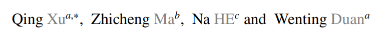

# DCSAU-Net: A deeper and more compact split-attention U-Net for medical image segmentation

https://arxiv.org/abs/2202.00972

# [DCSAU-Net 자세한 설명](./DCSAU-Net%20(2023).md)

## 저널 :  Computers in Biology and Medicine (q1, 2023)
## 저자 : 

"DCSAU-Net: A deeper and more compact split-attention U-Net for medical image segmentation" 논문은 의료 영상 분할을 위한 더 깊고 간결한 U-Net 아키텍처를 제안합니다. 이 논문에서 제안하는 DCSAU-Net은 두 가지 새로운 프레임워크를 기반으로 저수준 및 고수준 의미 정보를 효율적으로 활용합니다: 기본 피처 보존(primary feature conservation)과 간결한 분할 주의 블록(compact split-attention block).

1. 기본 피처 보존: 네트워크의 그림자 계층에서 네트워크의 장거리 공간 정보를 통합하고 매개 변수 수와 계산량을 줄이는 새로운 메커니즘이 제안됩니다. 이 계층에서 얻은 풍부한 기본 피처는 새로 구축된 모듈인 간결한 분할 주의 블록으로 전달됩니다.

2. 간결한 분할 주의 블록: 이 모듈은 다중 경로 주의 구조를 사용하여 다른 채널의 피처 표현을 강화합니다. 각 경로는 다른 수의 합성곱을 포함하므로 CSA 모듈은 다른 수용 필드 크기를 가진 혼합 피처 맵을 출력할 수 있습니다.

이 논문에서 제안하는 모델은 CVC-ClinicDB, 2018 Data Science Bowl, ISIC-2018 및 SegPC-2021 데이터셋에서 평가되었으며, 평균 IoU와 F1 점수 측면에서 다른 최첨단 방법보다 더 나은 성능을 보였습니다. 특히, 제안된 모델은 도전적인 이미지에 대한 우수한 분할 성능을 보였습니다. 

더 자세한 기술적 세부 사항은 다음 링크에서 확인할 수 있습니다: [https://github.com/xq141839/DCSAU-Net](https://github.com/xq141839/DCSAU-Net)

# 나의 의견
- 이미지 분할을 위해 본인의 모델을 만들었따.
- 많이 참고하는 것은 Resnext였다.
- recepitve filed를 늘리고, depthwise convolution을 통해 스피드 역시 개선했다.
- 그리고 PFC를 이용하여 medical 이미지가 stacked 된 block에서 low-level에서의 이미지 손실을 최소화 했다.
- 나의 느낌은 막 신기한 실험은 아니였다. 하지만 여러논문을 읽어서 개선을 하려고 한 점이 매우 매력있다.
- 그리고 PFC를 설계함과 동시에 block을 개선하였다.
- 그리고 자신의 동기를 증명하기 위해 추가 실험에서 충분한 실험(수렴, flops 등등)을 통해 증명 했다.