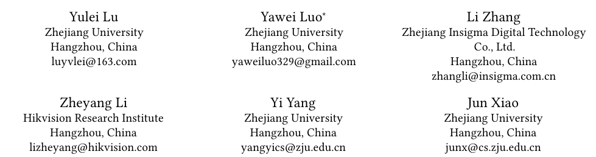

# Bidirectional Self-Training with Multiple Anisotropic Prototypes for Domain Adaptive Semantic Segmentation

## 저널 : [A1 정도](http://www.conferenceranks.com/?searchall=ACM%20Multimedia#data)

https://dl.acm.org/doi/pdf/10.1145/3503161.3548225

## 저자 : 

