# Prototypical Contrast Adaptation for Domain Adaptive Semantic Segmentation

## 저널 및 학회 : ECCV 2022, 거의 q1급

## 저자 : 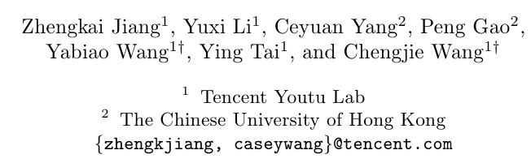

https://link.springer.com/chapter/10.1007/978-3-031-19830-4_3
https://arxiv.org/pdf/2207.06654.pdf%E4%BB%A3%E7%A0%81%E5%9C%B0%E5%9D%80%EF%BC%9Ahttps://github.com/jiangzhengkai/ProCA
https://github.com/jiangzhengkai/ProCA

[psedu에관련된 내용](/paper%20study/image%20study/0.0%20참고/0.0.1/psedu관련된%20내용.md)

## Abstract :

- Unsupervised Domain Adaptation (UDA)은 label이 있는 훈련된 모델은 unlabel된 target을 체택하는 거을 목표
- **Prototypical Contrast Adaptation (ProCA) 본인 제안한 모델.**
  - ProCA은 supervised domain adaptive semantic segmentation을 위해 간단하고 효율적인 contrastive learning 방법이다.
    - 이전 방법은 단순히 다양한 도메인에 걸치 intra-class representation distiributions(분포)의 정렬을 고려 했다.
    - 반면 inter-class strutural 관계 에는 불충분한 탐구 했다. 
    - 이는 target domian에 표현들을 정렬에서 source domain에서 하는 것처럼 쉽게 구분되지 않는다.
  - 대신에 ProCA는 class-wise prototypes안에 있는 inter-class information을 통합합니다.
    - 그리고 adaption을 위해 class-centered distribution alignment을 체택합니다.
  - postive로써의 같은 클래스 prototype와 negative로서의 다른 클래스는 class-centered distribution alignment을 성취하기위해 고려됨으로써, ProCA은 classical domain adaptation tasks에서 state-of-the-art 성능을 달성한다.
[inter and itra 차이점](/paper%20study/image%20study/0.0%20참고/0.0.1/ira%20and%20inter%20diffence.md)

## Introduction
- Deep neural network(DNN)의 개발 이후 많은 이미지 문제 그리고 semantic segmentation 문제에서 눈에 뛰게 개선을 이루었따.
  - 하지만 일부 학습되지 않은 testing data에서는 일부 drop이 일어 나고 있다.
  - target domain에서 pixel-wise large-scale semantic segmentation은 비용이 많이 들고 시간이 많이 소비된다.
  - 그래서 **Unsupervised Domain Adaptation (UDA)은 이러한 문제를 풀기 위해 유망한 방향**이다.

- UDA 몇몇 방법들은 **source 와 targe domain의 adversarial training losses을 최소화 하는 방법으로 두 도메인 간의 불일치를 줄였다**.
  - 구체적으로 two-player game으로 공식화되어 있다.
    - backbone network(i.e. ResNet-101 backbone) 은 feature 추출기로써, 반면 discriminator(구별기)는 어떤 domain에서 feature가 나왔는지 식별한다.
    - minmax game에서 평행상태에 도달하기 위해, 그것은 일반화를 위해 domain 불변성 representation 을 생성하기 위한 backbone network가 필요로 한다.
  - 몇몇 adverarial training은 두 도메인 사이에서 정렬되고 구별 할 수하는 특징의 분포를 초래한다.
  - 그러나 global feature distribution은 domain들에 걸쳐 closer(밀집) 되더라도, 그것은 target domain에 different semantic categories의 기인하여 pixels이 잘 구별 되도록 보장 되지 않는다.
    - 그것은 poor 일반화 능력과 성능이 저하된다.
    - `위에 문제점들을 나열 했다. 근데 잘 이해가 되지 않는다. 무슨 말이지?`
    - [조금더 문제점에 관련 자세한 설명](/paper%20study/image%20study/0.0%20참고/0.0.1/왜%20UDA가%20나왔는지%20그리고%20문제점.md)

- 위에 문제들을 해겨하기 위해, **몇몇은 category-wise information을 고려대상**으로 하다.
  - 높은 신뢰도 예측을 장려하는 아이디어는 결과의 **entropy를 최소함**으로써 이루어졌따.
    - 두 **classifiers(분류자)의 output 사이의 불일치는 implicitly(암묵적)으로 category-level alignment을 달성하는데 활용** 되었다.
  - 추가로 **fine-grained adverarial learning framework는 domain discrimination에서의 class information 을 통합하기 위해 제안** 되었다. 
    - 그것은 **fine-grained level 에서의 특징 배열에 도움**을 준다.
  - 그러나 **이전 접근들은 몇몇 intra-class에서의 adversarial training은 source 와 target dmoain 간 representational structure의 일관성으로 독려하지 않는 경향**이 있다.
    - **즉(namely), 어느정도로(to some extent), targent domain에서 multiple categories는 같은 group에서 잘 투영이되고, 같은 그룹은 반대로 source domian에서 잘 구별**된다.
  - 그러므로 단지 intra-class distributional alignment는 labeled source data로부터 learned representations의 최고로 활용하는데 불충분 할 수 있다.

- class-level information을 최대한 활용하기 위해서, 우리는 unsupervised domain adaptive semantic segmentation을 위해 Prototypical Contrast Adaptation (ProCA)을 제안한다.
  - **직관적으로(Intuitively), 다른 domain에서의 같은 category는 high representational similartiy를 공유**하도록 되어 있다.
  - 그러므로 **multiple prototypes, (i.e the approximated representational centroid of various categories 다양한 categories의 대략적인 표현 중심)은 source와 target domains 둘다 inter-class 관계를 묘사하는데 활용**된다.
  - 구체적으로 **오로지 source domian에서 훈련된 segmentaiton model은 얻은 이후, category-wise prototypes features을 source domain 에서 특징의 중심을 계산하여 얻는다**.
    - 그런다음 contrastive learning은 domian adaptation 과정에 도입이 된다.
    - 특히 target domain의 pixel은 추정된 의사 레이블과 동일한 클래스를 가진 해당 프로토타입에 더 가깝게 당겨지고 다른 프로토타입에서 밀려납니다
  - 또한 불변성 domains을 위해, category-wise prototypes은 두 domain의 current feature에 의해 추가로 업데이트 된다. 
  - 게다가 몇몇 prototyupe contrastive adaption 전략읜 feature와 output level에 simultaneously 적용된다.
  - self-training framework의 기반으로, 우리는 class-aware pseudo-label thresholds으로 성능을 향상 시켰다.

- 의미론적 분할에 대한 도메인 적응 벤치마크, 즉 GTA5 → Cityscapes 및 SYNTIA → Cityscapes에 대한 실험 결과는 최첨단 성능으로 이어지는 접근 방식의 효과를 더욱 입증합니다. 
  - 특히, DeepLab-v2 네트워크와 ResNet-101 백본을 사용하여 GTA5 [35] 및 SYNTIA [36] 데이터 세트에서 적응할 때 Cityscapes [4] 의미론적 분할 MioU를 56.3%, 53.0% 달성하여 이전의 최첨단 데이터를 크게 능가합니다.

- We summarize the major contributions as follows:
  - 우리는 semantic segmentation에서의 UDA problem을 위해 다른 categories의 features을 제약들을 명시적 도입함으로써 ProCA을 제안한다.
    - 이것은 동시에 prototypes에 같은 same class를 가까이 당기는 뿐만 아니라 다른 classes prototypes으로부터 멀리 보냅니다. 
    - multi-level variant(변형)은 또한 더 adaptation ability를 향상 시키기 위해 디자인 되었다.
  - scheme을 업데이트하는 Online prototypes은 domian 불변성과 class-wise prototypes의 구별 능력을 향상 시키기 위해 도입되었다.
  - self-training method의 class-wize adaptive thresholds을 결합하여 제안된 방법을 56.3%와 52.6%을 mIOU을 달성했다. (GTA5 and SYNTHIA)

## 2. Related Works

### 2.1 Semantic Segmentation

### 2.2 UDA for Semantic Segmentation

- 기존 semantic segmentation의 UDA에서 크게 3가지로 나누어진다.
  - **style transfer, feature alignmnet 그리고 self-training**
    - 최근 unpaired image-to-image translation 작업의 발전에 힘입어[55], style transfer에 대한 연구는 가상(virtual) 데이터에서 실제 데이터로의 매핑을 학습하는 것을 목표로 합니다[12, 31].
  - feature alignment에서의 이전 works은 **domain-invariant features을 얻기 위해 source와 target domains사이에 불일치를 최소화**한다.
    - 이는 도메인별 레이어에 걸쳐 도메인 간 **MMD(Maximum Mean Discrepancy) 거리를 직접 최소화하거나 도메인 인식 판별 기능 생성을 방지하기 위해 판별자를 사용하여 적대적인 방식으로 모델을 학습**함으로써 달성할 수 있습니다[13].
  - 또한 feature alignment안에 class-wise information을 쳬택하기 위해 몇가지 일을 시도한다.
  - fine-grained adversarial learning framework는 discriminator안에 class information 을 합치기 위해 제안 되었다. 
      - 이는 feature을 클래스 인식 방식으로 정렬하여 feature 적응(adaptation) 및 성능을 향상시키는 데 도움이 됩니다.
  - self training에 대한 접근 방식(Approaches)은 주로 대상 도메인에 pseudo-labels을 할당(assigning)하는 데 중점을 둡니다.
    - Iterative self-training method 제안되며[56] 유사 레이블(pseudo-labels)을 대안으로 생성하고 샘플링 모듈(sampling module)로 모델을 재학습(retraining)하여 범주 불균형 문제(category imbalanced issue)를 처리합니다.
    - pseudo-label 생성을 수정하기 위해 Uncertainty estimation  [50]이 제안되었습니다. 일관성 기반 방법 [1]은 서로 다른 섭동의 예측 간의 일관성을 강화함으로써 채택되었습니다.
  - [48]의 작업에서, prototype-based smaple-wise preudo-label correction 전략은 제안 되었고 segmentation performanc을 향상시키기 위해 복잡한 multi-stage training framework에 embede된다.
- 그럼에도 불구하고 위에 있는 방법들은 명시적으로 다른 categories의 clusters 사이에서의 relationship의 modeling을 무시한다.
  - 우리는 직접적으로 prototypical contrastive adaptation 에 의해 다른 category centroids의 여러 제한조건들을 탐험한다.
  - 이러한 방법은 target domain에서의 비슷한 distribution에서의 categories을 쉽게 distinguish 할 수 있다. 또한 우수한 성능을 이끈다.

### 2.3 Contrastive Learning

- Contrastive learning은 self-supervised representation learning에서 주목할 만한 성능을 보인다.
  - STC는 video instance segmentation task을 위해 연관된 embedding을 학습하기 위해 contrastive learning을 사용한다. 
  - UDA semantic segmentation에서 CLST는 마지막에 적응된 feature representation을 학습하기 위해 contrastive learning을 활용을 시도한다.
  - 동시 작업 SDCA[21]는 UDA segmentation을 위해 contrast adaptation을 수행하기 위해 highorder semantic information를 사용할 것을 제안하지만, 우리는 그것이 필요하지 않다는 것을 발견했습니다.
  - 본 논문에서는 contrastive learning의 도움을 받아 서로 different categories와 pixel-wise features의 관계를 명시적으로 모델링하여 unsupervised domain adaptive seantic segmentaiton에 대한 domian-invaariant representation을 얻습니다.

## 3 Methodology

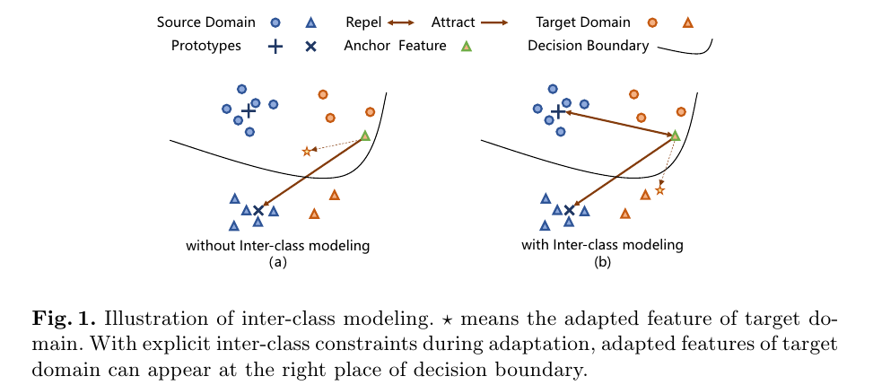

- source domain과 target domian 사이의 distribution 거리를 최소화함으로써 이전의 접근 방식은 domain adaptation problem에 대한 domain-invariante representations을 얻는 것을 목표로 합니다. 
  - 그러나 inter-class structural 관계는 충분히 탐구되지 않았습니다.
  - 그림 1의 (a)을 보면, two domain을 걸쳐 intra-class의 배열을 한 후, 그것은 different categories을 구별하기 위해 더 많은 문제점이 있다. 그 이유는 souce domain에서 확인된 desiction boundaries을 target domain 에서 유지하기가 어렵다.
  - 그러므로 우리는 새로운 category-aware prototypical contrast adaptation을 제아한다. 
    - 이것은 contrstive manner에서 명시적으로 intra-class와 inter-class의 관계를 모델링하기 위해 multiple prototypes을 도입했다.

- 이전에 유사한 state-of-the-art 방법들은, segmentation model은 supervised manner에서 sorce domian을 우선 훈련한다.
  - 동시에 multiple prototypes는 각각 category을 표현하기 위해 초기화 된다.
  - 대조적 적응은 inter-class relationship을 제한하기 위해 쳬택 되었다.
  - prototype은 domain-invariant representation을 향상시키기위해 source domain와 target domain 모두 업데이트 했다.
  - 마지막으로 우리는 self-training을 위하여 class-aware adaptive thresholds을 가진 수정된 pseudo-label generation 을 표현했다. 이것은 새로우 sota를 달성했다.

### 3.1 Preliminaries

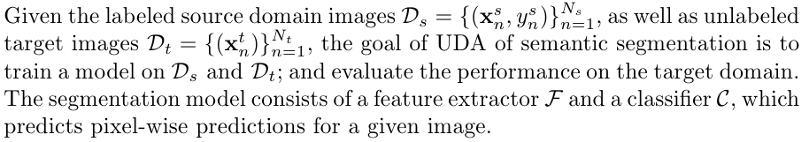

- 이전 works을 따르면, segmentation model은 예측 $p^s_n$와 C라는 주석이 달린 ground-truth label $Y_n^s \in \mathbb{L^{H * W}}, \mathbb{L} = \{1,2, ..., C\}$ , $x_n^s \in \mathbb{H * W}$으로 주어진 이미지.
  - 우리는 standard cross-entropy loss를 쓴다.

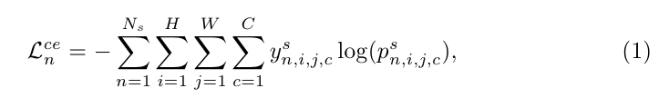

  - $N_s$는 source domian images의 수이다. 
  - $H$와 $W$는 이미지의 높이와 넓이 이다.
  - i,j는 pixel index의 높이와 넓이이다.
  - C 는 catgories의 수이다.
  - $p_n^s \in \mathbb{R^{H*W*C}}$는 image $x_n^s$의 예측된 확률이다. 이는 prediction $C(F(x_n^s))$이다.
  - $y_n^s \in \{0, 1\}^{H*W*C}$는 ground-truth label $Y_n^s$의 one-hot 표현이다.

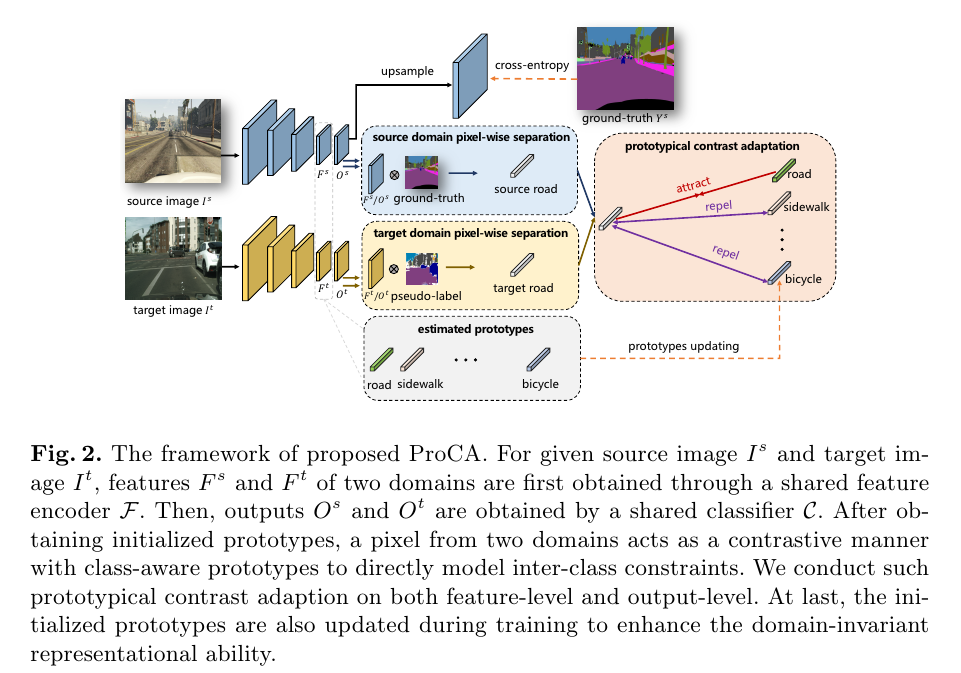

### 3.2 Prototypical Contrast Adaptation

- 그림 2에 나와 있는 것처럼 여기 intra-class와 inter-class relation들은 prototypes-based contrastive learning에 의해 동시에 고려된다.
  - 구체적으로 ProCA  세가지 stages로 포함된다. 
    - **prototypes initialization, contrast adaptation, prototypes updating**
  
**Prototypes Initialization**
- labeled source domain 에서 후련된 모델을 얻은 이후, class-aware prototypes는 계산 될 수 있다.
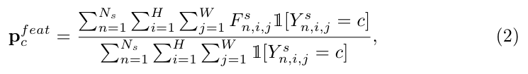
  - $F^s_{n,i,j} \in \mathbb{R^d}$는 dimension d를 가진 source feature vectord가 추출된것이다. 
  - c는 카테고리 ㅊ의 수의 인덱스이다.
  - H와 W는 feature의 Height와 width을 나타낸다.
  - $\mathbb{I}[Y^s_{n,i,j}=c]$는 함수를 나타낸다. 이것은 만약 $Y_{n,i,j}^s=c$ 이라면 1의 equals이다. 그리고 다른 경우는 0이다.
  - Prototypes는 다양한 categories의 근사 표현된 centroid으로써 참조된다.

**Contrast Adaptation.**
- target domain의 주어진 이미지, 해당되는 feature $F_s^t$은 공유된 backbone network $\mathcal{F}$에 의해 추출된다. 
  - 따라서 그것의 pseudo-label $y_n^{~t} \in \{0,1\}^{H * W * C}$는 source domina에서 classifier $\mathcal{C}$에의해 생산된다.
  -  여기에, pseudo-label은 extrated features와 그것들의 해당되는 prototypes와 연결시킨다.
  -  그러므로 우리는 features와 각 prototypes의 사이의 유사성을 계산할수 있다. 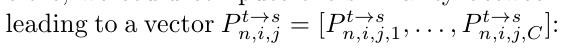

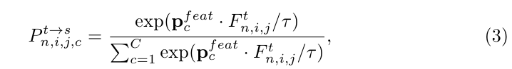

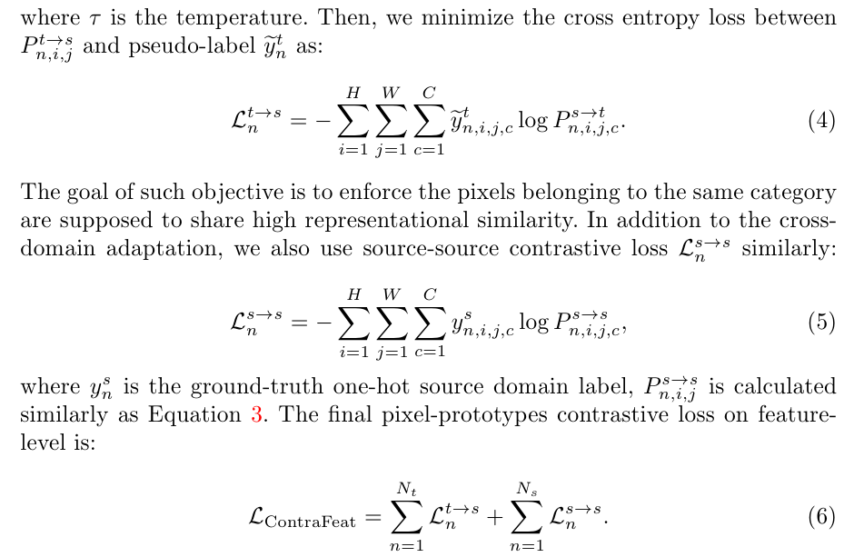

**Prototypes Updating.**
- prototypes의 domain-invariant representational 능력을 향상시키기 위해, 우리는 prototypes안에 target-related infromation을 통합하기 위해 훈련과 함께 prototype updatding의 두가지 전략을 제안한다.
  - 하나는 global data의 엄격한 통계적 mean의 계산에 따른 update:

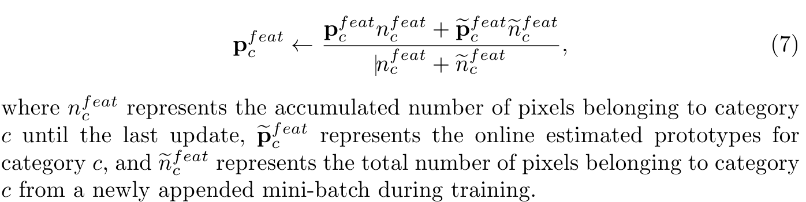

- source domain class-wise prototypes 외에도, 우리는 또한 target feature을 활용하여 feature adaptation precoess 중에 prototypes을 업데이트합니다
  - 이 mixed prototypes 전략은 two domains의 사이 연결로서 참조 될수 있다. 이는 서로간에 자연스러운 상호작용을 할 수 있다.
  - 따라서 우리는 a mixed domain 전략으로 prototypes을 직접 업데이트하는 보다 안정적이고 강력한 대안을 제안합니다.

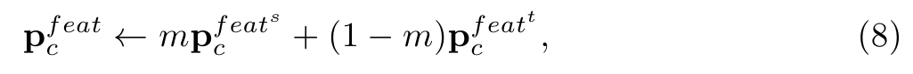

  - m 은 hyper-parameter, 그리고 source와 target prototypes이 훈련하는 동안 updating의 일정한 rate로 정의된다.
  - $p_c^{feat^s}$는 source prototypes을 평가된다.
  - $p_c^{feat^t}$는 target prototypes으로 평가된다.

**Label Space Adaptation.**
- 이전 언급했다시피, prototypes은 초기화 되며, 계산된고, feature level에 updated 된다. 다시말해 backbone noetwork $\matcal{F}$의 output으로써
  - 이와 별개로, label space에서 제안된 prototypical contrast adaptation 적용한다. 
  - 다시말해 label space란 classifier $\mathcal{C}$의 output이다.
  - 주된 차이점은 prototypes의 차원이 feature space안의 hidden channels이 아닌 categories의 수가 된다.
  - 따라서 전체적인 prototypical contrast adaptation losses은 이렇다.:

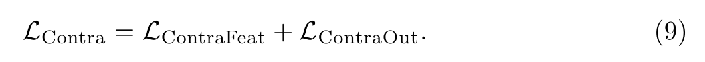

### 3.3 Combining ProCA with Self-Training

- 제안된 category-aware prototypicl contrast adaptation은 self-training based mehtods에 orthogonal 하기 때문에, 우리는 이전 작업에 이어 self-training strategy을 통해 adaptation performacne 을 추가로 향상시켰다.

**Class-wsie Adaptive Pseudo-Label Thresholds**

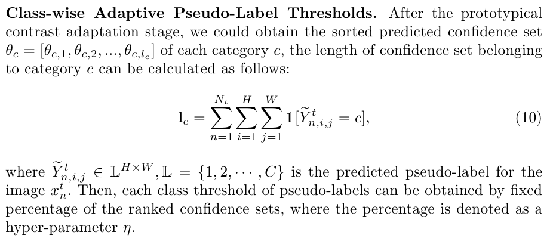

- 위의 self-training strategy 외에도 정확한 pseudo-label을 얻기 위해 프로토타입을 활용하는 ProDA과 같이 self-training 자체의 개선에 초점을 맞춘 일부 작업이다.
  - 우리의 제안된 ProCA는 주로 feature adaptation process을 작업하기 때문에, 그것은 몇몇 self-training based와 orthogonal 하다

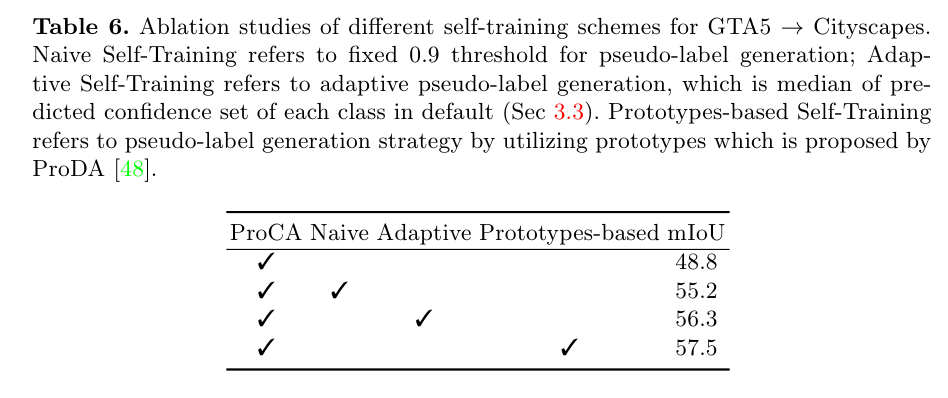

## Experiments

**Datasets and Evaluation Metrics:**
- 이전 연구 [21, 43]에 따르면, 우리는 semantic egmentation benchmark의 공통 UDA인 GTA5 [35] → Cityscapes [4] 및 SYNTIA [36] → Cityscapes [4]에서 모델을 평가합니다. GTA5는 사진 편집 오픈 월드 컴퓨터 게임에 의해 합성된 이미지 데이터 세트입니다.
  - Cityscapes 19개의 클래스를 공유합니다. 
    - 해상도 1914 × 1052의 24,966개의 이미지를 가지고 있습니다. 
  - (SYNTIA)는 합성 도시 장면 데이터 세트입니다. 
    - 이전 작품 [40]에 이어, 우리는 시티스케이프와 16개의 공통 클래스를 공유하는 부분 집합 SYNTIA-RAND-CITESCAPES를 사용합니다. 
    - 해상도 1280 × 760의 9400개의 이미지를 포함합니다. 
  - Cityscapes는 독일 및 인근 도시 50개에서 수집한 실제 도시 장면 데이터 세트입니다.
    - 2,975개의 훈련 영상, 500개의 유효성 검사 영상 및 1,525개의 테스트 영상이 있으며, 해상도는 2048 × 1024입니다. 
    - category-wise interaction은 over Union(IoU)을 사용하여 도시 경관 유효성 검사 세트의 결과를 보고합니다. 
      - 구체적으로, 우리는 GTA5 → 도시 경관 설정의 모든 19개 클래스의 평균 IoU(mIoU)와 SYNTIA → 도시 경관 설정의 16개 공통 범주를 보고합니다. 
      - 또한, 일부 작품 [26, 40]에서는 SYNTIA → 도시 경관 설정의 13개 공통 범주에 대한 MioU만 보고하므로, 우리는 또한 MioU*로 표시된 13개의 공통 범주 성능을 보고합니다.

**Implementation Details.**
- 대부분의 이전 연구 [12, 21, 43]에 이어 공정한 비교를 위해 ResNet-101 [11] 인코더가 포함된 DeepLab-v2 프레임워크 [2]를 분할 모델로 사용합니다. 
  - 모든 모델은 ImageNet [5]에서 사전 교육됩니다. 
  - Atrous Spatial Pyramid Pooling(ASPP)[2]은 확장된 속도 {6, 12, 18, 24}의 마지막 인코더 층 다음에 삽입됩니다. 
  - 마지막으로, 입력과 동일한 이미지 크기로 최종 픽셀당 예측을 얻기 위해 업샘플링 층을 사용합니다.

### 4.1 Comparisons with State-of-the-Art Methods

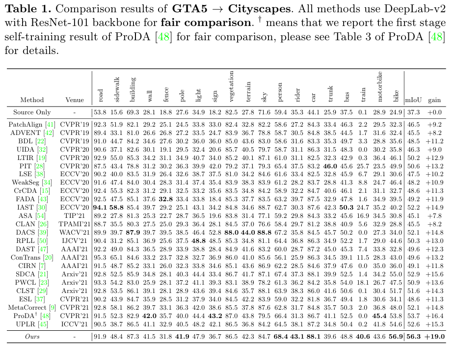

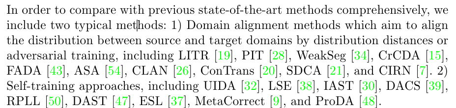

**Results on GTA5 → Cityscapes.**
- 표 1과 같이, 우리의 접근 방식은 56.3% mIoU를 달성하여 이전 방법을 큰 폭으로 능가합니다. 
  - 특히, 폴, 인물, 라이더, 바이크 및 트레인을 포함하여 [21]에 명시된 가장 도전적인 클래스는 이전 작업에 비해 상당한 개선을 얻습니다.
  
**Discussion with ProDA.**
- 제안된 prototype contrastive learning은 공정한 비교 설정 하에서 두 전송 시나리오 모두에서 유사한 프로토타입 기반 방법 ProDA [48]를 능가합니다. 
  - 특히, GTA5 → Cityscape에서 적응적 방법은 [48]을 1.4% mIOU라는 큰 차이로 능가합니다. 
  - 이는 ProDA가 프로토타입만을 사용하여 의사 신호를 수정하거나 기능을 순수한 샘플 단위로 정렬하기 때문에 대상 도메인에서 이상치 또는 노이즈가 많은 샘플의 간섭에 더 취약하고, 파이프라인은 클래스 단위 관계를 샘플 대 모델 방식으로 직접 묘사하여 학습 프로세스를 보다 강력하고 도메인 간 전송에 우호적으로 만듭니다.

**Discussion with Other Contrastive Learning based Methods.**
- 또한 유사한 패치별 대조 학습 방법인 PWCL[23]과 비교하여, 우리의 접근 방식은 GTA5 → Cityscapes 및 SYNTIA → Cityscapes 모두에서 각각 4.2% 및 5.4%의 mIOU 향상이라는 우수성을 달성한다는 점에 유의해야 합니다. 
  - 이는 PWCL이 대조적 특징 적응을 위해 패치별 특징만을 채택하기 때문에 클래스별 관계를 묘사하기에는 거칠고 훈련 과정 동안 세분화된 픽셀별 분포 변화를 무시하기 때문에 차별적이고 일반적인 표현이 덜하기 때문입니다.

**How ProCA helps poor classes adaptation?**
- 표 1과 같이 train 클래스의 성능은 최첨단 pseudo-label 방법 ProDA에 의해 향상될 수 없었습니다. 
  - 초기화된 예측이 완전히 잘못되었기 때문에 ProDA가 열차 클래스에 대한 정확한 pseudo-label을 추정할 수 없었기 때문입니다. 
  - ProDA와는 달리, ProCA는 먼저 train 클래스의 더 정확한 특징 표현을 점진적으로 얻는 다른 클래스 중심체로부터 push away를 통해 열차 클래스 예측을 수정합니다. 
  - 서로 다른 클래스 간에 이러한 관계를 도입한 후, 제안된 방법은 self-training mehtod과 결합한 후 가장 높은 train class 성능을 달성합니다.
  

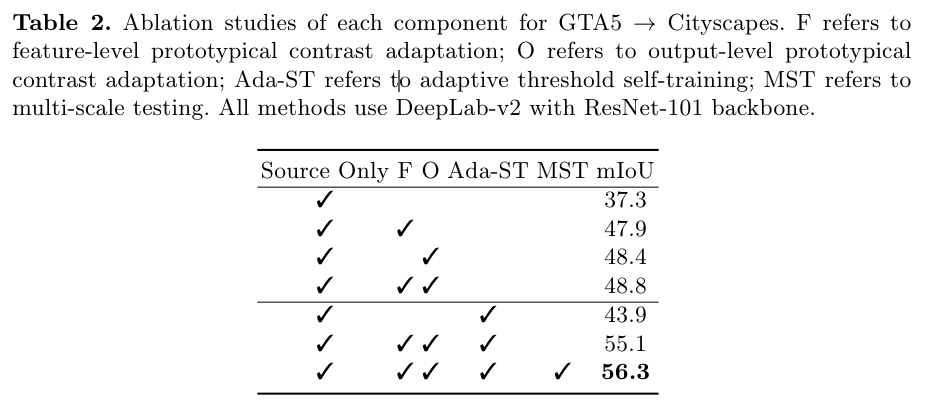

### 4.2 Ablation Studies

**Effectiveness of Each Component.**
- 우리는 각 구성 요소의 효과를 입증하기 위해 ablation 연구를 수행합니다. 
  - 우리는 GTA5 → Cityscapes 적응을 위해 DeepLab-v2 분할이 있는 ResNet-101 백본을 사용합니다.
  - 또한 제안된 prototypical constrast adaptation을 사용한 후 48.8% mIoU 점수를 달성합니다. 
  - 마지막으로 class-aware adaptive thresholds을 사용한 self-training을 통해 성능을 55.1% mIoU로 향상시킬 수 있습니다. 
  - 마지막으로 FADA [43]에 따른 다중 스케일 테스트를 통해 56.3% mIoU 점수를 얻습니다. 
  - source-domain training 후 self-traiing을 직접 사용할 경우 55.1% mIoU 점수보다 11.2% 낮은 43.9% mIoU만 얻을 수 있어 ProCA의 효과를 입증했습니다.

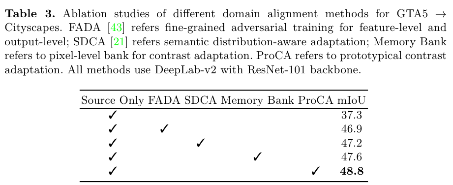

**Effectiveness of ProCA.**
- ProCA의 효과를 검증하기 위해 inter-class modelling FADA 간 모델링 없이 class-wise adversarial training, semantic-distribution modeling with categorywise informinat 등 다른 기능 정렬 방법을 구현합니다. 
  - 표 3과 같이 FADA는 adversarial 훈련의 효과를 나타내는 46.9% mIoU로 기준선을 개선합니다. 
  - SDCA[21]는 의미 인식 기능 정렬을 고려하여 47.2% mIoU를 얻습니다. 
  - Memory back는 픽셀 단위 대조 적응을 도입하여 47.6% mIoU를 얻는데, 이는 이미 FADA 및 SDCA보다 우수한 성능을 달성했습니다. 
  - 위의 방법과 비교하여 ProCA는 최고의 mIoU 점수 48.8%를 달성하여 pixel-wise memory bacnk scheme보다 제안된 클래스 인식 prototypical contrast adaptation의 우수성을 입증합니다.

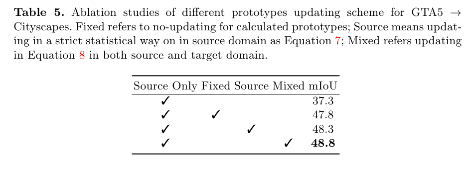

**Effectiveness of Mixed Updating.**
- 우리는 prototypes에 대한 혼합 업데이트의 효과를 검증하기 위한 ablation study를 수행합니다.
  -  5와 같이, naive fixed prototypes 방식은 47.8% mIoU만 달성하는 반면, 소스 도메인에서만 중심 업데이트 방식은 고정 prototypes 방식에 비해 0.5% 증가한 48.3% mIoU를 얻습니다.
  -  Mixed updating sheme식은 최상의 48.8% mIoU 점수를 달성하여 training 중 최신 기능의 효과를 보여줍니다.

## Conclution
- 본 논문에서는 class-wise prototypes을 활용하여 기능을 세분화된 방식으로 정렬하는 ProCA를 제안합니다.
  - feature-level adaptation 외에도 출력 수준 프로토타입을 활용하여 적응 성능을 향상시킵니다. 
  - 제안된 방법은 까다로운 벤치마크에서 최첨단 성능을 달성하여 이전 방법을 큰 폭으로 능가합니다. 
  - 정교한 절제 연구는 ProCA의 발전을 보여줍니다. 
  - 제안된 prototypical contrast adaptation이 객체 감지 및 인스턴스 분할과 같은 더 많은 작업으로 확장될 수 있기를 바랍니다.

# 나의 의견
## 이해하는거 다시 정리중
- Unsupervised Domain Adaptation (UDA)은 label이 있는 것을 훈련하여 unlabled된 것을 분류하는 문제이다.
- 약간 Zero shot learning과 few show learning의 느낌이 강하다.
- 또한 UDA는 GAN의 방법을 영감 받아 two-player 가 있다. (i.e 분류기와 추출기)
  - 초기 source와 target domain간의 불일치를 줄이기 위해 설계 되었다.
  - GAN의 adversarial의 방법을 영감 받아. 분류기는 두 domain을 구분할 수 없는 생성한다.
  - 분류기는 어떤 domain에서 feature가 나왔는지 식별한다.
  - 몇몇 adversarial training은 두 domains 사이를 정렬되고 구별 할 수 있는 특징의 분포를 초래한다.
    - 그러나 global feature distribution은 domain들에 걸쳐 밀접 되더라도, target domian의 다른 semantic categories에 의해 잘 구별되도록 보장 되지 않는다
    - 이것은 일반화 능력과 성능에 악여향을 미친다.

- 위의 문제를 해결하기위해 category-wise information을 고려했다.
  - entropy 최소함으로써 이루어 졌다.
  - 두 classifier은 ouput 사이의 불일치는 category-levle alignment을 달성하는데 활용 되었다.
  - 그러나 몇몇 intra-class 에서의 adversarial training은 source와 target domain 간 representational strucyture의 일관성을 독려하지 않았다.
  - target domain에서 multiple categories와 같은 group에서 잘 투영되고 같은 그룹은 반대로 source domain에서 잘 구별 된다.
    - 그러므로 intra-class distirvution alignment는 labeld source data로 부터 learned representation을 최고로 활용하는데 불충분 할 수 있다.

- 그니깐 요약하자면 다른 것들은 intra-class에 잘 되지만 inter-class에는 강한 강점이 보이지 않은것이고 저자들은 prototypes를 이용하여 inter-class 까지 잘 구별 되는 모델을 만들었다는 말