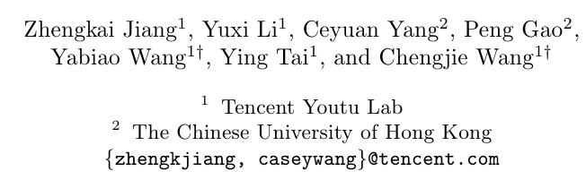
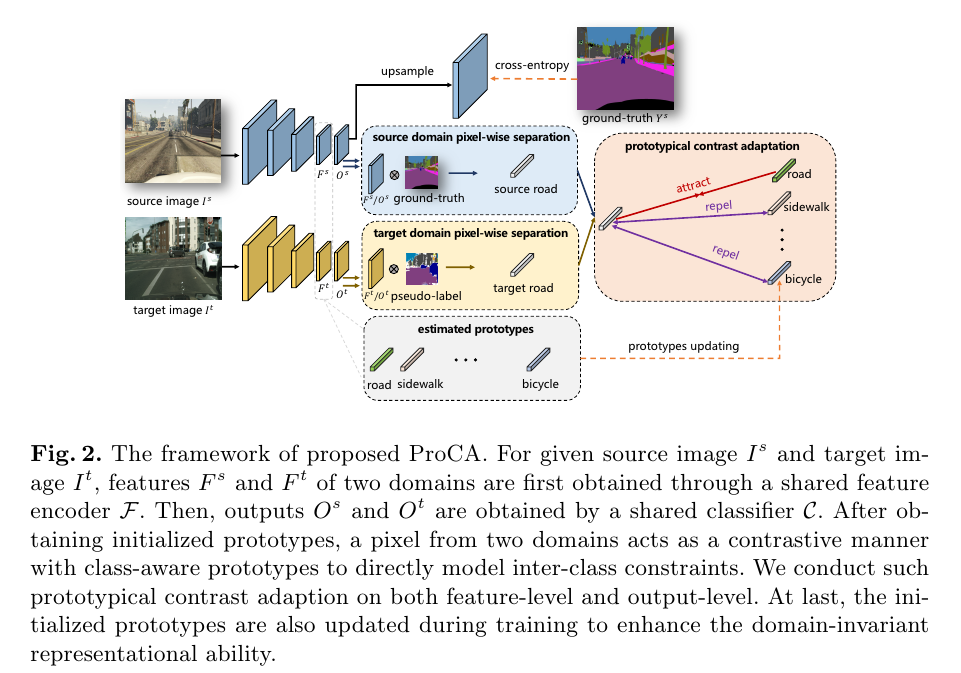

# Prototypical Contrast Adaptation for Domain Adaptive Semantic Segmentation

## 저널 및 학회 : ECCV 2022, 거의 q1급

## 저자 : 

https://link.springer.com/chapter/10.1007/978-3-031-19830-4_3
https://arxiv.org/pdf/2207.06654.pdf%E4%BB%A3%E7%A0%81%E5%9C%B0%E5%9D%80%EF%BC%9Ahttps://github.com/jiangzhengkai/ProCA
https://github.com/jiangzhengkai/ProCA

[psedu에관련된 내용](/paper%20study/image%20study/0.0%20참고/0.0.1/psedu관련된%20내용.md)

**도메인 적응적 의미론적 분할을 위한 원형 대조 적응**
*저자들*: Zhengkai Jiang, Yuxi Li, Ceyuan Yang, Peng Gao, Yabiao Wang, Ying Tai, 그리고 Chengjie Wang
*게시 날짜*: 2022년 7월 14일

**요약**
- 이 논문은 비지도 도메인 적응적 의미론적 분할을 위한 방법으로 원형 대조 적응(ProCA)을 소개합니다.
- ProCA는 내부 클래스 표현 분포와 클래스 간 구조적 관계 모두에 중점을 둡니다.
- 이 방법은 도메인 적응 작업, 특히 GTA5 → Cityscapes 및 SYNTHIA → Cityscapes에서 최첨단 성능을 달성합니다.

**1. 서론**
- 의미론적 분할은 픽셀별 예측을 포함하는 핵심 컴퓨터 비전 작업입니다.
- 발전에도 불구하고, 테스트 데이터의 분포가 훈련 데이터와 다를 때 도메인 이동으로 인한 성능 저하가 있습니다.
- 비지도 도메인 적응(UDA)은 추가 주석 비용 없이 레이블이 지정된 소스 도메인에서 레이블이 지정되지 않은 대상 도메인으로 모델을 적응시키는 해결책입니다.

**2. 배경**
- **클래스 간 모델링**: 논문은 내부 클래스와 클래스 간 관계 모두를 고려하는 것의 중요성을 강조합니다.
- **적대적 훈련**: 이전 방법은 도메인 차이를 줄이기 위해 적대적 훈련을 사용했습니다.
- **카테고리별 정보**: 일부 방법들은 카테고리별 정보를 포함하려고 시도했지만, 종종 내부 클래스 분포 정렬에 중점을 둡니다.

**3. 원형 대조 적응 (ProCA)**
- **아이디어**: 다른 도메인의 카테고리는 높은 표현 유사성을 공유해야 합니다.
- **원형**: 방법은 소스와 대상 도메인 모두에 대한 클래스 간 관계를 묘사하기 위해 원형을 사용합니다.
- **대조적 학습**: ProCA는 도메인 적응 과정에 대조적 학습을 도입합니다.

**4. 실험 결과**
- ProCA는 의미론적 분할을 위한 도메인 적응 벤치마크에서 테스트되었습니다.
- 방법은 GTA5 및 SYNTHIA 데이터셋에서 최첨단 성능을 달성했습니다.

**5. 기여**
- 의미론적 분할을 위한 UDA에서 다른 카테고리의 특징에 명시적 제약을 도입하는 원형 대조 적응(ProCA)을 제안합니다.
- 클래스별 원형의 도메인 불변성과 판별 능력을 향상시키기 위해 온라인 원형 업데이트 체계를 도입했습니다.

**6. 관련 연구**
- **의미론적 분할**: 컴퓨터 비전의 기본 작업으로, 합성곱 신경망의 도움으로 중요한 발전을 이루었습니다.
- **UDA 의미론적 분할**: 기존의 접근 방식은 스타일 전송, 특징 정렬 및 자기 훈련으로 주로 나눌 수 있습니다.
- **대조적 학습**: 자기 감독된 표현 학습에서 뛰어난 성능을 보여줍니다.

**7. 방법론**
- 논문은 ProCA의 방법론을 자세히 설명하며, 클래스 간 구조적 관계를 모델링하는 것의 중요성을 강조합니다.

# 나의 의견
## 이해하는거 다시 정리중
- Unsupervised Domain Adaptation (UDA)은 label이 있는 것을 훈련하여 unlabled된 것을 분류하는 문제이다.
- 약간 Zero shot learning과 few show learning의 느낌이 강하다.
- 또한 UDA는 GAN의 방법을 영감 받아 two-player 가 있다. (i.e 분류기와 추출기)
  - 초기 source와 target domain간의 불일치를 줄이기 위해 설계 되었다.
  - GAN의 adversarial의 방법을 영감 받아. 분류기는 두 domain을 구분할 수 없는 생성한다.
  - 분류기는 어떤 domain에서 feature가 나왔는지 식별한다.
  - 몇몇 adversarial training은 두 domains 사이를 정렬되고 구별 할 수 있는 특징의 분포를 초래한다.
    - 그러나 global feature distribution은 domain들에 걸쳐 밀접 되더라도, target domian의 다른 semantic categories에 의해 잘 구별되도록 보장 되지 않는다
    - 이것은 일반화 능력과 성능에 악여향을 미친다.

- 위의 문제를 해결하기위해 category-wise information을 고려했다.
  - entropy 최소함으로써 이루어 졌다.
  - 두 classifier은 ouput 사이의 불일치는 category-levle alignment을 달성하는데 활용 되었다.
  - 그러나 몇몇 intra-class 에서의 adversarial training은 source와 target domain 간 representational strucyture의 일관성을 독려하지 않았다.
  - target domain에서 multiple categories와 같은 group에서 잘 투영되고 같은 그룹은 반대로 source domain에서 잘 구별 된다.
    - 그러므로 intra-class distirvution alignment는 labeld source data로 부터 learned representation을 최고로 활용하는데 불충분 할 수 있다.

- 그니깐 요약하자면 다른 것들은 intra-class에 잘 되지만 inter-class에는 강한 강점이 보이지 않은것이고 저자들은 prototypes를 이용하여 inter-class 까지 잘 구별 되는 모델을 만들었다는 말