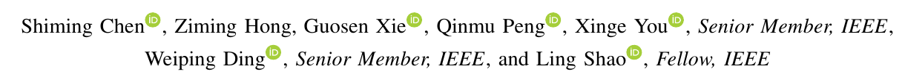

# GNDAN: Graph Navigated Dual Attention Network for Zero-Shot Learning

## 저널 : IEEE TRANSACTIONS ON NEURAL NETWORKS AND LEARNING SYSTEMS, Q1 5%

https://ieeexplore.ieee.org/abstract/document/9768177

## 저자 : 

## Abstract : 
- 제로샷 학습(ZSL)은 보이는 클래스에서 보이지 않는 클래스로 의미적 지식을 전달하여 보이지 않는 클래스 인식 문제를 해결합니다. 
  - 일반적으로 바람직한 지식 전달을 보장하기 위해 ZSL의 시각적 및 의미적 도메인을 연결하기 위해 직접 임베딩을 채택합니다. 
  - 그러나 기존의 대부분의 ZSL 방법은 암묵적인 전역 특징 또는 이미지 영역에서 의미적 공간으로 임베딩을 학습하는 데 초점을 맞추고 있습니다. 
    - 따라서 1) 단일 이미지에서 다양한 지역 간의 외관 관계를 활용하지 못하고 
    - 2) 차별적 특징 표현을 위해 협력적인 전역 및 지역 특징을 공동으로 학습합니다.

- 본 논문에서는 이러한 단점을 해결하기 위해 ZSL을 위한  graph navigated dual attention network(GNDAN)를 제안합니다. 
  - GNDAN은 region-guided attention network(RAN)와 region-guided graph attention network(RGAT)를 사용하여 차별적 로컬 임베딩을 공동으로 학습하고 그래프의 안내에 따라 명시적 글로벌 임베딩을 활용하기 위한 글로벌 컨텍스트를 통합합니다.
  - 특히 RAN은 부드러운 공간 주의력을 사용하여 로컬 임베딩을 생성하기 위한 차별적 영역을 발견합니다.
  
- 한편, RGAT는 속성 기반 영역 특징을 얻기 위해 속성 기반 주의를 채택하고, 여기서 각 속성은 가장 관련성이 높은 이미지 영역에 집중합니다. 
  - structural relationship representations에 유익한 그래프 신경망(GNN)에 의해 동기 부여된 RGAT는 그래프 주의 네트워크를 추가로 활용하여 명시적 글로벌 임베딩 표현을 위한 속성 기반 영역 특징 사이의 관계를 활용합니다.
  - self-calibration mechanism을 기반으로 학습된 공동 시각적 임베딩을 의미적 임베딩과 일치시켜 최종 예측을 형성합니다. 
- 세 가지 벤치마크 데이터 세트에 대한 광범위한 실험은 제안된 GNDAN이 최첨단 방법보다 우수한 성능을 달성한다는 것을 보여줍니다. 우리의 코드와 훈련된 모델은 https://github.com/shimingchen/GNDAN 에서 이용할 수 있습니다.

## I. INTRODUCTION AND MOTIVATION

