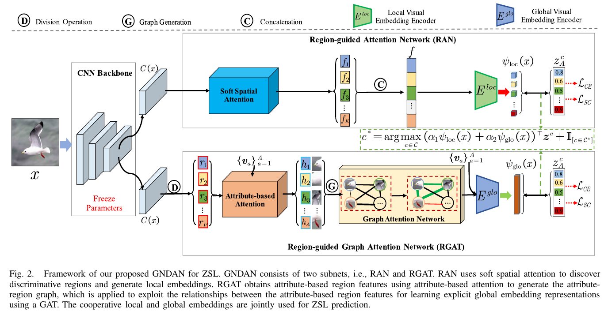

# GNDAN: Graph Navigated Dual Attention Network for Zero-Shot Learning

## 저널 : IEEE TRANSACTIONS ON NEURAL NETWORKS AND LEARNING SYSTEMS, Q1 5%

https://ieeexplore.ieee.org/abstract/document/9768177

## 저자 : 

## Abstract : 
- 제로샷 학습(ZSL)은 보이는 클래스에서 보이지 않는 클래스로 의미적 지식을 전달하여 보이지 않는 클래스 인식 문제를 해결합니다. 
  - 일반적으로 바람직한 지식 전달을 보장하기 위해 ZSL의 시각적 및 의미적 도메인을 연결하기 위해 직접 임베딩을 채택합니다. 
  - 그러나 기존의 대부분의 ZSL 방법은 암묵적인 전역 특징 또는 이미지 영역에서 의미적 공간으로 임베딩을 학습하는 데 초점을 맞추고 있습니다. 
    - 따라서 1) **단일 이미지에서 다양한 지역 간의 외관 관계를 활용하지 못하고** 
    - 2) 차**별적 특징 표현을 위해 협력적인 전역 및 지역 특징을 공동으로 학습**합니다.

- 본 논문에서는 이러한 단점을 해결하기 위해 ZSL을 위한  graph navigated dual attention network(GNDAN)를 제안합니다. 
  - **GNDAN은 region-guided attention network(RAN)와 region-guided graph attention network(RGAT)를 사용하여 차별적 로컬 임베딩을 공동으로 학습하고 그래프의 안내에 따라 명시적 글로벌 임베딩을 활용하기 위한 글로벌 컨텍스트를 통합**합니다.
  - **특히 RAN은 부드러운 공간 주의력을 사용하여 로컬 임베딩을 생성하기 위한 차별적 영역을 발견**합니다.
  
- 한편, **RGAT는 속성 기반 영역 특징을 얻기 위해 속성 기반 주의를 채택하고, 여기서 각 속성은 가장 관련성이 높은 이미지 영역에 집중**합니다. 
  - structural relationship representations에 유익한 그래프 신경망(GNN)에 의해 동기 부여된 RGAT는 그래프 주의 네트워크를 추가로 활용하여 명시적 글로벌 임베딩 표현을 위한 속성 기반 영역 특징 사이의 관계를 활용합니다.
  - self-calibration mechanism을 기반으로 학습된 공동 시각적 임베딩을 의미적 임베딩과 일치시켜 최종 예측을 형성합니다. 
- 세 가지 벤치마크 데이터 세트에 대한 광범위한 실험은 제안된 GNDAN이 최첨단 방법보다 우수한 성능을 달성한다는 것을 보여줍니다. 우리의 코드와 훈련된 모델은 https://github.com/shimingchen/GNDAN 에서 이용할 수 있습니다.

## I. INTRODUCTION AND MOTIVATION

- 일반적으로 전술한 방법은 ZSL 작업을 위해 다음과 같은 체계를 사용합니다. 
  - 1) 사전 훈련된 [8], [13], [22], [28] 또는 종단 간 훈련 가능한 네트워크 [10], [29]–[31] 및 
  - 2) 이러한 시각적 특징을 의미 벡터와 연관시키기 위해 암시적 글로벌 임베딩 또는 생성 모델을 구성합니다.
- 임베딩 기반 방법은 시각적 → 방법을 학습하는 것을 목표로 합니다
  - 시각적 특징을 시각적-의미론적 상호 작용을 위해 의미론적 공간에 매핑하는 매핑 [18], [33], [34]. 
  - 그러나 이러한 임베딩 기반 방법은 차별적인 클래스 관련 시각적 정보(예: 로컬 속성)를 효과적으로 캡처할 수 없으며, 그림 1(a)과 같이 지식 전달이 보이지 않는 클래스 [30], [31]로 제한됩니다. 
  - 이와 같이, 부분 임베딩 모델 [30]–[32], [35], [36]은 그림 1(b)와 같이 의미론적 벡터의 안내에 따라 보다 차별적인 부분(지역) 시각적 특징을 발견하기 위해 제안되어 CZSL 설정[31]을 크게 개선했습니다.
- 일부 주의 기반 방법은 속성 시맨틱 벡터 [32], [37]의 안내에 따라 부품 시각적 특징을 현지화합니다. 
  - 이러한 방법은 이러한 영역에서 차별적인 부품 임베딩을 학습하는 데 초점을 맞추고 있지만, 명시적인 글로벌 표현에 대한 부품 외관 관계는 여전히 무시됩니다. 
- 우리는 **그림 1(c)와 같이 발견된 부품 및 전체 객체에서 협력적인 로컬 및 글로벌 특징을 공동으로 학습하여 의미론적 설명에 기초하여 객체를 분류해야 한다고 주장**합니다.

- 위의 관찰 결과에 비추어, **우리는 효과적인 ZSL을 위한 로컬 및 명시적 글로벌 차별적 시각 임베딩을 동시에 학습할 것을 GNDAN을 제안**합니다. 
  - GNDAN은 **region-guided attention network(RAN)와 region-guided graph attention network(RGAT)로 구성되며, 이들은 속성 기반 교차 엔트로피 및 자체 보정 손실에 의해 공동으로 최적화**됩니다.
  - 특히 **RAN은 배경 및 중복 전경 영역을 억제하여 차별적 영역을 발견하고 로컬 임베딩을 생성하기 위해 부드러운 공간 주의[30]를 기울**입니다.
  - visual–semantic interactions,을 학습할 때 치수가 극단적으로 감소하여 발생하는 정보 손실을 고려하여 효과적인 매핑을 위해 시각적 특징 공간과 저차원 의미 공간 사이에 **로컬 시각적 임베딩 인코더를 추**가합니다. 
- 전체적인 시각적 특징 표현으로 글로벌 임베딩을 직접 학습하는 기존의 글로벌 임베딩 학습 방법과 달리, **우리는 RGAT를 사용하여 차별적 영역 간의 부분 관계를 활용하여 글로벌 임베딩을 명시적으로 표현**합니다. 
  - RGAT는 먼저 속성 기반 영역 특징을 얻기 위해 **속성 기반 주의를 채택하고, 여기서 각 속성은 속성 시맨틱 벡터의 지원으로 가장 관련성이 높은 이미지 영역에 집중**합니다. 
  - 각 이미지에 대한 이러한 속성 기반 영역 특징 사이의 점진적인 상호 작용을 더욱 활용하기 위해, 우리는 **이들을 속성 영역 그래프로 표현**합니다. 
  - 구조 관계 [24], [38]–[40]의 표현에서 그래프 신경망(GNN)의 이점에 힘입어, RGAT는 그래프 주의 네트워크(GAT)를 사용하여 글로벌 임베딩으로 인코딩된 명시적 글로벌 특징 표현을 학습합니다.
- 도메인 편향 문제를 해결하기 위해, 우리는 학습된 차별적 시각적 임베딩과 의미적 임베딩 사이에 더 정확한 일치를 달성하기 위해 자가 교정 메커니즘을 사용하여 최종 예측을 형성합니다.

- To summarize, this study makes the following main contributions.
  - 우리는 정확한 시각적-의미적 상호 작용을 달성하기 위해 차별적 시각적 임베딩을 학습하여 보이는 클래스에서 보이지 않는 클래스로 효과적인 지식 전달을 가능하게 하는 ZSL용 GNDAN을 제안합니다. 
    - GNDAN은 로컬 임베딩을 생성하기 위해 차별적 영역을 발견하는 RAN과 명시적 글로벌 임베딩을 활용하기 위한 글로벌 컨텍스트를 통합하는 RGAT를 사용합니다.
  - 우리는 각 이미지에 대한 속성 기반 영역 특징 사이의 새로운 속성-영역 그래프 표현 캡처 관계(attribute-region graph representation capturing relationships)를 소개합니다. 
    - 그런 다음 이 그래프에 대한 명시적인 전역 임베딩 표현 학습을 위해 속성 기반 영역 특징 사이의 관계를 활용하도록 RGAT를 설계합니다.
  - 우리는 제안된 방법이 CZSL 및 GZSL 설정 모두에서 최첨단 방법보다 분명한 이점을 달성한다는 것을 입증하기 위해 세 가지 벤치마크 데이터 세트에 대한 광범위한 실험을 수행합니다.

## II. RELATED WORK

### A. Zero-Shot Learning

- 보이는 범주에서 보이지 않는 범주로의 효과적인 지식 전달을 수행하기 위해, ZSL은 시각적 영역과 의미적 영역 사이의 연관성을 나타내기 위해 의미 벡터와 시각적 특징이 상호 작용하는 임베딩 공간을 학습합니다. 
  - 초기 단계에서는 시각적 특징과 그 의미적 벡터에 대한 학습 호환성 기능이 적합한 공통 공간 예를 들어 CMT [41], DEVICE [12], SJE [19], DEM [42] 및 ESZSL [33]에 적용됩니다. 
  - 도메인 편향 [43], [44]의 문제로 제한되는 이러한 방법은 일반적으로 GZSL 설정에서 성능이 좋지 않습니다.
  - 의미 임베딩에 따라 현실적인 이미지 또는 시각적 특징을 합성할 수 있는 생성 적대적 네트워크(GAN)의 혜택을 받는 생성 ZSL 방법은 ZSL을 기존의 감독 인식 작업으로 변환합니다. 
  - 따라서 도메인 편향을 완화할 수 있습니다. 시각적 특징 표현과 상호 작용된 임베딩을 공동으로 학습하기 위해 종단 간 ZSL 방법이 제안되었습니다 [10], [29]–[31].
- 그러나 이러한 ZSL 방법은 전역 시각적 특징만 고려합니다. 이와 같이 다양한 클래스 간의 미묘한 차이는 무시되어 지식 전달을 보는 것에서 보이지 않는 클래스로 제한합니다 [30], [31]. 
  - 이 과제를 해결하기 위해 부품 내장 모델 [31], [32], [35], [36], [45]는 의미 벡터의 안내에 따라 보다 차별적인 부분(영역) 시각적 특징을 발견하여 CZSL 설정을 크게 개선할 것을 제안했습니다. 
  - 또한 Xie et al. [31]은 지역 그래프와 GNN [46]을 사용하여 이러한 지역 표현 사이의 점진적 상호 작용을 활용하는 RGEN을 제안했습니다. 
- 그러나 이러한 방법은 로컬 또는 암시적 글로벌 임베딩만 고려하여 시각적-의미론적 상호 작용에 대한 부적절한 차별적 특징을 초래합니다.

### B. Graph Neural Networks

- GNN [46]–[54]은 신경망을 비유클리드 도메인, 예를 들어 그래프 및 다양체로 일반화하는 것을 목표로 합니다. 
  - GNN은 재귀적 이웃 집합 또는 메시지 전달을 통해 그래프의 표현을 반복적으로 학습하며, 여기서 각 그래프 노드는 로컬 그래프 구조를 나타내기 위해 이웃으로부터 특징을 수집합니다. 
  - 스펙트럼 및 비분광 접근법으로 분류될 수 있는 그래프 도메인에 컨볼루션을 일반화하는 데 대한 관심이 증가하고 있습니다 [55]. 
    - 스펙트럼 접근법은 그래프의 스펙트럼 표현과 함께 작동하며 노드 분류 [46], [49], [50]의 맥락에서 성공적으로 적용되었습니다. 
      - [49]에서, 컨볼루션 연산은 그래프 라플라시안의 고유 분해를 계산하여 푸리에 도메인에서 적용됩니다. 
      - Defferard et al. [50]은 스펙트럼 필터를 근사화하기 위해 그래프 라플라시안의 Chebyhev 확장을 제안했습니다. 
    - 대조적으로, 비분광 접근법은 공간적으로 가까운 이웃 그룹[51], [56], [57]에서 작동하는 컨볼루션을 그래프에서 직접 정의합니다.
- 관계 표현에 좋은 GNN 덕분에 컴퓨터 비전 [58], [59] 및 자연어 전처리 [60], [61]과 같은 광범위한 응용 분야에서 상당한 성공을 거두었다. 
  - 일부 작업은 또한 지식 그래프와 GNN을 사용하여 단어 임베딩 [62]–[64]를 기반으로 각 클래스의 분류자를 예측합니다. 
- 그러나 ZSL 지향 GNN은 특히 단일 이미지의 지역 관계 표현에 대해 여전히 연구가 부족합니다. 
  - 다른 최근 작업은 노드의 로컬 이웃 대신 모든 그래프 노드에 주의 메커니즘을 적용하여 글로벌 정보를 캡처합니다 [52], [55], [65], [66]. 
- 이는 우리가 GAT를 사용하여 ZSL에 대한 차별적 지역을 기반으로 글로벌 시각적 임베딩을 명시적으로 학습하도록 동기를 부여합니다.

## III. PROPOSED METHOD

- 우리의 GNDAN의 프레임워크는 그림 2에 제시되어 있습니다.
  - GNDAN은 두 개의 서브넷, 즉 RAN과 RGAT로 구성됩니다.
  - RAN은 부드러운 공간 주의를 사용하여 차별적 영역을 발견하여 로컬 임베딩을 생성합니다. 
  - RGAT는 속성 기반 주의를 사용하여 속성 기반 영역 특징을 획득하여 속성-영역 그래프를 생성합니다. 
- 따라서 RGAT는 명시적 글로벌 임베딩 표현을 학습하기 위해 GAT를 추가로 사용하여 속성-영역 그래프에서 속성 기반 영역 특징 사이의 관계를 활용합니다. 
  - 두 모듈은 교차 엔트로피 손실과 자체 보정 손실에 의해 최적화됩니다. 
- 제로샷 예측 동안 협력 로컬 및 글로벌 임베딩은 클래스 레이블을 예측하기 위해 공동으로 사용됩니다. 
  - 훈련 중 CNN 백본의 매개 변수가 동결되므로 GNDAN은 비엔드 투 엔드 모델입니다.

### A. Region-Guided Attention Network

- 의미 정보는 ZSL에서 볼 수 있는 클래스에서 보이지 않는 클래스로 효과적인 지식 전달을 수행하기 위한 로컬 판별 시각적 단서를 제공하기 때문에, 로컬 시각적 임베딩 학습은 중요합니다 [32], [35], [35], [45].
  -  이와 같이, 우리의 GNDAN은 먼저 RAN을 사용하여 부드러운 공간 주의[30]와 로컬 시각적 임베딩 인코더를 기반으로 한 차별적인 로컬 임베딩을 학습합니다.

- 로컬 시각적 임베딩 인코더: 시각적-의미적 상호작용을 배울 때 치수가 극도로 감소하여 발생하는 정보 손실을 고려하여 시각적 특징 공간과 저차원 의미 공간 사이에 로컬 시각적 임베딩 인코더(E_loc)를 추가하여 효과적인 매핑을 달성합니다.
  -  Eloc는 KC(dim)-4096(dim)-A(dim) 구조를 가진 다층 퍼셉트론(MLP)입니다. 연결된 영역 특징 벡터 f를 기반으로 로컬 시각적 임베딩 τ_{loc}(x)를 얻습니다

### B. Region-Guided Graph Attention Network

- 두 가지 관찰은 차별적 표현을 위한 시맨틱 정보를 기반으로 명시적 글로벌 임베딩을 학습하기 위한 RGAT를 제안하도록 동기를 부여합니다. 
  - 1) 로컬 임베딩이 ZSL에 중요하지만 차별적 시각적 영역 간의 관계도 고려되어야 하며 
  - 2) 암시적 글로벌 임베딩은 이러한 차별적 시각적 영역 간의 관계를 적절하게 표현할 수 없습니다.

- 구체적으로, RGAT는 먼저 [32] (즉, 동일한 크기의 그리드 셀 [69]) 다음의 분할 작업을 활용하여 피쳐 맵 C(x)를 영역 피쳐 {r 1, r 2, ..., p }_{p = 1}, 여기서 P = H × W입니다.
  - 그런 다음, RGAT는 각 속성이 가장 관련성이 높은 이미지 영역에 초점을 맞추는 속성 기반 영역 특징을 얻기 위해 속성 기반 주의를 사용합니다. 
  - 이와 같이, 이러한 속성 기반 영역 특징을 기반으로 속성-영역 그래프를 구성할 수 있습니다. 
  - 주의 기반 그래프 네트워크는 노드 집합 [52], [55], [65], [66]에 대한 전역 정보를 캡처하는 데 유익하기 때문에, RGAT는 명시적인 전역 특징 표현을 위해 속성 기반 영역 그래프에서 속성 기반 영역 특징 사이의 관계를 활용하기 위해 GAT [55]를 추가로 사용합니다. 
  - 마지막으로, 글로벌 비주얼 임베딩 인코더는 이러한 글로벌 기능 표현의 글로벌 컨텍스트를 글로벌 임베딩에 통합합니다.

# 나의 의견

1. **그래프와 주의 메커니즘의 통합**: GNDAN은 그래프 신경망 (GNN)과 주의 메커니즘을 결합하여 지역 및 전역 특징을 동시에 학습합니다. 이러한 접근 방식은 이미지 내의 다양한 지역 간의 관계를 캡처하고, 이를 바탕으로 보다 풍부한 특징 표현을 얻는 데 도움이 될 수 있습니다.

2. **자체 보정 메커니즘**: 도메인 편향을 해결하기 위해 자체 보정 메커니즘을 사용하는 것은 주목할 만한 점입니다. 이는 ZSL에서의 도메인 간의 차이를 극복하는 데 중요한 역할을 할 수 있습니다.

- 총평: GNDAN은 ZSL에 대한 새로운 접근 방식을 제안하며, 그래프 기반의 주의 메커니즘을 사용하여 복잡한 이미지 관계를 모델링하는 데 성공적입니다.
- GNN의 기반으로 ZSL의 특징적인 부분을 캐치 할 수 있다는 점이 흥미롭습니다.