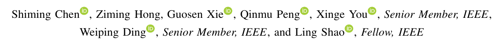
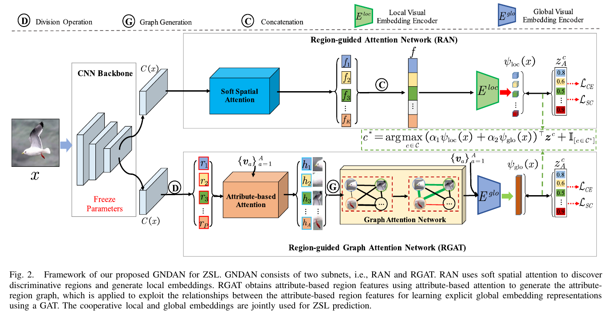

# GNDAN: Graph Navigated Dual Attention Network for Zero-Shot Learning

## 저널 : IEEE TRANSACTIONS ON NEURAL NETWORKS AND LEARNING SYSTEMS, Q1 5%

https://ieeexplore.ieee.org/abstract/document/9768177

## 저자 : 

[자세한 설명](./GNDAN%20(2022).md)

**요약**:
- 이 논문에서는 Zero-shot learning (ZSL)을 위한 새로운 방법론인 GNDAN (Graph Navigated Dual Attention Network)을 제안합니다.
- ZSL은 보이지 않는 클래스를 인식하는 문제를 해결하기 위해 본질적 지식을 전송하는 방법을 탐구합니다.
- 대부분의 기존 ZSL 방법은 시각적 및 의미적 도메인을 연결하기 위한 직접적인 임베딩을 사용합니다. 그러나 이러한 방법들은 이미지의 다양한 지역 간의 외관 관계를 활용하지 못합니다.
- GNDAN은 지역 가이드 주의 네트워크 (RAN)와 지역 가이드 그래프 주의 네트워크 (RGAT)를 사용하여 이러한 문제점을 해결합니다.
- RAN은 공간적 주의를 사용하여 지역 임베딩을 생성하는 반면, RGAT는 속성 기반 주의를 사용하여 속성 기반 지역 특징을 얻습니다.
- GNDAN은 세 가지 주요 벤치마크 데이터 세트에서 우수한 성능을 보여줍니다.

**주요 내용**:
1. **도입 및 동기**: ZSL은 본질적 의미 관련성을 활용하여 학습 중에 새로운 클래스를 인식하는 것을 목표로 합니다. ZSL은 실제 세계 응용 프로그램에서 널리 사용됩니다.
2. **그래프 신경망**: GNN은 비유클리드 도메인에 신경망을 일반화하는 것을 목표로 합니다. GNN은 노드 분류, 컴퓨터 비전, 자연어 처리 등 다양한 응용 분야에서 큰 성공을 거두었습니다.
3. **제안된 방법**: GNDAN은 지역 및 명시적 전역 차별적 시각적 임베딩을 동시에 학습하기 위해 제안되었습니다. GNDAN은 RAN과 RGAT로 구성되며, 속성 기반 교차 엔트로피와 자체 보정 손실에 의해 공동으로 최적화됩니다.

# 나의 의견

1. **그래프와 주의 메커니즘의 통합**: GNDAN은 그래프 신경망 (GNN)과 주의 메커니즘을 결합하여 지역 및 전역 특징을 동시에 학습합니다. 이러한 접근 방식은 이미지 내의 다양한 지역 간의 관계를 캡처하고, 이를 바탕으로 보다 풍부한 특징 표현을 얻는 데 도움이 될 수 있습니다.

2. **자체 보정 메커니즘**: 도메인 편향을 해결하기 위해 자체 보정 메커니즘을 사용하는 것은 주목할 만한 점입니다. 이는 ZSL에서의 도메인 간의 차이를 극복하는 데 중요한 역할을 할 수 있습니다.

- 총평: GNDAN은 ZSL에 대한 새로운 접근 방식을 제안하며, 그래프 기반의 주의 메커니즘을 사용하여 복잡한 이미지 관계를 모델링하는 데 성공적입니다.
- GNN의 기반으로 ZSL의 특징적인 부분을 캐치 할 수 있다는 점이 흥미롭습니다.