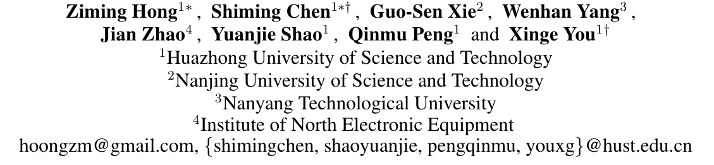
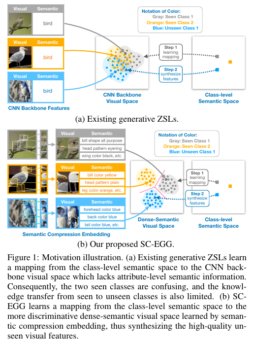
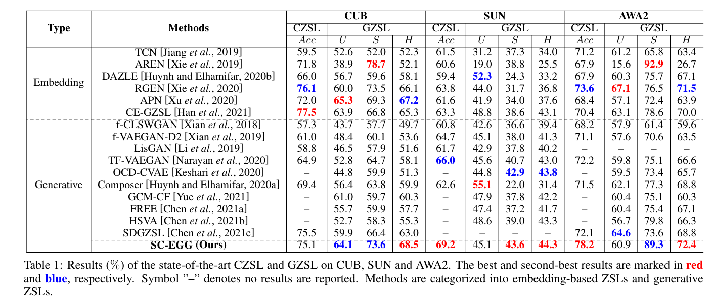
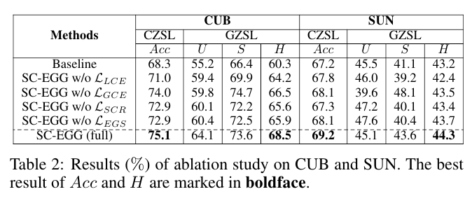
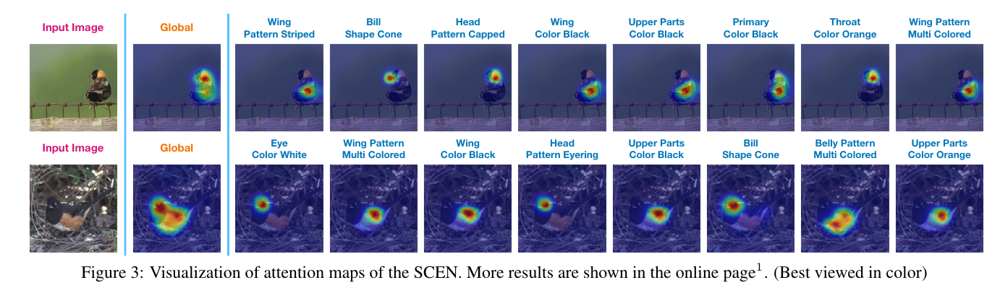
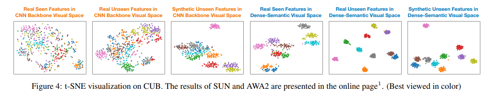

# Semantic Compression Embedding for Generative Zero-Shot Learning

## 학회 : Proceedings of the Thirty-First International Joint Conference on Artificial Intelligence (IJCAI-22), A+

## 저자 : 

https://www.researchgate.net/profile/Shiming-Chen-7/publication/362044667_Semantic_Compression_Embedding_for_Generative_Zero-Shot_Learning/links/6356500d12cbac6a3eee75cd/Semantic-Compression-Embedding-for-Generative-Zero-Shot-Learning.pdf

## Abstract :

- 생성 방법은 시각적-의미적 도메인 격차를 완화하기 위한 암시적 매핑을 학습하고 보이지 않는 샘플을 합성하여 보여진 클래스와 보이지 않는 클래스 간의 데이터 불균형을 처리함으로써 제로샷 학습(ZSL)에 성공적으로 적용되었습니다. 
  - 그러나 기존의 생성 방법은 단순히 사전 훈련된 CNN 백본에 의해 추출된 시각적 특징을 사용합니다. 
  - 이러한 시각적 특징에는 속성 수준의 의미적 정보가 부족합니다. 
  - 결과적으로 보여진 클래스는 구별할 수 없고, 보여진 클래스에서 보이지 않는 클래스로의 지식 전달은 제한됩니다. 

- 이 문제를 해결하기 위해 의미 압축 임베딩 네트워크(SCEN)와 임베딩 유도 생성 네트워크(EGN)를 계단식으로 연결하는 새로운 의미 압축 임베딩 유도 생성(SC-EGG) 모델을 제안합니다.
  - SCEN은 각 샘플에 대해 속성 수준 로컬 피쳐 그룹을 추출하고 이들을 새로운 저차원 시각적 피쳐로 추가 압축합니다.
  - 따라서 밀도 높은 의미론적 시각 공간이 얻어집니다.
  - EGN은 클래스 수준의 의미론적 공간에서 조밀한 의미론적 시각적 공간으로의 매핑을 학습하여 합성된 조밀한 의미론적 보이지 않는 시각적 특징의 판별성을 향상시킵니다. 
- CUB, SUN 및 AWA2와 같은 세 가지 벤치마크 데이터 세트에 대한 광범위한 실험은 현재의 최첨단 방법과 기준에 비해 SC-EGG의 상당한 성능 향상을 보여줍니다.

## 1 Introduction

- 최근, ZSL의 생성 방법(즉, 생성 ZSL)은 상당한 발전을 달성했습니다 [Chen et al., 2021c]. 
  - Generative models은 일반적으로 보이는 데이터를 사용하여 클래스 수준의 의미 공간에서 시각적 공간으로의 암시적 매핑을 학습하고 보이지 않는 클래스의 의미 벡터에서 보이지 않는 시각적 특징을 합성합니다. 
  - 따라서, ZSL은 표준 감독 분류 작업으로 변환되어 보이는 클래스와 보이지 않는 클래스 사이의 데이터 불균형 문제 및 시각적-의미적 도메인 격차 문제를 해결하는 데 도움이 됩니다.

- 그러나 기존 생성 ZSL 방법은 단순히 클래스 수준 시맨틱 공간에서 CNN 백본 시각적 공간(예: 사전 훈련된 CNN 백본에서 직접 추출한 시각적 특징으로 표시됨)으로의 매핑 기능을 학습하는데, 이는 ZSL에서 보이는 클래스를 보이지 않는 클래스로 지식을 전달하는 데 중요한 속성 수준 시맨틱 정보(예: "빌 컬러 옐로우" 및 "헤드 패턴 플레인")가 부족합니다.
  -  예를 들어, 그림 1(a)에 나타낸 바와 같이, 사전 훈련된 CNN 백본은 상이한 미세 조류 범주의 세 가지 샘플에 대해 "Bird"에 대한 의미론적 정보를 포함하는 시각적 특징만을 추출할 수 있으며, 이는 충분히 차별적이지 않습니다. 
  -  이와 같이, 보이는 클래스는 혼란스럽고, 보이는 클래스에서 보이지 않는 클래스로 전달되는 지식도 제한됩니다.

- 위의 문제를 해결하기 위해 의미 압축 임베딩 네트워크(SCEN)와 임베딩 유도 생성 네트워크(EGN)를 계단식으로 연결하는 새로운 의미 압축 임베딩 유도 생성(SC-EGG) 모델을 제안합니다. SCEN은 로컬 임베딩 네트워크(LEN)와 글로벌 임베딩 네트워크(GEN)로 구성됩니다. 
  - LEN은 의미론이 속성에 해당하는 로컬 시각적 특징의 그룹을 추출합니다. 
  - 특징 합성을 위한 차원의 저주를 고려하여 GEN이 각 샘플의 로컬 시각적 특징과 의미론이 일치하는 저차원 글로벌 시각적 특징을 학습할 수 있도록 새로운 의미 일치 회귀 손실을 도입합니다. 
  - 따라서 그림 1(b)와 같이 속성 수준의 의미 표현을 글로벌 시각적 특징으로 압축하고 밀도 있는 의미론적 시각 공간을 얻습니다. EGN은 더 나은 지식 전달을 위해 클래스 수준의 의미 벡터에서 밀도 있는 시각적 공간으로의 매핑을 학습하기 위해 생성 모델을 채택합니다. 
  - 보이는 클래스에 모델을 과적합하는 것을 완화하기 위해 훈련된 분류기를 GEN에서 사용하여 EGN의 보이는 클래스와 보이지 않는 클래스 모두에 대한 시각적 특징 합성을 제한하는 임베딩 유도 합성 손실을 추가로 도입합니다. 
- 마지막으로 훈련된 EGN을 사용하여 보이지 않는 시각적 특징의 양을 합성하여 분류기를 훈련시키고, 이는 ZSL 분류에 사용됩니다.

**Our main contributions are summarized as follows:**

- CNN 백본 시각적 특징의 속성 수준 시맨틱 누락 문제를 해결하기 위해 SC-EGG(Semantic Compression Membedding Guided Generation) 모델이라는 새로운 ZSL 방법을 제안하여 생성 ZSL의 성능을 더욱 향상시킵니다.
- 우리는 시맨틱 압축을 위한 새로운 시맨틱 일관성 있는 회귀 손실과 보이는 클래스에 과적합되는 생성 모델을 완화하기 위한 임베딩 유도 합성 손실을 제안합니다.
-  CUB [Welinder et al., 2010], SUN [Patterson and Hays, 2012] 및 AWA2 [Xian et al., 2017] 등 세 가지 도전적인 벤치마크 데이터 세트에 대한 광범위한 실험은 현재 최첨단 방법 및 기준에 비해 SCEGG의 상당한 성능 향상을 보여줍니다.

## 2 Related Work

**Embedding-based ZSL.**
- 임베딩 기반 ZSL 방법은 일반적으로 시각적 영역에서 의미적 영역으로의 매핑을 학습하며, 그 자체와 클래스 수준 의미 기술자 사이의 거리에 따라 가장 인접할 가능성이 높은 전략을 사용하여 ZSL 분류를 수행합니다. 
  - 그러나 대부분의 기존 방법은 속성 수준의 의미론적 관련이 없는 글로벌 시각적 특징을 기반으로 하므로 차별적이고 전달 가능한 특징 표현이 빈약합니다.    최근 주의 기반 로컬 임베딩 방법dms 보이는 클래스와 보이지 않는 클래스에 대한 시각적 특징 표현을 향상시키기 위해 사용되었습니다.
  - 불행히도 이러한 방법은 보이는 클래스에서만 ZSL 모델을 학습하므로 보이는 클래스에 과적합할 수밖에 없습니다.

**Generative ZSL.**

- 임베딩 기반 ZSL 방법의 한계를 극복하기 위해, 생성 ZSL 방법은 특징 증강을 위해 보이지 않는 시각적 특징을 합성하는 생성 모델을 사용합니다 
  -  분류 손실로 정규화된 Wasserstein 거리를 최적화하여 시각적 특징을 합성하는 조건부 WGAN(Wasserstein GAN)을 제안했습니다. 
  -  [Xian et al., 2019]에서 저자들은 WGAN과 VAE를 결합한 f-VAEGAN 프레임워크를 도입하여 두 가지 장점을 모두 활용했습니다. 
-  이후 많은 생성 ZSL 방법은 우수한 성능 때문에 f-VAEGAN 프레임워크를 따릅니다 [Narayan et al., 2020;Chen et al., 2021a; Yan et al., 2021). 
-  그러나 이러한 생성 방법은 사전 훈련된 CNN 백본에 의해 직접 추출된 의미 벡터에서 글로벌 시각적 특징으로의 매핑을 학습합니다. 
   -  글로벌 시각적 특징은 특정 데이터 세트의 사전 정의된 속성과 의미적으로 관련이 없기 때문에 학습된 생성 모델이 좋지 않습니다.
   -  이와 같이 합성된 보이지 않는 시각적 특징은 차별적이고 전달 가능하지 않습니다.

`REAME와 동일`
## 3. Proposed Method

### **문제 정의**:
- \( x \in X \): 입력 이미지를 나타냅니다.
- \( y \in Y \): 해당 레이블을 나타냅니다.
- \( Y = Y_s \cup Y_u \): 여기서 \( Y_s \)는 본질적으로 보이는 클래스의 집합이고 \( Y_u \)는 보이지 않는 클래스의 집합입니다.
- 각 클래스 \( y_j \)에는 클래스 수준의 의미 설명 벡터 \( a(y_j) \)가 있으며, 이는 모든 클래스 간의 관계를 인코딩합니다. 이 벡터는 훈련 중에 사용 가능하며, 각 속성에 해당하는 요소를 포함합니다.
- CZSL 및 GZSL의 작업은 각각 \( f_{czsl}: X \to Y_u \) 및 \( f_{gzsl}: X \to Y_s \cup Y_u \)의 분류기를 학습하는 것입니다.

- **SC-EGG 모델**: 그림 2에 나와 있는 것처럼 제안된 의미 압축 임베딩 가이드 생성 (SC-EGG) 모델은 의미 압축 임베딩 네트워크 (SCEN)와 임베딩 가이드 생성 네트워크 (EGGN)를 연속적으로 사용합니다.
  - **SCEN**: SCEN은 지역 임베딩 네트워크 (LEN)와 글로벌 임베딩 네트워크 (GEN)를 사용하여 의미 압축을 위한 지역-글로벌 일관된 임베딩을 학습합니다.
  - **EGGN**: EGGN은 글로벌 분류기에 의해 가이드되는 의미-시각 매핑을 학습하기 위해 생성 모델 (TF-V AEGAN)을 포함하며, 이 글로벌 분류기는 GEN의 글로벌 분류기와 매개 변수를 공유합니다.

### 3.1 Semantic Compression Embedding Network (SCEN):
- 목적: SCEN은 지역-글로벌 의미 일관성 특징 학습에 의해 밀도가 높은 의미 시각 공간을 학습합니다. 
  - 이 네트워크는 지역 임베딩 교차 엔트로피 손실, 글로벌 임베딩 교차 엔트로피 손실, 및 의미 일관성 회귀 손실에 의해 제약됩니다.

- Local Embedding Network (LEN): LEN은 속성 기반 주의 메커니즘을 사용하여 속성 수준의 의미와 관련된 이미지 영역을 식별하고, 이러한 영역을 사용하여 속성에 정렬된 지역 시각 특징의 그룹을 나타냅니다.

- Global Embedding Network (GEN): GEN은 의미 압축 모듈 SC와 글로벌 시각 특징 분류기 CLSg로 구성됩니다. 
  - SC는 속성 수준의 의미와 관련된 지역 시각 특징을 밀도가 높은 저차원 글로벌 시각 특징으로 압축합니다.

### 3.2 Embedding Guided Generative Network (EGGN):
- **개요**: EGGN은 **클래스 수준의 의미 벡터에서 SCEN에 의해 학습된 밀도가 높은 의미 시각 특징으로의 매핑을 학습**합니다. 
  - 이 밀도가 **높은 의미 시각 특징은 저차원이며 속성 수준의 의미와 관련**이 있습니다. 
  - 따라서 **EGGN은 구별력 있는 보이지 않는 특징을 합성**할 수 있습니다.

- **TF-V AEGAN 기반**: EGGN은 TF-V AEGAN을 기반으로 합니다. 이 네트워크는 변이형 오토인코더 (V AE)와 생성적 적대 네트워크 (GAN)를 포함합니다.
  -  V AE는 인코더와 디코더로 구성되며, GAN은 V AE의 디코더와 동일한 생성기와 판별기로 구성됩니다. 
  -  추가로, 의미 임베딩 디코더와 피드백 모듈도 포함됩니다.

- **TF-V AEGAN의 기본 손실**: TF-V AEGAN의 기본 손실은 다음과 같이 정의됩니다:
  - \( L_{VG} = L_{VAE} + \lambda_w L_{WGAN} + \lambda_r L_{Rec} \)
  여기서 \( L_{VAE} \)는 변이형 손실, \( L_{WGAN} \)은 WGAN 손실, \( L_{Rec} \)는 재구성 손실입니다.

- **Embedding Guided Synthesis Loss**: EGGN이 구별력 있는 특징을 합성하도록 하고, 합성된 보이지 않는 특징이 본질적으로 보이는 클래스에 과적합되지 않도록 하기 위해 임베딩 가이드 합성 손실이 도입되었습니다. 
  - 이 손실은 GEN의 글로벌 분류기와 매개 변수를 공유하는 분류기를 기반으로 합니다.

### **3.3 Model Optimization**:
- **훈련 단계**:
  1. **Stage 1**: SCEN을 지역 및 글로벌 임베딩 교차 엔트로피 손실로 훈련하여 속성 수준 의미 관련 지역 특징을 학습합니다.
  2. **Stage 2**: LEN의 매개 변수를 고정하고 GEN을 의미 일관성 회귀 손실로 업데이트하여 SCEN을 훈련합니다.
  3. **Stage 3**: 훈련된 SCEN을 사용하여 밀도가 높은 의미 시각 특징을 추출하고, EGGN을 훈련하여 클래스 수준 의미 공간에서 밀도가 높은 의미 시각 공간으로의 매핑을 학습합니다.

### **3.4 Classification**:
- **후처리**: 훈련 후 SCEN을 사용하여 본질적으로 보이는 샘플의 밀도가 높은 의미 시각 특징을 추출하고, EGGN의 생성기를 사용하여 보이지 않는 특징을 합성합니다. 그런 다음, 이 특징들을 사용하여 CZSL 분류기와 GZSL 분류기를 훈련합니다.
- **추론**: 테스트 특징은 SCEN으로 처리되어 밀도가 높은 의미 시각 특징을 얻고, 이 특징은 CZSL 또는 GZSL 분류기의 입력으로 사용되어 ZSL 예측을 수행합니다.

## **4. Experiments**:
- 이 섹션에서는 논문의 실험적인 부분을 다룹니다. CUB, SUN, AWA2와 같은 표준 ZSL 벤치마크 데이터셋에서 제안된 SC-EGG를 평가합니다. 실험은 CZSL 및 GZSL 작업에서 top-1 정확도를 측정하여 수행됩니다.

### **4.1 Comparison with State of the Arts**:
- **비교 기준**: SC-EGG는 귀납적 방법이므로, 다른 귀납적 방법들과의 공정한 비교를 위해 이를 다른 방법들과 비교합니다.
- **결과**: CZSL 및 GZSL 설정에서 CUB, SUN, AWA2에서 최첨단 방법들과의 비교 결과를 보여줍니다. CZSL 설정에서 SC-EGG는 SUN에서 69.2% 및 AWA2에서 78.2%의 최고 정확도를 달성하며, 다른 모든 방법들과 비교했을 때 3.2% 및 4.6%의 중요한 이득을 얻습니다. CUB에서는 SC-EGG가 여전히 75.1%의 top-1 정확도로 경쟁력 있는 성능을 보여줍니다. GZSL 설정에서 SC-EGG는 CUB에서 68.5%, SUN에서 44.3%, AWA2에서 72.4%의 조화 평균 (H)으로 최고의 성능을 달성합니다.

### **4.2 Ablation Study**:
- **목적**: SC-EGG의 다양한 구성 요소의 효과를 평가하기 위해 수행됩니다.
- **결과**: SC-EGG의 기본 버전 (즉, TF-V AEGAN)의 결과는 SC-EGG의 전체 버전보다 훨씬 나쁘며, CUB에서 Acc=H가 6.8% 및 8.2%, SUN에서 2.0% 및 1.1% 감소합니다. SCEN의 지역 분류 제약 없이 SCEN을 포함하면 (즉, SC-EGG w/o LLCE), 모델은 CUB에서 4.1% 및 4.3%, SUN에서 1.4% 및 1.9%의 Acc=H 감소로 전체 SC-EGG에 비해 나쁜 ZSL 성능을 보여줍니다.

### **4.3 Qualitative Results**:
- **시각화**: 그림 3에서는 두 개의 임의로 선택된 샘플의 SCEN의 주의 지도의 시각화를 보여줍니다. 첫 번째 열은 입력 이미지를 보여주고, 두 번째 열은 GEN의 전역 주의 지도를 보여줍니다.

- **t-SNE 시각화**: 그림 4에서는 CNN 백본 시각 공간과 밀도가 높은 의미 시각 공간에서 실제 본질적/보이지 않는 및 합성 보이지 않는 시각 특징의 t-SNE 시각화를 보여줍니다. 
  - 결과는 밀도가 높은 의미 시각 공간에서의 시각 특징이 CNN 백본보다 실제 본질적, 실제 보이지 않는, 및 합성 보이지 않는 클래스에서 더 구별력 있음을 보여줍니다.

## **5. 결론**:
- 이 논문에서는 ZSL을 위한 새로운 의미 압축 임베딩 가이드 생성 모델 (SC-EGG)을 제안합니다. 
  - SC-EGG는 의미 압축 임베딩 네트워크 (SCEN)와 임베딩 가이드 생성 네트워크 (EGGN)를 연속적으로 사용합니다. 
  - SCEN은 의미 압축 임베딩을 통해 구별력 있는 밀도가 높은 의미 시각 공간을 학습하며, EGGN은 SCEN의 지침 하에 클래스 수준 의미 공간에서 밀도가 높은 의미 시각 공간으로의 암시적 매핑을 학습하여 고품질의 보이지 않는 특징을 합성합니다. 
  - 세 가지 인기 있는 벤치마크 데이터셋에서의 광범위한 실험은 SC-EGG의 ZSL에 대한 우월성을 보여줍니다.

# 나의 의견:
 -  이 논문의 주요 기여는 기존의 생성적 ZSL 방법이 CNN 백본에서 추출된 시각적 특징을 단순히 사용하는 것에 반해, SC-EGG 모델을 통해 속성 수준의 의미 정보를 포함하는 밀도가 높은 시각적 공간을 학습하려고 시도한다.

- 이러한 접근 방식은 ZSL의 성능을 향상시키기 위한 중요한 단계일 수 있습니다. 
  - 속성 수준의 의미 정보를 포함하는 시각적 특징을 사용하면, 본질적으로 보이는 클래스와 보이지 않는 클래스 간의 지식 전송이 향상될 수 있다.
  -  이는 ZSL의 주요 도전 과제 중 하나인 본질적으로 보이는 클래스와 보이지 않는 클래스 간의 데이터 불균형 문제를 해결하는 데 도움이 될 수 있다.
