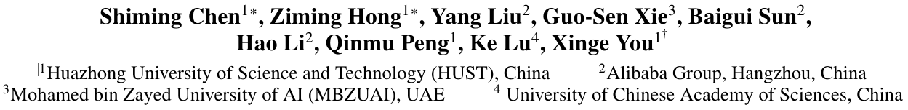
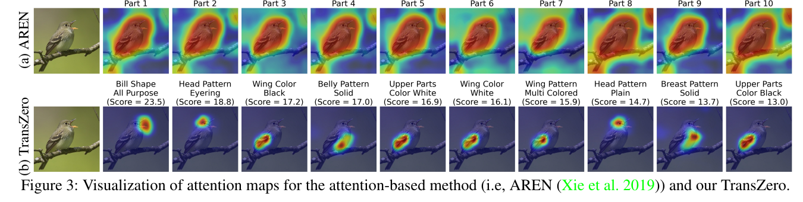

# TransZero: Attribute-guided Transformer for Zero-Shot Learning

https://ojs.aaai.org/index.php/AAAI/article/view/19909

## 컨퍼런스 :  Proceedings of the AAAI Conference on Artificial Intelligence (2021)
## 저자 : 

## Abstract
Zero-shot learning (ZSL)은 본적 없는 클래스를 인식하기 위해 본 클래스에서 본적 없는 클래스로 의미론적 지식을 전달하는 것을 목표로 합니다. 이 논문에서는 TransZero라는 속성 안내 Transformer 네트워크를 제안합니다. 이 네트워크는 ZSL에서 시각적 특징을 세밀화하고 속성 지역화를 학습하여 구별력 있는 시각적 임베딩 표현을 만듭니다. TransZero는 세 가지 ZSL 벤치마크에서 최신 기술을 달성합니다.

물론이죠! 아래에는 논문 "TransZero: Attribute-guided Transformer for Zero-Shot Learning"의 서론에 대한 자세한 설명이 있습니다.

## Introduction

**제로샷 학습 (Zero-Shot Learning)**

제로샷 학습 (ZSL)은 보지 않은 클래스를 인식하기 위해 본 클래스에서 보지 않은 클래스로 의미론적 지식을 전송하는 것을 목표로 합니다. 이러한 의미론적 지식은 객체 속성을 나타내는 판별 영역 특징을 지역화하는 강력한 사전 역할을 하며, 중요한 시각-의미론적 상호 작용을 가능하게 합니다.

**기존 방법의 한계**

기존의 일부 주의 기반 모델은 단일 이미지에서 이러한 영역 특징을 학습하려고 시도했지만, 시각적 특징의 전송 가능성과 판별 속성 지역화는 일반적으로 무시되었습니다.

**TransZero: 속성 안내 변환기**

이 논문에서는 TransZero라는 속성 안내 변환기 네트워크를 제안합니다. 이 네트워크는 시각적 특징을 세밀화하고 ZSL에서 판별 시각 임베딩 표현을 위한 속성 지역화를 학습합니다. TransZero는 ImageNet과 ZSL 벤치마크 간의 교차 데이터셋 편향을 완화하고, 영역 특징 간의 엉킨 상대 기하 관계를 줄이는 특징 증가 인코더를 취합니다.

**지역성 증가 시각 특징**

TransZero는 주어진 이미지에서 각 속성과 가장 관련 있는 이미지 영역을 지역화하기 위해 시맨틱 속성 정보의 지침 하에 시각-시맨틱 디코더를 사용하여 지역성 증가 시각 특징을 학습합니다. 그런 다음 지역성 증가 시각 특징과 시맨틱 벡터가 시각-시맨틱 임베딩 네트워크에서 효과적인 시각-시맨틱 상호 작용을 수행하는 데 사용됩니다.

**실험 결과**

다양한 실험을 통해 TransZero가 세 가지 ZSL 벤치마크에서 새로운 최첨단 성능을 달성함을 보여줍니다.

**제로샷 학습의 도전 과제**

제로샷 학습은 새로운 클래스를 인식하는 능력을 향상시키기 위해 인간의 인지 능력에서 영감을 받았습니다. ZSL에서는 테스트 세트의 보이지 않는 클래스에 대한 교육 샘플이 없으며, 교육 세트와 테스트 세트의 레이블 공간이 서로 배타적입니다. 따라서 ZSL의 핵심 작업은 의미 정보를 기반으로 효과적인 시각-의미론적 상호 작용을 수행하기 위해 판별 시각 특징을 학습하는 것입니다.

**TransZero의 주요 기여**

1. **TransZero의 도입**: 속성 안내 변환기를 사용하여 시각 특징을 세밀화하고 판별 시각 임베딩 표현을 위한 속성 지역화를 학습하는 새로운 ZSL 방법을 소개합니다.
2. **특징 증가 인코더의 제안**: ImageNet과 ZSL 벤치마크 간의 교차 데이터셋 편향을 완화하고, 다른 영역 간의 엉킨 상대 기하 관계를 줄이기 위해 특징 증가 인코더를 제안합니다.
3. **성능 향상**: TransZero가 세 가지 ZSL 벤치마크에서 새로운 최첨단 성능을 달성함을 실험적으로 보여줍니다.

## Method

### Visual-Semantic Decoder
논문에서는 표준 Transformer와 유사한 Visual-Semantic Decoder를 사용합니다. 이 디코더는 다중 헤드 자기 주의 계층과 피드 포워드 네트워크를 사용하여 디코더 계층을 구축합니다. 디코딩 과정은 의미적 속성 특징 \( v_A \)의 지침 하에 지속적으로 시각 정보를 통합합니다. 따라서 이 디코더는 주어진 이미지의 각 속성과 가장 관련 있는 이미지 영역을 효과적으로 지역화할 수 있습니다.

### Visual-Semantic Embedding Network
지역성이 강화된 시각적 특징을 생성한 후, 이를 의미적 임베딩 공간으로 매핑합니다. 이 매핑이 더 정확하게 이루어지도록 의미적 속성 벡터를 지원으로 사용하며, 매핑 함수 \( M \)을 기반으로 합니다.

### Model Optimization
효과적인 최적화를 달성하기 위해, TransZero를 훈련시키는 데 속성 회귀 손실, 속성 기반 교차 엔트로피 손실, 자기 보정 손실을 사용합니다.

- **속성 회귀 손실**: VSEN이 시각적 특징을 해당 의미적 임베딩으로 정확하게 매핑하도록 유도하기 위해 속성 회귀 손실을 도입합니다.
- **속성 기반 교차 엔트로피 손실**: 이미지가 해당 클래스 의미 벡터와 가장 높은 호환성 점수를 갖도록 하기 위해 사용됩니다.
- **자기 보정 손실**: TransZero가 본 클래스에 과적합되는 것을 방지하기 위해 도입됩니다.

## Zero-Shot Prediction
TransZero 훈련 후, 테스트 인스턴스의 의미 공간에서 임베딩 특징을 얻고, 명시적 보정을 사용하여 테스트 레이블을 예측합니다.

## Experiments

### Dataset
실험은 세 가지 인기 있는 ZSL 벤치마크에서 수행되며, 두 가지 세분화된 데이터셋 (CUB, SUN)과 하나의 대분류 데이터셋 (AWA2)을 포함합니다.

### Evaluation Protocols
CZSL 및 GZSL 설정에서 상위 1 정확도를 측정합니다.

### Implementation Details
ResNet101을 CNN 백본으로 사용하고, SGD 최적화 도구와 하이퍼파라미터를 사용하여 모델을 최적화합니다.

### Comparison with State of the Art
- **일반 Zero-Shot Learning**: TransZero는 CUB와 SUN에서 최상의 정확도를 달성하며, 다른 주의 기반 방법과 비교하여 중요한 이득을 얻습니다.
- **일반화 Zero-Shot Learning**: TransZero는 CUB와 AWA2에서 최상의 성능을 달성합니다. 이는 AGT의 특징 증강 인코더와 자기 보정 메커니즘이 기여한 결과입니다.

## Ablation Study
TransZero의 다양한 구성 요소의 효과를 평가하기 위해 실시한 실험입니다.

### Qualitative Results
TransZero의 효과를 직관적으로 보여주기 위해 주의 맵을 시각화합니다.

### Hyperparameter Analysis
속성 회귀 손실의 중요성을 평가하기 위해 다양한 하이퍼파라미터를 사용합니다.

## 결론

이 논문에서 제안된 TransZero는 속성 가이드 변환기를 사용하여 Zero-Shot Learning을 위한 효과적인 방법을 제시합니다. 실험 결과, TransZero는 다양한 데이터셋에서 뛰어난 성능을 보이며, 기존의 주의 기반 방법보다 더 뛰어난 성능을 보입니다. 또한, 시각적 특징의 구별력과 전송 가능성을 향상시키고, 편향 문제를 완화하는 데 기여합니다.

# 나의 의견:
- Transformer의 일반화의 능력이 강한것을 빌려
- ZSL을 시도 해 보았다.
- 그 결과 강력한 성능을 보였다.
- 하지만 제목이 Transformer 이지만 block 1개 attention head 1개 인 것이, overfitting에 대한 아쉬운 점이 있다.