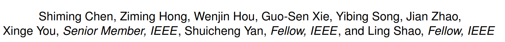

# TransZero++: Cross Attribute-Guided Transformer for Zero-Shot Learning

https://ieeexplore.ieee.org/stamp/stamp.jsp?tp=&arnumber=9987664

## 저널 : IEEE Transactions on Pattern Analysis and Machine Intelligence (2022), q1, if 23.6, 1%

## 저널 : 

**논문 개요**
"TransZero++: Cross Attribute-Guided Transformer for Zero-Shot Learning"이라는 제목의 이 연구 논문은 IEEE Transactions on Pattern Analysis and Machine Intelligence에서 출판을 위해 수락된 연구 논문입니다. 저자들은 Shiming Chen, Ziming Hong, Wenjin Hou, Guo-Sen Xie, Yibing Song, Jian Zhao, Xinge You, Shuicheng Yan, 그리고 Ling Shao입니다.

**Zero-shot learning (ZSL)에 대한 초점**
이 논문은 Zero-shot learning (ZSL)에 초점을 맞추고 있습니다. ZSL은 보이는 클래스에서 보이지 않는 클래스로 의미론적 지식을 전송함으로써 새로운 클래스 인식 문제를 해결하는 방법입니다.

**TransZero++ 네트워크의 제안**
저자들은 ZSL에서 핵심 의미론적 지식 표현을 위해 시각적 특징을 정제하고 정확한 속성 위치를 학습하기 위해 TransZero++라는 교차 속성 가이드 Transformer 네트워크를 제안합니다. TransZero++는 속성 기반 시각적 특징을 학습하기 위한 속성→시각 Transformer 하위 네트 (AVT)와 시각 기반 속성 특징을 학습하기 위한 시각→속성 Transformer 하위 네트 (VAT)를 사용합니다.

**의미론적 협력적 손실의 도입**
저자들은 또한 특징 수준과 예측 수준의 의미론적 협력적 손실을 도입합니다. 이 두 가지 속성 가이드 변환기는 의미론적 협력 학습을 통해 핵심 의미론적 지식 표현을 위한 의미론적으로 증가된 시각적 임베딩을 학습하기 위해 서로에게 가르칩니다.

**논문의 결론**
논문은 TransZero++가 세 가지 황금 ZSL 벤치마크와 대규모 ImageNet 데이터셋에서 새로운 최첨단 결과를 달성한다는 결론을 내립니다. 또한, TransZero++가 시각적 특징을 정제하고 의미론적으로 증가된 특징 표현을 위해 속성 영역을 정확하게 지역화한다는 것을 보여주는 질적 결과도 제공합니다.

**성능 향상**
TransZero++는 생성 모델에 대한 성능을 향상시키는 것으로 나타났습니다. 특히, TransZero++는 f-VAEGAN의 성능을 CUB에서 10.2%/7.1%, SUN에서 1.4%/0.3% 향상시켰습니다. 또한, TransZero++는 TF-VAEGAN의 성능을 CUB에서 6.6%/5.0%, SUN에서 2.5%/1.3% 향상시켰습니다.

**의미론적 지식의 발견**
이 논문에서는 TransZero++가 다양한 보이지 않는 클래스를 구별하기 위한 지식 전송을 가능하게 하는 이동 가능한 의미론적 지식을 효과적으로 발견한다는 것을 보여줍니다. 다른 주의 기반 방법 (예: SGMA [38], AREN [37], APN [39])과 비교하여 TransZero++는 CUB에서 6.3%, SUN에서 5.0%의 큰 이득을 얻습니다.

**의미론적 협력 학습의 도입**
TransZero [22] (컨퍼런스 버전)와 비교하여, TransZero++는 의미론적 협력 학습을 수행하도록 장려하는 두 가지 의미론적 협력적 손실 (즉, Lf_SCL과 Lp_SCL)을 도입합니다.

# 나의 의견 :
- Transzero를 더 발전된 형태
- Transzero는 AAAI에서 사용한 모델이다.
- 또한 저자의 논문을 추적하면 MSDN이라는 논문을 만들고 같이 합쳐서 만들었따.
- 이 저자의 논문을 추적하면 어떻게 실험하는지 또한 어떻게 논문을 쓰는지 시간 절약 면에서 어떻게 하는지 배울 수 있다.

- TransZero++는 두 개의 Transformer 하위 네트워크를 사용하여 속성 기반 시각적 특징과 시각 기반 속성 특징을 학습한다.
  - 이 두 하위 네트워크는 서로를 가르치며 의미론적으로 증가된 시각적 임베딩을 학습합니다. 
  - 이러한 접근 방식은 보이지 않는 클래스를 인식하는 데 필요한 핵심 의미론적 지식을 표현하는 데 도움이 됩니다.

- 그러나 이 논문은 여전히 몇 가지 제한 사항을 가지고 있다. 
  - 먼저, TransZero++는 속성 기반 시각적 특징과 시각 기반 속성 특징을 학습하기 위해 두 개의 Transformer 하위 네트워크를 사용하지만, 이러한 두 가지 접근 방식이 어떻게 함께 작동하는지에 대한 자세한 설명이 부족하다.
  -  또한, 이 논문에서 제안하는 의미론적 협력 학습 방법이 어떻게 효과적으로 작동하는지에 대한 명확한 이해를 제공하지 않습니다.

- 마지막으로, 이 논문에서 제안하는 TransZero++는 복잡한 구조를 가지고 있으며, 이로 인해 학습과 추론 과정이 복잡해질 수 있다.
  - 이러한 복잡성은 TransZero++를 실제 시스템에 적용하는 데 어려움을 초래할 수 있다. 
  - 따라서, TransZero++의 구조를 단순화하거나, 이러한 복잡성을 관리하는 방법에 대한 추가적인 연구가 필요할 수 있다.

- 전반적으로, 이 논문은 ZSL에 대한 새로운 접근 방식을 제시하며, 이는 이 분야의 연구를 촉진하는 데 중요한 기여를 한다. 
  - 그러나 이 논문에서 제시하는 방법은 여전히 몇 가지 제한 사항을 가지고 있으며, 이러한 제한 사항을 극복하기 위한 추가적인 연구가 필요하다.