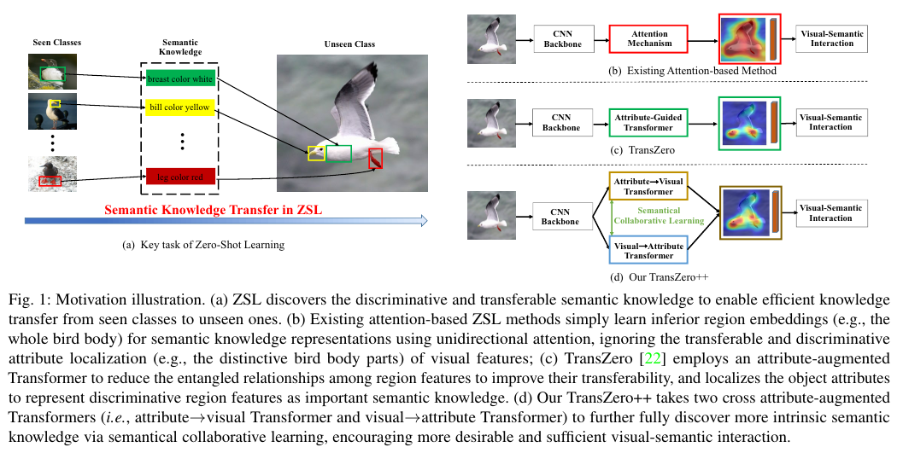
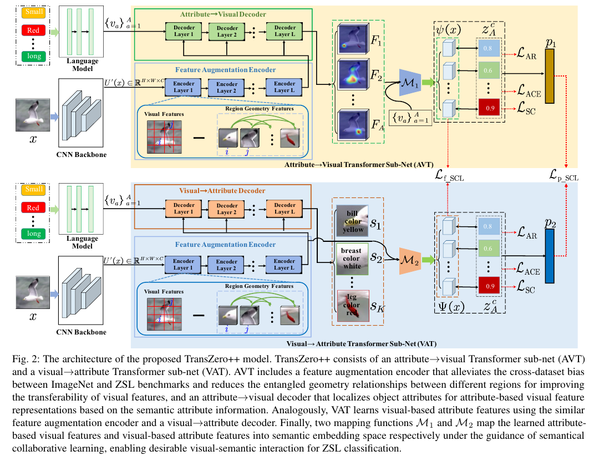

# TransZero++: Cross Attribute-Guided Transformer for Zero-Shot Learning

https://ieeexplore.ieee.org/stamp/stamp.jsp?tp=&arnumber=9987664

## 저널 : IEEE Transactions on Pattern Analysis and Machine Intelligence (2022), q1, if 23.6, 1%

## 저널 : 

## Abstrat :

- 제로샷 학습(ZSL)은 보는 클래스에서 보이지 않는 클래스로 Semantic knowledge을 전달함으로써 새로운 클래스 인식 문제를 해결합니다. 
  - Semantic knowledge은 일반적으로 다른 클래스 간에 공유된 속성 설명으로 표현되며, 이는 차별적 영역 특징을 나타내는  object attributes을 로컬화하기 위한 강력한 선행 요소로 작용하여 ZSL을 발전시키기 위한 유의미하고 충분한 시각적 의미적 상호 작용을 가능하게 합니다.
- 기존의  attention-based models은 ZSL에서 효과적인 지식 전달을 위한 핵심 의미 지식을 표현하기 위한 시각적 특징의 전달 가능하고 차별적인 속성 현지화를 무시하는 unidirectional(단방향) attention을 사용하여 단일 이미지에서 하위 지역 특징을 학습하는 데 어려움을 겪었습니다.
- 본 논문에서는 ZSL의 핵심 의미 지식 표현에 대한 시각적 특징을 정교화하고 정확한 속성 현지화를 학습하기 위해 TransZero++라고 하는 cross attribute-guided Transformer network를 제안합니다. 
  - 구체적으로, TransZero+는 속성 기반 시각적 특징과 시각 기반 속성 특징을 각각 학습하기 위해 attribute → Visual Transformer 서브넷(AVT)과 VAT ( visual → attribtue Transformer 서브넷)를 사용합니다.
  - feature-level 및  prediction-level 의미론적 collaborative losses을 추가로 도입함으로써 두 속성 유도 변환기는 의미론적 협력 학습을 통해 핵심 의미 지식 표현에 대한 의미론적 기반 시각적 임베딩을 학습하도록 서로 가르칩니다. 
- 마지막으로 AVT와 VAT에 의해 학습된 의미론적 기반 시각적 임베딩은 ZSL 분류를 위한 클래스 의미 벡터와 협력된 바람직한 시각적-시각적 상호 작용을 수행하기 위해 융합됩니다. 
- 광범위한 실험은 TransZero+가 세 가지 황금 ZSL 벤치마크와 대규모 ImageNet 데이터 세트에서 새로운 최첨단 결과를 달성한다는 것을 보여줍니다. 프로젝트 웹 사이트는 https://shiming-chen.github.io/TransZero-pp/TransZero-pp.html 에서 이용할 수 있습니다.

## 1 INTRODUCTION AND MOTIVATION

- 생성 모델은은 상당한 개선을 달성했지만 의미적 지식 [34], [35], [36]을 표현하기 위해 Red Legged Kittiwake의 세분화된 속성 정보(예: "bill color yellow")를 캡처하는 데 부족한 전역적(전체적) 시각적 특징 1에 의존합니다. 
  - 차별적이고 전달 가능한 의미적 지식은 일반적으로 몇 가지 속성에 해당하는 몇 개의 영역에 포함되어 그림 1(a)과 같이 보이는 클래스에서 보이지 않는 클래스로 효율적인 지식 전달을 가능하게 하기 때문입니다. 
  - 따라서 이러한 방법으로 학습된 시각적 특징 표현은 열등하여 지식 전달을 위한 바람직하지 않은 시각적-의미적 상호 작용을 초래합니다. 
  - 보다 최근에는 그림 1(b)과 같이 소수의 주의 기반 모델 [34], [37], [38], [39], [40], [41], [42]에서 보다 차별적인 영역 특징을 탐색하려고 시도했습니다. 
  - 그러나 이러한 방법은 
    - i) ZSL 분류를 위해 얽힌 영역(그리드) 특징을 직접 취하므로 시각적 특징이 보이지 않는 클래스로 전달되는 것을 방해합니다. 
    - i) 핵심 의미적 지식 표현을 위한 차별적 속성 현지화(예: 독특한 새 몸 부분)의 중요성을 무시하고 단방향 주의를 사용하여 단순히 영역 임베딩(예: 전체 새 몸)을 학습합니다. 
  - 따라서 ZSL에서 효율적인 의미적 지식 전달을 가능하게 하기 위해 시각적 특징에서 핵심 의미적 지식을 적절히 발견하는 것은 매우 필요하게 되었습니다.

- 위의 과제를 해결하기 위해 본 논문에서는 그림 1(d)과 같이 의미론적 협력 학습을 통해 ZSL에서 보이는 클래스에서 보이지 않는 클래스로 효율적인 지식 전달을 위한 핵심 의미 지식을 발견하는 TransZero++라는 교차 속성 유도 변압기를 제안합니다.
  - 구체적으로, TransZero++는 속성 기반 시각적 특징과 시각적 기반 속성 특징을 각각 학습하는 두 개의 속성 유도 트랜스포머 서브넷(즉, 속성→비주얼 트랜스포머(AVT)과 시각→비주얼 트랜스포머(VAT)로 구성되며, 이들은 두 개의 매핑 함수 M_1과 M_2를 사용하여 의미 임베딩 공간에 추가로 매핑되어 바람직한 시각-시각적 상호 작용을 수행합니다.

- AVT 및 VAT에서 우리는 먼저 
  - i) ImageNet과 ZSL 벤치마크 간의 교차 데이터 세트 편향을 완화하고 
  - ii) 보이는 클래스에서 보이지 않는 클래스로의 전달 가능성을 향상시키기 위해 서로 다른 영역 간의 얽힌 상대 기하학 관계를 줄임으로써 시각적 특징을 증가시키는 기능 증강 인코더를 사용합니다.
  
- 이러한 증강된 시각적 특징은 다음과 같은 순차적 학습을 촉진할 것입니다. 
  - 지역성을 강조하는 시각적 특징을 학습하기 위해 AVT에서 Attribute→Visual Decoder를 사용하여 시맨틱 속성 정보의 안내에 따라 주어진 이미지에서 각 속성과 가장 관련이 많은 이미지 영역(속성 기반 시각적 특징으로 표시됨)을 지역화합니다.

- 또한 VAT에서 시각적 기반 속성 특징을 학습하기 위해 visual→attribute 디코더를 사용합니다. 
  - feature-level and prediction-level의 semantical collaborative losses을 더 도입함으로써 두 attribute-guided transformers는 의미론적 협업 학습을 통해 핵심(key) 의미 지식 표현을 위한 두 가지 보완적 semantic-augmented visual embeddings을 더 학습하도록 서로 가르칩니다.
- 마지막으로, semantic vectors와 협력한semantic-augmented visual embeddings을 활용하여 ZSL 분류를 위한 바람직한visual-semantic interaction을 수행합니다. 
- 광범위한 실험은 TransZero+가 3개의 ZSL 벤치마크와 대규모 ImageNet 데이터 세트에서 새로운 최첨단을 달성한다는 것을 보여줍니다. 
  - 정성적인 결과는 또한 TransZero+가 시각적 기능을 정제하고 시맨틱 증강 기능 표현을 위한 속성 영역을 정확하게 현지화한다는 것을 보여줍니다.

- 이 작업의 예비 버전은 회의 논문(TransZero [22]라고 함)으로 발표되었습니다. 
  - 그림 1(c)과 같이, TransZero는 신뢰도가 낮은 점수로 차별 지역 특징 표현에 대한 일부 중요한 속성을 현지화할 수 있지만, 일부 다른 가치 있는 속성은 실패합니다(예: Red Legged Kittiwake의 "흰색 날개 색상"). 이 버전에서는 작업을 네 가지 측면에서 강화합니다. 
    - i) AVT에서 학습한 속성 기반 시각적 특징과 보완되는 시각 기반 의미 속성 표현을 학습하기 위해 부가 가치세를 제안하여, TransZero+가 시각적 특징에서 핵심 의미 지식을 완전히 발견할 수 있도록 합니다.
    - ii) 우리는 AVT와 VAT가 의미적 협력 학습의 안내에 따라 속성 현지화의 신뢰 점수를 향상시키기 위한 보다 본질적인 의미적 지식을 발견하도록 서로 가르치도록 하기 위해 기능 수준 및 예측 수준의 의미적 협력 손실을 도입합니다. 
    - ii) 학습된 속성 기반 시각적 특징과 시각적 기반 속성 특징은 서로 보완적이기 때문에 AVT와 VAT에 의해 학습된 두 가지 의미 증강 시각적 임베딩을 융합하여 ZSL 분류를 위한 바람직한 시각적-의미적 상호 작용을 수행합니다.
    -  ii) 우리는 제안된 프레임워크의 효과를 입증하고 각 구성 요소의 기여도를 검증하기 위해 실질적으로 더 많은 실험을 수행합니다. 따라서, TransZero [22]는 TransZero+로 확장됩니다.

- **본 논문의 주요 기여는 다음과 같이 요약됩니다:**
  - 우리는 시각적 특징을 정제하고 의미론적 협력 학습을 통해 의미적 지식 표현을 위한 객체 속성을 현지화하는 TransZero++라는 새로운 ZSL 방법을 소개합니다. 
    - TransZero++는 서로 보완적인 속성 기반 시각적 특징과 시각적 기반 속성 특징을 각각 학습하는 속성→시각적 트랜스포머 서브넷(AVT)과 시각적→시각적 트랜스포머 서브넷(VAT)으로 구성됩니다.
  - 우리는 AVT와 VAT 사이의 의미론적 협업 학습을 가능하게 하기 위해 기능 수준 및 예측 수준의 의미론적 협업 손실을 도입하고, 시각적 기능과 속성 기능 사이의 보다 본질적인 의미론적 지식을 발견하여 TransZero++가 의미론적 증강 시각적 임베딩을 학습하도록 장려합니다.
  - 광범위한 실험을 통해 TransZero++는 세 가지 인기 있는 ZSL 벤치마크와 대규모 ImageNet 데이터 세트에서 새로운 최첨단을 달성한다는 것을 입증했습니다. 일반적인 주의 기반 방법(즉, APN [39])과 비교하여, TransZero++는 CUB [32], SUN [43] 및 AWA2 [15]에서 각각 acc/H에서 6.3%/3.2%, 6.0%/4.9% 및 4.2%/8.6%의 상당한 개선을 이끌어냅니다.

## 2 RELATED WORK

### 2.1 Zero-Shot Learning
- 초기 임베딩 기반 ZSL 방법 [18], [24], [44], [44], [45]는 보기에서 보이지 않는 클래스로 의미적 지식을 전달하기 위해 시각적 도메인에서 의미적 도메인으로의 매핑을 학습하는 것을 목표로 합니다. 
  - 그들은 일반적으로 사전 훈련된 또는 종단 간 훈련 가능한 네트워크(예: ResetNet[30])에서 글로벌 시각적 특징을 추출합니다. 
  - 종단 간 모델은 시각적 특징을 미세 조정하므로 사전 훈련된 모델보다 더 나은 성능을 달성하므로 ImageNet과 ZSL 벤치마크 간의 데이터 세트 간 편향이 완화됩니다 [8], [28].

- 그러나 이러한 방법은 보이는 클래스 [15], [46], [47]에서만 모델을 학습하기 때문에 GZSL에서 보이는 클래스에 과도하게 적합합니다.
  - 이와 같이, 생성 ZSL 방법은 다양한 생성 모델(예: VAE [25], [26], [27], [33], GAN [25], [26], [27], [27], 및 생성 흐름 [29])을 사용하여 이 과제를 해결하기 위해 도입됩니다. 
  - 따라서, ZSL 작업은 감독 분류로 변환됩니다. Arora et al. [25]는 조건부 VAE 모델(SE-ZSL)을 사용하여 보이지 않는 클래스에 대한 이미지를 합성합니다. 
  - 고차원 이미지를 합성하는 것은 실현 가능하지 않기 때문에 Xian et al. [8], [16]은 GAN을 기반으로 시각적 특징을 합성할 것을 제안합니다. 
  - 생성기로서 의미론적-시각적 매핑을 학습하는 이러한 생성 방법과는 달리, 공통 공간 학습 기반 ZSL 방법은 VAE [26], [33], [48]를 사용하여 시각적 특징과 의미론적 특징을 동시에 공통 공간에 매핑하는 특별한 생성 모델이기도 합니다.

- 앞서 언급한 ZSL 방법은 상당한 개선을 달성했지만 여전히 상대적으로 바람직하지 않은 결과를 도출합니다.
  -  이는 전역 임베딩을 수행하기 위해 전체적인 시각적 특징을 압축하기 때문에 다양한 세분화된 클래스 간의 미묘한 차이를 효율적으로 포착할 수 없기 때문입니다 [35]. 
  -  또한 전체적인 시각적 특징은 한 도메인에서 다른 도메인(예: 보이는 클래스에서 보이지 않는 클래스로 전송할 수 있는 열악한 것으로 제한됩니다. 
  -  이 작업과 더 관련이 있는 것은 보다 차별적인 영역(또는 부분) 특징을 발견하기 위한 지침으로 속성 설명을 활용하는 최근의 주의 기반 ZSL 방법 [34], [37], [38], [39], [51]입니다.
  -  안타깝게도, 그들은 단순히 영역 임베딩(예: 전체 새의 몸)을 학습할 뿐 차별적인 속성 현지화(예: 독특한 새의 몸 부분)의 중요성을 무시합니다. 
  -  또한 CNN 백본을 미세 조정하는 것에 있어서도 종단 간 주의 모델은 시간이 많이 걸립니다. 
  -  대조적으로, 우리는 비 종단 간 ZSL 모델 하에서 차별적인 영역 특징 표현에 대한 속성 현지화를 학습하기 위해 속성 유도 변압기를 제안합니다.

### 2.2 Transformer Model

- 트랜스포머 모델 [52], [53], [54]은 최근 기계 번역 [55], 이미지 인식 [56], 비디오 이해 [57], 시각적 질문 답변 [58] 등 광범위한 언어 및 컴퓨터 비전 작업에서 탁월한 성능을 달성했습니다. 
  - 일반적으로 트랜스포머의 성공은 자체 감독 및 자기 주의 덕분입니다 [54]. 

  - 자체 감독을 통해 수동 주석의 높은 비용 없이 복잡한 모델을 훈련할 수 있으며, 이를 통해 주어진 데이터 세트에 제시된 엔티티 사이의 유용한 관계를 인코딩하는 일반화 가능한 표현을 학습할 수 있습니다. 

  - 자기 주의 계층은 토큰 세트의 요소(예: 언어로 된 단어 또는 이미지의 패치) 간의 관계를 학습하여 주어진 시퀀스의 광범위한 맥락을 고려합니다. 
    - 일부 방법 [57], [59], [60]은 또한 Transformer가 교육 중에 다양한 모드(예: 시각적 특징 및 언어) 간의 관계를 병렬로 더 잘 포착할 수 있음을 보여주었습니다. 
- 이러한 동기로 우리는 시각적 특징의 전달 가능성을 향상시키기 위해 서로 다른 영역 간의 관계를 줄이고 차별적 영역 특징을 표현하기 위한 속성 현지화를 학습하는 속성 유도형 Transformer를 설계합니다. 
- 이미지 패치에 대한 특징 표현을 학습하는 대부분의 비전 Transformer와 대조적으로, 우리의 TransZero+는 CNN 백본(예: ResNet)에서 학습한 시각적 특징에 대한 의미론적 증강 시각적 임베딩을 학습합니다.

### 2.3 Collaborative Learning

- 최근에는 동일한 작업에 대해 여러 모델을 공동으로 학습하는 협력 학습[61]이 도입되었습니다. 
  - 교사-학생 모델은 협력 학습을 사용하여 레이블이 지정된/ 레이블이 지정되지 않은 데이터에 대해 일관된 훈련 감독을 만들어 서로 간의 양방향 지식 전달을 가능하게 합니다. 
  - 따라서 서로 다른 모델 간의 고유 지식은 특징 표현 [62], [63]에 대해 증류됩니다.
- 일부 방법은 교사 모델 대신 학생 모델 풀을 채택하여 서로 감독하여 훈련합니다 [64], [65].
  - 이러한 작업은 두 개의 속성 유도 변압기에서 의미론적으로 강화된 시각적 임베딩 표현을 위한 더 본질적인 의미적 지식(예: 속성)을 발견하도록 의미론적 협력 학습을 설계하도록 동기를 부여합니다. 
  - 암묵적 지식 증류를 위해 여러 개의 유사한 네트워크를 사용하는 기존의 협력 방법과 달리, 의미론적 협력 학습은 명시적 지식 증류를 위해 각각 속성 기반 시각적 특징과 시각적 기반 속성 특징을 학습하는 두 개의 속성 유도 변압기를 기반으로 합니다.

## 3 PROPOSED METHOD

- 본 논문에서는 비 엔드 투 엔드 모델 하에서 의미론적 협력 학습을 통해 시각적 특징을 정교화하고, 차별적 지역 특징 표현을 위한 객체 속성을 현지화하며, 의미론적으로 강화된 시각적 임베딩을 학습하기 위한 교차 속성 유도 트랜스포머 네트워크(TransZero++)를 제안합니다.

- TransZero++는 두 개의 속성 가이드 Transformer 하위 네트워크를 포함하고 있습니다. 
  - 이들은 각각 속성 기반 시각적 특징(attribute-based visual features)과 시각 기반 속성 특징(visual-based attribute features)을 학습합니다. 
  - 이 두 특징은 각각 두 개의 매핑 함수 M1과 M2를 사용하여 의미론적 임베딩 공간으로 매핑되어, 시각-의미론적 상호작용을 수행합니다.

- AVT(Attribute→Visual Transformer)와 VAT(Visual→Attribute Transformer)에서는 먼저 특징 증강 인코더를 사용하여 시각적 특징을 증강시킵니다. 
  - 이는 ImageNet과 ZSL 벤치마크 간의 교차 데이터셋 편향을 완화하고, 다른 영역 간의 복잡한 상대 기하학적 관계를 줄여 시각적 특징의 전이 가능성을 향상시킵니다.

- AVT에서는 속성 기반 시각적 특징을 학습하기 위해 속성→시각 디코더를 사용하여, 주어진 이미지에서 각 속성과 가장 관련 있는 이미지 영역을 지역화합니다. 
  - 이는 의미론적 속성 정보의 지침 하에 이루어집니다. VAT에서는 시각 기반 속성 특징을 학습합니다.
  - 또한, 특징 수준과 예측 수준의 의미론적 협업 손실을 도입하여, 두 속성 가이드 변환기가 서로를 가르치며 의미론적 협업 학습을 통해 핵심 의미론적 지식 표현을 위한 두 가지 보완적인 의미론적 증강 시각적 임베딩을 학습합니다.

- 마지막으로, AVT와 VAT에 의해 학습된 의미론적 증강 시각적 임베딩은 클래스 의미론적 벡터와 협력하여 ZSL 분류를 위한 바람직한 시각-의미론적 상호작용을 수행합니다.

- 이러한 방법을 통해 TransZero++는 ZSL 벤치마크와 대규모 ImageNet 데이터셋에서 새로운 최첨단 결과를 달성하였습니다. 또한, 질적인 결과는 TransZero++가 시각적 특징을 정제하고 속성 영역을 정확하게 지역화하여 의미론적 증강 특징 표현을 학습한다는 것을 보여줍니다 

# 나의 의견:
- Transzero를 더 발전된 형태
- **코드를 확인하면 더 빠릴 이해 할 수 있다.**
- Transzero는 AAAI에서 사용한 모델이다.
- 또한 저자의 논문을 추적하면 MSDN이라는 논문을 만들고 같이 합쳐서 만들었따.
- 이 저자의 논문을 추적하면 어떻게 실험하는지 또한 어떻게 논문을 쓰는지 시간 절약 면에서 어떻게 하는지 배울 수 있다.
- **나중에 ZSL관련 저널 쓸때 도움이 확실히 될 것 같다.**   

- TransZero++는 두 개의 Transformer 하위 네트워크를 사용하여 속성 기반 시각적 특징과 시각 기반 속성 특징을 학습한다.
  - 이 두 하위 네트워크는 서로를 가르치며 의미론적으로 증가된 시각적 임베딩을 학습합니다. 
  - 이러한 접근 방식은 보이지 않는 클래스를 인식하는 데 필요한 핵심 의미론적 지식을 표현하는 데 도움이 됩니다.

- 그러나 이 논문은 여전히 몇 가지 제한 사항을 가지고 있다. 
  - 먼저, TransZero++는 속성 기반 시각적 특징과 시각 기반 속성 특징을 학습하기 위해 두 개의 Transformer 하위 네트워크를 사용하지만, 이러한 두 가지 접근 방식이 어떻게 함께 작동하는지에 대한 자세한 설명이 부족하다.
  -  또한, 이 논문에서 제안하는 의미론적 협력 학습 방법이 어떻게 효과적으로 작동하는지에 대한 명확한 이해를 제공하지 않습니다.

- 마지막으로, 이 논문에서 제안하는 TransZero++는 복잡한 구조를 가지고 있으며, 이로 인해 학습과 추론 과정이 복잡해질 수 있다.
  - 이러한 복잡성은 TransZero++를 실제 시스템에 적용하는 데 어려움을 초래할 수 있다. 
  - 따라서, TransZero++의 구조를 단순화하거나, 이러한 복잡성을 관리하는 방법에 대한 추가적인 연구가 필요할 수 있다.

- 전반적으로, 이 논문은 ZSL에 대한 새로운 접근 방식을 제시하며, 이는 이 분야의 연구를 촉진하는 데 중요한 기여를 한다. 
  - 그러나 이 논문에서 제시하는 방법은 여전히 몇 가지 제한 사항을 가지고 있으며, 이러한 제한 사항을 극복하기 위한 추가적인 연구가 필요하다.

