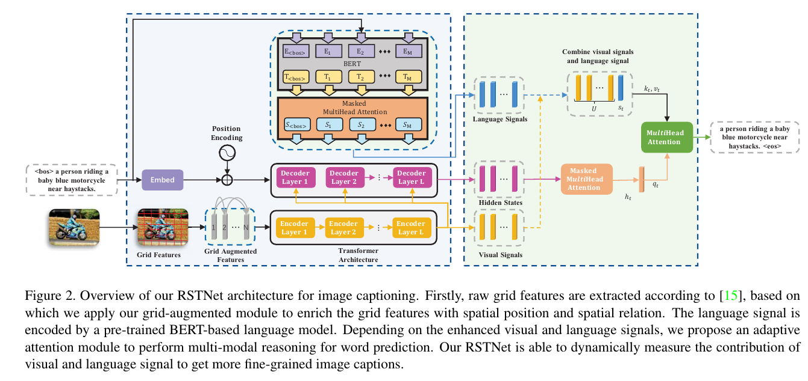

# **논문 제목**: RSTNet: Captioning With Adaptive Attention on Visual and Non-Visual Words

## **저자**: Zhang 등

## **출판 정보**: CVPR 2021

## [RSTNet: Captioning With Adaptive Attention on Visual and Non-Visual Words 자세한 설명](./RSTNet%20(2021).md)

## **논문 요약**: 
- 이 논문에서는 이미지 캡셔닝 작업을 위한 새로운 모델인 Relationship-Sensitive Transformer (RSTNet)를 제안합니다. 
  - 이 모델은 Grid-Augmented (GA) 모듈과 Adaptive-Attention (AA) 모듈을 사용하여 시각적 단어와 비시각적 단어에 대한 적응형 주의를 적용합니다. 
  - 이를 통해 모델은 단어 예측을 위한 시각적 신호와 언어 신호의 기여도를 적응적으로 측정할 수 있습니다.

## **1. 서론**

- 이미지 캡셔닝은 주어진 이미지의 시각적 내용을 설명하는 자연어 문장을 자동으로 생성하는 작업을 목표로 합니다. 
  - 이 작업은 CNN 기반 인코더가 시각적 특징을 추출하고, RNN 기반 디코더가 출력 문장을 생성하는 인코더-디코더 프레임워크를 널리 사용하고 있습니다. 
  - 이 논문에서는 이러한 프레임워크를 기반으로 두 가지 주요 측면에 초점을 맞추어 이미지 캡셔닝 모델을 개선하려고 합니다:
    -  a) 입력 이미지에서 추출된 시각적 특징 최적화, 
    -  b) 특징 처리를 위한 모델 구조 개선.

## **2. 시각적 표현과 그리드 특징**

- 이 논문에서는 시각적 표현을 위해 그리드 특징을 사용합니다. 
  - 그러나 그리드 특징은 트랜스포머 모델에 공급될 때 평탄화되어 공간 정보가 손실됩니다. 이 문제를 해결하기 위해, 저자들은 그리드 특징을 보강하는 Grid-Augmented (GA) 모듈을 제안합니다. 
  - 이 모듈은 상대적인 위치 간의 공간 기하학적 관계를 그리드에 통합하여 그리드 특징의 보다 포괄적인 사용을 촉진합니다.

## **3. 특징 처리를 위한 모델 구조**

- 트랜스포머 기반의 캡셔닝 모델은 공개 벤치마크에서 최고의 성능을 보여주고 있습니다. 
  - 그러나 캡션의 모든 단어가 시각적 단어가 아니며, 시각적 신호를 가지고 있지 않기 때문에, 트랜스포머 기반 이미지 캡셔닝 모델에서 시각적 단어와 비시각적 단어를 다르게 처리하는 효과적인 조치가 취해지지 않았습니다. 
  - 이 문제를 해결하기 위해, 저자들은 언어 컨텍스트와 시각적 신호를 기반으로 한 Adaptive Attention (AA) 모듈을 제안합니다. 이 모듈은 시각적 신호와 언어 컨텍스트의 기여도를 측정하여 세밀한 캡션 생성을 가능하게 합니다.

## **4. RSTNet**

- GA 모듈과 AA 모듈은 이미지 캡셔닝 모델인 Relationship-Sensitive Transformer (RSTNet)에 적용됩니다. 
  - 각 트랜스포머 인코더의 주의 모듈에 대해, 그리드 특징의 상대적인 기하학적 정보가 포함되어 더 정확한 주의 분포를 계산합니다. 
  - 디코더에 대해서는, 시각적 신호와 언어 신호의 기여도 사이에 균형을 이루어 단어를 직접 예측하는 대신에 기여도를 측정합니다.

## **5. 실험 결과**

- RSTNet는 MSCOCO 벤치마크 데이터셋에서 평가되었으며, 양적 및 질적 실험은 모델의 효과성을 입증하였습니다. 
- 특히, 제안된 RSTNet는 오프라인 및 온라인에서 최고의 성능을 보여주었습니다. 
- 더 많은 통찰력을 얻기 위해, 저자들은 RSTNet의 중간 출력을 사용하여 각 단어의 시각성을 측정하였습니다. 
- 이는 제안된 모델의 효과성을 보여주는 데 뿐만 아니라, 시맨틱 갭의 영향을 더 직관적으로 보여줍니다.

# 나의 의견 :

- 어쩔 수 없이 Transformer의 flatten으로 공간적인 정보 손실이 발생하여, grid-agumentation을 도입하여 공간적인 정보손실을 방지했다.
- 또한 image capure에 있어 공간적인 해석이 중요하다는 점에서 grid-agumentation을 좋은 방법이다.
- 일단은 언어특징을 모방하려는 시도를 했지만, transformer decoder에 정보가 결합되 심각한 언어편향이 가져 온다는 시도를 언급했다.
- 따라서 이들은 BERT 기반 언어 모델을 구현한 이유를 간단하게 언급을 하였다.
- 이는 논문의 시행착오에 있어서 기승전결이 너무 괜찮게 나왔다.

- 이 논문을 간다하게 보면 인코더에서 이미지를 받은 다음 디코더에서 단어를 출력하는 것이라고 해도 된다.
