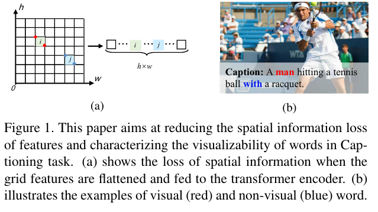

# RSTNet: Captioning with Adaptive Attention on Visual and Non-Visual Words

https://openaccess.thecvf.com/content/CVPR2021/papers/Zhang_RSTNet_Captioning_With_Adaptive_Attention_on_Visual_and_Non-Visual_Words_CVPR_2021_paper.pdf

## 컨퍼런스 : CVPR, 2021

## 저자 : 

## Abstract

- 트랜스포머는 평탄화(flattening operation) 작업으로 인한 공간(spatial) 정보 손실 뿐만 아니라 시각적 단어와 비사각적 단어 구별하는  변압기 모델의 결함은 여전히  탐구되지 않았다. 
- 본 논문에서 Grid-Augmented (GA) 모듈 제안한다. 이것은 상대 기하학 특징(features)이 시각 표현을 향상시키기 위해 통합된다.
- 다음으로 BERT 기반 언어 모델을 구성하여 언어 컨텍스트를 추출하고 변압기 디코더 위에 AA(Adaptive-Attention) 모듈을 소개합니다. AA 모듈은 단어 예측에 대한 결정을 내리기 전에 시각적 및 언어적 신호의 기여도를 적응적(adaptive)으로 측정합니다.
- 제안의 일반성을 입증하기 위해 GA와 AA 모듈을 모두 표준 변압기 모델에 적용하여 이미지 캡션 작업을 위한 관계 감지 변압기(Relationship-Sensitive Transformer RSTNet)를 만듭니다.

## 1. Introduction

- 이미지 캡션(caption) 작업은 주어진(given) 이미지의 시각적(visiual) 내용을 설명하기 위해 자연어 (natural language) 문장을 자동으로 생성하는 것을 목표로 한다.
	- 신경 기계 번역 (neural machine translation)에서 영감을 받은 인코더-디코더 프레임 워크는 CNN 기반 인코더가 시가적 트징을 추출하고 RNN 기반 디코더가 출력 문장을 생성하는 캡션모델에 의해 널리 채택 되었다.
	- 또한(besides), 각 단어를 생성할 때 모델이 관련 위치에 집중할 수 있도록 주의(attention) 메커니즘이 도입되었다.
	- 인코더-디코더 프레임 워크에 따르면, 이미지 캡션(image captioning) 모델을 개선하기 위해 대부분의 노력은 2가지 측명에 중점을 둔다.
		- a)  입력 이미지에서 추출된 시각적 특징을 최적화 하는것
		- b) 특징 처리를 위한 모델 구조를 개선 하는것

- 시각적인 측면에서(In terms of visiual representation), 지역 기반 시각적 특징(region-based visual features)은 이미지 캡션(image captioning)와 시각적 질문 답변(visual question answering)과 같은 주요 비전 및 언어 작업에서 지배적인(dominant) 접근 방식이 되었다.
	- 그러나 영역 추출(region extraction) 프로세스(process)는 시간이 너무 많이 소요 되므로 현재 영역 기능이 있는 대부분의 모델은 캐시된 시각적 기능(cached visual features)에 대해 직접 교육 및 평가 됩니다. 
	- cached visual features : "캐시된 시각적 특징(cached visual features )"은 나중에 사용할 수 있도록 메모리에 저장된 이미지의 사전 계산된(precomputed) 시각적 특징을 말합니다. 
	- 모델 교육 또는 평가 중에 필요할 때마다 이미지에서 시각적 기능을 추출하는 대신 이러한 캐시된 기능을 사용하여 시간과 계산 리소스를 절약합니다. 
	- 이 관행(practice)은 모델을 더 효율적으로 훈련하고 평가할 수 있기 때문에 특징 추출 프로세스가 계산 비용이 많이 들거나 시간이 많이 소요될 때 일반적입니다.

- 최근에 Jiang 등. [15] VQA에 대한 그리드 기능(grid features)을 재검토(revisited)하여 정확하게 동일한 영역 기능 검출기 계층(same layer of region feature detector)에서 추출한 그리드 기능이 속도와 정확도 모두에서 상당히 잘 작동한다는 것을 입증했습니다.
	- 본 논문에서는 또한 캡션 모델(captioning model)의 주요 시각적 표현으로 그리드 기능을 활용합니다. 
	- 그럼에도 불구하고, **그리드 기능은 변압기 모델에 공급될 때 평평해지므로, 그림 1(a)와 같이 공간 정보의 손실이 불가피(inevitably)합니다. **
	- 따라서 그리드 기능을 보다 포괄적(comprehensive)으로 사용할 수 있도록 상대적 위치 간 공간 기하학적 관계를 그리드에 통합하는 그리드 증강(GA) 모듈을 제안합니다.

- 기능 처리(feature processing)를 위한 모델 구조 측면에서, Transformer[37] 기반 캡션 모델[13, 6, 28]은 공개 벤치마크에서 최첨단 성능을 이끌어 왔습니다.
	- 변압기 아키텍처는 훈련 중에 시각적 특징과 프로세스 시퀀스 간의 관계를 병렬(parallel)로 더 잘 포착할 수 있습니다.
	- 그러나 그림 1(b)와 같이 시각과 언어 사이의 의미적 차이(semantic gap)로 인해 캡션의 모든 단어가 시각적 단어가 아니며 해당(corresponding) 시각적 신호(visual signals)를 가지고 있는 것은 아닙니다 . 
	- 변압기 디코더 계층의 주의 모듈의 경우, 각 단어를 예측하는 데 사용되는 중간(intermediate) 표현이 함께 쌓입니다.
	-  따라서 단어가 시각적 단어인지 비시각적 단어인지에 관계없이 모든 단어 예측은 척도화된 도트 제품 [37] 작업을 기반으로 동등(equally)하게 처리됩니다.
	-  즉(in other word), 변압기 기반 이미지 캡션 모델에 대해 시각적 단어와 비시각적 단어를 다르게(differently) 처리하기 위한 효과적인 조치(measure)가 취해지지 않았습니다.
- 따라서, 우리는 세분화된(fine-grained) 캡션 생성에 대한 시각적 신호와 언어 컨텍스트의 기여도를 측정(measure)하기 위해 변압기 아키텍처를 위한 언어 컨텍스트 및 시각적 신호를 기반으로 적응형 주의(Adaptive Attention AA) 모듈을 구축합니다.

**summary contribution**
- 이미지에서 추출한 원시 시각적 특징의 공간 정보를 통합하여 캡션 성능을 향상시키기 위해 평평한 그리드 특징의 확장인 그리드 증강(GA) 모듈을 제안합니다.
- 우리는 보다 세분화된 캡션 생성을 용이하게 하기 위해 각 단어의 예측에 대한 시각적 신호와 언어 신호의 기여도를 동적으로 측정하는 AA(Adaptive-Attention) 모듈을 제안합니다.
- 우리는 COCO 벤치마크 데이터 세트에서 새로운 최첨단 성능을 달성하기 위해 GA 모듈과 AA 모듈을 RSTNet에 적용합니다. 더 많은 통찰력을 얻기 위해 어휘(vocabulary)에서 각 단어의 시각화(visualizability) 가능성을 정량적(quantitatively)으로 측정하는 시각성(visualness)이라는 교차 도메인(cross-domain) 속성을 정의합니다.

## 2.  Related Work

### 2.1 Image Captioning