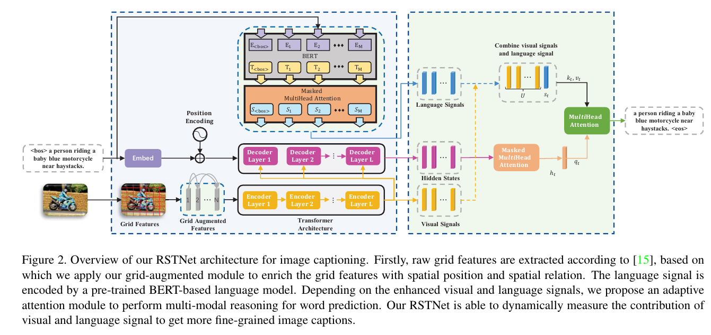

# RSTNet: Captioning with Adaptive Attention on Visual and Non-Visual Words

https://openaccess.thecvf.com/content/CVPR2021/papers/Zhang_RSTNet_Captioning_With_Adaptive_Attention_on_Visual_and_Non-Visual_Words_CVPR_2021_paper.pdf

## 컨퍼런스 : CVPR, 2021

## 저자 : 

## Abstract

- 트랜스포머는 평탄화(flattening operation) 작업으로 인한 공간(spatial) **정보 손실 뿐만 아니라 시각적 단어와 비사각적 단어 구별하는  변압기 모델의 결함은 여전히  탐구되지 않았다**. 
- 본 논문에서 **Grid-Augmented (GA) 모듈 제안한다. 이것은 상대 기하학 특징(features)이 시각 표현을 향상시키기 위해 통합**된다.
- 다음으로 **BERT 기반 언어 모델을 구성하여 언어 컨텍스트를 추출하고 변압기 디코더 위에 AA(Adaptive-Attention) 모듈을 소개합니다. AA 모듈은 단어 예측에 대한 결정을 내리기 전에 시각적 및 언어적 신호의 기여도를 적응적(adaptive)으로 측정**합니다.
- 제안의 **일반성을 입증하기 위해 GA와 AA 모듈을 모두 표준 변압기 모델에 적용하여 이미지 캡션 작업을 위한 관계 감지 변압기(Relationship-Sensitive Transformer RSTNet)를 만듭**니다.

## 1. Introduction

- 이미지 캡션(caption) 작업은 주어진(given) 이미지의 시각적(visiual) 내용을 설명하기 위해 자연어 (natural language) 문장을 자동으로 생성하는 것을 목표로 한다.
	- 신경 기계 번역 (neural machine translation)에서 영감을 받은 인코더-디코더 프레임 워크는 CNN 기반 인코더가 시가적 트징을 추출하고 RNN 기반 디코더가 출력 문장을 생성하는 캡션모델에 의해 널리 채택 되었다.
	- 또한(besides), 각 단어를 생성할 때 모델이 관련 위치에 집중할 수 있도록 주의(attention) 메커니즘이 도입되었다.
	- 인코더-디코더 프레임 워크에 따르면, 이미지 캡션(image captioning) 모델을 개선하기 위해 대부분의 노력은 2가지 측명에 중점을 둔다.
		- a) 입력 이미지에서 추출된 시각적 특징을 최적화 하는것
		- b) 특징 처리를 위한 모델 구조를 개선 하는것
		- `기존의 image capturing이 어떻게 활용됬는지 정리 하는 글`

- 시각적인 측면에서(In terms of visiual representation), 지역 기반 시각적 특징(region-based visual features)은 이미지 캡션(image captioning)와 시각적 질문 답변(visual question answering)과 같은 주요 비전 및 언어 작업에서 지배적인(dominant) 접근 방식이 되었다.
	- 그러나 영역 추출(region extraction) 프로세스(process)는 시간이 너무 많이 소요 되므로 현재 영역 기능이 있는 대부분의 모델은 캐시된 시각적 기능(cached visual features)에 대해 직접 교육 및 평가 됩니다. 
	- cached visual features : "캐시된 시각적 특징(cached visual features )"은 나중에 사용할 수 있도록 메모리에 저장된 이미지의 사전 계산된(precomputed) 시각적 특징을 말합니다. 
	- 모델 교육 또는 평가 중에 필요할 때마다 이미지에서 시각적 기능을 추출하는 대신 이러한 캐시된 기능을 사용하여 시간과 계산 리소스를 절약합니다. 
	- 이 관행(practice)은 모델을 더 효율적으로 훈련하고 평가할 수 있기 때문에 특징 추출 프로세스가 계산 비용이 많이 들거나 시간이 많이 소요될 때 일반적입니다.

- 최근에 Jiang 등. [15] VQA에 대한 그리드 기능(grid features)을 재검토(revisited)하여 정확하게 동일한 영역 기능 검출기 계층(same layer of region feature detector)에서 추출한 그리드 기능이 속도와 정확도 모두에서 상당히 잘 작동한다는 것을 입증했습니다.
	- 본 논문에서는 또한 캡션 모델(captioning model)의 주요 시각적 표현으로 그리드 기능을 활용합니다. 
	- 그럼에도 불구하고, **그리드 기능은 변압기 모델에 공급될 때 평평해지므로, 그림 1(a)와 같이 공간 정보의 손실이 불가피(inevitably)합니다.**
	- 따라서 **그리드 기능을 보다 포괄적(comprehensive)으로 사용할 수 있도록 상대적 위치 간 공간 기하학적 관계를 그리드에 통합하는 그리드 증강(GA) 모듈을 제안**합니다.

- 기능 처리(feature processing)를 위한 모델 구조 측면에서, Transformer[37] 기반 캡션 모델[13, 6, 28]은 공개 벤치마크에서 최첨단 성능을 이끌어 왔습니다.
	- 변압기 아키텍처는 훈련 중에 시각적 특징과 프로세스 시퀀스 간의 관계를 병렬(parallel)로 더 잘 포착할 수 있습니다.
	- 그러나 그림 1(b)와 같이 시각과 언어 사이의 의미적 차이(semantic gap)로 인해 캡션의 모든 단어가 시각적 단어가 아니며 해당(corresponding) 시각적 신호(visual signals)를 가지고 있는 것은 아닙니다 . 
	- 변압기 디코더 계층의 주의 모듈의 경우, 각 단어를 예측하는 데 사용되는 중간(intermediate) 표현이 함께 쌓입니다.
	-  따라서 단어가 시각적 단어인지 비시각적 단어인지에 관계없이 모든 단어 예측은 척도화된 도트 제품 [37] 작업을 기반으로 동등(equally)하게 처리됩니다.
	-  즉(in other word),** 변압기 기반 이미지 캡션 모델에 대해 시각적 단어와 비시각적 단어를 다르게(differently) 처리하기 위한 효과적인 조치(measure)가 취해지지 않았**습니다.
- 따라서, **우리는 세분화된(fine-grained) 캡션 생성에 대한 시각적 신호와 언어 컨텍스트의 기여도를 측정(measure)하기 위해 변압기 아키텍처를 위한 언어 컨텍스트 및 시각적 신호를 기반으로 적응형 주의(Adaptive Attention AA) 모듈을 구축**합니다.

**summary contribution**
- 이미지에서 추출한 원시 시각적 특징의 공간 정보를 통합하여 캡션 성능을 향상시키기 위해 평평한 그리드 특징의 확장인 그리드 증강(GA) 모듈을 제안합니다.
- 우리는 보다 세분화된 캡션 생성을 용이하게 하기 위해 각 단어의 예측에 대한 시각적 신호와 언어 신호의 기여도를 동적으로 측정하는 AA(Adaptive-Attention) 모듈을 제안합니다.
- **우리는 COCO 벤치마크 데이터 세트에서 새로운 최첨단 성능을 달성하기 위해 GA 모듈과 AA 모듈을 RSTNet에 적용합니다. 더 많은 통찰력을 얻기 위해 어휘(vocabulary)에서 각 단어의 시각화(visualizability) 가능성을 정량적(quantitatively)으로 측정하는 시각성(visualness)이라는 교차 도메인(cross-domain) 속성을 정의**합니다.

## 2.  Related Work

### 2.1 Image Captioning

- 이미지 캡션의 주요 개발 [24]은 전통적인 방법 단계(traditional method stage)와 딥 러닝 방법 단계(deep learning method stage)의 두 단계로 나눌 수 있습니다. 
	- 기존 방법 단계(traditional method stage)에서 검색(retrieval-based) 기반 [10] 및 템플릿 기반(template-based) [36] 방법은 이미지 캡션을 위한 두 가지 일반적인 구현 유형입니다.
	- 이미지가 주어지면 검색 기반 방법은 미리 정의된 문장 풀에서 가장 유사한 문장 세트 또는 하나를 선택하는 반면, 템플릿 기반(template-based) 방법은 슬롯형(slotted) 문장 템플릿을 생성하고 감지된(detected) 시각적 개념을 사용하여 공백(gap)을 채웁니다.

	- 딥 러닝에서 상당한 발전을 이루면서, 신경 기계 번역에서 파생된(derived from)인코더-디코더 패러다임이 캡션 모델[25, 39]에 채택되었으며, 여기서 CNN은 이미지에서 시각적 특징을 추출하는 인코더로, RNN은 해당 출력 시퀀스를 생성하는 디코더로 사용되었습니다.
	- 그 후, 이미지 캡션의 주요 초점은 더 정확하고 상세한 캡션을 생성하기 위해 주의 메커니즘을 사용하여 시각적 단서와 언어적(linguistic) 단서(cues) 사이의 상호 작용을 모델링하는 것으로 전환(shifted)되었습니다. 
	- 예를 들어, Xu 등. [41] LSTM 기반 디코더인 Lu et al.에 부드럽고 단단한 주의를 도입했습니다. [23] 각 단어를 생성할 때 시각적 신호에 주의(attention)해야 하는지 여부를 동적으로 결정하는 적응형(adaptive) 주의 메커니즘을 제안했고 Anderson 등이 이를 설명했습니다. [2] 
	- 그리드 수준(grid-level)에서 객체 및 돌출(salient) 영역 수준으로 시각적 특징을 개선하는 상향식(bottom-up) 및 하향식(top-down) 주의 메커니즘을 도입했습니다.

### 2.2. Region Features vs. Grid Features

- 시각적 특징의 표현은 딥 러닝의 광범위한(extensive) 적용 이후 두 가지 주요 단계를 거쳤습니다.
  - 첫 번째 단계에서 그리드 기능으로 시각적 정보를 표현(represent)하기 위해 일련의 컨볼루션 신경망[32, 11]이 제안되었으며, 이러한 그리드 기능은 이미지 분류[18]와 같은 시각적 작업과 이미지 캡션과 같은 다중 모드 작업에서 우수한 성능을 달성했습니다.

  - 두 번째 단계에서 RCNN 기반 탐지 모델의 출현(emerging)은 세분화된 작업에 대한 영역 기능의 효과를 보여줍니다. 
    - 대표적으로 앤더슨 외 연구진. [2] 사전 훈련된 지역 기능(region feature)을 멀티모달 작업에 적용하고 이미지 캡션 및 시각적 질문 답변 모두에서 우수한 성능을 달성했습니다. 
    - 그 후, 지역 특성이 광범위하게 연구되어 대부분의 비전 및 언어 작업에 대한 사실상(defacto)의 표준이 되었습니다.
- 최근에 Jiang 등. [15] VQA에 대한 그리드 기능을 다시 방문(revisited)하여 사전 훈련된 검출기의 정확히(exactly) 동일한 계층에서 추출된 그리드 기능이 지역 기반(region-based)의 대응물(counterpart)에 비해 경쟁적(competitively)으로 성능을 발휘할 수 있으며 동시에 시간 소모, 종단 간(end-to-end) 교육 등과 같은 몇 가지 중요한 문제를 해결할 수 있다는 것을 발견했습니다.
  - 이러한 문제는 최첨단 이미지 캡션 모델에도 존재합니다. 
- 본 논문에서는 **그리드 기능을 시각적 표현으로 활용**합니다. 
  - 또한 그리드 기**능의 평탄화(flatten)로 인한 공간 정보 손실 문제를 해결하기 위해 그리드 기능의 증강된 형태를 탐구**합니다.

### 2.3. Transformer Models

- RNN 기반 모델은 시퀀스(sequence) 특성에 의해 제한되며 멀리 있는9distant) 위치 간의 의존성으로 어려움을 겪습니다(suffer from) [37]. 
	- 이 문제를 해결하기 위해, [37, 7, 33]은 재발(recurrence)과 컨볼루션(convolution)을 주의(attention) 메커니즘으로 대체할 것을 제안했고 거의 모든 신경 언어 처리(NLP) 메트릭을 새로 고쳤습니다.

- 그 후(Subsequently), 이 아이디어를 이미지 캡션으로 전환(transfer)하기 위한 많은 노력이 이루어졌습니다. [3] 
	- 이미지 캡션 모델에서 컨볼루션 언어 모델을 탐색했습니다. Herdade et al. [12] 영역 피쳐 간의 지오메트리(geometry) 관계를 캡션을 위해 변압기 아키텍처에 통합했습니다.
	- [13] 주의 결과와 쿼리 간의 관련성(relevance)을 결정하기 위해 주의 메커니즘에 대한 GLU 유사 구조를 제안했습니다. 
	- Li et al. [20] 외부(external) 속성 검출기에 의해 추출된 시각적 정보와 의미론적 지식을 활용하기 위해 변압기 인코더와 디코더를 연결하는 주의 모듈을 확장했습니다.
	- [6] 변압기 인코더에서 주의 모듈을 증강하기 위한 학습 가능한 우선 순위(priori) 정보와 각 인코더 레이어와 각 디코더 레이어 간의 완전한 연결을 구축하기 위한 메시(mesh( 구조를 소개했습니다. 
	- 팬 등. [28] 공간 및 채널별 이중 선형(Bi-linear) 주의 분포를 모두 활용하기 위해 변압기 모델에 이중 선형 풀링(Bi-linear Pooling)을 도입했습니다.
- 위에서 언급한 변압기 기반 캡션 모델이 꽤 유망한 결과를 달성했지만, 심각한 문제는 여전히 존재합니다. 
	- **모든 단어 시퀀스가 시각적 단어와 비시각적 단어가 동일하게(equally) 처리되는 고차원 텐서로 결합**된다는 것입니다.
- **본 논문에서는 모델이 캡션을 위한 단어 시퀀스(sequence)를 예측할 때 시각적 신호와 현재 언어 컨텍스트의 기여도를 적응적(adaptively)으로 측정할 수 있도록 변압기 백본을 기반으로 한 적응형 주의를 탐구합니다.**

## 3. Method

- 그림 2는 제안된 RSTNet의 전체 아키텍처를 보여줍니다. 
	- 시각적 신호는 그리드 확장 기능으로 표현되며, 언어 신호는 사전 훈련된 BERT 기반 언어 모델에 의해 추출되며, 적응형 주의 모듈은 단어 예측을 위한 시각적 신호와 언어 컨텍스트의 기여도를 측정합니다.
- 우리는 먼저 3.1절에서 그리드 기능 표현을 보여줍니다.
- 그런 다음, 우리는 3.2절에서 언어 기능 표현의 세부 사항을 제공합니다. 
- 다음으로, 3.3절에서 이미지 캡션 작업을 위해 제안된 관계 민감 변압기(Relationship-Sensitive Transformer RSTNet)의 구현을 소개합니다. 
- 또한 3.4절에서 단어의 시각화 가능성을 설명하기 위해 시각성(visualness)을 정의하고 3.5절에서 RSTNet의 교육 세부 사항을 제공합니다.

### 3.1. Grid Feature Representation

- [15]의 작업에 따라 원시 그리드(raw grid feature) 기능이 제공됩니다. 
	- 일련의 h×w 그리드 특징을 고려할 때, 이전의(previous) 접근 방식은 일반적으로 그것들을 평평하게(flatten) 만들어 변압기 인코더로 직접 보냅니다. 
	- 그러나 이러한 평탄화(flatten) 작업은 필연적(inevitably)으로 입력 이미지의 공간 정보(예: 그리드 쌍의 위치 및 관계)를 손실시킵니다.
- 본 논문에서는 위의 문제를 해결하기 위해 그리드 위치 간의 상대적 기하학적 관계(relative geometry relationships between grid positions)를 통합하는 그리드 증강(Grid-Augmented GA) 모듈을 구축(build)합니다.
- `cvpr accept 될만 한 논문이다. 왜냐하면 기존의 문제점을 명확히 지적하고 해결 방안 그리고 방법을 제시 했다.`

- 우리는 먼저 각각의 2D 상대 위치 쌍(pair)을 계산합니다
- 그리드: {(xmini,ymini), (xmaxi,ymaxi)}, 여기서 (xmini,ymini)는 그리드 i의 왼쪽 상단(upper) 모서리의 상대 위치 좌표이며, (xmaxi,ymaxi)는 그리드 i의 오른쪽 하단(lower) 모서리의 상대 위치 좌표입니다(그림 1(a).
	-  구체적인 계산 과정은 보충 자료(supplementary)에 나와 있습니다. 그런 다음 그리드 i의 상대 중심 좌표(cxi, cyi), 상대 폭 wi 및 상대 높이 hi를 다음과 같이 계산합니다:
	-  `그림 설명 없었으면 이해하기 힘들었을 것 같다. 물론 이렇게 친절히 글이 나와도 논문 설명에 있었어 그림이 더 명확하게 가독성을 주는 것은 없다. 따라서 필요에 따라 그림을 적절히 배치 해야 한다. 그리고 과도 하게 친절해야 한다는 생각도 든다.`.

- 마지막으로, [12, 9]의 영역 기하학적 특징 계산을 모방(imitate)하여 두 그리드 i와 j 사이의 상대적 기하학적(relative geometry) 특징을 얻습니다:

### 3.2. Language Feature Representation

- 주어진 시퀀스의 언어 특징을 얻기 위해, 우리는 게이트된 단어 메모리를 현재 단어의 언어 특징으로 사용하는 [23]의 방법을 모방하려고 시도한 적이 있습니다.
	- 그러나, 우리는 실험을 통해 메모리 정보와 숨겨진 정보가 변압기 디코더에 매우 결합(couple)되어 심각한 언어 편향(bias)을 초래한다는 것을 발견했습니다.
	- `이미 시도를 해보았지만 안되는 이유를 이렇게 언급 했구나, 왜 자기가 지금 제안한 방법을 썻는지 말이야`

- 주어진 시퀀스의 언어 특징을 얻기 위해, 우리는 게이트된 단어 메모리를 현재 단어의 언어 특징으로 사용하는 [23]의 방법을 모방하려고 시도한 적이 있습니다.
	- 그러나, 우리는 실험을 통해 메모리 정보와 숨겨진 정보가 변압기 디코더에 매우 결합(couple)되어 심각한 언어 편향을 초래한다는 것을 발견했습니다.

- 따라서 자연어 처리 커뮤니티의 최근 추세를 따르고 BERT 기반 [7] 언어 모델(BBLM)을 구축하여 언어 기능을 추출합니다.
	- 테스트 단계에서 부분적으로 생성된 문장 정보에만 액세스할 수 있다는 점을 고려하여 BERT 모델 위에 변압기 디코더 레이어와 유사한 마스킹된 주의 모듈을 추가합니다.
	- 그림 3은 당사 언어 기능 모듈의 스키마(schema)를 보여줍니다. 
	- 단어 시퀀스 W = (< bos >, w1, w2, ..., wM)이 주어지면 이 모듈은 이 시퀀스 ˆW = (ˆw1, ˆw2, ..., ˆwM, < eos >)를 한 번의 단계로 오프셋을 사용하여 단어별로(word by word) 예측합니다. 
	- 이 프로세스 흐름은 다음 공식으로 표현할 수 있습니다:

