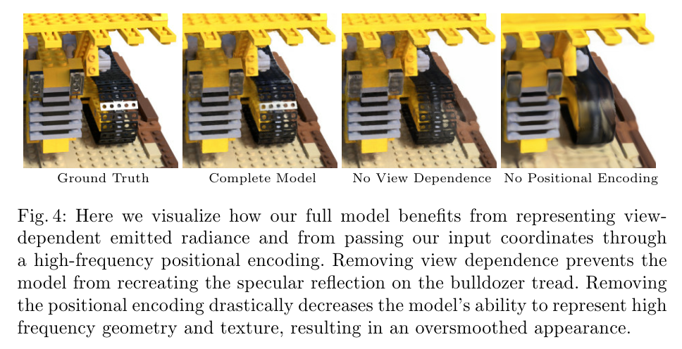
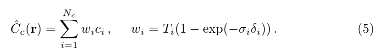
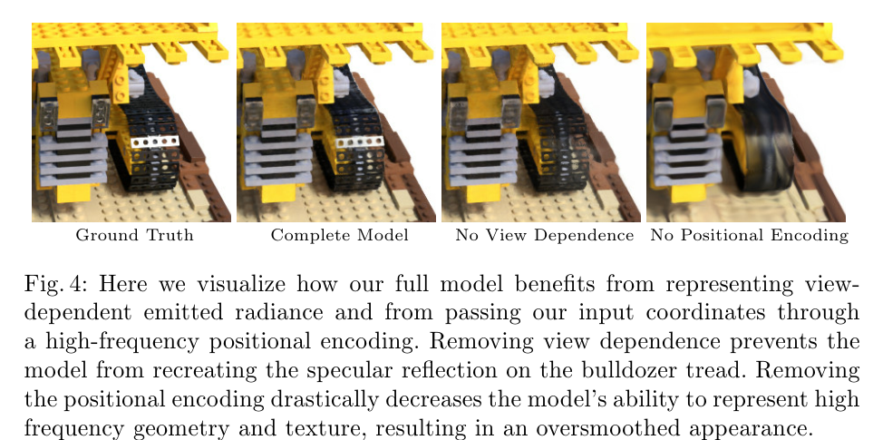
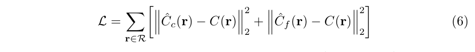
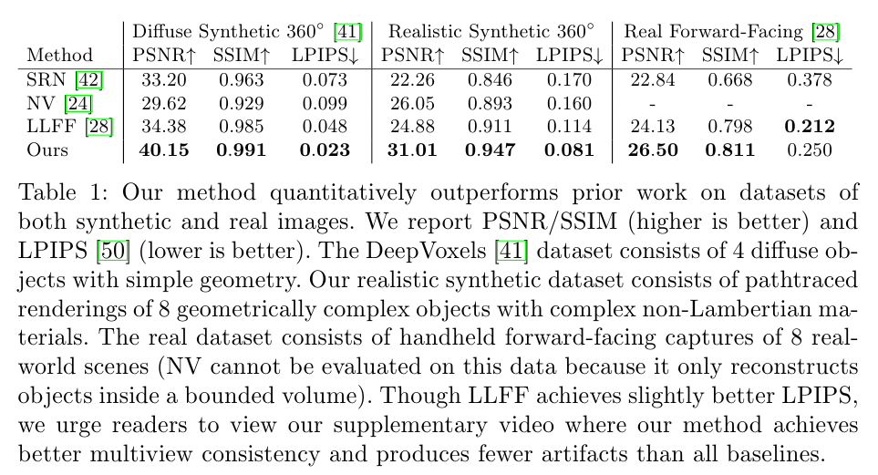

# NeRF: Representing Scenes as Neural Radiance Fields for View Synthesis


## 저널 : 2021년 q1, if 14.065, 0.81


## 저자 : 

공식 사이트 : https://www.matthewtancik.com/nerf
한국인이 만든거 https://modulabs.co.kr/blog/nerf-from-2d-to-3d/


[Rendering](/paper%20study/image%20study/0.0%20참고/0.0.1/rendering.md)

[Radiance Field](/paper%20study/image%20study/0.0%20참고/0.0.1/Radiance%20Field.md)

## abstrct:
- sparse 입력 view 세트을 사용하여 기본적인 continuous volumetrice(연속 체적) scene function을 최적화함으로써 complex scene의 새로운 view을 합성하기 위해 최첨단 성능 달성했다.
  - algorithm에  a scene에 fully-connected deep network(non-colvolutional) 을 사용하여 표현 했다.
  - input으로 5D ( spatial location (x,y,z) 그리고 viewing direction (theta, phi)) 
  - output으로 해당 공간 위치에서의 체적 밀도와 관찰 시점에 따라 달라지는 발산된 밝기입니다\
  - 우리는 카메라 광선을 따라 5차원 좌표를 조회(querying)하여 view을 합성하며, 우리는 classic volume rendering techniques을 사용하여 이미지안에있는 output colors와 densities을 투영한다.
  - [rendering 렌더링이란?](/paper%20study/image%20study/0.0%20참고/0.0.1/렌더링.md)
  - Because volume rendering은 본질적으로 미분가능(differentiable)하기 때문에, 우리의 표현 방식을 최적화기 위해 필요한 유일한 입력은 known 카메라 pose를 가진 이미지의 집합이다.
  - `위에거 해석 :  기술적으로, 미분 가능한 시스템은 훈련 중에 그라디언트(미분 값)를 사용하여 최적화될 수 있습니다. 따라서, 체적 렌더링의 이러한 특성을 활용하면, 알려진 카메라 포즈를 가진 이미지만을 사용하여 해당 표현 방식을 최적화할 수 있습니다.`
  - 우리는 complicated geometry 형태와 외관을 가진 장면들의 사실적인(photorealistic) 새로운 뷰를 렌더링하기 위해 'neural radiance fields'를 어떻게 효과적으로 최적화하는지 설명하며, 이전의 신경 렌더링 및 뷰 합성 연구보다 더 우수한 결과를 보여줍니다."

## 1 Introduction

- 이 연구에서는, 연속(continuous) 5D 장면 표현의 매개변수를 직접 최적화하여 캡처된 이미지의 렌더링 오류를 최소화함으로써, 오랫동안 지속되어(long-standing) 온 뷰 합성 문제를 새로운 방식으로 해결합니다.
  
- 우리는 고정된 장면(static scene)을 연속적인 5차원 함수로 표현하며, 이 함수는 공간의 각 점 (x, y, z)에서 각 방향 (θ, φ)으로 발산되는 방사도와, 미세한 불투명도( differential opacity)처럼 작동하여 (x, y, z)를 통과하는 광선이 얼마나 많은 방사도를 축적하는지를 제어하는 밀도를 출력합니다."
  - 우리의 방법은 합성곱 레이어 없이 깊은 완전 연결 신경망(다층 퍼셉트론 또는 MLP로도 불림)을 최적화하여 5차원 좌표 (x, y, z, θ, φ)에서 단일 체적 밀도와 뷰에 종속적인 RGB 색상으로 회귀하는 이 함수를 표현합니다.
  - neural raidance filed (NeRF)
    - 1) 3D 포인트의 샘플 세트를 생성하기 위해 카메라 광선을 장면을 통해 진행시키고, 
    - 2) 해당 포인트와 그에 해당하는 2D 시점 방향을 신경망의 입력으로 사용하여 색상 및 밀도의 출력 세트를 생성하며, 
    - 3) 해당 색상 및 밀도를 2D 이미지로 누적하기 위해 고전적인 볼륨 렌더링 기술을 사용합니다.
  - 본질적으로으로 미분 가능하기 때문에, gradient descent를 사용하여 관측된 각 이미지와 표현에서 렌더링된 해당 뷰 간의 오차를 최소화하여 이 모델을 최적화할 수 있습니다.
  - 여러 뷰에서 이 오차를 최소화(minimize)하면 네트워크가 실제 장면 내용을 포함하는 위치에 높은 부피 밀도와 정확한 색상을 할당함으로써 장면의 일관된(coherent) 모델을 예측하도록 권장합니다.
  -  그림 2는 이 전체 파이프라인을 시각화합니다.


```
이 설명은 어떻게 신경 라디언스 필드가 장면을 표현하고 이미지를 렌더링하는지에 대한 과정을 개요로 보여주는 것입니다.
(a): 카메라의 광선을 따라 3D 공간의 특정 위치와 그 위치에서의 시야 방향(5D 좌표)을 샘플링합니다.
(b): 해당 5D 좌표들이 다층 퍼셉트론(MLP)에 입력되며, MLP는 해당 위치와 방향에 대한 색상과 부피 밀도를 출력합니다.
(c): 출력된 색상과 부피 밀도 값들은 볼륨 렌더링 기법을 사용하여 최종적인 이미지로 합성됩니다.
(d): 이 렌더링 프로세스는 미분 가능하므로, 렌더링된 이미지와 실제 캡처된 이미지 간의 차이(잔차)를 최소화하는 방향으로 신경 라디언스 필드를 최적화할 수 있습니다.
```

- 복잡한 장면에 대한 neural radiance field representation을 최적화하는 기본 구현은 충분히 고해상도의 표현으로 수렴하지 않으며, 카메라 광선당 필요한 샘플 수에서 비효율적입니다.
  - 우리는 MLP가 더 높은 주파수의 함수를 표현할 수 있도록 위치 인코딩을 사용하여 입력 5D 좌표를 변환함으로써 이러한 문제를 해결합니다. 
  - 또한 이 고주파 장면 표현을 적절하게 샘플링하기 위해 필요한 쿼리 수를 줄이기 위한 계층적 샘플링 절차를 제안합니다.


# 2 Related Work

- 컴퓨터 비전에서 유망한 최근 방향은 3D 공간 위치로부터 해당 위치의 부호 거리(the signed distance) [6]과 같은 형상의 암시적 표현으로 직접 매핑하는 MLP의 가중치로 객체 및 장면을 인코딩하는 것입니다.
  - 그러나, 이러한 방법들은 지금까지 삼각형 메시(triangle meshes) 또는 보셀 그리드(voxel grids)와 같은 이산적인 표현을 사용하여 장면을 표현하는 기술과 동일한 정밀도(fidelity)로 복잡한 기하학을 갖는 현실적인 장면을 재현할 수 없었습니다.
  - 이 섹션에서는 이 두 가지 작업 방식을 검토하고 우리의 접근법과 대비시킵니다. 우리의 접근법은 복잡한 현실적인 장면을 렌더링하는데 있어 최첨단의 결과를 가져오기 위해 신경망 장면 표현의 능력을 향상시킵니다. 
  - (`두 가지 작업 방식` :)
    -  1. 3D 공간 위치에서 그 위치의 사인 거리와 같은 형태의 암시적 표현으로 직접 매핑하는 MLP의 가중치로 객체와 장면을 인코딩하는 최근의 방향성.
    -  2. 삼각형 메시 또는 보셀 그리드와 같은 이산적인 표현을 사용하여 장면을 표현하는 기술.


- MLP를 사용하여 저차원 좌표에서 색상으로 매핑하는 유사한 접근법은 이미지[44], 텍스처링된 재료[12,31,36,37] 및 간접 조명 값[38]과 같은 다른 그래픽 기능을 표현하는 데에도 사용되었습니다.

[continuous 3D shapes](/paper%20study/image%20study/0.0%20참고/0.0.1/continuous%203d%20shapes.md)

**Neural 3D shape representations**
- 최근의 연구에서는 연속적인 3D 형상( continuous 3D shapes )의 암시적 표현을 레벨 셋으로서 조사하였으며, 이를 위해 xyz 좌표를 사인 거리 함수(signed distance functions)나 점유 필드(occupancy fields)로 매핑하는 딥 네트워크를 최적화하였다. 
  - 그러나 이러한 모델들은 일반적으로 ShapeNet과 같은 합성 3D 형상 데이터셋에서 얻은 실제 3D 기하학에 대한 접근 요구로 인해 제한적이다.
  - 후속 작업에서는 2D 이미지만을 사용하여 신경 암시적 형상 표현을 최적화할 수 있는 차별화 가능한 렌더링 함수를 공식화함으로써 지상 진리 3D 형상에 대한 요구 사항을 완화했습니다.
  - Niemeyer 등[29]은 표면을 3D 점유 필드(occupancy fields)로 표현하고 각 광선에 대한 표면 교차점을 찾기 위해 수치적 방법을 사용한 후 암시적 미분(differentiation)을 사용하여 정확한 도함수(derivative )를 계산합니다. 
    - 각 광선 교차 위치는 해당 지점에 대한 확산 색상을 예측하는 신경 3D 질감 필드의 입력으로 제공됩니다
  - Sitzmann 등[42]은 각 연속적인 3D 좌표에서 특징 벡터와 RGB 색상을 단순히 출력하는 덜 직접적인 신경 3D 표현을 사용하고, 각 광선을 따라 3D 공간을 탐색하는 순환 신경망으로 구성된 미분 가능한 렌더링 함수를 제안합니다.
  - `Ray marching` :  컴퓨터 그래픽스에서 사용되는 기법으로, 광선이 3D 공간에서 어떻게 진행되는지를 시뮬레이션하는 방법을 말합니다. 따라서 "marches along each ray"는 광선을 따라 3D 공간을 탐색한다는 의미로 해석해야 합니다.


- 이러한 기법들은 복잡하고 고해상도의 geometiry를 표현할 수 있는 잠재력을 가지고 있지만, 지금까지는 geometric 복잡성이 낮은 단순한 형태에 제한되어 왔습니다, 그 결과 과도하게 부드러운 렌더링이 됩니다.  `(실제 구현에서는 단순한 형태에만 제한되어 있다는 것을 지적)`
  - 우리는 5D 방사선 필드(adiance fields) (2D 시점 종속적 외관(view-dependent)을 가진 3D 볼륨)를 인코드하기 위해 **네트워크를 최적화하는 대체 전략이 더 높은** 해상도의 geometry와 appearance을 표현하여 복잡한 장면의 사진같은 새로운 뷰를 렌더링할 수 있다는 것을 보여줍니다.
  

**View synthesis and image-based rendering**

- 주어진 조밀한 뷰 샘플링에서는 단순한 빛 필드 샘플 보간 기술(simple light field sample interpolation techniques) [21,5,7]을 사용하여 사진같은 새로운 뷰를 재구성할 수 있습니다. [simple light field sample interpolation techniques](/paper%20study/image%20study/0.0%20참고/0.0.1/simple%20light%20field%20sample%20interpolation%20techniques.md)
  - 더 희소한 뷰 샘플링을 가진 새로운 뷰 합성에 대해 컴퓨터 비전 및 그래픽스 커뮤니티는 관찰된 이미지에서 전통적인 지오메트리와 외관 표현(apperance representation)을 예측함으로써 중요한 진전을 이루었습니다.
  - 하나의 대중적인 접근 방식 클래스는 장면의 메시 기반 표현(mesh-based representations)을 사용하며, 이는 무광택(diffuse) [48] 또는 뷰 종속적 [2,8,49] 외관(view-dependent [2,8,49] appearance)을 가집니다. 
  - 미분 가능한(Differentiable) 래스터라이저(Rasterizers:) [4,10,23,25] 또는 패스 트레이서(Pathtracers) [22,30]는 그래디언트 하강을 사용하여 입력 이미지를 재현하기 위해 메시 표현을 직접 최적화할 수 있습니다. 
  - [래스터라이저(Rasterizers:)  또는 패스 트레이서(Pathtracers) ](/paper%20study/image%20study/0.0%20참고/0.0.1/rasterizers%20or%20pathtracers.md)
  - 그러나 이미지 재투영을 기반으로 한 그래디언트 기반 메시 최적화는 종종 어렵습니다, 주로 지역 최소값 또는 손실 풍경의 나쁜 조건화 때문입니다. 
    - 더욱이, 이 전략은 최적화 전에 초기화로 제공되는 고정된 위상을 가진 템플릿 메시를 필요로 합니다 [22], 이는 일반적으로 제약이 없는 실제 세계의 장면에서 사용할 수 없습니다.

` "volumetric representations" 또는 "체적 접근법"은 3D 공간 내의 객체나 장면을 표현하는 방법 중 하나로, 해당 공간을 일정한 크기의 작은 구역들로 나누고 각 구역에 특정한 값을 할당함으로써 3D 데이터를 표현`
- 다른 유형의 방법들은 입력 RGB 이미지의 집합에서 고품질 사진같은 뷰 합성의 작업을 다루기 위해 부피(체적)(volumetric) 표현을 사용합니다.
  - 체적 접근법(Volumetric approaches)은 복잡한 형태와 재료를 현실적으로 표현할 수 있으며, 기울기 기반(gradient-based) 최적화에 적합하며, 메시 기반(mesh-based) 방법보다 눈에 띄게 방해되는 아티팩트(예상치 못한 결과물)를 덜 생성합니다.
    - `체적 표현은 기울기 기반 최적화(gradient-based optmization) : 기계 학습 및 신경망 학습에서 자주 사용되는 기법으로, 특정 함수의 값을 최소화(또는 최대화)하기 위해 그 함수의 기울기 정보를 사용하는 방법을 말함`
  - 초기의 체적 접근법은 관찰된 이미지를 사용하여 보젤 그리드(voxel grids)를 직접 색칠(color)했습니다.
    - `Voxel grids: "Voxel"은 "Volume"과 "Pixel"의 합성어로, 3D 공간에서의 픽셀로 생각할 수 있습니다. 일반적인 이미지의 픽셀이 2D 상의 점을 나타내듯, 보젤은 3D 공간상의 작은 상자(큐브)를 나타냅니다. 따라서 "voxel grids"는 3D 공간을 일정한 크기의 보젤들로 나눈 그리드를 의미합니다.` 
  - 더 최근에는 여러 방법들이 다양한 장면들의 큰 데이터셋을 사용하여 입력 이미지의 집합에서 샘플링된 체적 표현을 예측하는 심층 네트워크를 학습시키고, 테스트 시간에 새로운 뷰를 렌더링하기 위해 알파 병합(Alpha-compositing)[34] 또는 광선을 따라 학습된 병합 방법을 사용했습니다. [Alpha-compositing](/paper%20study/image%20study/0.0%20참고/0.0.1/Alpha-compositing%20참고.md)
  - 다른 연구들은 각 특정 장면에 대해 합성곱 신경망(Convolutional Networks, CNNs)과 샘플링된 복셀 그리드(voxel grids)의 조합을 최적화했습니다. 
  - 이렇게 하면 CNN이 저 해상도 복셀 그리드에서 발생하는 이산화 아티팩트(discretization artifacts)를 보완할 수 있게 되고 [41], 또는 예측된 복셀 그리드가 입력 시간이나 애니메이션 컨트롤에 따라 변화하도록 할 수 있게 되었습니다 [24].
    - `이산화 아티팩트(discretization artifacts): 연속적인 데이터나 정보를 이산적(discrete)으로 변환할 때 발생하는 불연속적인 또는 원하지 않는 패턴이나 오차를 의미합니다. 예를 들면, 고해상도의 이미지를 저해상도로 변환할 때 생기는 품질 손실 등이 있습니다.`
  - 이런 볼륨 기반 기술들은 새로운 시점의 합성에 대해 인상적인 결과를 보였지만, 그들의 이미지의 높은 해상도로 확장할 수 있는 능력은 기본적으로 이산 샘플링(Discrete sampling)으로 인한 시간과 공간의 복잡도 때문에 제한되어 있다.
  - [이산 샘플링(Discrete sampling)](/paper%20study/image%20study/0.0%20참고/0.0.1/Discrete%20sampling(이산%20샘플링).md)
  - 더 높은 해상도의 이미지를 렌더링하려면 3D 공간의 더 세밀한(finer) 샘플링이 필요하다. 
  - 우리는 이 문제를 극복하기 위해 대신 깊은 완전 연결 신경망의 매개변수 내에 연속적인 볼륨(ontinuous volum)을 인코딩함으로써 이 문제를 우회한다(circumvent). 
  - 이 방법은 이전의 볼륨 접근 방식(volumetric approaches)보다 훨씬 높은 품질의 렌더링을 생성할 뿐만 아니라, 샘플링된 볼륨 표현의 저장 비용의 일부만 필요로 한다.


------

"requires just a fraction of the storage cost of those sampled volumetric representations." 이 부분은 연구자들이 새로운 방법을 제안하면서 그 방법의 효율성에 대한 강점을 강조하고 있습니다.

기존의 방법, 즉 "sampled volumetric representations"는 3D 공간의 특정 부분을 디지털로 샘플링하여 저장합니다. 이러한 디지털 샘플링은 고해상도 이미지를 만들기 위해서는 매우 높은 해상도로 샘플링되어야 하기 때문에 그에 따른 저장 공간이 크게 필요합니다.

예를 들어, 당신이 작은 방을 사진으로 촬영한다고 생각해보세요. 만약 이 방을 세밀하게 촬영하려면 방의 모든 작은 부분, 예를 들면 벽의 각 세부 사항, 바닥의 각 패턴, 천장의 모든 세부 사항 등을 디지털로 샘플링하고 저장해야 합니다. 이렇게 세부적으로 저장하려면 많은 저장 공간이 필요하게 됩니다.

그러나 이 연구에서 제안하는 새로운 방법은 3D 공간의 연속적인 부분을 심층 신경망의 파라미터로 인코딩하여 이 문제를 우회합니다. 즉, 공간의 모든 세부 사항을 디지털로 샘플링해서 저장하는 대신, 신경망의 파라미터를 사용하여 3D 공간을 표현하고 이를 통해 이미지를 렌더링합니다. 이 방법은 많은 양의 디지털 샘플링 데이터를 저장하는 것보다 훨씬 적은 저장 공간을 사용하며, 그 결과로 기존 방법에 비해 저장 비용이 크게 감소됩니다.


----------


## 3 Neural Radiance Field Scene Representation (신경 방사선 필드 장면 표현)

`여기서 "신경 방사선 필드"는 "Neural Radiance Field"의 번역입니다. 해당 부분은 3D 장면의 연속적인 표현을 5차원 함수로 모델링하는 방법에 대한 설명입니다. 이 함수는 3D 공간의 위치와 2D 시야 방향을 입력으로 받아, 그 위치와 방향에서 발생하는 색상과 밀도를 출력합니다. 이 연속적인 표현은 다층 퍼셉트론 (MLP) 네트워크로 근사화됩니다.`

- 우리는 연속적인 장면(continuous scene)을 5D 벡터 값 함수로 표현합니다. 
  - 이 함수의 입력은 3D 위치 x = (x, y, z)와 2D 시야 방향(viewing direction) (θ, φ)이며, 출력은 발산되는 색상 c = (r, g, b)와 부피 밀도 σ입니다. 
  - 실제로, 방향은 3D 직교 단위 벡터 d(3D Cartesian unit vector d)로 표현됩니다. [3D Cartesian unit vector d](/paper%20study/image%20study/0.0%20참고/0.0.1/3D%20Cartesian%20unit%20vector.md)
  - 이 연속적인(continuous) 5D 장면 표현을 MLP 네트워크 F Θ : (x, d) → (c, σ)로 근사시키며, 그 가중치 Θ를 최적화하여 각 입력 5D 좌표를 해당하는 부피 밀도와 방향성을 가진 발산되는 색상에 매핑합니다.


- 우리는 네트워크가 위치 x만을 기반으로 체적 밀도 \( \sigma \)를 예측하도록 제한(restricting)함으로써 표현이 다양한 시점(multiview)에서 일관성(consistent) 있게 되도록 장려합니다. 
  - 반면, RGB 색상 \( c \)는 위치(location)와 시야 방향(view direction) 둘 다를 기반으로 예측될 수 있습니다. 
  - 이를 달성하기 위해, MLP \( F_\Theta \)는 먼저 입력되는 3D 좌표 \( x \)를 8개의 완전 연결 계층(ReLU 활성화 함수와 각 계층당 256 채널 사용)을 통해 처리하고, \( \sigma \)와 256차원의 특징 벡터를 출력합니다. 
  - 이 특징 벡터는 카메라 광선의 시야 방향과 연결되어 하나의 추가적인 완전 연결 계층(ReLU 활성화 함수와 128 채널 사용)을 통과하여 시점에 따른 RGB 색상을 출력합니다.

- Fig. 3을 참조하면 우리의 방법이 입력 시야 방향을 사용하여 비람베르트 효과를 표현하는 방법의 예를 볼 수 있습니다. 
  - Fig. 4에서 보여지는 것처럼, 시야 의존(view dependenc) 없이 훈련된 모델(입력으로 x만 사용)은 반사 효과를 표현하는 데 어려움을 겪습니다
  - [비람베르트 효과 Lambertian reflection](/paper%20study/image%20study/0.0%20참고/0.0.1/Lambertian%20reflection.md)


----


```
Fig. 3: 시야 방향에 따라 변하는 발광의 시각화입니다. 우리의 신경 radiance field representation은 공간 위치 x와 시야 방향 d를 포함한 5D 함수로 RGB 색상을 출력합니다. 여기서는 우리의 "Ship" 장면에 대한 신경 표현에서 두 공간 위치에 대한 예시적인 방향 색상 분포를 시각화합니다.

(a)와 (b)에서는 두 다른 카메라 위치에서 두 개의 고정된 3D 점의 모습을 보여줍니다: 배의 한쪽면에서 (주황색 삽입 그림)과 물의 표면에서 (파란색 삽입 그림). 우리의 방법은 이 두 3D 점의 변하는 광택 모습을 예측하며, (c)에서는 이러한 행동이 전체 시야 방향의 반구에 걸쳐 연속적으로 어떻게 일반화되는지 보여줍니다.

- 간단히 말해, Fig. 3은 신경 래디언스 필드 표현이 어떻게 공간 위치와 시야 방향의 함수로서 RGB 색상을 출력하는지를 보여주며, 배와 물의 특정 점에서 빛의 광택 반사가 어떻게 변하는지를 시각적으로 설명하고 있습니다.
```


## 4 Volume Rendering with Radiance Fields


- 우리의 5D 신경 radiance field는 공간의 어느 지점에서든 볼륨 밀도와 방향별 발광을 사용하여 장면을 표현합니다. 
  - 우리는 고전적인 볼륨 렌더링 원칙을 사용하여 장면을 통과하는 어떤 광선의 색상도 렌더링합니다. 
  - 볼륨 밀도 \( \sigma(\mathbf{x}) \)는 위치 \( \mathbf{x} \)에서의 미세한 입자에서 광선이 종료될 차등 확률로 해석될 수 있습니다. 
  - 카메라 광선 \( \mathbf{r}(t) = \mathbf{o} + t\mathbf{d} \)의 예상 색상 \( C(\mathbf{r}) \)는 근거리와 원거리 범위 \( t_{\text{near}} \)와 \( t_{\text{far}} \) 내에서 다음과 같습니다:

  
\[ 
C_{\text{true}} = \int_{t_{\text{near}}}^{t_{\text{far}}} T(t) \sigma(\mathbf{r}(t)) \mathbf{c}(\mathbf{r}(t), \mathbf{d}) \, dt \, , \text{ where } 
T(t) = \exp \left( -\int_{t_{\text{near}}}^{t} \sigma(\mathbf{r}(s)) \, ds \right) 
\]


- 함수 \(T(t)\)는 광선이 \(t_n\)부터 \(t\)까지 진행되면서 누적된 투과도(transmittance)를 나타냅니다. 
  - 다시 말해서, 이것은 광선이 \(t_n\)부터 \(t\)까지 다른 어떠한 입자에도 충돌하지 않고 이동하는 확률을 나타냅니다. 
  - 우리의 연속적인 신경 방사장을 통해 렌더링된 뷰를 표현하려면, 원하는 가상 카메라의 각 픽셀을 통해 추적된 카메라 광선에 대해 이 적분 \(C(t)\)을 추정해야 합니다.


- 이 연속적인 적분(continuous integral)을 숫자적으로 추정하기 위해 쿼드라처 (quadrature)를 사용합니다. 
  - 일반적으로 discretized voxel grids를 렌더링하기 위해 사용되는 결정론적 쿼드라처를 사용하면, MLP (멀티 레이어 퍼셉트론)는 고정된 이산 위치 집합(a fixed discrete set of locations)에서만 쿼리될 수 있기 때문에 우리의 표현의 해상도가 실질적으로 제한됩니다. [왜?]()
  - 대신, 우리는 계층화된 샘플링 방법을 사용하여 \( [t_n, t_f] \)을 \(N \)개의 균일한 간격의 구간으로 나누고, 각 구간 내에서 균일하게 무작위로 한 샘플을 추출합니다:
  - [quadrature](/paper%20study/image%20study/0.0%20참고/0.0.1/Quadrature.md)
  - [discretized voxel grids](./참고/discretized%20Voxel%20Grids.md)


[공식2](./참고/공식2.md)

- 여기서, \( t_i \)는 \( i \)번째 샘플링 지점을 나타내며, \( \mathcal{U} \)는 균일 분포를 의미합니다.
  -  이 방법은 각 구간에서 샘플링 지점을 무작위로 선택하므로, MLP에서 균일하지 않은 위치 집합을 쿼리할 수 있게 해줍니다. 
  -  이를 통해 더 높은 해상도와 다양성을 얻을 수 있습니다.


- 우리는 적분 값을 근사하기 위해 이산 샘플 집합을 사용하지만, 계층화된 샘플링(stratified sampling)은 최적화 과정 중 MLP가 연속적인 위치에서 평가되기 때문에 연속적인 장면 표현을 나타낼 수 있습니다. [Stratified Sampling](./참고/Stratified%20Sampling.md)
  - 우리는 Max에 의해 검토된 볼륨 렌더링 리뷰에서 논의된 쿼드라처 규칙을 사용하여 \(C(t)\)를 근사합니다:


- 이 수식은 주어진 샘플 세트 \(\mathbf{c}_i,\),\(absrp_i\)에서 \(\hat{C}(\mathbf{r})\) 값을 계산하는 함수를 설명합니다. 
  - 여기서 \(\mathbf{c}_i\)는 i번째 샘플의 색상이며, \(\alpha_i\)는 i번째 샘플의 흡수율입니다.

- 계산은 각 샘플에 대하여 진행됩니다. 
  - \(\delta_i\)는 인접한 샘플 사이의 거리로, \(t_{i+1} - t_i\)를 사용하여 계산됩니다. 
  - 각 샘플의 투명도는 \(1-\exp({-\alpha_i \delta_i})\)를 사용하여 계산되며, 이는 전통적인 알파 합성에서의 알파 값과 동일하게 취급됩니다.

- 각 샘플에 대한 기여도는 투과율 \(T_i\)와 함께 곱해져 합성됩니다. 
  - 여기서 \(T_i\)는 이전 샘플들의 흡수율과 거리를 통해 결정됩니다.

## 5 Optimizing a Neural Radiance Field

- 이전 섹션에서 우리는 neural radiance field로 장면을 모델링하고 이 표현으로부터 새로운 뷰를 렌더링하기 위한 핵심 구성요소를 설명했습니다. 
  - 그러나 우리는 이러한 구성요소가 최첨단의 품질을 달성하기에는 충분하지 않다는 것을 Section 6.4에서 보여주었습니다. 
  - 우리는 고해상도의 복잡한 장면을 표현할 수 있도록 두 가지 개선사항을 도입합니다. 
    - 첫째로, MLP가 고주파 함수(high-frequency functions)를 표현하는 데 도움을 주는 입력 좌표의 위치 인코딩(positional encoding)이 있습니다. 
    - 둘째로, 이 고주파 표현을 효과적으로 샘플링 할 수 있도록 계층적 샘플링(hierarchical sampling) 절차가 있습니다.
  
```

- 위치 인코딩: 이것은 입력 좌표를 변환하여 신경망이 복잡한 (또는 고주파) 패턴과 상호 작용하도록 돕습니다. 위치 인코딩은 실제로 신경망이 장면의 복잡한 부분을 더 잘 표현하도록 도와줍니다.

- 계층적 샘플링: 이 절차는 장면의 복잡한 부분을 효과적으로 샘플링하게 해줍니다. 기본적으로, 장면의 모든 부분을 동일하게 처리하는 대신, 중요하거나 복잡한 부분에 더 많은 계산 자원을 할당하려는 것입니다.
```
### 5.1 Positional encoding

- 신경망이 보편적인 함수 근사자(universal function approximators)임에도 불구하고 [14], 우리는 네트워크 \(F_Θ\)가 xyzθφ 입력 좌표를 직접 사용하면 색상과 기하학의 고주파 변동을 표현하는 데 있어 성능이 떨어지는 렌더링이 발생한다는 것을 발견했습니다.[universal function approximators](./참고/universal%20function%20approximators.md)
  -  이것은 Rahaman 등에 의한 최근의 연구 [35]와 일치하는데, deep network가 저주파 함수( lower frequency functions) 학습에 편향되어 있다는 것을 보여줍니다. [Rahaman](./참고/Rahaman.md)
  -  그들은 또한 네트워크에 입력을 전달(passing)하기 전에 고주파 함수를 사용하여 입력을 더 높은 차원의 공간으로 매핑하면 고주파 변동을 포함하는 데이터의 더 나은 적합이 가능하다는 것을 보여줍니다.[설명1](./참고/설명1.md)


- 우리는 신경 씬 표현의 맥락에서 이러한 결과를 활용하고, \( F_\Theta \)를 두 함수의 합성 함수로 재구성하는 것이 성능을 크게 향상시킨다는 것을 보여줍니다. 
  - 이때 두 함수 중 하나는 학습되고 다른 하나는 학습되지 않습니다 (Fig.4와 Table.2 참조).
  - 여기서 \( \gamma \)는 \( \mathbb{R} \)에서 더 높은 차원의 공간 \( \mathbb{R}^{2L} \)로의 매핑이며, \( F'_\Theta \)는 여전히 일반적인 MLP입니다. 
  - 공식적으로, 우리가 사용하는 인코딩 함수는 다음과 같습니다:

\[
\gamma(\text{pos}) = \left(
\begin{array}{ccccc}
\sin\left(2^0 \pi \text{pos}\right), &
\cos\left(2^0 \pi \text{pos}\right), &
\cdots, &
\sin\left(2^{L-1} \pi \text{pos}\right), &
\cos\left(2^{L-1} \pi \text{pos}\right)
\end{array} \right) \,.
\]

- 이 함수 \( \gamma(\cdot) \)는 \(\mathbf{x}\)의 세 좌표 값 (정규화되어 \([-1, 1]\) 범위에 있음) 및 직교 시야 방향 단위 벡터 \(\mathbf{d}\)의 세 구성 요소에 각각 별도로 적용됩니다 (이 벡터는 구성에 의해 \([-1, 1]\) 범위에 있습니다). 
  - 실험에서는 \( \gamma(\mathbf{x}) \)에 대해 \( L=10 \)을, \( \gamma(\mathbf{d}) \)에 대해 \( L=4 \)를 설정했습니다.
[position](./참고/position.md)


- 인기 있는 Transformer 아키텍처 [47]에서도 유사한 매핑이 사용됩니다. 
  - 여기서 이것은 위치 인코딩(positional encoding)이라고 불립니다. 
  - 그러나 Transformer는 순서 개념이 없는 아키텍처에 시퀀스 내 토큰의 이산(discrete) 위치를 제공하는 다른 목적으로 이를 사용합니다. 
  - 반대로, 우리는 이러한 함수를 사용하여 연속적인 입력 좌표를 더 높은 차원의 공간으로 매핑하여, 우리의 MLP가 더 높은 주파수 함수를 더 쉽게 근사할 수 있도록 합니다. 
  - 투영으로부터 3D 단백질 구조를 모델링하는 관련 문제에 대한 동시 연구 [51]도 유사한 입력 좌표 매핑을 활용합니다.



``
### 5.2 Hierarchical volume sampling


- 우리의 렌더링 전략은 각 카메라 광선을 따라 \( N \) 쿼리 포인트에서 신경 방사성 필드 네트워크를 밀도 있게 평가하는 것인데, 이것은 비효율적입니다: 렌더링된 이미지에 기여하지 않는 여유 공간과 가려진 영역도 여전히 반복적으로 샘플링됩니다. 
  - 우리는 볼륨 렌더링 [20]의 초기 연구에서 영감을 얻어, 최종 렌더링에 대한 예상 효과에 비례하여 샘플을 할당함으로써 렌더링 효율성을 높이는 계층적 표현을 제안합니다.

- 장면을 표현하기 위해 단순히 하나의 네트워크만을 사용하는 대신, 우리는 동시에 두 개의 네트워크를 최적화합니다: 하나는 "대략적인(coarse)"이고 다른 하나는 "정밀한(fine)"입니다.
  - 먼저, 계층화된 샘플링(stratified sampling)을 사용하여 \( \N_c \) 위치의 집합을 샘플링하고, Eqns.2 및 3에서 설명한 것처럼 이 위치들에서 "대략적인" 네트워크를 평가합니다. 
  - 이 "대략적인" 네트워크의 출력을 기반으로, 우리는 각 광선을 따라서 샘플들이 볼륨의 관련 부분에 편향되도록 더 잘 알려진 포인트들의 샘플링을 생성합니다. 
  - 이를 위해, 우리는 대략적인 네트워크에서의 알파 합성된 색상 \( \hat{C}_c(r) \)를 광선을 따라 샘플링된 모든 색상 \( c_i \)의 가중치 합으로 다시 작성합니다:
  

[공식4](./참고/공식4.md)

- 이러한 가중치를 정규화하면 광선을 따라 조각별로 일정한(piecewise-constant) 확률밀도함수(PDF)가 생성됩니다.
  - 우리는 역변환 샘플링(inverse transform sampling)을 사용하여 이 분포에서 두 번째 위치 집합 \( N_f \)을 샘플링하고, 첫 번째 및 두 번째 샘플 집합의 합집합에서 "정밀한" 네트워크를 평가하며, 광선의 최종 렌더링된 색상 \( \hat{C}_f\)를 모든 \( N_c+ N_f \) 샘플을 사용하여 Eqn.3를 사용하여 계산합니다. 
  - 이 절차는 우리가 보이는 내용을 포함하고 있다고 예상하는 지역에 더 많은 샘플을 할당합니다. 
  - 이것은 중요도 샘플링(importance sampling)과 유사한 목표를 추구하지만, 우리는 전체 통합 도메인의 비균일적인(nonuniform) 이산화(discretization)로 샘플된 값을 사용하며 각 샘플을 전체 적분(integration)의 독립적인 확률적 추정으로 취급하지 않습니다.


```
그림 4: 여기에서 우리는 시야에 따른 방사된 밝기를 표현하고 입력 좌표를 고주파 위치 인코딩을 통과시키는 것으로 우리의 전체 모델이 어떻게 혜택을 받는지 시각화하여 보여줍니다. 시야의 의존성을 제거하면 모델이 불도저 트레드에 있는 반사 빛을 재생성하는 것을 방지합니다. 위치 인코딩을 제거하면 모델의 고주파 기하학과 질감을 표현하는 능력이 크게 감소하여 과도하게 부드러운 외관이 나타납니다.
```

### 5.3 Implementation details

- 각 장면에 대해 별도(separate)의 연속적인 볼륨 표현 네트워크(continuous volume representation network)를 최적화합니다. 
  - 이를 위해서는 장면의 캡쳐된 RGB 이미지 데이터셋, 해당 카메라 위치와 내부 파라미터, 그리고 장면 경계만 필요합니다 (우리는 합성 데이터에 대해 ground truth 카메라 위치, 내부 파라미터, 그리고 경계를 사용하며, 실제 데이터에 대해서는 COLMAP 구조-모션 패키지[39]를 사용하여 이러한 파라미터를 추정합니다). 
  - 각 최적화 반복에서, 데이터셋의 모든 픽셀 집합에서 카메라 광선의 배치를 무작위로 샘플링하고, Sec. 5.2에서 설명한 계층적 샘플링을 따라서 대략적인 네트워크에서 \( N_c \) 샘플과 정밀한 네트워크에서 \( N_c + N_f \) 샘플을 쿼리합니다. 
  - 그런 다음, Sec. 4에서 설명한 볼륨 렌더링 절차를 사용하여 두 샘플 집합으로부터 각 광선의 색상을 렌더링합니다. 
  - 우리의 손실 함수는 단순히 렌더링된 픽셀 색상과 실제 픽셀 색상 간의 총 제곱 오차로, 대략적인 렌더링과 정밀한 렌더링 모두에 대해 계산됩니다.



- \(R\)는 각 배치에 있는 광선들의 집합을 나타냅니다.
  - - \(C_(r)\), \(\hat{C}_c (r)\), 그리고 \(\hat{C}_f (r)\)은 각각 광선 \( r\)에 대한 실제 RGB 색상, 대략적 네트워크에서 예측된 볼륨의 RGB 색상, 그리고 정밀한 네트워크에서 예측된 볼륨의 RGB 색상을 나타냅니다.
  - 최종 렌더링은 \(\hat{C}_c (r)\)에서 나오지만, 대략적 네트워크에서의 손실 \(\hat{C}_c (r)\)도 최소화합니다. 
  - 이렇게 함으로써 대략적 네트워크에서의 가중치 분포를 사용하여 정밀한 네트워크에서 샘플을 할당할 수 있습니다.



```
우리의 방법은 합성 이미지와 실제 이미지의 데이터셋 모두에서 이전 연구보다 양적으로 더 우수한 성능을 보입니다. 우리는 PSNR/SSIM (높을수록 좋음) 및 LPIPS [50] (낮을수록 좋음)을 보고합니다. DeepVoxels [41] 데이터셋은 단순한 기하학적 형태의 4개의 디퓨즈 객체로 구성되어 있습니다. 우리의 현실적인 합성 데이터셋은 복잡한 비-램버트 소재로 구성된 8개의 기하학적으로 복잡한 객체의 경로 추적 렌더링으로 구성되어 있습니다. 실제 데이터셋은 8개의 실제 세계 장면의 손으로 들고 있는 전방향 캡처로 구성되어 있습니다 (NV는 경계된 부피 내의 객체만 재구성하기 때문에 이 데이터에서 평가될 수 없습니다). 비록 LLFF가 약간 더 좋은 LPIPS를 달성하지만, 우리는 독자들에게 우리의 보충 비디오를 보기를 권장합니다. 여기서 우리의 방법은 모든 기본선보다 더 나은 다중 시점 일관성을 달성하고 더 적은 아티팩트를 생성합니다.
```


## 6 Results

### 6.1 Datasets

**Synthetic renderings of objects**

- 우리는 먼저 두 가지 합성 물체 렌더링 데이터셋에서의 실험 결과를 보여줍니다 (표 1, “Diffuse Synthetic 360°”와 “Realistic Synthetic 360°”).
  - DeepVoxels [41] 데이터셋은 단순한 기하학적 형태를 가진 네 개의 Lambertian 물체를 포함하고 있습니다. 
  - 각 물체는 상반구에서 샘플링된 관점에서 512 × 512 픽셀로 렌더링됩니다 (479개는 입력으로 사용되고 1000개는 테스트용입니다). 
  - 또한 우리는 복잡한 기하학적 형태와 현실적인 비-Lambertian 소재를 나타내는 여덟 개의 물체의 경로 추적 이미지를 포함하는 자체 데이터셋을 생성합니다.
  - 여섯 개는 상반구(upper hemisphere)에서 샘플링된 관점에서 렌더링되고, 두 개는 전체 구에서 샘플링된 관점에서 렌더링됩니다. 
  - 우리는 각 장면의 100개의 뷰를 입력으로 렌더링하고 200개를 테스트용으로 렌더링하며, 모두 800 × 800 픽셀에서 진행됩니다.
  - `3D 그래픽스나 컴퓨터 그래픽스의 맥락에서 "upper hemisphere"는 3D 공간에서 어떤 특정 지점을 중심으로 그 지점 위쪽의 반구를 의미하기도 합니다. 여기서 "렌더링" 문맥에서 상반구에서 샘플링된 관점은 물체를 그 위쪽 반구의 다양한 각도에서 보는 관점들을 의미합니다.`

