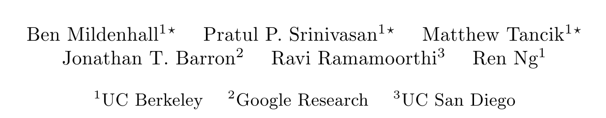

# NeRF: Representing Scenes as Neural Radiance Fields for View Synthesis

## 저널 : 2021년 q1, if 14.065, 0.81

## 저자 : 

[Rendering](/paper%20study/image%20study/0.0%20참고/0.0.1/rendering.md)

공식 사이트 : https://www.matthewtancik.com/nerf
한국인이 만든거 https://modulabs.co.kr/blog/nerf-from-2d-to-3d/

[자세한설명](./NeRF.md)

**요약**
- 이 논문은 희소한 입력 뷰를 사용하여 연속적인 부피 장면 함수를 최적화함으로써 복잡한 장면의 새로운 뷰를 합성하는 방법을 소개합니다.
- 장면은 연속적인 5D 좌표(공간 위치 및 시청 방향)를 입력으로 사용하고 해당 위치에서의 부피 밀도와 시청 방향에 따른 방사된 라디언스를 출력하는 완전 연결된 딥 네트워크를 사용하여 표현됩니다.
- 출력 색상과 밀도를 이미지로 투영하기 위해 고전적인 볼륨 렌더링 기술이 사용됩니다.
- 이 방법은 복잡한 기하학과 외관을 가진 장면의 사실적인 새로운 뷰를 렌더링하기 위해 최적화되었으며, 뉴럴 렌더링 및 뷰 합성에 대한 이전 작업을 능가합니다.

---

**1. 서론**
- 이 논문은 캡처된 일련의 이미지의 렌더링 오류를 최소화하기 위해 연속적인 5D 장면 표현의 매개 변수를 최적화함으로써 뷰 합성 문제를 해결합니다.
- 장면은 각 공간 지점에서의 방향별 방사된 라디언스를 출력하는 연속적인 5D 함수로 표현됩니다.
- 이 방법은 이 함수를 표현하기 위해 완전 연결된 신경망(MLP로도 알려져 있음)을 사용합니다.

---

**2. 관련 연구**
- 최근 컴퓨터 비전 분야의 연구는 3D 공간 위치에서 직접 암시적인 형태의 표현으로 매핑하는 MLP의 가중치에 객체와 장면을 인코딩하는 데 중점을 두고 있습니다.
- 전통적인 방법들은 삼각형 메시나 복셀 그리드와 같은 이산 표현을 사용했지만 이러한 방법들에는 한계가 있습니다.
- 이 논문은 이전 작업과의 접근 방식을 대조하면서, 자연 설정에서 캡처된 RGB 이미지에서 실제 객체와 장면의 고해상도 사실적인 새로운 뷰를 렌더링할 수 있는 첫 번째 연속적인 뉴럴 장면 표현을 제시합니다.

---

**3. 뉴럴 라디언스 필드 장면 표현**
- 장면은 3D 위치와 2D 시청 방향을 입력으로 가지며, 출력은 방출된 색상과 부피 밀도인 5D 벡터 값 함수로 표현됩니다.
- 부피 밀도는 광선이 위치에서 종료될 확률의 미분을 나타낼 수 있습니다.
- 카메라 광선의 예상 색상은 고전적인 볼륨 렌더링 원칙을 사용하여 계산됩니다.

---

**4. 라디언스 필드로 볼륨 렌더링하기**
- 논문은 고전적인 볼륨 렌더링 원칙을 사용하여 장면을 통과하는 광선의 색상을 렌더링하는 방법을 설명합니다.
- 부피 밀도는 광선이 위치에서 무한소 입자에 도달할 확률을 나타냅니다.
- 논문은 렌더링을 위해 적분을 추정하기 위해 계층화된 샘플링을 사용합니다.

---

**5. 뉴럴 라디언스 필드 최적화하기**
- 이전 섹션에서는 뉴럴 라디언스 필드로 장면을 모델링하고 이 표현에서 새로운 뷰를 렌더링하는 데 필요한 핵심 구성 요소를 설명했습니다.
- 그러나 이러한 구성 요소만으로는 최첨단 품질을 달성하기에 충분하지 않습니다.
