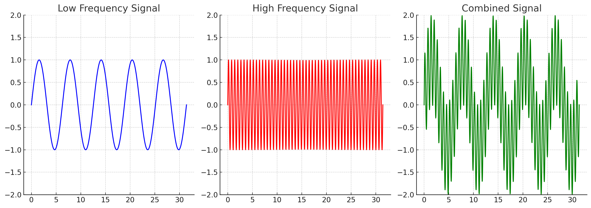
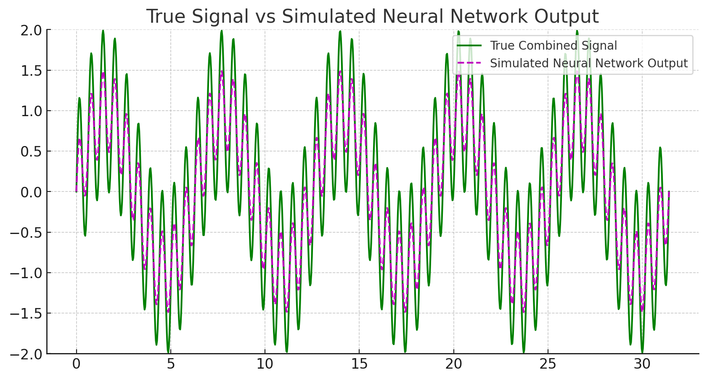

Rahaman 등의 연구에 기반하여 딥 네트워크가 낮은 주파수 함수를 학습하는 경향이 있다는 내용을 강조하고 있습니다. 이를 이해하기 위해 주파수와 신경망 학습에 관한 몇 가지 기본 개념을 살펴보겠습니다.

1. **주파수**: 데이터나 신호에서의 주파수는 그 신호의 변화율을 의미합니다. 높은 주파수는 빠른 변화나 진동을, 낮은 주파수는 느린 변화나 진동을 나타냅니다. 이미지에서 높은 주파수는 세밀한 질감이나 경계선과 같은 빠른 색상 변화를 나타내며, 낮은 주파수는 부드러운 그라디언트나 큰 색상 블록을 나타냅니다.

2. **신경망의 학습**: 신경망이 학습하는 동안, 그것은 주어진 데이터셋의 패턴과 구조를 학습하려고 노력합니다. 이 과정에서 신경망은 데이터셋 내의 다양한 주파수 구성 요소를 모델링하려고 노력합니다.

Rahaman 등의 연구에서는 딥 네트워크가 낮은 주파수 함수를 학습하는 경향이 있다는 것을 발견했습니다. 이는 딥 네트워크가 세밀한 텍스처나 빠른 변화보다는 큰 패턴이나 부드러운 변화를 더 쉽게 잡아내는 경향이 있음을 의미합니다. 

이러한 경향은 신경망의 구조나 학습 동안의 최적화 과정, 그리고 다양한 정규화 기법 때문일 수 있습니다. 예를 들어, 네트워크가 불필요하게 복잡한 모델을 학습하는 것을 방지하기 위해 사용되는 정규화 기법은 네트워크가 높은 주파수의 세부 사항보다는 낮은 주파수의 전반적인 패턴에 더 집중하게 만들 수 있습니다.

이러한 경향성을 이해하는 것은 신경망이 어떤 유형의 정보나 패턴을 우선적으로 학습하는지, 그리고 어떤 유형의 데이터나 문제에 대해 더 효과적일지를 파악하는 데 중요합니다.

---------

1. **낮은 주파수 신호 (파란색)**: 이 신호는 느린 진동을 나타냅니다. 진동의 주기가 길며, 그래프의 변화가 느립니다.
2. **높은 주파수 신호 (빨간색)**: 이 신호는 빠른 진동을 나타냅니다. 진동의 주기가 짧으며, 그래프의 변화가 빠릅니다.
3. **결합된 신호 (초록색)**: 낮은 주파수와 높은 주파수의 신호를 합쳐서 생성했습니다. 이 신호는 두 주파수의 패턴을 모두 포함하고 있습니다.

Rahaman 등의 연구에 따르면, 딥 네트워크는 낮은 주파수의 패턴 (즉, 파란색 그래프와 같은 느린 변화)을 더 쉽게 학습하려는 경향이 있습니다. 반면에 높은 주파수의 패턴 (즉, 빨간색 그래프와 같은 빠른 변화)는 덜 학습될 수 있습니다.

위 그래프에서:

- **초록색 선**: 원래의 결합된 신호입니다. 이것은 낮은 주파수와 높은 주파수의 신호를 합쳐서 생성된 것입니다.
- **자주색 점선**: 가상의 신경망 출력을 나타냅니다. 이 출력은 낮은 주파수의 패턴을 주로 포착하고, 높은 주파수의 패턴은 부분적으로만 학습하였다고 가정하여 생성되었습니다.

이 시각화는 Rahaman 등의 연구 결과에 따르면 딥 네트워크가 낮은 주파수의 패턴을 더 잘 학습하고, 높은 주파수의 패턴을 덜 학습하는 경향이 있음을 개념적으로 보여줍니다.

- 신경망은 낮은 주파수의 패턴 (즉, 파란색 그래프와 같은 느린 변화)을 더 잘 학습할 것입니다.
- 높은 주파수의 패턴 (즉, 빨간색 그래프와 같은 빠른 변화)은 신경망에 의해 완벽하게 재현되지 않을 수 있습니다.

따라서 신경망의 예측은 진짜 결합된 신호와 유사하지만, 높은 주파수의 세부 사항이 누락되거나 왜곡될 수 있습니다. 이는 Rahaman 등의 연구에서 언급된 딥 네트워크의 경향성과 일치합니다.

---------
## 이미지의 패턴을 주파수로써 생가을 한다면?

일반적으로 이미지에는 다음과 같은 주파수 구성 요소가 있습니다:

1. **낮은 주파수**: 이미지의 부드러운 그라디언트나 큰 색상 블록을 나타냅니다. 이러한 패턴은 이미지에서 전반적인 형태나 구조를 나타내는 데 중요합니다.
2. **높은 주파수**: 이미지의 세밀한 텍스처, 경계선 또는 빠른 색상 변화를 나타냅니다. 이러한 패턴은 이미지의 세부 사항이나 질감을 나타내는 데 중요합니다.

CNN (Convolutional Neural Network)는 학습 과정에서 이러한 다양한 주파수 구성 요소를 모두 캡처하려고 합니다. 초기 계층은 높은 주파수의 특징 (예: 경계선, 작은 질감)을 캡처하는 경향이 있으며, 깊은 계층은 낮은 주파수의 특징 (예: 객체의 전반적인 형태)을 캡처하는 경향이 있습니다.

요약하면, 이미지의 픽셀 자체를 주파수로 바로 생각하는 것은 부적절하지만, 픽셀 간의 패턴과 관계는 주파수 도메인에서 해석될 수 있으며, CNN은 이러한 다양한 주파수 구성 요소를 학습합니다.

-------

## 이미지의 픽셀을 직접적으로 주파수라고 표현 하지 않는 이유?

1. **이미지의 픽셀**: 이미지의 각 픽셀은 그 위치에서의 색상 또는 밝기 값을 나타냅니다. 이러한 픽셀 값 자체는 주파수 정보를 직접적으로 포함하고 있지 않습니다.
  
2. **주파수**: 주파수는 신호나 데이터의 변화율을 나타냅니다. 이미지의 컨텍스트에서 주파수는 픽셀 간의 밝기 값의 변화를 나타낼 수 있습니다. 

이미지를 주파수 도메인으로 변환하려면, 픽셀 간의 밝기 값의 변화를 분석해야 합니다. 이는 Fourier 변환과 같은 도구를 사용하여 수행됩니다. 이 변환을 통해 이미지의 낮은 주파수 (부드러운 그라디언트나 큰 색상 블록)와 높은 주파수 (세밀한 텍스처나 경계선) 정보를 추출할 수 있습니다.

-------
## 픽셀의 변화량을 하나의 주파수로써 생각 해도 되지 않을까? Fourier의 변환을 하지 않았을때

이미지의 픽셀 변화나 그라디언트는 주파수로 해석될 수 있습니다. 즉, 이미지에서 발생하는 빠른 픽셀 값의 변화는 높은 주파수의 정보로, 느린 변화는 낮은 주파수의 정보로 해석될 수 있습니다.

예를 들어, 이미지에 급격한 밝기 변화가 있는 경계선이나 텍스처가 있으면, 이는 높은 주파수의 정보로 해석될 수 있습니다. 반면 이미지의 부드러운 그라디언트나 큰 영역의 동일한 색상은 낮은 주파수의 정보로 해석될 수 있습니다.

이렇게 이미지의 픽셀 값의 변화를 직접 주파수의 정보로 해석하는 것은 완전히 타당하며, Fourier 변환 없이도 이러한 해석은 가능합니다. Fourier 변환은 이러한 주파수 정보를 더 명확하고 정량적으로 분석하기 위한 도구일 뿐입니다.

따라서, 네, 이미지 내의 픽셀 값의 변화나 그라디언트를 주파수 정보로 해석하는 것은 바람직하며 합리적입니다.

---------

### Attention 메커니즘과 주파수

**1. Attention 메커니즘의 기본 원리**
- Attention은 입력 데이터의 다양한 부분에 대한 가중치를 계산합니다.
- 이 가중치는 데이터의 특정 부분에 모델이 "주목"하도록 만들며, 중요하다고 판단되는 부분을 강조하는 데 사용됩니다.

**2. 주파수와 데이터의 변화**
- 데이터나 신호의 변화율은 주파수로 해석될 수 있습니다.
- 데이터 내의 빠른 변화나 높은 그라디언트는 고주파수의 정보로 해석될 수 있습니다. 반대로, 느린 변화나 부드러운 그라디언트는 저주파수의 정보로 해석될 수 있습니다.

**3. Attention과 주파수의 관계**
- Attention 메커니즘은 데이터의 특정 주파수 구성 요소에 주목할 수 있습니다.
- 이것은 attention이 데이터의 중요한 부분, 특히 변화가 큰 부분에 주목한다는 것과 일치합니다.
- 따라서, attention이 데이터의 특정 주파수의 변화에 주목한다는 것은 합리적인 주장입니다.

**4. 주의점**
- Attention이 항상 특정 주파수에만 주목한다는 것을 의미하는 것은 아닙니다. 그러나 데이터의 변화와 연관된 주파수 구성 요소에 주목하는 경향이 있을 수 있습니다.

