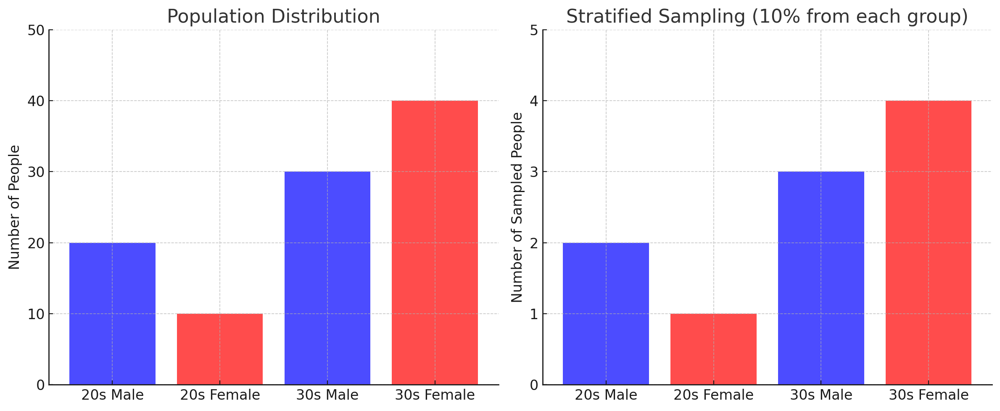

"계층화된 샘플링" 혹은 "Stratified Sampling"은 통계와 샘플링 이론에서 널리 사용되는 방법입니다. 이 방법의 주요 아이디어는 전체 데이터 집합을 서로 겹치지 않는 하위 그룹 또는 '계층'으로 나누고, 각 계층에서 독립적으로 샘플을 추출하는 것입니다.

계층화된 샘플링의 주요 특징 및 이점은 다음과 같습니다:

1. **대표성**: 각 계층은 전체 데이터 집합의 특정 부분을 대표하므로, 모든 계층에서 샘플링하면 전체 데이터의 특성을 더 잘 반영할 수 있습니다.
2. **정확도 향상**: 계층화된 샘플링을 사용하면 각 계층의 특성을 더 정확하게 반영할 수 있으므로 추정치의 정확도가 향상됩니다.
3. **효율성**: 계층화된 샘플링은 각 계층의 크기와 중요성에 따라 적절한 수의 샘플을 선택할 수 있습니다. 이로 인해 필요한 샘플의 수를 최소화하면서도 원하는 정확도를 달성할 수 있습니다.

예를 들어, 여러 지역에서 사람들의 의견을 조사하려는 경우를 생각해 보겠습니다. 각 지역의 인구 수와 특성이 다르기 때문에 단순 무작위 샘플링을 사용하면 일부 지역의 의견이 과도하게 반영될 수 있습니다. 그러나 계층화된 샘플링을 사용하면 각 지역을 별도의 계층으로 나누고 각 계층에서 적절한 수의 샘플을 추출하여 전체 의견을 더 잘 반영할 수 있습니다.

--------

계층화된 샘플링의 개념을 시각적으로 설명하기 위해 간단한 예제

예를 들어, 100명의 사람들로 구성된 그룹이 있고 이 그룹은 성별과 연령대에 따라 다음과 같이 분류된다고 가정해보겠습니다:

- 20대 남성: 20명
- 20대 여성: 10명
- 30대 남성: 30명
- 30대 여성: 40명

이 데이터 집합에서 전체 인구의 10%를 샘플링하려면 단순 무작위 샘플링을 사용하면 일부 그룹이 과도하게 샘플링될 위험이 있습니다. 

그러나 계층화된 샘플링을 사용하면 각 그룹에서 동일한 비율 (10%)의 샘플을 추출하여 전체 인구를 더 잘 대표할 수 있습니다.

위의 그래프에서 왼쪽 차트는 각 그룹별 인구 분포를 나타내며, 오른쪽 차트는 계층화된 샘플링을 사용하여 각 그룹에서 10%의 샘플을 추출한 결과를 나타냅니다.

- **왼쪽 차트 (Population Distribution)**: 각 그룹의 전체 인구 수를 보여줍니다. 여기서 파란색은 남성을, 빨간색은 여성을 나타냅니다.
- **오른쪽 차트 (Stratified Sampling)**: 각 그룹에서 동일한 비율 (10%)의 샘플을 추출한 결과를 보여줍니다.

이 시각화를 통해, 계층화된 샘플링을 사용하면 전체 인구를 대표하는 샘플을 효과적으로 얻을 수 있음을 확인할 수 있습니다. 각 그룹에서 동일한 비율의 샘플을 추출함으로써, 각 그룹의 특성이 결과에 잘 반영됩니다.