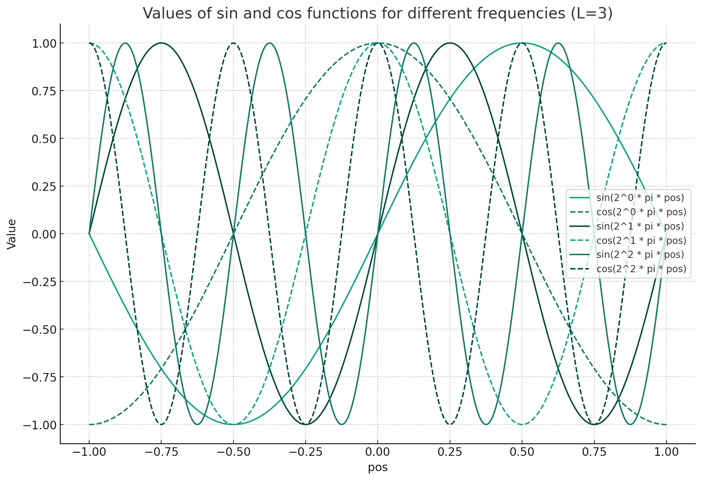

이 공식은 주어진 위치값(`pos`)을 높은 차원의 공간으로 매핑하는 함수인 \( \gamma \)를 정의하고 있습니다. 공식을 자세히 보면, 주어진 입력 값 `pos`에 대해 사인(sin)과 코사인(cos) 변환을 사용하여 새로운 값들을 생성합니다. 이 과정은 `L`번 반복됩니다.

이 공식의 주요 개념을 다음과 같이 설명할 수 있습니다:

1. **사인(sin)과 코사인(cos) 함수**: 이 두 함수는 주기적인 함수로서, 입력 값의 변화에 따라 -1과 1 사이의 값을 반환합니다. 사인과 코사인 함수는 신호 처리, 푸리에 변환 등에서 널리 사용되며, 주기적인 패턴을 표현하는 데 유용합니다.

2. **지수 값에 대한 변화**: \(2^0, 2^1, \ldots, 2^{L-1}\)는 각각의 주기를 조절합니다. 즉, `L`값이 커질수록 더 높은 주파수의 사인과 코사인 값을 생성합니다. 이렇게 여러 주파수의 사인과 코사인 값을 사용하면, 입력 데이터의 다양한 주파수 구성 요소를 포착할 수 있습니다.

3. **높은 차원의 매핑**: 이 함수는 주어진 단일 입력 값 `pos`를 \(2 \times L\) 차원의 벡터로 변환합니다. 즉, 각 입력 값에 대해 `L`개의 사인 값과 `L`개의 코사인 값이 생성됩니다.

이 공식의 목적은 주어진 입력 값을 더 높은 차원의 공간으로 매핑하여, 신경망이 더 복잡한 패턴이나 특징을 캡쳐할 수 있도록 돕는 것입니다. 다양한 주파수의 사인과 코사인 값을 사용함으로써, 입력 데이터의 다양한 주파수 구성 요소를 표현할 수 있게 됩니다.

물론입니다! 먼저 간단한 예시를 제공하고 이를 시각화하여 설명해보겠습니다.

**예시**:
\( L = 3 \)으로 설정하고 \( \text{pos} \) 값이 0.5일 때의 \( \gamma(\text{pos}) \) 값을 계산해보겠습니다.

이 경우의 \( \gamma \) 함수는 다음과 같습니다:

\[
\gamma(0.5) = \left( \sin(2^0 \pi \times 0.5), \cos(2^0 \pi \times 0.5), \sin(2^1 \pi \times 0.5), \cos(2^1 \pi \times 0.5), \sin(2^2 \pi \times 0.5), \cos(2^2 \pi \times 0.5) \right)
\]

위의 식을 계산하여 결과 벡터를 얻을 수 있습니다.

이제 이 결과를 시각화해보겠습니다. \( \text{pos} \) 값을 -1부터 1까지 변화시키면서 각각의 \( \sin \) 및 \( \cos \) 함수 값을 그래프로 나타내보겠습니다.

위의 그래프는 \( L = 3 \)으로 설정했을 때, \( \gamma(\text{pos}) \) 함수의 출력 값을 나타냅니다.

- 실선은 각각의 주파수에 대한 사인 함수의 값입니다.
- 점선은 각각의 주파수에 대한 코사인 함수의 값입니다.

\( L \) 값이 3이기 때문에 3개의 주파수 (즉, \( 2^0, 2^1, 2^2 \))에 대한 사인 및 코사인 함수 값을 볼 수 있습니다.

주파수가 높아질수록 (즉, \( L \) 값이 증가할수록) 함수의 진동이 더 빨라지는 것을 확인할 수 있습니다. 이러한 다양한 주파수의 사인과 코사인 값은 입력 데이터의 다양한 특징을 캡쳐할 수 있게 해줍니다.

입력 데이터의 차원을 늘리는 것은 여러 가지 장점을 가질 수 있습니다. 특히 위치 (Position) 정보와 같은 경우, 차원을 늘리는 것은 다음과 같은 이유로 유용할 수 있습니다:

1. **특징 추출**: 고차원 공간에서는 데이터의 다양한 특징이 더 잘 표현될 수 있습니다. 예를 들어, 주어진 위치 값에 대해 다양한 주파수의 사인 및 코사인 값을 생성함으로써, 그 위치에서의 다양한 주파수 구성 요소나 패턴을 캡쳐할 수 있습니다.

2. **비선형성 증가**: 차원을 늘림으로써, 데이터의 복잡한 비선형 관계를 신경망이나 기타 기계 학습 모델이 더 쉽게 학습할 수 있게 됩니다. 이는 특히 심층 신경망에서 중요한데, 각 계층을 거치면서 데이터의 다양한 특징이 추출될 수 있기 때문입니다.

3. **정규화 효과**: 고차원 공간에서의 표현은 모델이 과적합을 방지하도록 도와주는 정규화 효과를 가질 수 있습니다. 이는 모델이 더 강건하고 일반화 성능이 좋아질 수 있음을 의미합니다.

4. **더 나은 분리**: 고차원 공간에서 데이터 포인트들은 더 잘 분리될 수 있습니다. 이는 분류나 클러스터링 작업에서 특히 중요합니다. 

그러나 차원을 늘리는 것에는 주의해야 할 점도 있습니다. 차원이 늘어나면 계산 복잡성이 증가하고, 데이터의 희소성이 증가할 수 있습니다. 이러한 문제는 "차원의 저주"라는 문제로 알려져 있습니다. 따라서 차원을 늘리는 것은 신중하게 선택하고, 모델의 성능과 복잡성 사이의 균형을 잘 유지해야 합니다.

Vision Transformer (ViT)와 CNN이 이미지를 처리하는 방식의 근본적인 차이로 인해 Position Encoding의 필요성이 달라집니다. 

1. **ViT의 Position Encoding의 필요성**: 
   - Vision Transformer는 원래의 Transformer 아키텍처에서 영감을 받았습니다. 기본 Transformer는 순서 정보가 없는 데이터(예: 텍스트)를 처리하도록 설계되었습니다. 따라서 입력 토큰의 위치 정보를 인코딩하기 위해 Position Encoding이 필요합니다.
   - ViT에서 이미지는 일련의 패치로 나누어지며, 각 패치는 개별적인 토큰으로 취급됩니다. 이 토큰들은 본래의 이미지 내에서의 위치 정보를 잃어버리기 때문에, Position Encoding을 사용하여 위치 정보를 주입합니다.

2. **CNN의 공간적인 특징**: 
   - CNN은 공간적 구조를 내재적으로 고려합니다. 합성곱 연산을 통해 이미지의 지역적 특징을 캡쳐하며, 이 과정에서 위치 정보가 자연스럽게 처리됩니다.
   - CNN의 계층 구조는 이미지의 저수준 특징에서 고수준 특징까지 순차적으로 추출하는 데 도움이 됩니다. 이렇게 하면 위치 정보와 컨텍스트를 함께 고려할 수 있습니다.

3. **ViT와 CNN의 결합**:
   - ViT와 CNN을 결합하는 모델은 두 아키텍처의 장점을 모두 활용하려고 합니다. CNN의 공간적 특징 추출 능력과 ViT의 전역적인 컨텍스트 인식 능력을 결합하면, 위치 정보를 인코딩하는 별도의 Position Encoding이 덜 중요해질 수 있습니다.
   - 특히, CNN의 초기 계층을 통해 얻은 특징 맵에 Transformer를 적용하면, CNN에서 이미 포착된 공간적 특징에 기반하여 Transformer는 전역적인 컨텍스트를 더 잘 학습할 수 있습니다.

요약하면, CNN은 구조상 이미 위치 정보를 처리하는 능력이 있기 때문에 별도의 Position Encoding이 필요하지 않습니다. 반면, Vision Transformer는 이미지의 위치 정보를 잃어버리는 경향이 있어 Position Encoding이 필요하며, 이 두 아키텍처를 결합할 때 Position Encoding의 중요성은 상황에 따라 달라질 수 있습니다.

**설명**:

이 문단은 신경 씬 표현을 개선하기 위한 방법에 대해 설명하고 있습니다. 연구자들은 기존의 함수 \( F_\Theta \)를 두 개의 함수의 합성 함수로 재구성하였습니다. 이때 두 함수 중 하나는 학습되는 함수이고, 다른 하나는 학습되지 않는 함수입니다.

특히, 학습되지 않는 함수 \( \gamma \)는 주어진 입력 값을 더 높은 차원의 공간으로 매핑하는 역할을 합니다. 이 함수는 사인과 코사인 함수를 사용하여 입력 값을 변환합니다. 

이 \( \gamma \) 함수는 좌표 값 \(\mathbf{x}\)와 시야 방향 \(\mathbf{d}\)에 각각 적용됩니다. 

마지막으로, 연구자들은 실험에서 \( \gamma \) 함수의 차원 수를 \(\mathbf{x}\)에 대해 10으로, \(\mathbf{d}\)에 대해 4로 설정하였다고 언급하고 있습니다.