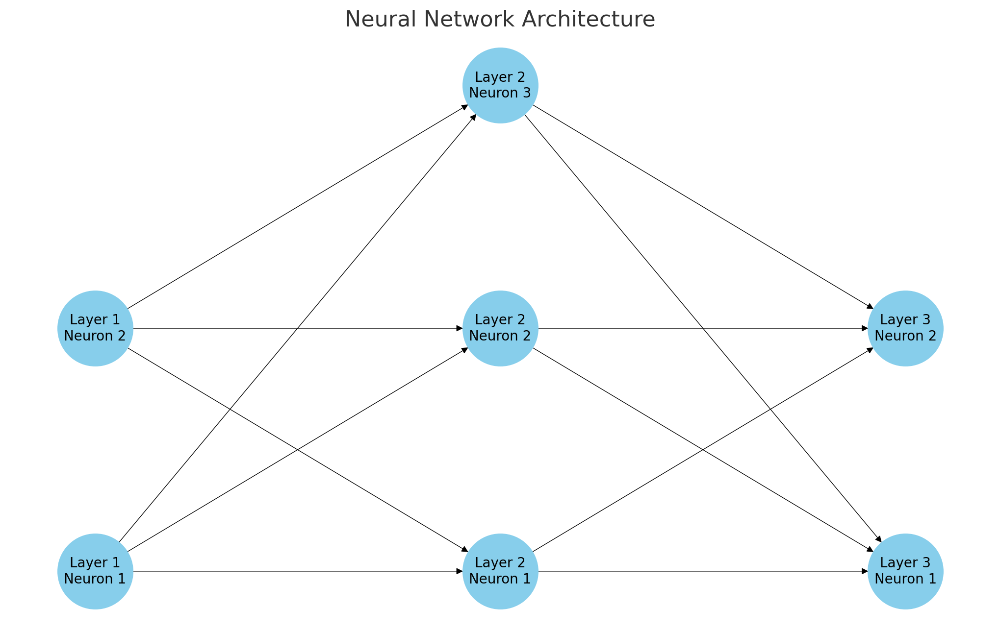

"Universal function approximators"라는 표현은 신경망이 이론적으로 어떤 함수든지 근사할 수 있다는 개념을 나타냅니다.

1. **함수**: 함수는 입력을 받아 출력을 생성하는 규칙이나 연산입니다. 예를 들어, 간단한 수학적 함수 \( y = x^2 \)은 입력 \( x \)를 받아 \( x \)의 제곱 값을 출력합니다.

2. **함수 근사**: 함수 근사는 어떤 주어진 함수를 다른 함수 (또는 함수 계열)로 표현하는 것입니다. 예를 들어, 복잡한 함수가 있을 때 이를 간단한 다항식으로 표현하려고 할 수 있습니다.

3. **신경망**: 신경망은 입력 레이어, 여러 개의 숨겨진 레이어, 그리고 출력 레이어로 구성된 계산 모델입니다. 각 레이어는 노드(또는 뉴런)로 구성되어 있으며, 이 뉴런들은 서로 연결되어 있습니다.

4. **Universal function approximators**: 1980년대 후반, 몇몇 연구자들은 단층 숨겨진 레이어를 가진 신경망이 (적절한 뉴런 수와 함께) 임의의 연속 함수를 근사할 수 있음을 증명했습니다. 이 이론은 실제로 신경망이 매우 다양한 문제와 데이터셋에 적용될 수 있음을 의미합니다.

다만 이론적으로 "어떤 함수든 근사할 수 있다"는 것이 실제로 항상 효과적이거나 실용적이라는 뜻은 아닙니다. 실제로는 신경망의 구조, 학습률, 초기화 방법 등 여러 요소들이 그 성능에 큰 영향을 미칩니다.

## 보통의 신경망 구조

신경망은 여러 계층(layer)과 뉴런(neuron)으로 구성됩니다. 각 뉴런은 가중치(weights)와 활성화 함수(activation function)로 구성되며, 이러한 구성을 통해 입력 값들을 변형하고 다음 레이어로 전달합니다.

기본적인 구조를 설명하면:

1. **입력 레이어**: 신경망에 제공되는 원시 데이터. 이것은 일반적으로 피처 벡터(feature vector)로 제공됩니다.

2. **숨겨진 레이어**: 입력 레이어와 출력 레이어 사이의 하나 이상의 레이어. 각 숨겨진 레이어는 여러 뉴런으로 구성됩니다.

3. **출력 레이어**: 신경망의 최종 출력을 제공하는 레이어.

각 뉴런의 기본 연산은 다음과 같습니다:

\[
y = f(w \cdot x + b)
\]

여기서:
- \( x \)는 입력 벡터,
- \( w \)는 가중치 벡터,
- \( b \)는 바이어스(bias),
- \( f \)는 활성화 함수 (예: 시그모이드, ReLU 등),
- \( y \)는 뉴런의 출력입니다.

이 연산은 각 레이어의 모든 뉴런에 대해 수행되며, 각 레이어의 출력은 다음 레이어의 입력으로 사용됩니다.

위의 다이어그램은 간단한 신경망의 구조를 보여줍니다. 이 신경망은 다음과 같이 구성되어 있습니다:

1. **입력 레이어**: 2개의 뉴런으로 구성됩니다. 이 뉴런들은 신경망에 제공되는 원시 데이터를 받아들입니다.
2. **숨겨진 레이어**: 3개의 뉴런으로 구성됩니다. 각 뉴런은 활성화 함수를 사용하여 입력 값을 변형하고 다음 레이어로 전달합니다.
3. **출력 레이어**: 2개의 뉴런으로 구성됩니다. 이 뉴런들은 신경망의 최종 출력 값을 제공합니다.

각 화살표는 뉴런 간의 연결을 나타내며, 이 연결은 가중치를 가지고 있습니다. 이 가중치는 학습 과정 중에 최적화됩니다. 

기억해야 할 중요한 점은 이 다이어그램이 신경망의 가장 기본적인 구조를 보여주며, 실제로는 더 복잡한 구조와 많은 레이어를 가진 신경망도 많이 사용됩니다.

--------
## wx + b 로 하나요? 2차 3차는 효과가 없나요?

신경망에서의 \( w \cdot x + b \) 형태의 선형 조합은 각 뉴런에서의 기본 연산입니다. 이 연산 자체는 선형적입니다. 그러나 이 선형 조합 후에 활성화 함수, 예를 들어 시그모이드(sigmoid)나 ReLU 등,가 적용되어 비선형성이 도입됩니다. 

신경망의 힘은 이러한 비선형 활성화 함수를 통해 나타납니다. 실제로, 하나의 숨겨진 레이어와 비선형 활성화 함수만으로도 신경망은 임의의 복잡한 함수를 근사할 수 있습니다. 여러 숨겨진 레이어를 쌓으면, 이 비선형성은 조합되어 더 복잡한 함수를 모델링할 수 있게 됩니다.

2차, 3차 등의 다항식 특성을 직접 추가하는 것이 아니라, 신경망의 레이어와 비선형 활성화 함수를 통해 이러한 복잡한 관계를 학습하게 됩니다.

간단히 말하면:
- \( w \cdot x + b \)는 각 뉴런의 선형 연산입니다.
- 활성화 함수를 통해 비선형성이 추가됩니다.
- 여러 레이어를 쌓음으로써 신경망은 복잡한 함수를 모델링할 수 있습니다.

2차, 3차 등의 다항식 형태를 직접 사용하는 대신, 신경망은 데이터로부터 복잡한 관계를 자동으로 학습할 수 있는 유연성을 제공합니다.

----------

신경망에서의 \( w \cdot x + b \) 형태의 선형 조합은 각 뉴런에서의 기본 연산입니다. 이 연산 자체는 선형적입니다. 그러나 이 선형 조합 후에 활성화 함수, 예를 들어 시그모이드(sigmoid)나 ReLU 등,가 적용되어 비선형성이 도입됩니다. 

신경망의 힘은 이러한 비선형 활성화 함수를 통해 나타납니다. 실제로, 하나의 숨겨진 레이어와 비선형 활성화 함수만으로도 신경망은 임의의 복잡한 함수를 근사할 수 있습니다. 여러 숨겨진 레이어를 쌓으면, 이 비선형성은 조합되어 더 복잡한 함수를 모델링할 수 있게 됩니다.

2차, 3차 등의 다항식 특성을 직접 추가하는 것이 아니라, 신경망의 레이어와 비선형 활성화 함수를 통해 이러한 복잡한 관계를 학습하게 됩니다.

간단히 말하면:
- \( w \cdot x + b \)는 각 뉴런의 선형 연산입니다.
- 활성화 함수를 통해 비선형성이 추가됩니다.
- 여러 레이어를 쌓음으로써 신경망은 복잡한 함수를 모델링할 수 있습니다.

2차, 3차 등의 다항식 형태를 직접 사용하는 대신, 신경망은 데이터로부터 복잡한 관계를 자동으로 학습할 수 있는 유연성을 제공합니다.

----
## 확률로써 처리 하는 방법

네, 뉴런 자체에서 확률적인 행동을 모델링하는 다양한 신경망 구조와 기법이 있습니다. 이런 접근 방식은 종종 불확실성을 다루거나, 정규화를 위해 사용됩니다. 몇 가지 예를 들면:

1. **Dropout**: Dropout은 신경망의 정규화 방법 중 하나로, 학습 중에 무작위로 일부 뉴런을 "비활성화"하는 기법입니다. 이는 과적합(overfitting)을 방지하는 데 도움을 줍니다. Dropout은 학습 시에만 적용되며, 테스트나 예측 시에는 모든 뉴런이 사용됩니다.

2. **Bayesian Neural Networks**: Bayesian Neural Networks는 뉴런의 가중치에 확률 분포를 할당합니다. 이로 인해 신경망의 예측에 대한 불확실성을 추정할 수 있게 됩니다. 이는 예측의 불확실성을 고려해야 하는 응용 분야에서 유용합니다.

3. **Stochastic Activation Pruning (SAP)**: SAP는 뉴런의 활성화를 확률적으로 제로로 설정하는 기법입니다. 이는 계산 효율성을 향상시키고, 불필요한 뉴런의 활성화를 제거하는 데 도움을 줍니다.

4. **Variational Dropout**: 이는 기본 Dropout의 확장으로, 각 뉴런에 대한 dropout 확률을 학습하는 기법입니다. 이로 인해 학습 중에 뉴런 별로 다양한 dropout 확률이 적용됩니다.

이와 같은 확률적 접근 방식은 신경망의 불확실성을 처리하거나, 과적합을 방지하고, 모델의 표현력을 향상시키는 데 도움을 줍니다.

