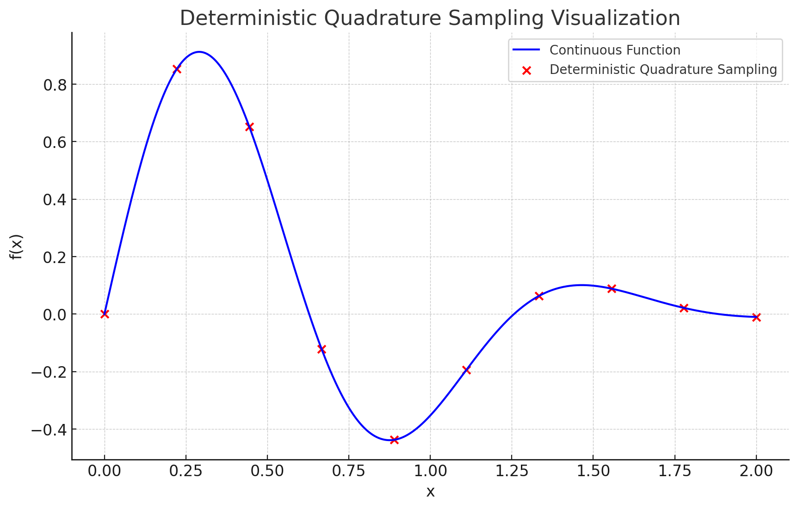

"Deterministic quadrature, which is typically used for rendering discretized voxel grids, would effectively limit our representation’s resolution because the MLP would only be queried at a fixed discrete set of locations."

1. **Deterministic Quadrature**: 이는 고정된 위치에서 함수의 값을 샘플링하여 적분 값을 근사하는 방법입니다.
2. **Rendering Discretized Voxel Grids**: 보텍스 그리드는 3D 공간을 일정한 크기의 작은 상자로 나눈 것입니다. 결정론적 쿼드라처는 이러한 그리드를 렌더링하는 데 흔히 사용됩니다.
3. **Limit Our Representation’s Resolution**: 결정론적 쿼드라처를 사용하면 표현의 해상도가 제한됩니다. 즉, 디테일이나 정밀도가 떨어질 수 있습니다.
4. **MLP Would Only Be Queried at a Fixed Discrete Set of Locations**: MLP (멀티 레이어 퍼셉트론, 일종의 인공신경망)는 고정된 이산 위치 집합에서만 값을 요청하거나 쿼리합니다. 이는 결정론적 쿼드라처의 특징 중 하나입니다.

예를 들어, 3D 객체를 렌더링하기 위해 보텍스 그리드를 사용한다고 가정해봅시다. 이 객체 내부의 각 보텍스에는 특정한 값을 저장하고 있을 것입니다. 

만약 우리가 결정론적 쿼드라처를 사용한다면, 이 객체의 특정한 위치에서만 값을 샘플링할 것입니다. 이는 고정된 위치에서만 MLP를 쿼리한다는 것을 의미합니다. 

그 결과, 객체의 전체적인 형태는 잘 표현될 수 있지만, 디테일한 부분이나 미세한 변화는 누락될 수 있습니다. 

위의 그래프에서 파란색 선은 연속적인 함수 \( f(x) = \sin(5x) \times \exp(-x^2) \)를 나타냅니다. 빨간색 점들은 결정론적 쿼드라처를 사용하여 고정된 위치에서 샘플링한 값들을 나타냅니다.

이렇게 고정된 위치에서만 값을 샘플링하면, 함수의 전반적인 형태는 대략적으로 캡처할 수 있지만, 함수의 미세한 변화나 디테일은 잘 반영되지 않습니다. 

이 예시에서, 결정론적 쿼드라처는 함수의 주요 특징은 잡아내지만, 중간의 빠른 변화나 뾰족한 부분은 놓치게 됩니다. 이것은 결정론적 쿼드라처의 한계를 보여주는 좋은 예시입니다. 

보텍스 그리드 렌더링의 맥락에서 이를 이해하면, 객체의 전반적인 형태는 잘 표현될 수 있지만, 객체의 표면의 미세한 디테일이나 텍스처는 놓칠 수 있습니다. 이러한 한계 때문에, MLP는 고정된 이산 위치에서만 값을 요청하게 됩니다.

---------------
`MLP는 고정된 이산 위치에서만 값을 요청하게 됩니다`.?

MLP (멀티 레이어 퍼셉트론)은 딥 러닝과 인공 신경망의 영역에서 사용되는 기본적인 신경망 구조입니다. 여기서 "고정된 이산 위치에서만 값을 요청한다"는 문장은 결정론적 쿼드라처의 특징을 설명하려는 시도였습니다.

이 문장의 의미는 결정론적 쿼드라처를 사용할 때 MLP를 쿼리하는 위치가 미리 정의된, 고정된 위치로 제한된다는 것입니다. 즉, MLP의 입력으로 주어지는 샘플 위치는 미리 정해진 규칙에 따라 선택되며, 이 위치 외에는 MLP를 쿼리하지 않습니다.

이것의 실제 의미는 다음과 같습니다:

1. **제한된 정보**: 결정론적 쿼드라처를 사용하면, MLP는 정해진 위치에서만 정보를 얻을 수 있습니다. 이는 함수나 데이터의 전체 영역을 완전히 표현하는 데 제한을 줄 수 있습니다.
2. **해상도의 한계**: 고정된 샘플 위치로 인해, MLP가 표현할 수 있는 디테일이나 해상도는 제한됩니다. 

이런 특징 때문에, 결정론적 쿼드라처는 일정한 해상도를 가진 보텍스 그리드와 같은 이산 데이터에 적합합니다. 그러나 더 높은 해상도나 더 정밀한 정보를 필요로 하는 응용에서는 다른 방법을 사용할 필요가 있습니다.