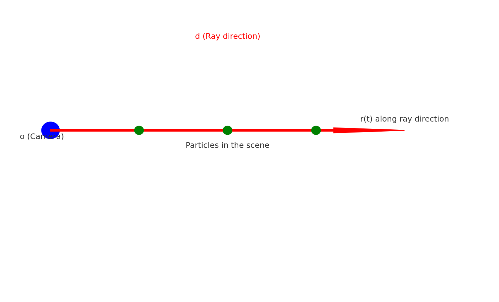
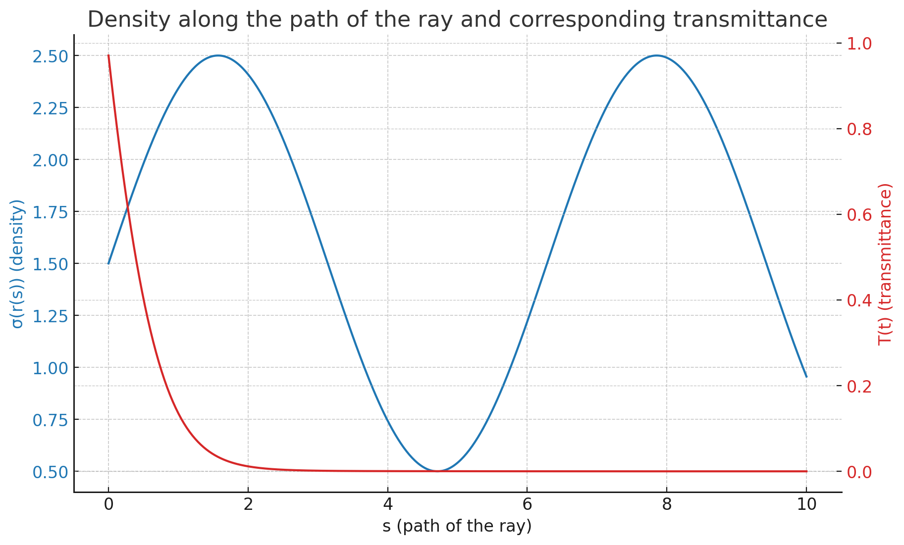

\[
C(r) = \int_{t_{\text{near}}}^{t_{\text{far}}} T(t) \sigma(\mathbf{r}(t)) \mathbf{c}(\mathbf{r}(t), \mathbf{d}) \, dt
\]

에서 \( T(t) \), \( \sigma(\mathbf{r}(t)) \), 그리고 \( \mathbf{c}(\mathbf{r}(t), \mathbf{d}) \)는 모두 곱셈 관계입니다.

이 세 요소의 연관성을 설명하겠습니다:

1. **\( T(t) \)**: 이는 광선이 특정 지점 \( t \)에 도달하기 전에 투과한 빛의 양을 나타냅니다. 즉, \( t \) 지점에 도달할 때까지의 빛의 손실을 나타내는 지표입니다.

2. **\( \sigma(\mathbf{r}(t)) \)**: 이는 광선이 지점 \( t \)에서 만나는 매체의 밀도입니다. 이 밀도는 해당 지점에서 광선이 얼마나 흡수될 것인지를 나타냅니다. 밀도가 높을수록 더 많은 빛이 흡수됩니다.

3. **\( \mathbf{c}(\mathbf{r}(t), \mathbf{d}) \)**: 이는 지점 \( t \)에서의 빛의 색상 또는 강도를 나타냅니다. \( \mathbf{d} \)는 광선의 방향을 나타내며, 이는 빛의 산란이나 반사에 따라 다를 수 있습니다.

이 세 가지 요소를 함께 곱하면, 광선이 지점 \( t \)를 통과할 때의 효과를 모델링할 수 있습니다. 즉:

- \( T(t) \)는 \( t \) 지점에 도달하기 전의 빛의 손실을 나타냅니다.
- \( \sigma(\mathbf{r}(t)) \)는 해당 지점에서 더 많은 빛이 흡수될 가능성을 나타냅니다.
- \( \mathbf{c}(\mathbf{r}(t), \mathbf{d}) \)는 해당 지점에서의 빛의 색상 또는 강도를 나타냅니다.

이 세 가지 요소를 곱하여, 광선이 \( t \) 지점을 통과하면서 어떻게 변화하는지를 계산합니다. 그런 다음 \( t_{\text{near}} \)부터 \( t_{\text{far}} \)까지의 모든 지점에 대해 이 값을 적분하여, 광선이 전체 경로를 통과하면서 어떻게 변화하는지를 구합니다.

-----
- **5D neural radiance field**: 이것은 5D 정보를 사용하여 3D 공간에서의 장면을 볼륨 밀도와 방향적으로 발산하는 빛으로 표현합니다.
- **볼륨 밀도 \(\sigma(\mathbf{x})\)**: 광선이 위치 \(\mathbf{x}\)의 미세한 입자에서 끝날 확률을 나타냅니다.
- **카메라 광선의 예상 색상 \(C(\mathbf{r})\)**: 이는 광선이 장면을 통과할 때의 색상을 나타냅니다. 이 색상은 광선의 시작점부터 끝점까지 계산됩니다.
  
1. \(C(r)\): 카메라 광선이 장면을 통과할 때 예상되는 색상의 총량입니다.
2. \(T(t)\): \(t_{\text{near}}\)에서 \(t\)까지 광선이 다른 입자에 충돌하지 않고 이동할 확률을 나타냅니다.
3. \(\sigma(\mathbf{r}(t))\): 광선이 위치 \(\mathbf{r}(t)\)에서 끝날 확률을 나타냅니다.
4. \(\mathbf{c}(\mathbf{r}(t),\mathbf{d})\): 위치 \(\mathbf{r}(t)\)에서 광선의 방향 \(\mathbf{d}\)로 방출되는 색상을 나타냅니다.

위의 수식은 카메라 광선이 장면을 통과하면서 얻을 수 있는 총 색상을 계산하는 방법을 나타냅니다. 

---

우리의 5D 신경 방사장(representational radiance field)은 3D 공간 내의 장면을 볼륨 밀도와 방향별 발광으로 표현합니다. 

볼륨 밀도 \( \sigma(\mathbf{x}) \)는 위치 \( \mathbf{x} \)의 무한소 입자에서 광선이 끝날 확률의 변화로 해석할 수 있습니다. 카메라 광선 \( \mathbf{r}(t) = \mathbf{o} + t\mathbf{d} \)의 예상 색상 \( C(\mathbf{r}) \)는 다음과 같습니다:

\[ C(r) = \int_{t_{\text{near}}}^{t_{\text{far}}} T(t) \sigma(\mathbf{r}(t)) \mathbf{c}(\mathbf{r}(t), \mathbf{d}) dt \]

여기서, 

\[ T(t) = \exp\left(-\int_{t_{\text{near}}}^{t} \sigma(\mathbf{r}(s)) ds\right) \]

함수 \( T(t) \)는 \( t_{\text{near}} \)에서 \( t \)까지 광선이 다른 입자에 충돌하지 않고 이동할 확률을 나타냅니다.

----

1. **\(\mathbf{r}(t) = \mathbf{o} + t\mathbf{d}\)**:
    - \(\mathbf{r}(t)\): 광선의 위치를 나타내는 함수입니다. 
    - \(\mathbf{o}\): 광선이 시작하는 카메라의 위치입니다.
    - \(\mathbf{d}\): 광선의 방향을 나타냅니다.
    - \(t\): 광선이 \(\mathbf{o}\)에서 출발한 이후의 시간 또는 거리를 나타내는 스칼라 값입니다.

2. **\(C(r)\)**:
    - 광선의 최종 색상을 나타내는 값입니다.

3. **\(\sigma(\mathbf{x})\)**:
    - 위치 \(\mathbf{x}\)에서의 볼륨 밀도를 나타냅니다.

4. **\(\mathbf{c}(\mathbf{r}(t),\mathbf{d})\)**:
    - 위치 \(\mathbf{r}(t)\)에서, 방향 \(\mathbf{d}\)로 방출되는 방사율을 나타냅니다.

5. **\(T(t)\)**:
    - 광선이 \(t_n\)에서 \(t\)까지 다른 입자에 충돌하지 않고 이동하는 확률을 나타냅니다.

식을 해석하면, 광선이 장면을 통과하면서 얻는 색상은 \(t_n\)에서 \(t\)까지의 모든 포인트에서 방출되는 빛의 합입니다. 여기서 \(T(t)\)는 광선이 특정 위치까지 도달할 확률을 나타내므로, 이 확률을 사용하여 각 위치에서의 방출되는 빛의 기여도를 가중치로 적용합니다.

위의 그림에서:

- 파란색 점은 카메라의 위치를 나타내며 이것이 \(\mathbf{o}\) 입니다.
- 빨간색 화살표는 광선의 방향을 나타내며, 이것이 \(\mathbf{d}\) 입니다.
- 녹색 점들은 장면 내의 입자들을 나타냅니다. 광선이 이들을 통과할 때 마다, 그 위치에서의 방출되는 빛과 그 위치의 볼륨 밀도에 따라 광선의 최종 색상이 결정됩니다.

식 \(\mathbf{r}(t) = \mathbf{o} + t\mathbf{d}\)는 광선이 시간 \(t\) 후에 도달하는 위치를 나타냅니다. 따라서 \(t\)가 0일 때 \(\mathbf{r}(t)\)는 카메라의 위치인 \(\mathbf{o}\)이며, \(t\)가 증가함에 따라 광선은 \(\mathbf{d}\) 방향으로 이동합니다.

\(C(r)\) 식은 광선이 특정 위치를 통과할 때 해당 위치에서의 빛의 기여도를 계산하는 것입니다. 이 기여도는 위치의 볼륨 밀도와 그 위치에서의 방출되는 빛, 그리고 광선이 그 위치까지 도달할 확률인 \(T(t)\)에 의해 결정됩니다.

------- 

 - \(\mathbf{r}(t) = \mathbf{o} + t\mathbf{d}\) 방향이 정해져 있는데 왜 \(\sigma(\mathbf{x})\) 여기서 한번더 방향을 두번 들어 가는 이유

\(\mathbf{r}(t)\)와 \(\sigma(\mathbf{x})\)의 역할과 사용하는 변수의 의미입니다.

1. **\(\mathbf{r}(t) = \mathbf{o} + t\mathbf{d}\)**: 
이 식은 광선의 경로를 나타냅니다. \(\mathbf{o}\)는 시작 위치, \(\mathbf{d}\)는 광선의 방향, \(t\)는 광선이 이동한 거리 또는 시간을 나타냅니다. 따라서 \(\mathbf{r}(t)\)는 광선이 \(t\) 거리만큼 이동한 후의 위치를 나타냅니다.

1. **\(\sigma(\mathbf{x})\)**: 
이 함수는 3D 공간 내의 어떤 지점 \(\mathbf{x}\)에서의 볼륨 밀도를 나타냅니다. \(\mathbf{x}\)는 3D 공간의 어떤 위치를 나타내는 벡터입니다.

이제 주요한 의문점인 "왜 방향을 다시 넣는가?"에 대한 답을 드리겠습니다. 실제로, 볼륨 밀도 함수 \(\sigma(\mathbf{x})\) 자체에는 방향이 포함되어 있지 않습니다. 볼륨 밀도는 3D 공간의 어떤 지점에서의 밀도를 나타내는 값이기 때문입니다. 

그런데, 본문에서 다른 함수와 혼동이 있을 수 있습니다. \(\mathbf{c}(\mathbf{r}(t),\mathbf{d})\)는 위치 \(\mathbf{r}(t)\)에서의 광선의 방향 \(\mathbf{d}\)로 방출되는 색상을 나타냅니다. 이 함수에는 방향이 포함되어 있습니다. 왜냐하면 어떤 재질(예: 반사 또는 굴절)은 방향에 따라 다르게 빛을 반사하거나 투과시키기 때문입니다.

요약하면, \(\sigma(\mathbf{x})\)에는 방향이 포함되어 있지 않습니다. \(\mathbf{c}(\mathbf{r}(t),\mathbf{d})\)와 같은 다른 함수에만 방향이 포함됩니다.

------

\[ T(t) = \exp \left( -\int_{t_{\text{near}}}^{t} \sigma(\mathbf{r}(s)) \, ds \right) \]

이 식은 광선의 누적 투과도 \(T(t)\)를 계산합니다. 투과도는 광선이 물체나 매체를 통과하면서 감소하는 빛의 양을 나타냅니다. 

- **\(\exp(x)\)**: 자연 로그의 밑인 \(e\)의 \(x\) 제곱을 나타냅니다. 이 표현은 여기서 "감소"를 모델링하는 데 사용됩니다.

- **\(\int_{t_{\text{near}}}^{t}\)**: 이 기호는 \({t_{\text{near}}}\)부터 \(t\)까지의 정적분을 나타냅니다. 이것은 광선이 어떤 경로를 통과하면서 누적되는 값을 계산하고자 할 때 사용됩니다.

- **\(\sigma(\mathbf{r}(s))\)**: 이 함수는 특정 위치에서의 매체의 밀도를 나타냅니다. 즉, 광선이 얼마나 많은 입자나 장애물에 부딪히는지를 나타내는 값입니다. 이 값이 크면 광선은 더 많이 흡수됩니다.

- **ds**: 광선의 작은 구간을 나타냅니다. \(s\)는 광선을 따라 이동하는 데 사용되는 변수입니다.

광선이 \({t_{\text{near}}}\)부터 \(t\)까지 이동하면서 경로를 따라 특정 지점에서의 밀도에 기반하여 빛이 감소하는 양을 누적하여 계산합니다. 이 누적된 감소량은 \(\exp\) 함수에 의해 변환되어, 광선이 통과하는 동안 빛이 얼마나 투과되는지의 확률을 나타내는 \(T(t)\) 값을 제공합니다.

이 공식은 광선이 매체를 통과하면서 얼마나 많은 빛이 감소하는지를 계산하는 데 사용됩니다.

\( ds \)는 광선을 따라 이동하는 데 사용되는 "작은 구간"을 나타냅니다. 기본적으로, 우리는 무한히 작은 구간들로 경로를 나누어 각 구간에서의 밀도 \( \sigma \)를 평가하고, 그 결과를 합산하여 전체 경로를 통한 빛의 감소량을 계산합니다. \( ds \)는 그러한 작은 구간의 길이를 나타내며, 미분적인 의미로 생각할 수 있습니다. 즉, \( ds \)는 무한히 작아져서 개별 포인트를 나타내게 됩니다.

1. 광선이 이동하는 경로를 생각해보겠습니다. 이 경로는 시작점 \( t_{\text{near}} \)에서 끝점 \( t \)까지의 선분으로 나타낼 수 있습니다.
2. 이 선분을 여러 개의 작은 구간 \( ds \)로 나누겠습니다. 각 구간에서의 밀도 \( \sigma \)는 매체의 특성에 따라 다를 수 있습니다.
3. 각 구간에서의 밀도 \( \sigma \)를 사용하여 해당 구간에서의 빛의 감소량을 계산하고, 모든 구간의 결과를 합산하여 전체 경로를 통한 빛의 감소량을 구하게 됩니다.

이를 시각화하기 위해, \( t_{\text{near}} \)부터 \( t \)까지의 경로에 대한 임의의 밀도 함수 \( \sigma(\mathbf{r}(s)) \)를 설정하고, 그 결과로 나타나는 누적 투과도 \( T(t) \)를 그래프로 그려보겠습니다.

위의 그래프는 광선의 경로 (\( s \))에 따른 밀도 함수 (\( \sigma(\mathbf{r}(s)) \), 파란색)와 그에 따른 누적 투과도 (\( T(t) \), 빨간색)를 나타냅니다.

- **파란색 그래프**는 광선의 경로를 따라 매체의 밀도를 나타냅니다. 이 예제에서는 간단한 \(\sin\) 함수를 사용하여 밀도를 모델링했습니다. 광선이 경로를 따라 이동할 때 밀도는 변동합니다.
  
- **빨간색 그래프**는 해당 밀도를 기반으로 계산한 누적 투과도를 나타냅니다. 즉, 광선이 얼마나 많은 빛을 잃어버렸는지 (또는 얼마나 투과되었는지)를 나타내는 값입니다. 

각 \( ds \) 구간에서 광선이 경험하는 밀도 (\( \sigma \))는 누적되며, 이 누적된 밀도를 기반으로 투과도가 감소합니다. 이를 통해 광선이 특정 매체를 통과할 때 얼마나 많은 빛이 흡수되는지를 평가할 수 있습니다.

이 시각화는 광선이 매체를 통과하면서 빛의 감소량을 어떻게 계산하는지에 대한 직관적인 이해를 도와줍니다.

