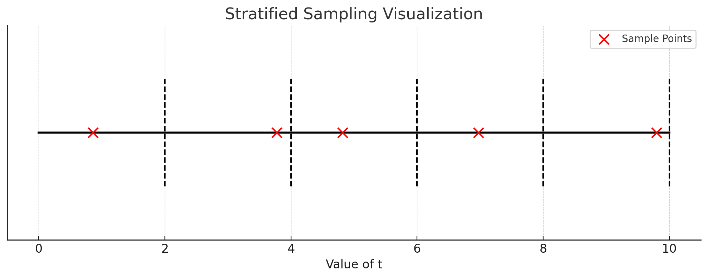

먼저, 전체 문맥을 이해하기 위해 제공된 문장을 간단히 요약하면:
- 본문은 연속적인 적분을 수치적으로 근사하는 방법에 대해 설명하고 있습니다.
- 결정론적 쿼드라처는 일반적으로 이산화된 보텍스 그리드의 렌더링에 사용되며, 이 방법은 MLP가 고정된 이산 위치에서만 값을 요청하기 때문에 표현의 해상도에 제한을 줍니다.
- 대신 계층화된 샘플링 방식을 사용하여 \([t_{\text{near}}, t_{\text{far}}]\) 범위를 \(\text{num\_samples}\) 개의 균일한 구간으로 나누고, 각 구간에서 균일한 확률로 샘플을 추출합니다.

이제 수식을 살펴보겠습니다:
\[
t_i \sim \mathcal{U} \left[ t_{\text{near}} + \frac{i-1}{\text{num\_samples}}(t_{\text{far}}-t_{\text{near}}), t_{\text{near}} + \frac{i}{\text{num\_samples}}(t_{\text{far}}-t_{\text{near}}) \right]
\]

이 수식은 계층화된 샘플링에서 각 샘플의 위치 \(t_i\)를 어떻게 선택하는지를 나타냅니다.

1. **\(t_i\)**: \(i\)번째 샘플의 위치를 나타냅니다.
2. **\(\mathcal{U}[a, b]\)**: 균일한 확률 분포로, 구간 \([a, b]\)에서 균일하게 값을 선택합니다.
3. **\(t_{\text{near}}\) 및 \(t_{\text{far}}\)**: 샘플링할 전체 범위의 시작점과 끝점을 나타냅니다.
4. **\(\frac{i-1}{\text{num\_samples}}(t_{\text{far}}-t_{\text{near}})\) 및 \(\frac{i}{\text{num\_samples}}(t_{\text{far}}-t_{\text{near}})\)**: 이는 \(i\)번째 샘플의 위치에 대한 범위를 나타냅니다. 각 샘플은 균일하게 분포된 구간에서 추출되기 때문에, 이 표현은 \(i\)번째 구간의 시작점과 끝점을 계산하는 데 사용됩니다.

결론적으로, 이 수식은 \([t_{\text{near}}, t_{\text{far}}]\) 범위를 균일한 구간으로 나누고, 각 구간에서 균일한 확률로 샘플의 위치를 선택하는 방법을 설명합니다.

-----

기호 \( \sim \)은 수학과 통계에서 여러 가지 의미로 사용되지만, 여기서의 문맥에서 \( \sim \)은 "분포되다" 또는 "따르다"의 의미로 사용됩니다.

예를 들어, 
\[
X \sim \mathcal{N}(0, 1)
\]
이라고 표현하면, 변수 \( X \)가 평균이 0이고 표준편차가 1인 정규 분포를 따른다는 것을 의미합니다.

문맥에 따라 \( t_i \sim \mathcal{U}[a, b] \)는 \( t_i \)가 구간 \([a, b]\)의 균일 분포를 따른다는 것을 의미합니다. 즉, \( t_i \)는 \([a, b]\) 구간 내에서 균등한 확률로 선택될 것이라는 의미입니다.

--------

1. 우선, \( t_{\text{near}} \)와 \( t_{\text{far}} \) 사이의 전체 범위를 나타내는 선을 그릴 것입니다.
2. 그 다음, 이 범위를 \( \text{num\_samples} \)개의 균일한 구간으로 나눕니다.
3. 각 구간에서 균일한 확률로 샘플의 위치를 선택하고 이를 표시합니다.

이러한 절차를 통해 각 샘플의 위치가 어떻게 결정되는지 시각적으로 확인할 수 있습니다.

이를 위해 \( t_{\text{near}} = 0 \), \( t_{\text{far}} = 10 \), 그리고 \( \text{num\_samples} = 5 \)로 가정하고 시각화를 진행하겠습니다.

위의 그래프에서 검은 선은 전체 범위 \( t_{\text{near}} \)에서 \( t_{\text{far}} \)까지를 나타냅니다. 

점선은 전체 범위를 균일하게 나눈 5개의 구간을 표시하고 있습니다. 

빨간색 점은 각 구간에서 균일한 확률로 선택된 샘플의 위치를 나타냅니다. 즉, 각 구간에서 무작위로 하나의 위치를 선택합니다.

이렇게 계층화된 샘플링은 전체 범위를 균일하게 나눈 후, 각 구간에서 하나의 샘플을 균일하게 추출함으로써 전체 범위를 대표하는 샘플을 생성합니다. 이 방법은 적분을 수치적으로 근사하는 데 사용됩니다.

