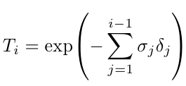

물론입니다! 이 수식을 단계별로 해석하고 그 이후에 간단하게 요약해드리겠습니다.

1. **수식 전반부:**
   

    - \(\hat{C}(\mathbf{r})\): 이것은 결과적으로 얻고자 하는 값입니다. 공간에서의 어떤 지점 \(\mathbf{r}\)에서의 합성된 색상 또는 값을 나타냅니다.
    - \(\sum_{i=1}^{\N}\): 이는 여러 샘플들에 대하여 합을 나타냅니다.
    - \(T_i\): 이는 i번째 샘플까지의 전체 투과율입니다. 나중에 자세히 설명됩니다.
    - \((1-\exp({-\alpha_i \delta_i}))\): 이 부분은 i번째 샘플의 투명도\((\alpha)\)를 계산합니다. \(\alpha_i\)는 i번째 샘플의 흡수율이고, \(\delta_i\)는 인접한 샘플 간의 거리입니다.
    - \(\mathbf{c}_i\): 이는 i번째 샘플의 색상 또는 값입니다.

2. **수식 후반부:**

    - \(T_i\): i번째 샘플 전까지의 전체 투과율을 나타냅니다.
    - \(\sum_{j=1}^{i-1}\): 이는 i번째 샘플 전까지의 모든 샘플들에 대한 합을 나타냅니다.
    - \(\alpha_j \delta_j\): j번째 샘플의 흡수율과 인접한 샘플 간의 거리의 곱입니다.

### 간단한 설명:

이 수식은 여러 샘플들의 색상과 투명도를 합성하여 최종 색상 \(\hat{C}(\mathbf{r})\)을 얻기 위한 것입니다. 각 샘플의 투명도는 해당 샘플의 흡수율 \(\alpha_i\)와 인접한 샘플 간의 거리 \(\delta_i\)를 사용하여 계산됩니다. 그리고 \(T_i\)는 i번째 샘플 전까지의 누적 투과율을 나타냅니다.

마지막 부분에서, 전통적인 알파 합성(일반적으로 이미지나 그래픽에서 사용되는 방법)과 관련이 있다고 언급되었습니다. 각 샘플의 투명도는 \((1-\exp({-\alpha_i \delta_i}))\)로 계산되며, 이는 전통적인 알파 값과 비슷합니다.

간단하게 말하자면, 이 수식은 각각의 샘플에 대한 색상과 투명도 정보를 합쳐서 하나의 결과적인 색상을 생성하는 방법을 설명하는 것입니다.